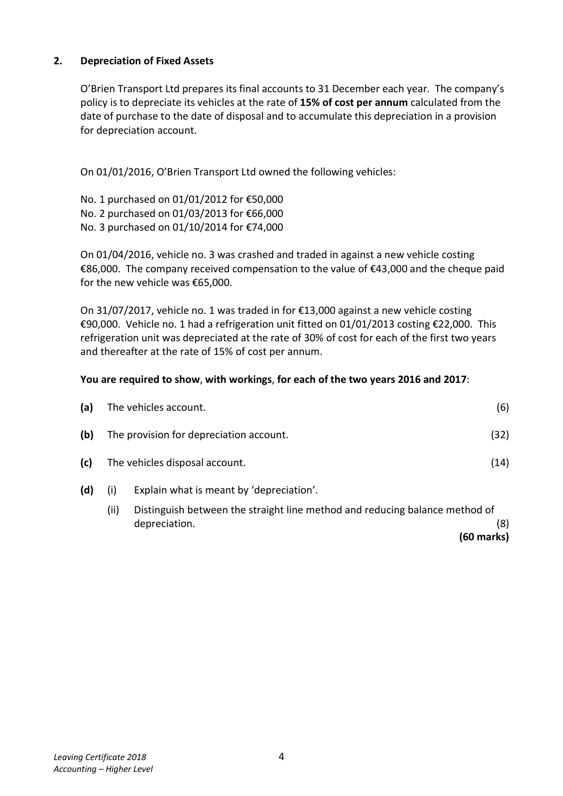
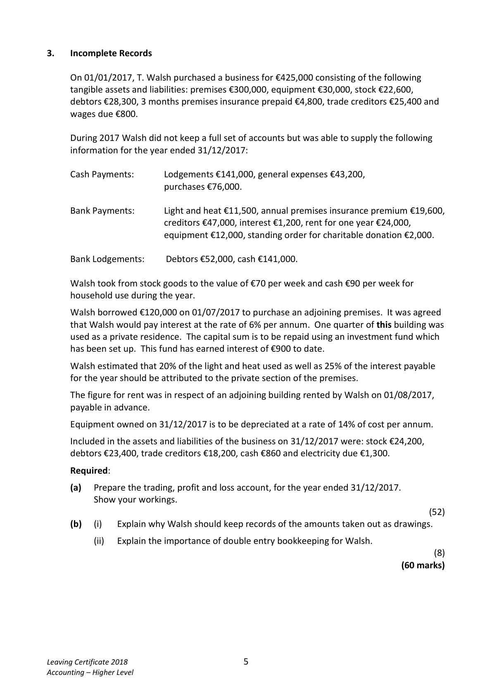
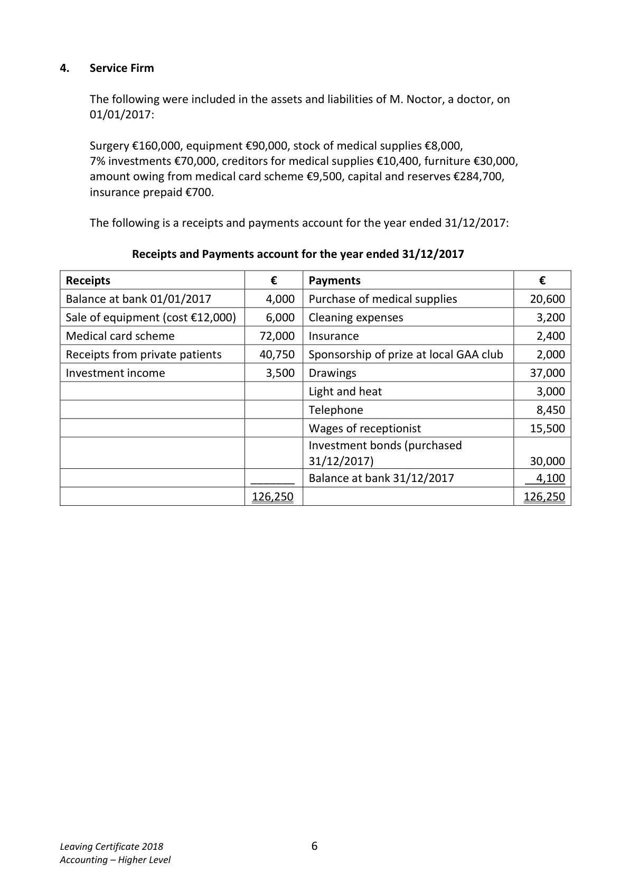
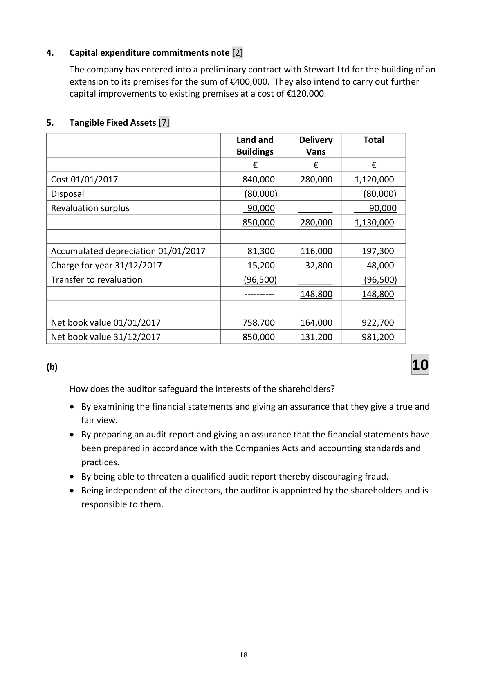

# Question

3.   A cheque of €6,300 issued to a supplier had not been presented for payment.
       (v)   Provide for a recent wage increase of 5% to be backdated to cover the three months
          from 01/10/2017.
       (vi)  During 2017 (January to December) Austin Ltd built an extension to the warehouse.
         The work was carried out by the company’s own employees. The cost of their labour
          €24,000 (before wage increase) was included in factory wages. The materials, costing
          €31,500 were taken from stocks. No entry had been made in the books in respect of
             this extension.
        (vii)  Included in the figure for sale of scrap materials is €3,000 received from the sale of
         an old machine on 30/06/2017. This machine had cost €20,000 on 01/04/2011.
        (viii) Provide for depreciation as follows:

              Plant and machinery at the annual rate of 10% of cost from the date of purchase to
             the date of sale.
               Buildings at 2% of the cost at 31/12/2017. Depreciation on buildings is to be
              allocated 75% to factory and the remainder to office administration.
       (ix)   Provision should be made for the following:
                1.   Investment income due and debenture interest due.
                2.   The creation of a provision for bad debts equal to 6% of
                  debtors on 31/12/2017.
     Required:

      (a)   Prepare a manufacturing, trading and profit and loss account for the year ended
          31/12/2017.                                                                       (75)

      (b)   Prepare a balance sheet as at 31/12/2017.                                         (45)
                                                                             (120 marks)

Leaving Certificate 2018                       3
Accounting – Higher Level

<!-- PAGE 4 -->
# Page 4

<!-- HAS_VISUAL: true -->
<!-- VISUAL_REASON: text contains visual keywords: line; page image extracted because text may not fully capture visual content -->

2.    Depreciation of Fixed Assets

     O’Brien Transport Ltd prepares its final accounts to 31 December each year. The company’s
      policy is to depreciate its vehicles at the rate of 15% of cost per annum calculated from the
     date of purchase to the date of disposal and to accumulate this depreciation in a provision
      for depreciation account.

    On 01/01/2016, O’Brien Transport Ltd owned the following vehicles:

     No. 1 purchased on 01/01/2012 for €50,000
     No. 2 purchased on 01/03/2013 for €66,000
     No. 3 purchased on 01/10/2014 for €74,000

    On 01/04/2016, vehicle no. 3 was crashed and traded in against a new vehicle costing
     €86,000. The company received compensation to the value of €43,000 and the cheque paid
      for the new vehicle was €65,000.

    On 31/07/2017, vehicle no. 1 was traded in for €13,000 against a new vehicle costing
     €90,000. Vehicle no. 1 had a refrigeration unit fitted on 01/01/2013 costing €22,000. This
      refrigeration unit was depreciated at the rate of 30% of cost for each of the first two years
     and thereafter at the rate of 15% of cost per annum.

    You are required to show, with workings, for each of the two years 2016 and 2017:

      (a)  The vehicles account.                                                                     (6)

      (b)  The provision for depreciation account.                                            (32)

       (c)   The vehicles disposal account.                                                     (14)

      (d)    (i)    Explain what is meant by ‘depreciation’.

                  (ii)   Distinguish between the straight line method and reducing balance method of
                 depreciation.                                                                        (8)
                                                                                 (60 marks)

Leaving Certificate 2018                       4
Accounting – Higher Level

<!-- PAGE 5 -->
# Page 5

<!-- HAS_VISUAL: true -->
<!-- VISUAL_REASON: text contains visual keywords: figure, table; page image extracted because text may not fully capture visual content -->

3.   Incomplete Records

    On 01/01/2017, T. Walsh purchased a business for €425,000 consisting of the following
      tangible assets and liabilities: premises €300,000, equipment €30,000, stock €22,600,
     debtors €28,300, 3 months premises insurance prepaid €4,800, trade creditors €25,400 and
     wages due €800.

     During 2017 Walsh did not keep a full set of accounts but was able to supply the following
     information for the year ended 31/12/2017:

     Cash Payments:      Lodgements €141,000, general expenses €43,200,
                          purchases €76,000.

     Bank Payments:       Light and heat €11,500, annual premises insurance premium €19,600,
                             creditors €47,000, interest €1,200, rent for one year €24,000,
                        equipment €12,000, standing order for charitable donation €2,000.

     Bank Lodgements:     Debtors €52,000, cash €141,000.

     Walsh took from stock goods to the value of €70 per week and cash €90 per week for
     household use during the year.

     Walsh borrowed €120,000 on 01/07/2017 to purchase an adjoining premises.  It was agreed
      that Walsh would pay interest at the rate of 6% per annum. One quarter of this building was
     used as a private residence. The capital sum is to be repaid using an investment fund which
     has been set up. This fund has earned interest of €900 to date.

     Walsh estimated that 20% of the light and heat used as well as 25% of the interest payable
      for the year should be attributed to the private section of the premises.

     The figure for rent was in respect of an adjoining building rented by Walsh on 01/08/2017,
     payable in advance.

     Equipment owned on 31/12/2017 is to be depreciated at a rate of 14% of cost per annum.

     Included in the assets and liabilities of the business on 31/12/2017 were: stock €24,200,
     debtors €23,400, trade creditors €18,200, cash €860 and electricity due €1,300.

     Required:

      (a)   Prepare the trading, profit and loss account, for the year ended 31/12/2017.
         Show your workings.
                                                                                               (52)
      (b)    (i)    Explain why Walsh should keep records of the amounts taken out as drawings.

                  (ii)   Explain the importance of double entry bookkeeping for Walsh.
                                                                                                         (8)
                                                                                 (60 marks)

Leaving Certificate 2018                       5
Accounting – Higher Level

<!-- PAGE 6 -->
# Page 6

<!-- HAS_VISUAL: true -->
<!-- VISUAL_REASON: page contains vector drawings; page image extracted because text may not fully capture visual content -->

# Marking Scheme

3.   Dividends [4]

     Ordinary Dividend Paid
             7.57 cent per share                   €45,400
     Preference Dividends Paid
            8 cent per share                       €9,600

                                              17

<!-- PAGE 20 -->
# Page 20

<!-- HAS_VISUAL: true -->
<!-- VISUAL_REASON: page contains vector drawings; page image extracted because text may not fully capture visual content -->

# Source References

Exam paper:
- file: intermediate_markdown/exam_papers/higher/accounting_higher_2018_paper_1_exam.md
- pages: [4, 5, 6]

Marking scheme:
- file: intermediate_markdown/marking_schemes/higher/accounting_higher_2018_paper_1_marking_scheme.md
- pages: [20]

# Notes

