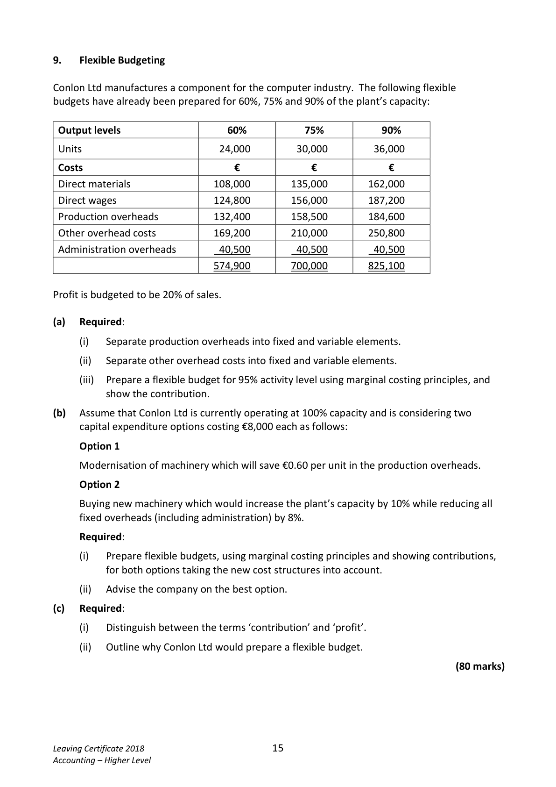

# Question

8.    Stock Valuation and Product Costing

      (a)   Stock Valuation
         Weston Ltd is a retail store that buys and sells one product. The following information
            relates to the purchases and sales of the firm for the year 2017:

               Period             Purchases on        Credit Sales         Cash Sales
                                         Credit
      01/01/2017 ‐ 31/03/2017   4,500 @ €8 each     1,000 @ €10 each  1,200 @ €12 each
      01/04/2017 ‐ 30/06/2017   2,500 @ €7 each     2,000 @ €11 each  1,400 @ €13 each
      01/07/2017 ‐ 30/09/2017   3,000 @ €6 each     1,500 @ €13 each  1,800 @ €10 each
      01/10/2017 ‐ 31/12/2017   1,500 @ €5 each     1,000 @ €12 each  1,200 @ €11 each

    On 01/01/2017 there was an opening stock of 5,000 units @ €6 each.
     Required:
        (i)    Calculate the value of closing stock using ‘First in/First out’ (FIFO) method.
         (ii)   Prepare a trading account for the year ending 31/12/2017.
         (iii)   Explain how the concept of prudence applies to the valuation of closing stock.

      (b)   Product Costing
     The following are the specifications for a job quotation received from Tully Ltd:
      Direct Materials 70 kg @ €16 per kg
      Direct labour hours spent in each department:

        Department    Hours
           A          50
           B         120
            C          24

     The monthly budgeted figures are as follows:

                                 Budgeted overheads
       Department    Variable      Fixed    Wage Rate per hour     Labour Hours
                       €         €              €                  €
          A         20,000     22,000           15                 500
          B         18,000     23,000           26                 1,000
           C         21,000     42,000           34                 1,400

     General administration overheads are expected to be €55,100 for the month.
     Required:

        (i)    Calculate the variable and fixed overhead absorption rates for each department in
            direct labour hours.

         (ii)   Calculate the administration overhead absorption rate in direct labour hours.

         (iii)   Calculate the selling price of the job if the profit is set at 25% of selling price.

       (iv)   Outline the role of the management accountant within an organisation.

                                                                                 (80 marks)

Leaving Certificate 2018                       14
Accounting – Higher Level

<!-- PAGE 15 -->
# Page 15

<!-- HAS_VISUAL: true -->
<!-- VISUAL_REASON: page contains vector drawings; text contains visual keywords: line; page image extracted because text may not fully capture visual content -->

# Marking Scheme

[No matching marking scheme section detected.]

# Source References

Exam paper:
- file: intermediate_markdown/exam_papers/higher/accounting_higher_2018_paper_1_exam.md
- pages: [15]

Marking scheme:
- file: 
- pages: []

# Notes

