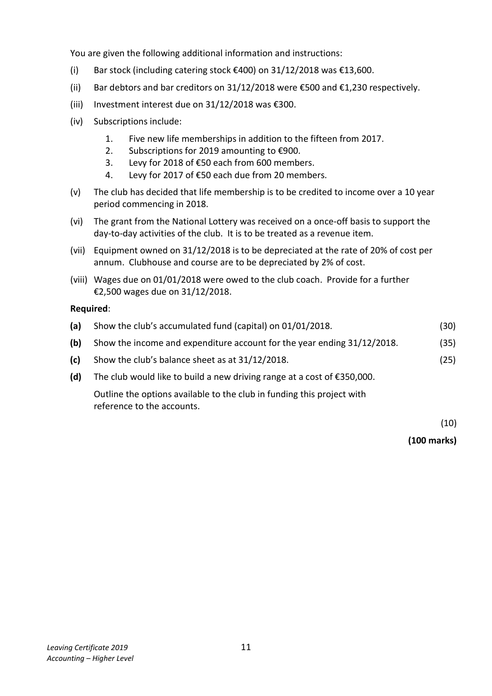
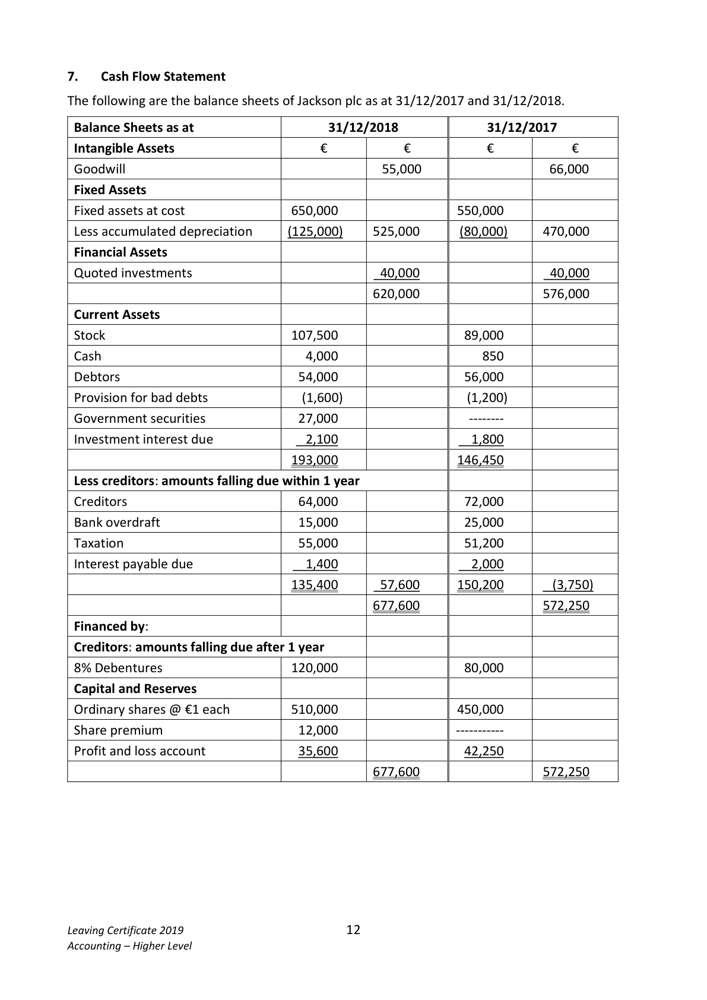

# Question

6.   Club Accounts

     Included in the assets and liabilities of Crest Wood Golf Club on 01/01/2018 were the
      following:

     Clubhouse and course €550,000, bar stock €5,800, equipment at cost €26,000,
     investment interest due €400, bar debtors €480, life membership €45,000,
     bar creditors €750, wages due €1,640, levy reserve fund €30,000,
      subscriptions received in advance €1,900.

      All fixed assets have 2 years accumulated depreciation on 01/01/2018.

     The club treasurer has supplied the following account of the club’s activities during the
     year ended 31/12/2018.

             Receipts and Payments account for the year ended 31/12/2018

     Receipts                        €      Payments                           €
     Subscriptions                 126,900     Balance 01/01/2018                    7,300
     Catering receipts                8,500     Bar purchases                        38,700
     Interest on 4% investments       2,800      Catering purchases                     4,900
                                              Purchase of equipment on
     Bar receipts                   66,200     01/04/2018                          15,000
     Entrance fees                  12,000     Sundry expenses                      81,500
    Annual sponsorship              7,400     Competition prizes                    20,100
     National Lottery grant          15,500      Coaching expenses                     5,600
                                          Bank loan and 18 months’ interest at
     Competition receipts           28,000     3% per annum on 31/05/2018        20,900
     Transfer from building society   10,000     Balance 31/12/2018                   83,300
                                 277,300                                        277,300

Leaving Certificate 2019                       10
Accounting – Higher Level

<!-- PAGE 11 -->
# Page 11

<!-- HAS_VISUAL: true -->
<!-- VISUAL_REASON: text contains visual keywords: line; page image extracted because text may not fully capture visual content -->

You are given the following additional information and instructions:

        (i)   Bar stock (including catering stock €400) on 31/12/2018 was €13,600.

         (ii)   Bar debtors and bar creditors on 31/12/2018 were €500 and €1,230 respectively.

         (iii)  Investment interest due on 31/12/2018 was €300.

       (iv)   Subscriptions include:

                1.    Five new life memberships in addition to the fifteen from 2017.
                2.    Subscriptions for 2019 amounting to €900.
                3.    Levy for 2018 of €50 each from 600 members.
                4.    Levy for 2017 of €50 each due from 20 members.

       (v)   The club has decided that life membership is to be credited to income over a 10 year
           period commencing in 2018.

       (vi)  The grant from the National Lottery was received on a once‐off basis to support the
           day‐to‐day activities of the club.  It is to be treated as a revenue item.

        (vii)  Equipment owned on 31/12/2018 is to be depreciated at the rate of 20% of cost per
         annum. Clubhouse and course are to be depreciated by 2% of cost.

        (viii) Wages due on 01/01/2018 were owed to the club coach. Provide for a further
          €2,500 wages due on 31/12/2018.

     Required:

      (a)  Show the club’s accumulated fund (capital) on 01/01/2018.                           (30)

      (b)  Show the income and expenditure account for the year ending 31/12/2018.          (35)

       (c)  Show the club’s balance sheet as at 31/12/2018.                                      (25)

      (d)  The club would like to build a new driving range at a cost of €350,000.

           Outline the options available to the club in funding this project with
           reference to the accounts.

                                                                                                  (10)

                                                                                (100 marks)

Leaving Certificate 2019                       11
Accounting – Higher Level

<!-- PAGE 12 -->
# Page 12

<!-- HAS_VISUAL: true -->
<!-- VISUAL_REASON: page contains vector drawings; page image extracted because text may not fully capture visual content -->

# Marking Scheme

6.    Depreciation – buildings      (975,000 – 150,000) × 2%                    16,500

6.    Life membership w/o       (45,000 + 15,000)/10                           6,000

6.    Profit after tax                                23,950

# Source References

Exam paper:
- file: intermediate_markdown/exam_papers/higher/accounting_higher_2019_paper_1_exam.md
- pages: [11, 12]

Marking scheme:
- file: intermediate_markdown/marking_schemes/higher/accounting_higher_2019_paper_1_marking_scheme.md
- pages: []

# Notes

