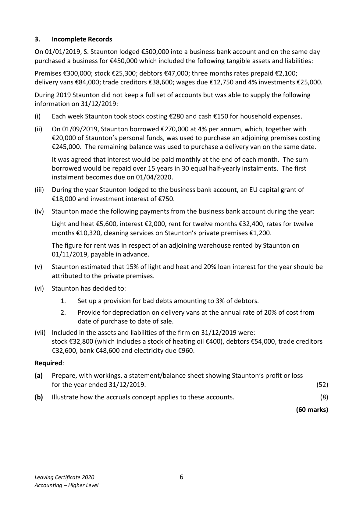
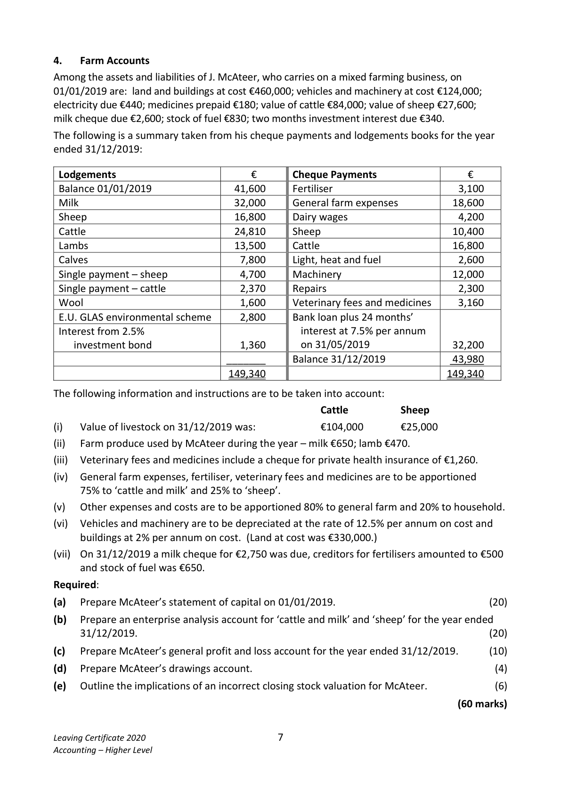
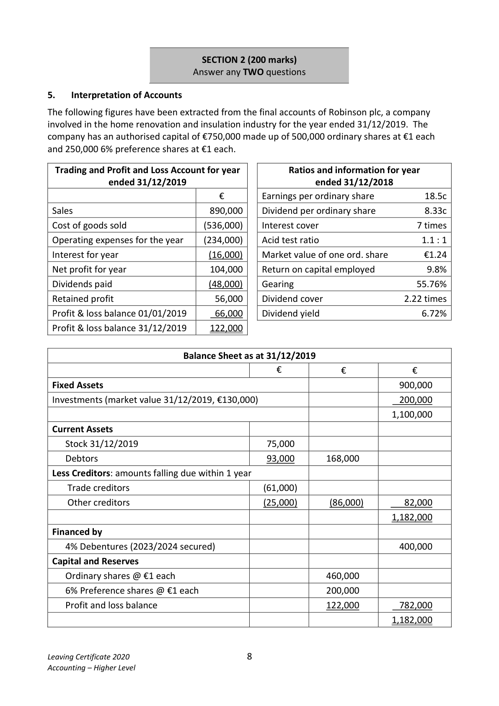
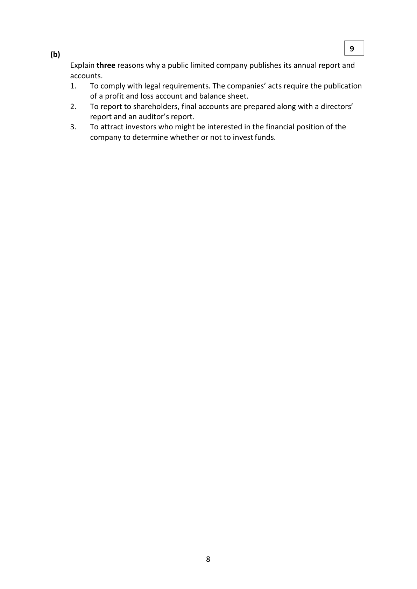
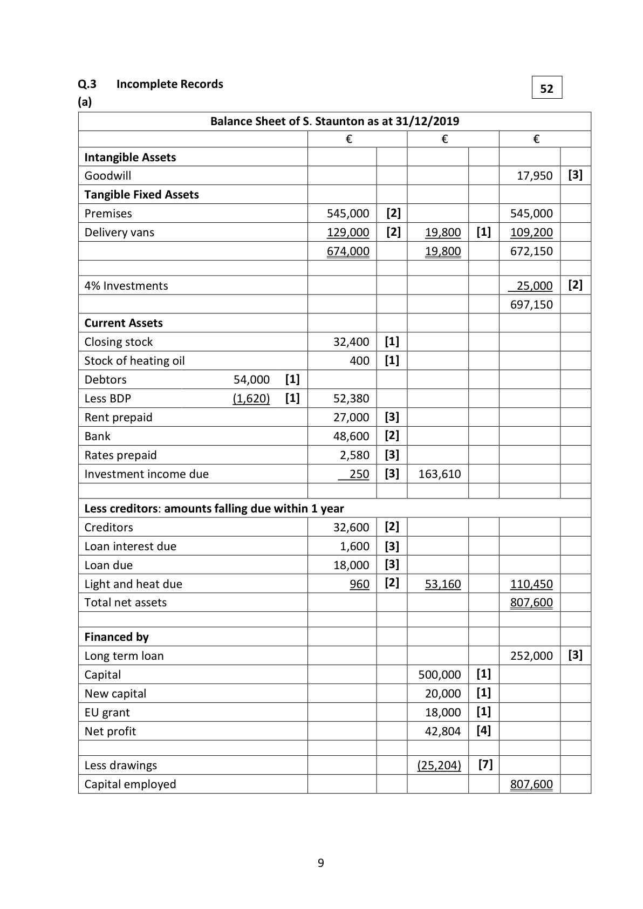
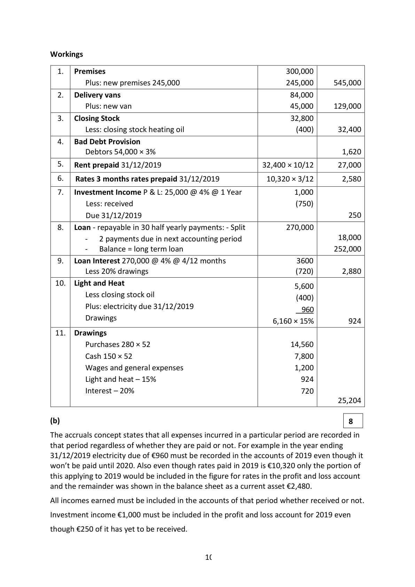

# Question

4.    Tangible fixed assets.
                                                                                               (51)
(b)   Explain three reasons why a public limited company publishes its annual report and
     accounts.
                                                                                                         (9)
                                                                                 (60 marks)

Leaving Certificate 2020                       5
Accounting – Higher Level

<!-- PAGE 6 -->
# Page 6

<!-- HAS_VISUAL: true -->
<!-- VISUAL_REASON: text contains visual keywords: figure; page image extracted because text may not fully capture visual content -->

3.   Incomplete Records

On 01/01/2019, S. Staunton lodged €500,000 into a business bank account and on the same day
purchased a business for €450,000 which included the following tangible assets and liabilities:

Premises €300,000; stock €25,300; debtors €47,000; three months rates prepaid €2,100;
delivery vans €84,000; trade creditors €38,600; wages due €12,750 and 4% investments €25,000.

During 2019 Staunton did not keep a full set of accounts but was able to supply the following
information on 31/12/2019:

(i)   Each week Staunton took stock costing €280 and cash €150 for household expenses.

(ii)  On 01/09/2019, Staunton borrowed €270,000 at 4% per annum, which, together with
     €20,000 of Staunton’s personal funds, was used to purchase an adjoining premises costing
     €245,000. The remaining balance was used to purchase a delivery van on the same date.

        It was agreed that interest would be paid monthly at the end of each month. The sum
     borrowed would be repaid over 15 years in 30 equal half‐yearly instalments. The first
     instalment becomes due on 01/04/2020.

(iii)  During the year Staunton lodged to the business bank account, an EU capital grant of
     €18,000 and investment interest of €750.

(iv)  Staunton made the following payments from the business bank account during the year:

      Light and heat €5,600, interest €2,000, rent for twelve months €32,400, rates for twelve
     months €10,320, cleaning services on Staunton’s private premises €1,200.

     The figure for rent was in respect of an adjoining warehouse rented by Staunton on
     01/11/2019, payable in advance.

(v)   Staunton estimated that 15% of light and heat and 20% loan interest for the year should be
      attributed to the private premises.

(vi)  Staunton has decided to:

         1.    Set up a provision for bad debts amounting to 3% of debtors.

         2.    Provide for depreciation on delivery vans at the annual rate of 20% of cost from
             date of purchase to date of sale.

(vii)  Included in the assets and liabilities of the firm on 31/12/2019 were:
      stock €32,800 (which includes a stock of heating oil €400), debtors €54,000, trade creditors
     €32,600, bank €48,600 and electricity due €960.

Required:

(a)   Prepare, with workings, a statement/balance sheet showing Staunton’s profit or loss
      for the year ended 31/12/2019.                                                         (52)

(b)   Illustrate how the accruals concept applies to these accounts.                                (8)

                                                                                 (60 marks)

Leaving Certificate 2020                       6
Accounting – Higher Level

<!-- PAGE 7 -->
# Page 7

<!-- HAS_VISUAL: true -->
<!-- VISUAL_REASON: page contains vector drawings; text contains visual keywords: line; page image extracted because text may not fully capture visual content -->

4.   Farm Accounts
Among the assets and liabilities of J. McAteer, who carries on a mixed farming business, on
01/01/2019 are: land and buildings at cost €460,000; vehicles and machinery at cost €124,000;
electricity due €440; medicines prepaid €180; value of cattle €84,000; value of sheep €27,600;
milk cheque due €2,600; stock of fuel €830; two months investment interest due €340.
The following is a summary taken from his cheque payments and lodgements books for the year
ended 31/12/2019:

 Lodgements                        €      Cheque Payments                €
 Balance 01/01/2019                41,600       Fertiliser                        3,100
 Milk                              32,000     General farm expenses          18,600
 Sheep                            16,800      Dairy wages                     4,200
 Cattle                            24,810     Sheep                         10,400
 Lambs                            13,500      Cattle                         16,800
 Calves                              7,800      Light, heat and fuel               2,600
 Single payment – sheep              4,700     Machinery                     12,000
 Single payment – cattle              2,370     Repairs                          2,300
 Wool                              1,600      Veterinary fees and medicines     3,160
 E.U. GLAS environmental scheme      2,800     Bank loan plus 24 months’
 Interest from 2.5%                                   interest at 7.5% per annum
    investment bond                 1,360      on 31/05/2019                32,200
                               _______     Balance 31/12/2019             43,980
                                 149,340                                  149,340

The following information and instructions are to be taken into account:
                                                         Cattle         Sheep
(i)   Value of livestock on 31/12/2019 was:            €104,000       €25,000
(ii)  Farm produce used by McAteer during the year – milk €650; lamb €470.
(iii)  Veterinary fees and medicines include a cheque for private health insurance of €1,260.
(iv)  General farm expenses, fertiliser, veterinary fees and medicines are to be apportioned
    75% to ‘cattle and milk’ and 25% to ‘sheep’.
(v)   Other expenses and costs are to be apportioned 80% to general farm and 20% to household.
(vi)   Vehicles and machinery are to be depreciated at the rate of 12.5% per annum on cost and
      buildings at 2% per annum on cost. (Land at cost was €330,000.)
(vii) On 31/12/2019 a milk cheque for €2,750 was due, creditors for fertilisers amounted to €500
     and stock of fuel was €650.
Required:

(a)   Prepare McAteer’s statement of capital on 01/01/2019.                                  (20)

(b)   Prepare an enterprise analysis account for ‘cattle and milk’ and ‘sheep’ for the year ended
     31/12/2019.                                                                             (20)

(c)   Prepare McAteer’s general profit and loss account for the year ended 31/12/2019.       (10)

(d)   Prepare McAteer’s drawings account.                                                          (4)

(e)   Outline the implications of an incorrect closing stock valuation for McAteer.                (6)

                                                                                 (60 marks)

Leaving Certificate 2020                       7
Accounting – Higher Level

<!-- PAGE 8 -->
# Page 8

<!-- HAS_VISUAL: true -->
<!-- VISUAL_REASON: page contains vector drawings; text contains visual keywords: figure; page image extracted because text may not fully capture visual content -->

SECTION 2 (200 marks)
                            Answer any TWO questions

# Marking Scheme

4.   Depreciation – L & B         795,000 – 12,150
                                  (782,850 – 500,000[2]) × 2%        =       5,657

4.   Other operating income: 60,000 + 12,000 + 47,000                =    119,000

4.  Tangible Fixed Assets [7]
                                   Land and                                                         Vehicles          Total                                         Buildings
                                    €               €             €
 Cost as at 01/01/2019                940,000           420,000       1,360,000
 Disposal                             (140,000)                          (140,000)
 Revaluation surplus                  200,000                          200,000
                                     1,000,000          420,000       1,420,000
 Depreciation
 Depreciation 01/01/2019              74,000          134,000         208,000
 Depreciation charge for year            16,000          84,000         100,000
 Revaluation                           (90,000)                            (90,000)
                                                      218,000         218,000

 Net book value 01/01/2019             866,000        286,000       1,152,000
 Net book value 31/12/2019            1,000,000        202,000       1,202,000

                                     7

<!-- PAGE 8 -->
# Page 8

<!-- HAS_VISUAL: true -->
<!-- VISUAL_REASON: page contains vector drawings; page image extracted because text may not fully capture visual content -->

9(b)
      Explain three reasons why a public limited company publishes its annual report and
     accounts.
      1.   To comply with legal requirements. The companies’ acts require the publication
           of a profit and loss account and balance sheet.
      2.   To report to shareholders, final accounts are prepared along with a directors’
           report and an auditor’s report.
      3.   To attract investors who might be interested in the financial position of the
         company to determine whether or not to invest funds.

                                     8

<!-- PAGE 9 -->
# Page 9

<!-- HAS_VISUAL: true -->
<!-- VISUAL_REASON: page contains vector drawings; page image extracted because text may not fully capture visual content -->

Q.3   Incomplete Records                                                                      52
(a)
                      Balance Sheet of S. Staunton as at 31/12/2019
                                         €              €             €
 Intangible Assets
 Goodwill                                                                17,950   [3]
 Tangible Fixed Assets
 Premises                                545,000   [2]                  545,000
 Delivery vans                            129,000   [2]    19,800   [1]   109,200
                                         674,000         19,800        672,150

 4% Investments                                                          25,000   [2]
                                                                       697,150
 Current Assets
 Closing stock                              32,400   [1]
 Stock of heating oil                         400   [1]
 Debtors                  54,000   [1]
 Less BDP                   (1,620)   [1]      52,380
 Rent prepaid                              27,000   [3]
 Bank                                     48,600   [2]
 Rates prepaid                               2,580   [3]
 Investment income due                     250   [3]   163,610

 Less creditors: amounts falling due within 1 year
 Creditors                                 32,600   [2]
 Loan interest due                            1,600   [3]
 Loan due                                 18,000   [3]
 Light and heat due                         960   [2]    53,160        110,450
 Total net assets                                                        807,600

 Financed by
 Long term loan                                                         252,000   [3]
 Capital                                                 500,000   [1]
 New capital                                              20,000   [1]
 EU grant                                                 18,000   [1]
 Net profit                                                42,804   [4]

 Less drawings                                               (25,204)   [7]
 Capital employed                                                       807,600

                                     9

<!-- PAGE 10 -->
# Page 10

<!-- HAS_VISUAL: true -->
<!-- VISUAL_REASON: page contains vector drawings; text contains visual keywords: figure; page image extracted because text may not fully capture visual content -->

Workings

4.  Bad Debt Provision
         Debtors 54,000 × 3%                                                 1,620

4.   Cleaning                 750 + 4,600 – 475                      4,875

# Source References

Exam paper:
- file: intermediate_markdown/exam_papers/higher/accounting_higher_2020_paper_1_exam.md
- pages: [6, 7, 8]

Marking scheme:
- file: intermediate_markdown/marking_schemes/higher/accounting_higher_2020_paper_1_marking_scheme.md
- pages: [8, 9, 10]

# Notes

