# Question

9.   Budgeting

Houghton Ltd is planning to set up a business on 01/07/2020 and has made the following forecast
for the first six months of trading:

                     July      August    September   October   November    December
   Sales units     11,400     11,600      11,800     11,900     12,200       12,400

Sales price per unit is €50.

(i)    Stocks of finished goods are maintained at 60% of the following month’s sales requirement.

(ii)   Each product unit requires 4 kg of material X, which costs €3 per kg.

(iii)  Stocks of raw materials, sufficient for 20% of the following month’s requirements in kgs are
     held at the end of each month.

(iv)  The cash collection pattern from sales is expected to be:

     Cash Customers   40% of sales revenue will be for immediate cash and a cash discount of
                 5% will be allowed.

      Credit Customers  60% of sales revenue will be from credit customers.
                      These debtors will pay their bills in the month after sale.

(v)  One month’s credit is received from suppliers.

(vi)  Expenses of the business will be settled as follows:

     Expected Costs    Wages €20,000 plus 10% of sales revenue per month, payable as
                          incurred.

                         Variable overheads €12 per unit, payable as incurred.

                         Fixed overheads (including depreciation) €20,000 per month, payable as
                          incurred.

      Capital Costs      Equipment will be purchased on 1 July 2020 costing €108,000 which will
                      have a useful life of 5 years.

                     To finance this purchase, a loan of €96,000 will be secured at 6% per
                     annum.

                     The capital sum is to be repaid in 48 equal monthly instalments.

                     The interest for each month is to be paid on the last day of the month
                      based on the amount of the loan outstanding at that date.

                      Both capital repayments and interest payments commence on 31 August.

Required:

(a)   Prepare a production budget for Houghton Ltd for the four months July to October 2020.

(b)   Prepare a raw materials purchases budget (in units and €) for Houghton Ltd for the four
     months July to October 2020.

(c)   Prepare a cash budget for Houghton Ltd for the four months July to October 2020.

(d)   Prepare a budgeted trading and profit and loss account for Houghton Ltd for the four
     months ending 31/10/2020 (if the budgeted cost of a unit of finished goods is €30).

(e)    (i)   What useful information is available to Houghton Ltd from the cash budget?
         (ii)   Explain what is meant by a master budget.
                                                                                 (80 marks)

Leaving Certificate 2020                       16
Accounting – Higher Level

# Marking Scheme

9.   Mortgage interest           240,000 X 8% X 3/12                       22,800
                                300,000 X 8% X 9/12
                                                       =     Mortgage interest           4,800 +18,000 – 4,560                      18,240

                                 3,600 + 19,200 -4,560               =     18,240
     Mortgage interest due       22,800 + 3,600 – 8,400              =     18,000
 10.  Delivery vans               250,000 – 48,000 + 64,000           =    266,000
      Accumulated dep. vans       64,000 – 23,200 + 52,400            =     93,200
 11.  Debtors                    97,500 + 500                      =     98,000
 12.  VAT                        3,100 – 3,700 – 12,150              =    (12,750)
 13.  Creditors                   84,300 + 19,600 -900 + 2,500               105,500

 14.  Bank                       48,800 +900 – 1,000 -2,500          =     46,200

                                  32,000 +14,200                   =     46,200

 15.  Revaluation reserve          900,000 – 782,850      = 117,150

                                 25,000 + 5,657         = 30,657    =    147,807
 16.  Drawings                   50,000 + 4,560                    =     54,560

                                     5

<!-- PAGE 6 -->
# Page 6

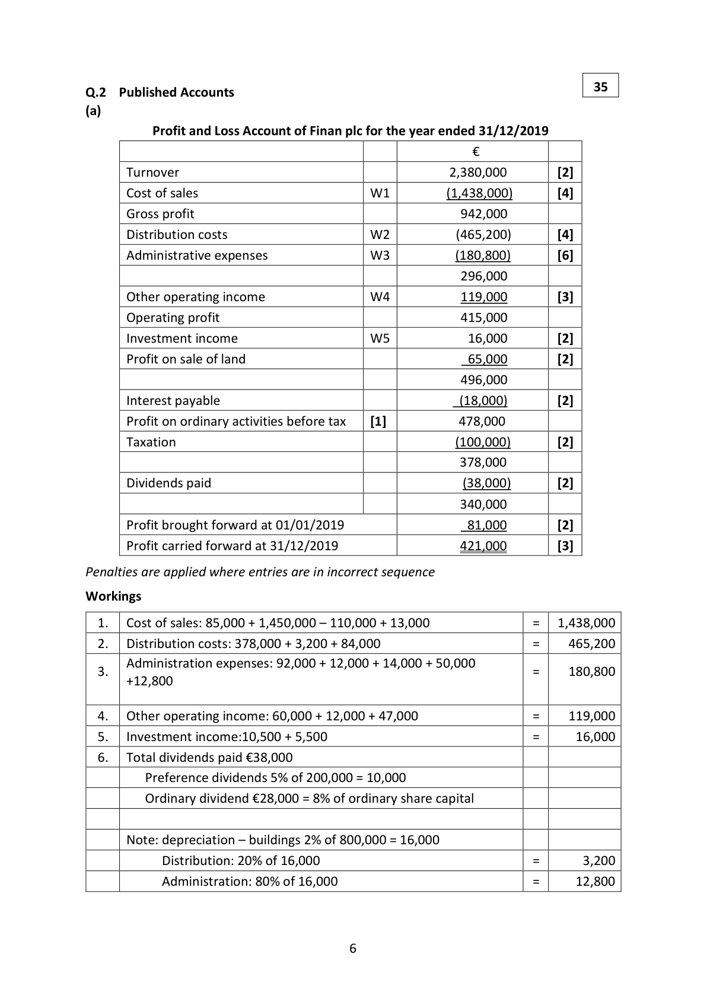

<!-- HAS_VISUAL: true -->
<!-- VISUAL_REASON: page contains vector drawings; page image extracted because text may not fully capture visual content -->

35Q.2  Published Accounts
(a)
            Profit and Loss Account of Finan plc for the year ended 31/12/2019
                                                      €
      Turnover                                          2,380,000         [2]
      Cost of sales                 W1         (1,438,000)        [4]
      Gross profit                                        942,000
       Distribution costs              W2           (465,200)        [4]
       Administrative expenses          W3           (180,800)        [6]
                                                        296,000
      Other operating income           W4           119,000         [3]
      Operating profit                                    415,000
      Investment income             W5            16,000         [2]
        Profit on sale of land                                  65,000         [2]
                                                        496,000
       Interest payable                                        (18,000)         [2]
        Profit on ordinary activities before tax    [1]           478,000
       Taxation                                             (100,000)        [2]
                                                        378,000
      Dividends paid                                         (38,000)        [2]
                                                        340,000
        Profit brought forward at 01/01/2019                   81,000         [2]
        Profit carried forward at 31/12/2019                  421,000         [3]
Penalties are applied where entries are in incorrect sequence
Workings

9.   Loan Interest 270,000 @ 4% @ 4/12 months                 3600
          Less 20% drawings                                         (720)       2,880
 10.  Light and Heat                                                                5,600
          Less closing stock oil                                                                     (400)
           Plus: electricity due 31/12/2019                                                              960
         Drawings                                                          6,160 × 15%        924
 11.  Drawings
         Purchases 280 × 52                                    14,560
         Cash 150 × 52                                          7,800
        Wages and general expenses                             1,200
           Light and heat – 15%                                  924
           Interest – 20%                                       720
                                                                          25,204

(b)                                                                    8
The accruals concept states that all expenses incurred in a particular period are recorded in
that period regardless of whether they are paid or not. For example in the year ending
31/12/2019 electricity due of €960 must be recorded in the accounts of 2019 even though it
won’t be paid until 2020. Also even though rates paid in 2019 is €10,320 only the portion of
this applying to 2019 would be included in the figure for rates in the profit and loss account
and the remainder was shown in the balance sheet as a current asset €2,480.
All incomes earned must be included in the accounts of that period whether received or not.
Investment income €1,000 must be included in the profit and loss account for 2019 even
though €250 of it has yet to be received.

                                    10

<!-- PAGE 11 -->
# Page 11

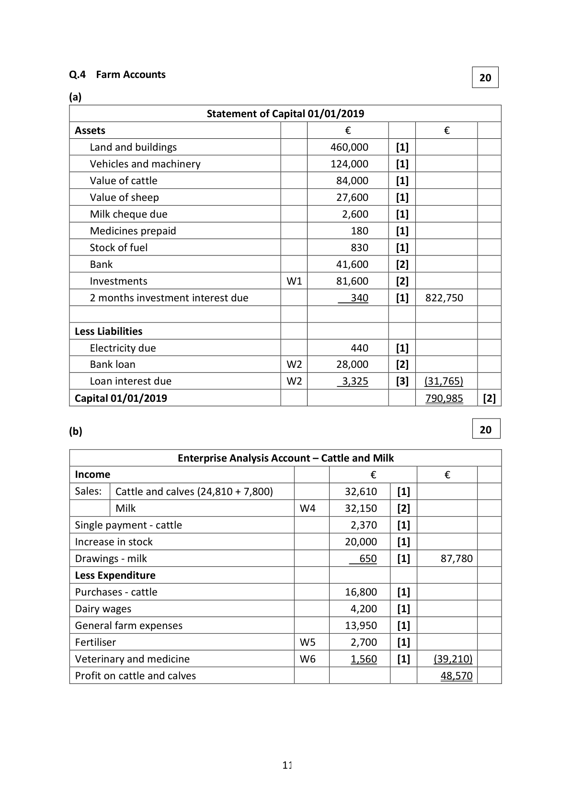

<!-- HAS_VISUAL: true -->
<!-- VISUAL_REASON: page contains vector drawings; page image extracted because text may not fully capture visual content -->

Q.4  Farm Accounts                                                                      20
(a)
                         Statement of Capital 01/01/2019
 Assets                                         €                €
    Land and buildings                            460,000      [1]
    Vehicles and machinery                        124,000      [1]
    Value of cattle                                  84,000      [1]
    Value of sheep                                 27,600      [1]
    Milk cheque due                                 2,600      [1]
    Medicines prepaid                              180      [1]
    Stock of fuel                                   830      [1]
    Bank                                          41,600      [2]
    Investments                 W1      81,600      [2]
    2 months investment interest due                  340      [1]   822,750

 Less Liabilities
     Electricity due                                 440      [1]
    Bank loan                   W2      28,000      [2]
    Loan interest due              W2        3,325      [3]   (31,765)
 Capital 01/01/2019                                                790,985    [2]

(b)                                                                    20

                      Enterprise Analysis Account – Cattle and Milk
 Income                                             €            €
 Sales:   Cattle and calves (24,810 + 7,800)             32,610     [1]
         Milk                    W4     32,150     [2]
 Single payment - cattle                                2,370     [1]
 Increase in stock                                    20,000     [1]
 Drawings - milk                                     650     [1]      87,780
 Less Expenditure
 Purchases - cattle                                   16,800     [1]
 Dairy wages                                          4,200     [1]
 General farm expenses                              13,950     [1]
 Fertiliser                       W5       2,700     [1]
 Veterinary and medicine              W6       1,560     [1]     (39,210)
 Profit on cattle and calves                                              48,570

                                    11

<!-- PAGE 12 -->
# Page 12

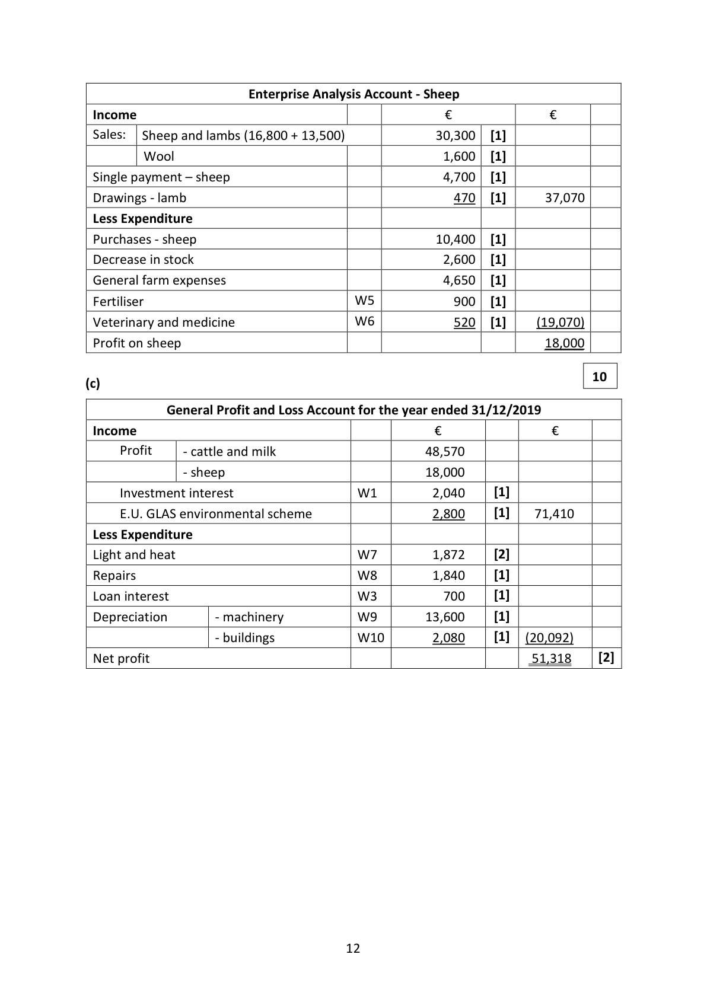

<!-- HAS_VISUAL: true -->
<!-- VISUAL_REASON: page contains vector drawings; page image extracted because text may not fully capture visual content -->

Enterprise Analysis Account - Sheep
 Income                                           €             €
 Sales:  Sheep and lambs (16,800 + 13,500)              30,300   [1]
       Wool                                         1,600   [1]
 Single payment – sheep                                 4,700   [1]
 Drawings - lamb                                     470   [1]      37,070
 Less Expenditure
 Purchases - sheep                                    10,400   [1]
 Decrease in stock                                      2,600   [1]
 General farm expenses                                 4,650   [1]
 Fertiliser                     W5           900   [1]
 Veterinary and medicine            W6           520   [1]     (19,070)
 Profit on sheep                                                       18,000

                                                                      10(c)
            General Profit and Loss Account for the year ended 31/12/2019
 Income                                         €               €
      Profit       - cattle and milk                       48,570
                      - sheep                              18,000
     Investment interest            W1        2,040     [1]
      E.U. GLAS environmental scheme                  2,800     [1]    71,410
 Less Expenditure
 Light and heat                  W7        1,872     [2]
 Repairs                      W8        1,840     [1]
 Loan interest                   W3         700     [1]
 Depreciation           - machinery       W9       13,600     [1]
                              - buildings         W10       2,080     [1]   (20,092)
 Net profit                                                          51,318     [2]

                                    12

<!-- PAGE 13 -->
# Page 13

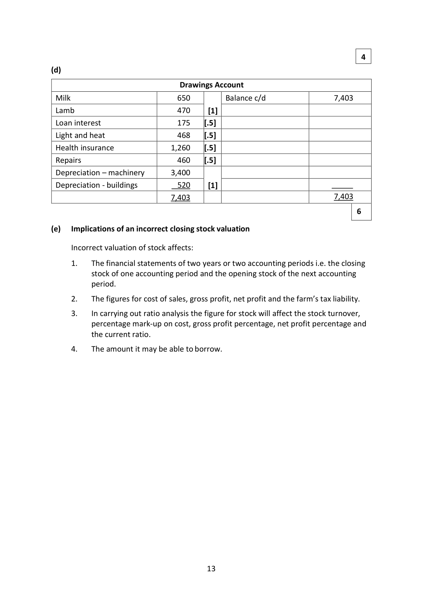

<!-- HAS_VISUAL: true -->
<!-- VISUAL_REASON: page contains embedded images; page contains vector drawings; text contains visual keywords: figure; page image extracted because text may not fully capture visual content -->

4
(d)
                               Drawings Account
 Milk                         650         Balance c/d                 7,403
 Lamb                        470     [1]
 Loan interest                  175     [.5]
 Light and heat                 468     [.5]
 Health insurance               1,260     [.5]
 Repairs                      460     [.5]
 Depreciation – machinery       3,400
 Depreciation - buildings         520     [1]
                               7,403                                     7,403
                                                                       6
(e)   Implications of an incorrect closing stock valuation

      Incorrect valuation of stock affects:
      1.   The financial statements of two years or two accounting periods i.e. the closing
           stock of one accounting period and the opening stock of the next accounting
           period.
      2.   The figures for cost of sales, gross profit, net profit and the farm’s tax liability.
      3.    In carrying out ratio analysis the figure for stock will affect the stock turnover,
          percentage mark-up on cost, gross profit percentage, net profit percentage and
          the current ratio.
      4.   The amount it may be able to borrow.

                                    13

<!-- PAGE 14 -->
# Page 14

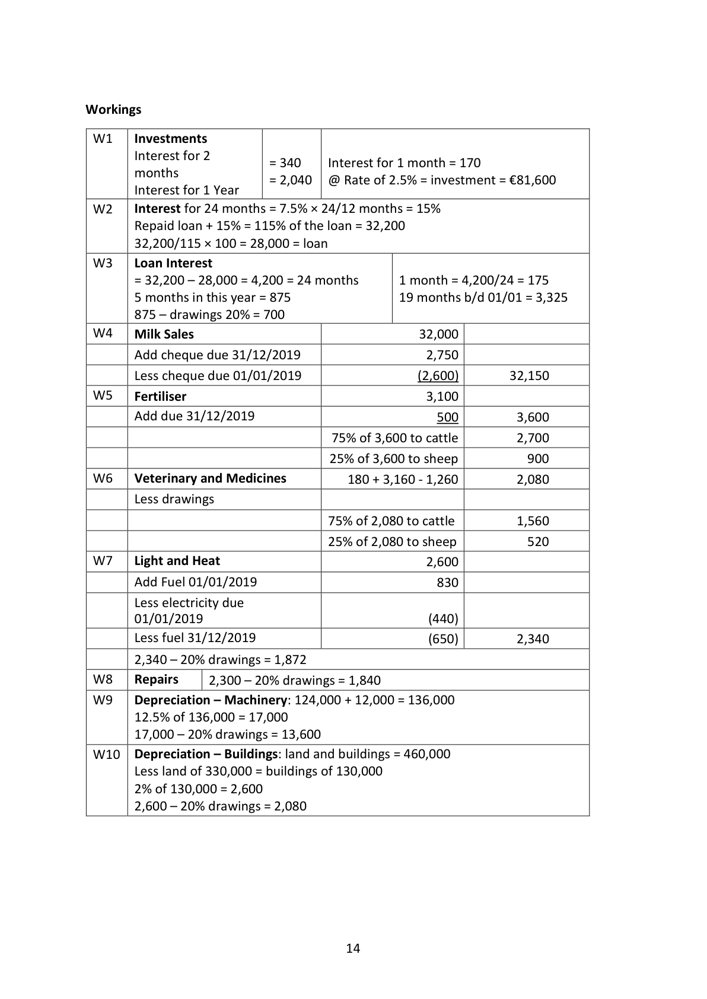

<!-- HAS_VISUAL: true -->
<!-- VISUAL_REASON: page contains vector drawings; page image extracted because text may not fully capture visual content -->

Workings
 W1   Investments
         Interest for 2                          = 340     Interest for 1 month = 170
       months                          = 2,040 @ Rate of 2.5% = investment = €81,600
         Interest for 1 Year
 W2    Interest for 24 months = 7.5% × 24/12 months = 15%
       Repaid loan + 15% = 115% of the loan = 32,200
       32,200/115 × 100 = 28,000 = loan
 W3   Loan Interest
       = 32,200 – 28,000 = 4,200 = 24 months      1 month = 4,200/24 = 175
       5 months in this year = 875               19 months b/d 01/01 = 3,325
       875 – drawings 20% = 700
 W4   Milk Sales                                  32,000
      Add cheque due 31/12/2019                   2,750
        Less cheque due 01/01/2019                    (2,600)        32,150
 W5    Fertiliser                                     3,100
      Add due 31/12/2019                         500         3,600
                              75% of 3,600 to cattle         2,700
                              25% of 3,600 to sheep          900
 W6   Veterinary and Medicines        180 + 3,160 - 1,260         2,080
        Less drawings
                             75% of 2,080 to cattle         1,560
                             25% of 2,080 to sheep          520
 W7    Light and Heat                                2,600
      Add Fuel 01/01/2019                         830
        Less electricity due
       01/01/2019                                     (440)
        Less fuel 31/12/2019                            (650)         2,340
        2,340 – 20% drawings = 1,872
 W8   Repairs     2,300 – 20% drawings = 1,840
 W9   Depreciation – Machinery: 124,000 + 12,000 = 136,000
       12.5% of 136,000 = 17,000
       17,000 – 20% drawings = 13,600
 W10  Depreciation – Buildings: land and buildings = 460,000
        Less land of 330,000 = buildings of 130,000
      2% of 130,000 = 2,600
        2,600 – 20% drawings = 2,080

                                    14

<!-- PAGE 15 -->
# Page 15

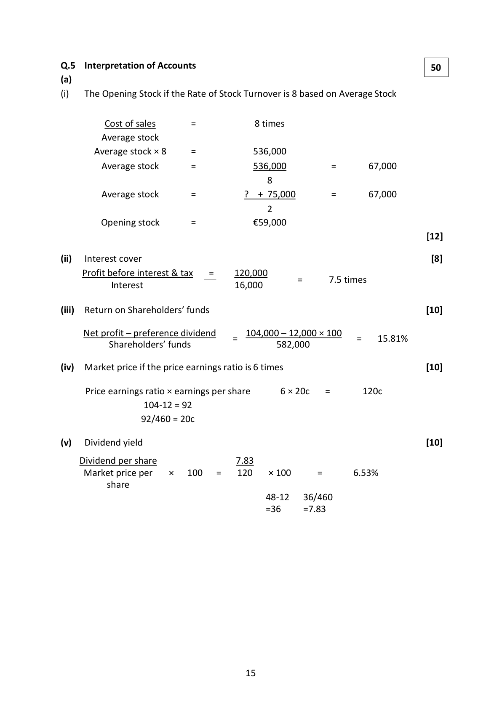

<!-- HAS_VISUAL: true -->
<!-- VISUAL_REASON: page contains vector drawings; page image extracted because text may not fully capture visual content -->

Q.5  Interpretation of Accounts                                              50
(a)
(i)   The Opening Stock if the Rate of Stock Turnover is 8 based on Average Stock

          Cost of sales       =           8 times
        Average stock
       Average stock × 8     =            536,000
        Average stock      =            536,000         =       67,000
                                        8
        Average stock      =          ?  + 75,000       =       67,000
                                        2
        Opening stock      =            €59,000
                                                                                       [12]

(ii)   Interest cover                                                                          [8]
      Profit before interest & tax   =    120,000                                               =      7.5 times             Interest                   16,000

(iii)  Return on Shareholders’ funds                                                   [10]

     Net profit – preference dividend      104,000 – 12,000 × 100                                  =                        =   15.81%           Shareholders’ funds                  582,000

(iv)  Market price if the price earnings ratio is 6 times                                  [10]

      Price earnings ratio × earnings per share      6 × 20c   =       120c
                 104-12 = 92
                92/460 = 20c

(v)   Dividend yield                                                                   [10]
    Dividend per share                  7.83
     Market price per   ×   100   =   120   × 100     =      6.53%
          share
                                           48-12   36/460
                                        =36     =7.83

                                    15

<!-- PAGE 16 -->
# Page 16

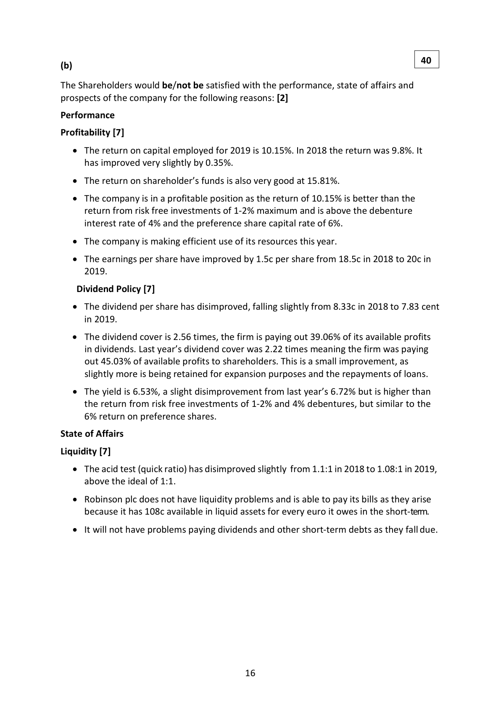

<!-- HAS_VISUAL: true -->
<!-- VISUAL_REASON: page contains vector drawings; text contains visual keywords: table; page image extracted because text may not fully capture visual content -->

40(b)
The Shareholders would be/not be satisfied with the performance, state of affairs and
prospects of the company for the following reasons: [2]
Performance
Profitability [7]
   • The return on capital employed for 2019 is 10.15%. In 2018 the return was 9.8%. It
     has improved very slightly by 0.35%.
   • The return on shareholder’s funds is also very good at 15.81%.
   • The company is in a profitable position as the return of 10.15% is better than the
     return from risk free investments of 1-2% maximum and is above the debenture
      interest rate of 4% and the preference share capital rate of 6%.
   • The company is making efficient use of its resources this year.
   • The earnings per share have improved by 1.5c per share from 18.5c in 2018 to 20c in
     2019.
   Dividend Policy [7]
   • The dividend per share has disimproved, falling slightly from 8.33c in 2018 to 7.83 cent
      in 2019.
   • The dividend cover is 2.56 times, the firm is paying out 39.06% of its available profits
      in dividends. Last year’s dividend cover was 2.22 times meaning the firm was paying
     out 45.03% of available profits to shareholders. This is a small improvement, as
       slightly more is being retained for expansion purposes and the repayments of loans.
   • The yield is 6.53%, a slight disimprovement from last year’s 6.72% but is higher than
     the return from risk free investments of 1-2% and 4% debentures, but similar to the
    6% return on preference shares.
State of Affairs
Liquidity [7]
   • The acid test (quick ratio) has disimproved slightly from 1.1:1 in 2018 to 1.08:1 in 2019,
     above the ideal of 1:1.
   •  Robinson plc does not have liquidity problems and is able to pay its bills as they arise
     because it has 108c available in liquid assets for every euro it owes in the short-term.
   •  It will not have problems paying dividends and other short-term debts as they fall due.

                                    16

<!-- PAGE 17 -->
# Page 17

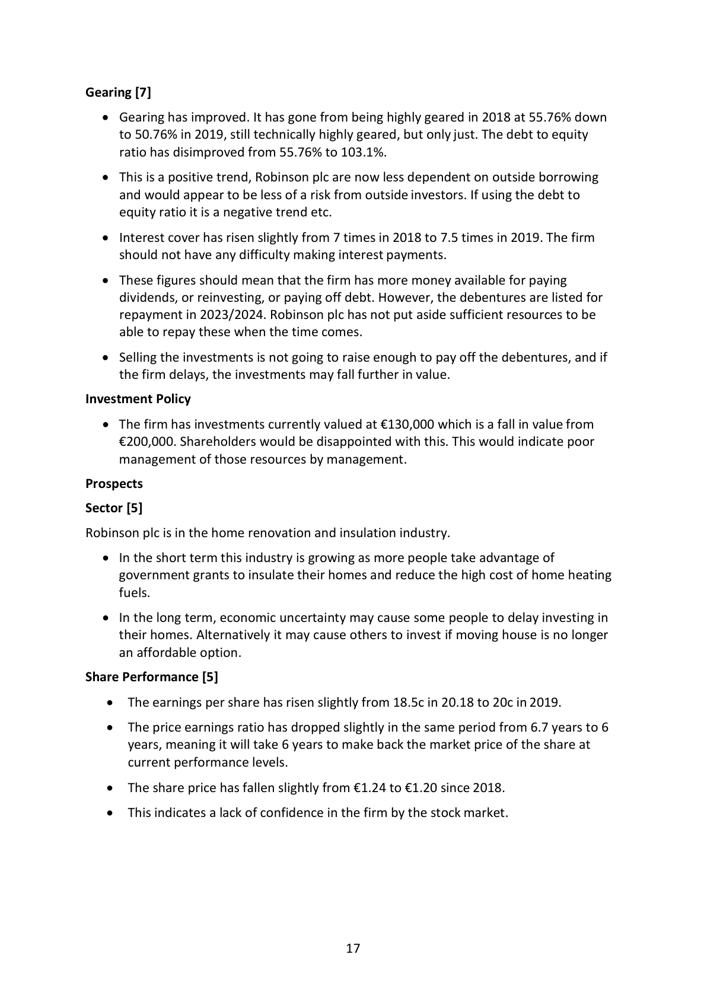

<!-- HAS_VISUAL: true -->
<!-- VISUAL_REASON: text contains visual keywords: figure; page image extracted because text may not fully capture visual content -->

Gearing [7]
   •  Gearing has improved. It has gone from being highly geared in 2018 at 55.76% down
     to 50.76% in 2019, still technically highly geared, but only just. The debt to equity
      ratio has disimproved from 55.76% to 103.1%.
   •  This is a positive trend, Robinson plc are now less dependent on outside borrowing
     and would appear to be less of a risk from outside investors. If using the debt to
      equity ratio it is a negative trend etc.
   •  Interest cover has risen slightly from 7 times in 2018 to 7.5 times in 2019. The firm
     should not have any difficulty making interest payments.
   •  These figures should mean that the firm has more money available for paying
      dividends, or reinvesting, or paying off debt. However, the debentures are listed for
     repayment in 2023/2024. Robinson plc has not put aside sufficient resources to be
     able to repay these when the time comes.
   •  Selling the investments is not going to raise enough to pay off the debentures, and if
     the firm delays, the investments may fall further in value.
Investment Policy
   • The firm has investments currently valued at €130,000 which is a fall in value from
     €200,000. Shareholders would be disappointed with this. This would indicate poor
    management of those resources by management.
Prospects
Sector [5]
Robinson plc is in the home renovation and insulation industry.
   •  In the short term this industry is growing as more people take advantage of
     government grants to insulate their homes and reduce the high cost of home heating
      fuels.
   •  In the long term, economic uncertainty may cause some people to delay investing in
      their homes. Alternatively it may cause others to invest if moving house is no longer
     an affordable option.
Share Performance [5]
   •  The earnings per share has risen slightly from 18.5c in 20.18 to 20c in 2019.
   •  The price earnings ratio has dropped slightly in the same period from 6.7 years to 6
       years, meaning it will take 6 years to make back the market price of the share at
       current performance levels.
   •  The share price has fallen slightly from €1.24 to €1.20 since 2018.
   •   This indicates a lack of confidence in the firm by the stock market.

                                    17

<!-- PAGE 18 -->
# Page 18

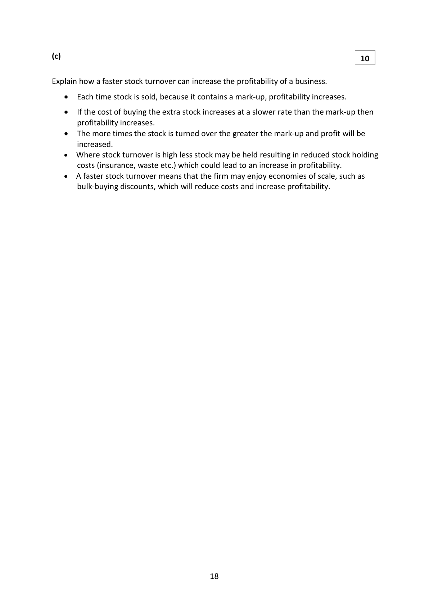

<!-- HAS_VISUAL: true -->
<!-- VISUAL_REASON: page contains vector drawings; page image extracted because text may not fully capture visual content -->

(c)                                                                      10

Explain how a faster stock turnover can increase the profitability of a business.
   •  Each time stock is sold, because it contains a mark-up, profitability increases.
   •    If the cost of buying the extra stock increases at a slower rate than the mark-up then
        profitability increases.
   •  The more times the stock is turned over the greater the mark-up and profit will be
       increased.
   •  Where stock turnover is high less stock may be held resulting in reduced stock holding
       costs (insurance, waste etc.) which could lead to an increase in profitability.
   •  A faster stock turnover means that the firm may enjoy economies of scale, such as
       bulk-buying discounts, which will reduce costs and increase profitability.

                                    18

<!-- PAGE 19 -->
# Page 19

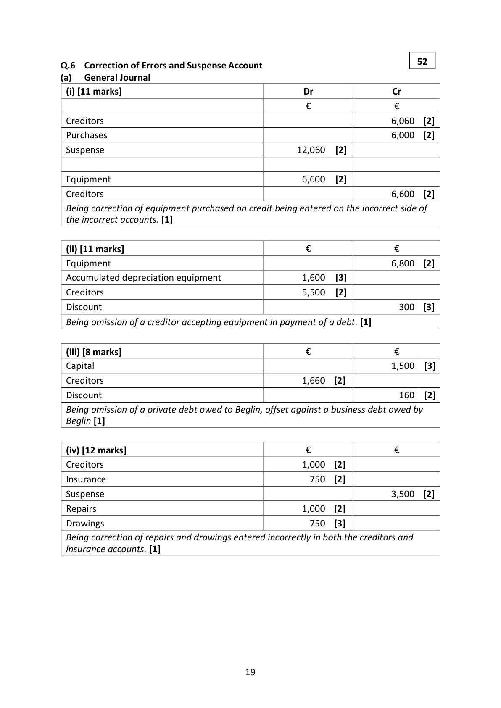

<!-- HAS_VISUAL: true -->
<!-- VISUAL_REASON: page contains vector drawings; page image extracted because text may not fully capture visual content -->

52Q.6  Correction of Errors and Suspense Account
(a)   General Journal
  (i) [11 marks]                                     Dr                  Cr
                                                €                €
 Creditors                                                              6,060  [2]
 Purchases                                                              6,000  [2]
 Suspense                                         12,060   [2]

 Equipment                                         6,600   [2]
 Creditors                                                              6,600  [2]
 Being correction of equipment purchased on credit being entered on the incorrect side of
 the incorrect accounts. [1]

  (ii) [11 marks]                                   €                €
 Equipment                                                             6,800  [2]
 Accumulated depreciation equipment                  1,600   [3]
 Creditors                                           5,500   [2]
 Discount                                                          300  [3]
 Being omission of a creditor accepting equipment in payment of a debt. [1]

  (iii) [8 marks]                                    €                €
 Capital                                                                1,500  [3]
 Creditors                                           1,660  [2]
 Discount                                                          160  [2]
 Being omission of a private debt owed to Beglin, offset against a business debt owed by
 Beglin [1]

  (iv) [12 marks]                                   €                €
 Creditors                                           1,000  [2]
 Insurance                                        750  [2]
 Suspense                                                              3,500  [2]
 Repairs                                             1,000  [2]
 Drawings                                        750  [3]
 Being correction of repairs and drawings entered incorrectly in both the creditors and
 insurance accounts. [1]

                                    19

<!-- PAGE 20 -->
# Page 20

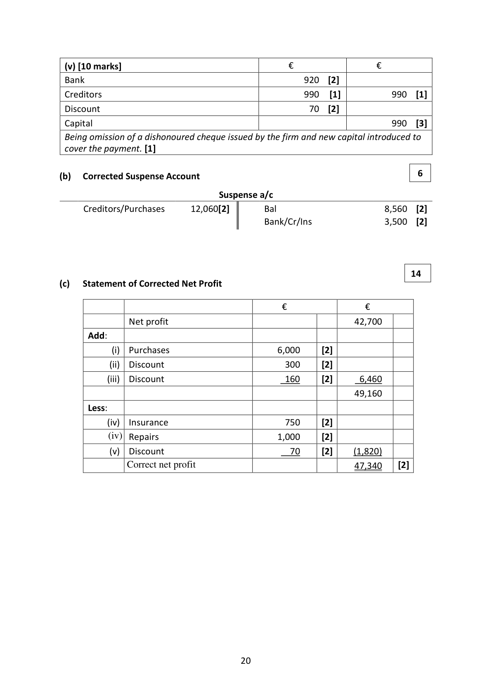

<!-- HAS_VISUAL: true -->
<!-- VISUAL_REASON: page contains embedded images; page contains vector drawings; page image extracted because text may not fully capture visual content -->

(v) [10 marks]                                 €                €
 Bank                                            920  [2]
 Creditors                                        990   [1]          990  [1]
 Discount                                         70  [2]
 Capital                                                           990  [3]
 Being omission of a dishonoured cheque issued by the firm and new capital introduced to
 cover the payment. [1]

                                                                       6(b)   Corrected Suspense Account
                                 Suspense a/c
      Creditors/Purchases      12,060[2]        Bal                        8,560  [2]
                                               Bank/Cr/Ins                3,500  [2]

                                                                      14
(c)   Statement of Corrected Net Profit

                                            €                €
              Net profit                                        42,700
      Add:
                   (i)  Purchases                        6,000      [2]
                   (ii)  Discount                        300      [2]
                   (iii)  Discount                        160      [2]      6,460
                                                                49,160
       Less:
               (iv)  Insurance                       750      [2]
              (iv) Repairs                          1,000      [2]
              (v)  Discount                         70      [2]     (1,820)
                Correct net profit                                   47,340    [2]

                                    20

<!-- PAGE 21 -->
# Page 21

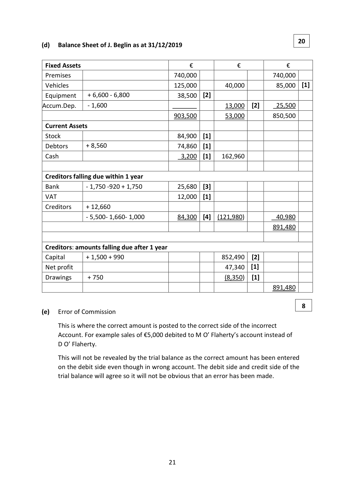

<!-- HAS_VISUAL: true -->
<!-- VISUAL_REASON: page contains embedded images; page contains vector drawings; page image extracted because text may not fully capture visual content -->

20(d)   Balance Sheet of J. Beglin as at 31/12/2019

 Fixed Assets                               €             €             €
 Premises                               740,000                       740,000
 Vehicles                                125,000         40,000          85,000  [1]
 Equipment   + 6,600 - 6,800               38,500  [2]
Accum.Dep.     - 1,600                                     13,000   [2]     25,500
                                        903,500         53,000         850,500
 Current Assets
 Stock                                    84,900  [1]
 Debtors     + 8,560                      74,860  [1]
 Cash                                       3,200  [1]   162,960

 Creditors falling due within 1 year
 Bank             - 1,750 -920 + 1,750           25,680  [3]
 VAT                                     12,000  [1]
 Creditors    + 12,660
                     - 5,500- 1,660- 1,000          84,300  [4]  (121,980)          40,980
                                                                       891,480

 Creditors: amounts falling due after 1 year
 Capital      + 1,500 + 990                              852,490   [2]
 Net profit                                               47,340  [1]
 Drawings     + 750                                          (8,350)   [1]
                                                                       891,480

                                                                          8
(e)   Error of Commission
      This is where the correct amount is posted to the correct side of the incorrect
     Account. For example sales of €5,000 debited to M O’ Flaherty’s account instead of
    D O’ Flaherty.
      This will not be revealed by the trial balance as the correct amount has been entered
    on the debit side even though in wrong account. The debit side and credit side of the
       trial balance will agree so it will not be obvious that an error has been made.

                                    21

<!-- PAGE 22 -->
# Page 22

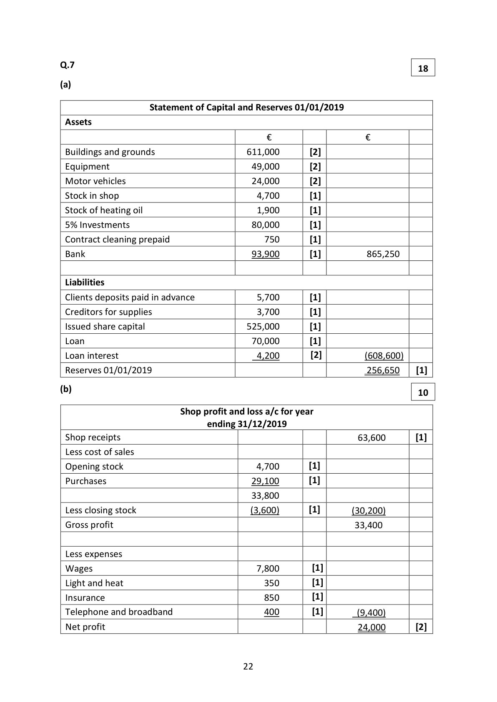

<!-- HAS_VISUAL: true -->
<!-- VISUAL_REASON: page contains vector drawings; page image extracted because text may not fully capture visual content -->

Q.7                                                                      18
(a)

                  Statement of Capital and Reserves 01/01/2019
 Assets
                                         €                  €
 Buildings and grounds                   611,000        [2]
 Equipment                               49,000        [2]
 Motor vehicles                           24,000        [2]
 Stock in shop                              4,700        [1]
 Stock of heating oil                         1,900        [1]
 5% Investments                          80,000        [1]
 Contract cleaning prepaid                   750        [1]
 Bank                                    93,900        [1]          865,250

 Liabilities
 Clients deposits paid in advance              5,700        [1]
 Creditors for supplies                       3,700        [1]
 Issued share capital                      525,000        [1]
 Loan                                    70,000        [1]
 Loan interest                              4,200        [2]          (608,600)
 Reserves 01/01/2019                                              256,650    [1]
(b)                                                                      10
                       Shop profit and loss a/c for year
                               ending 31/12/2019
 Shop receipts                                                   63,600        [1]
 Less cost of sales
 Opening stock                             4,700        [1]
 Purchases                               29,100        [1]
                                         33,800
 Less closing stock                            (3,600)        [1]       (30,200)
 Gross profit                                                    33,400

 Less expenses
 Wages                                    7,800        [1]
 Light and heat                            350        [1]
 Insurance                               850        [1]
 Telephone and broadband                  400        [1]        (9,400)
 Net profit                                                      24,000        [2]

                                    22

<!-- PAGE 23 -->
# Page 23

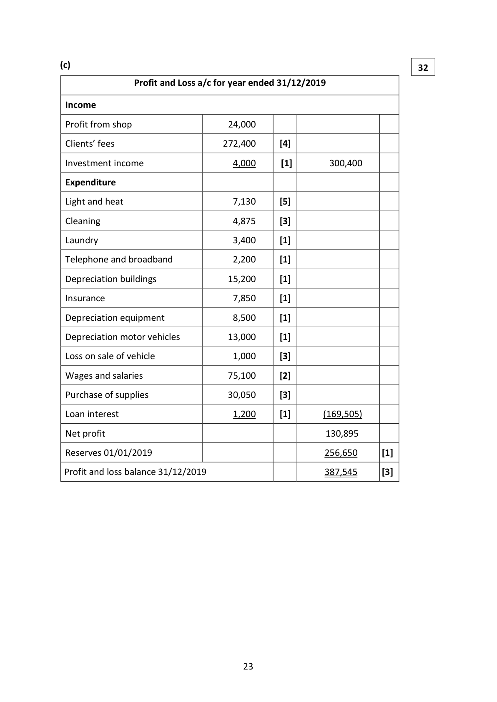

<!-- HAS_VISUAL: true -->
<!-- VISUAL_REASON: page contains vector drawings; page image extracted because text may not fully capture visual content -->

(c)                                                                      32
                   Profit and Loss a/c for year ended 31/12/2019

 Income
 Profit from shop                     24,000
 Clients’ fees                       272,400      [4]
 Investment income                   4,000       [1]        300,400
 Expenditure
 Light and heat                        7,130      [5]
 Cleaning                             4,875      [3]
 Laundry                             3,400      [1]
 Telephone and broadband             2,200      [1]
 Depreciation buildings               15,200      [1]
 Insurance                            7,850      [1]
 Depreciation equipment               8,500      [1]
 Depreciation motor vehicles          13,000      [1]
 Loss on sale of vehicle                 1,000      [3]
 Wages and salaries                  75,100      [2]
 Purchase of supplies                 30,050      [3]
 Loan interest                         1,200      [1]       (169,505)
 Net profit                                               130,895
 Reserves 01/01/2019                                     256,650      [1]
 Profit and loss balance 31/12/2019                         387,545      [3]

                                    23

<!-- PAGE 24 -->
# Page 24

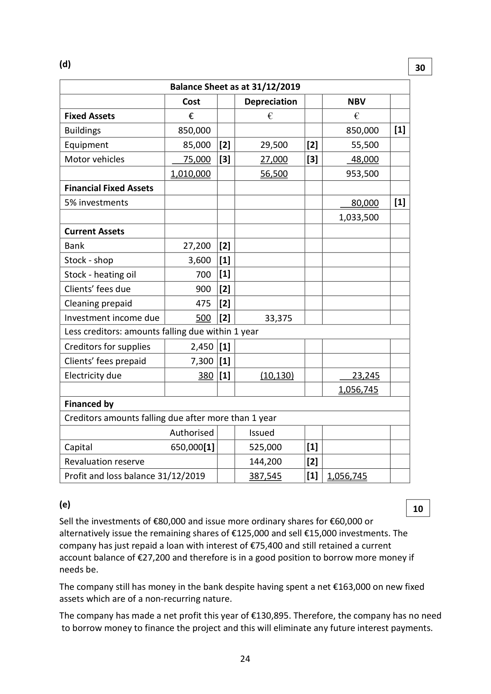

<!-- HAS_VISUAL: true -->
<!-- VISUAL_REASON: page contains vector drawings; page image extracted because text may not fully capture visual content -->

(d)                                                                       30
                        Balance Sheet as at 31/12/2019
                           Cost          Depreciation        NBV
 Fixed Assets               €               €                €
 Buildings                 850,000                             850,000    [1]
 Equipment                85,000  [2]      29,500     [2]       55,500
 Motor vehicles             75,000  [3]      27,000     [3]       48,000
                         1,010,000           56,500             953,500
 Financial Fixed Assets
 5% investments                                                 80,000    [1]
                                                               1,033,500
 Current Assets
 Bank                      27,200  [2]
 Stock - shop                 3,600  [1]
 Stock - heating oil            700  [1]
 Clients’ fees due             900  [2]
 Cleaning prepaid             475  [2]
 Investment income due       500  [2]       33,375
 Less creditors: amounts falling due within 1 year
 Creditors for supplies         2,450  [1]
 Clients’ fees prepaid          7,300  [1]
 Electricity due               380  [1]       (10,130)             23,245
                                                               1,056,745
 Financed by
 Creditors amounts falling due after more than 1 year
                         Authorised        Issued
 Capital                  650,000[1]       525,000       [1]
 Revaluation reserve                      144,200       [2]
 Profit and loss balance 31/12/2019         387,545       [1]  1,056,745

(e)                                                                      10
Sell the investments of €80,000 and issue more ordinary shares for €60,000 or
alternatively issue the remaining shares of €125,000 and sell €15,000 investments. The
company has just repaid a loan with interest of €75,400 and still retained a current
account balance of €27,200 and therefore is in a good position to borrow more money if
needs be.
The company still has money in the bank despite having spent a net €163,000 on new fixed
assets which are of a non-recurring nature.
The company has made a net profit this year of €130,895. Therefore, the company has no need
 to borrow money to finance the project and this will eliminate any future interest payments.

                                    24

<!-- PAGE 25 -->
# Page 25

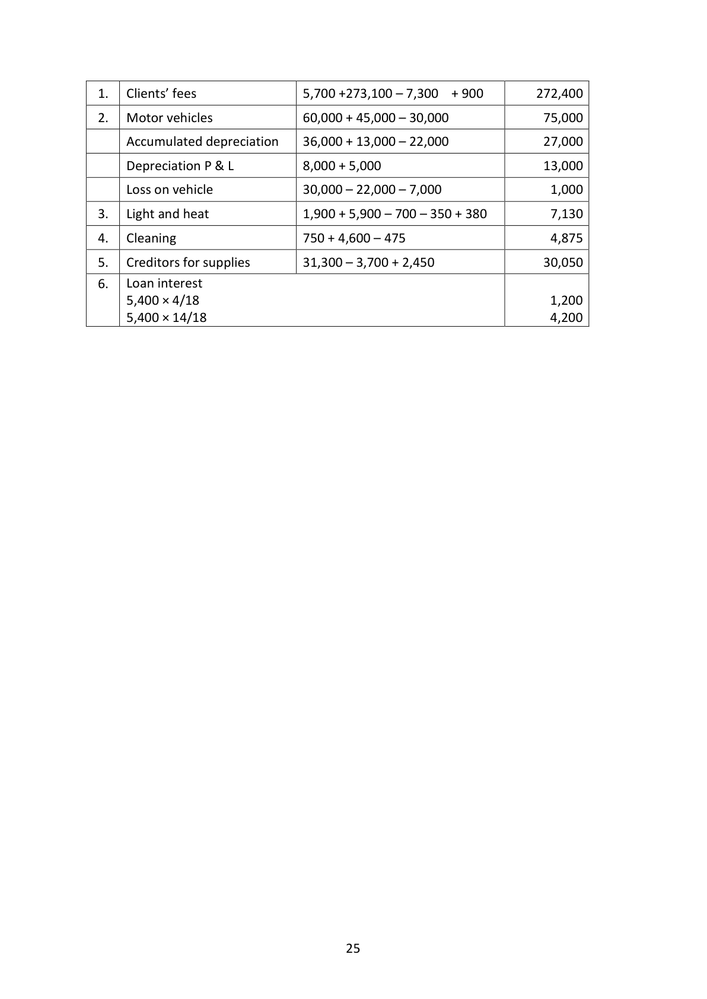

<!-- HAS_VISUAL: true -->
<!-- VISUAL_REASON: page contains vector drawings; page image extracted because text may not fully capture visual content -->

# Source References

Exam paper:
- file: intermediate_markdown/exam_papers/higher/accounting_higher_2020_paper_1_exam.md
- pages: []

Marking scheme:
- file: intermediate_markdown/marking_schemes/higher/accounting_higher_2020_paper_1_marking_scheme.md
- pages: [6, 11, 12, 13, 14, 15, 16, 17, 18, 19, 20, 21, 22, 23, 24, 25]

# Notes

