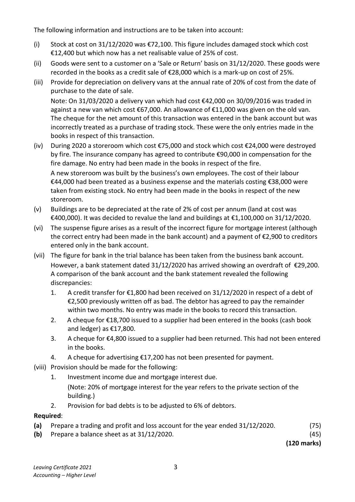
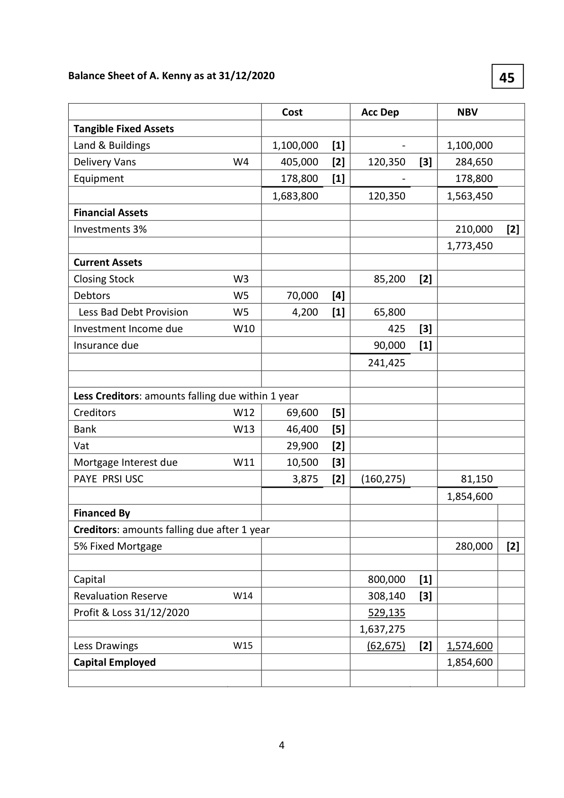
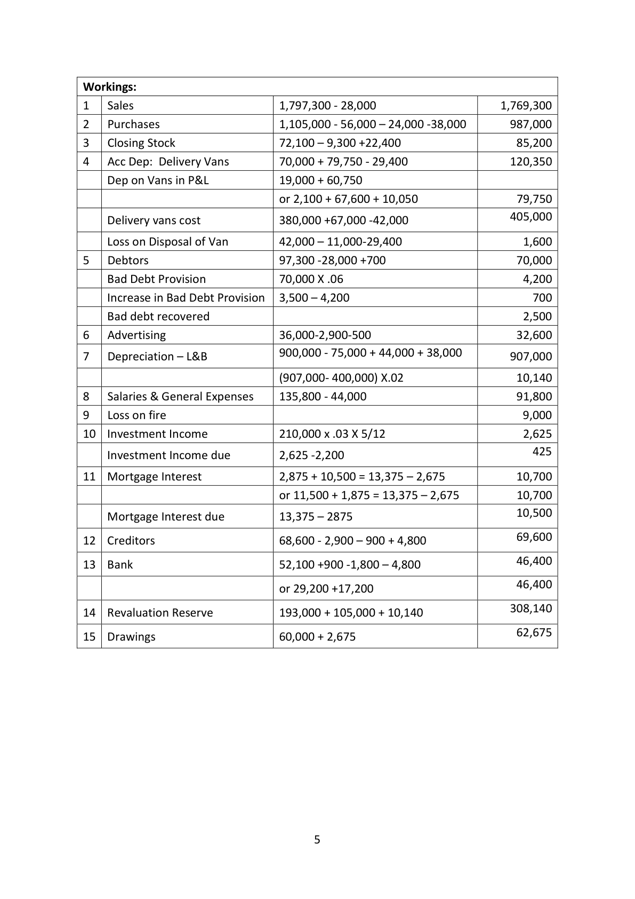
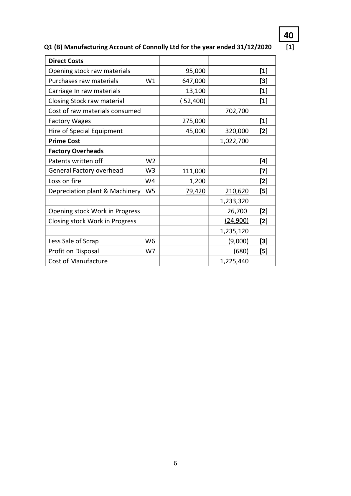
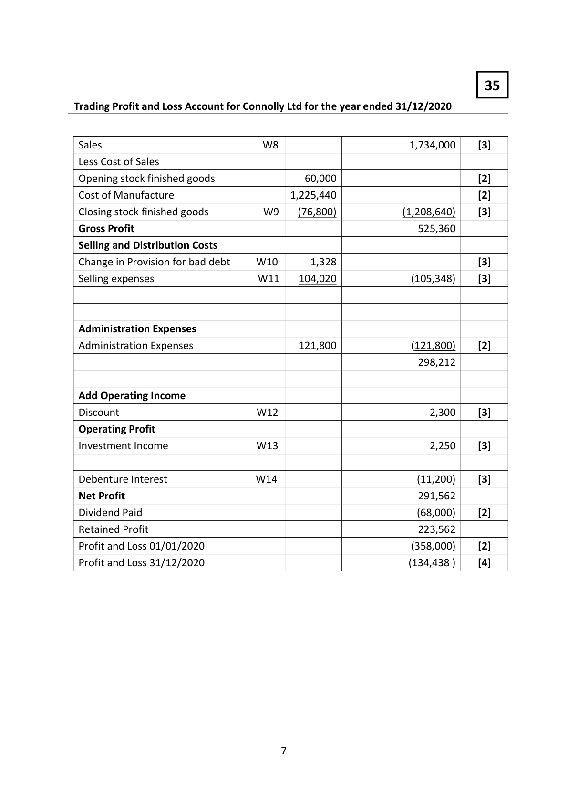
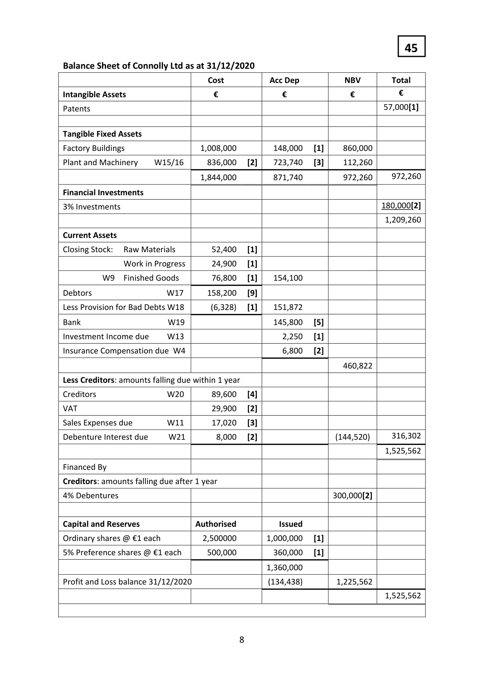
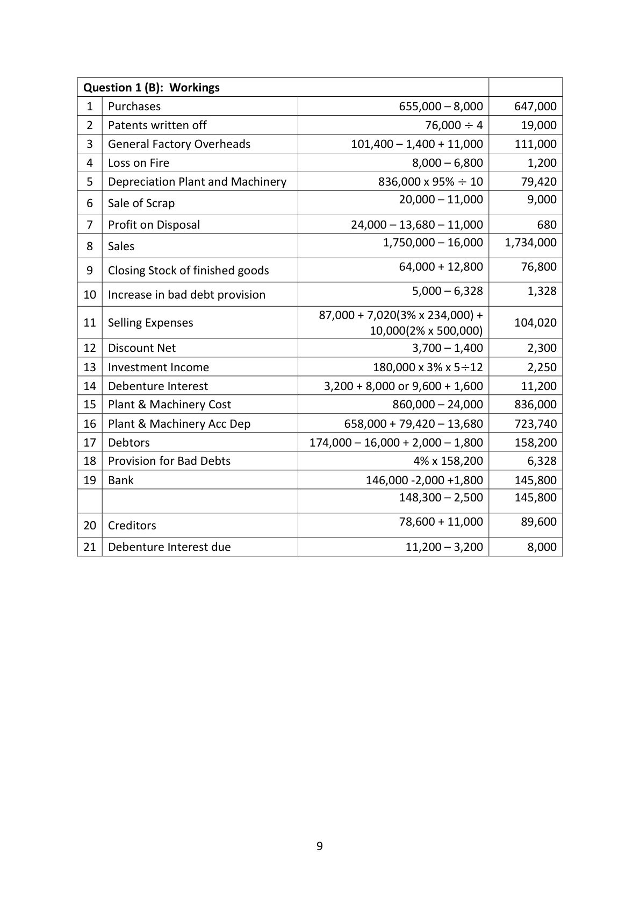
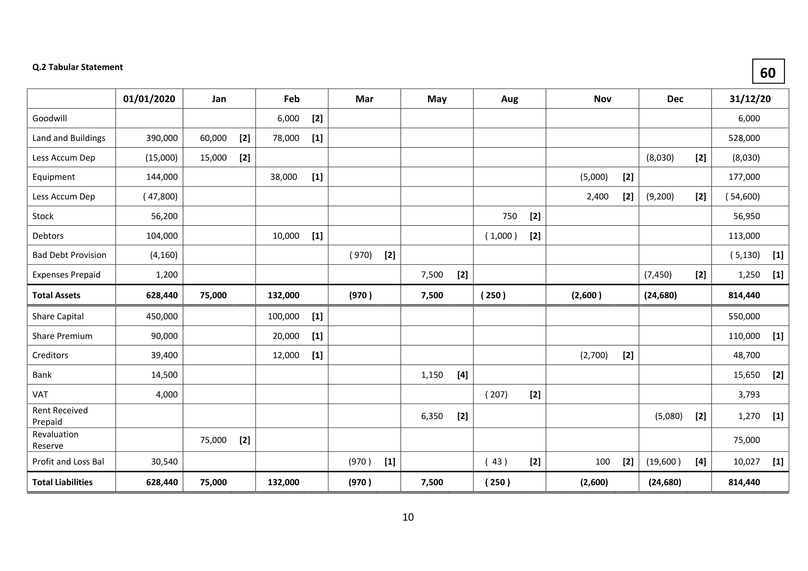
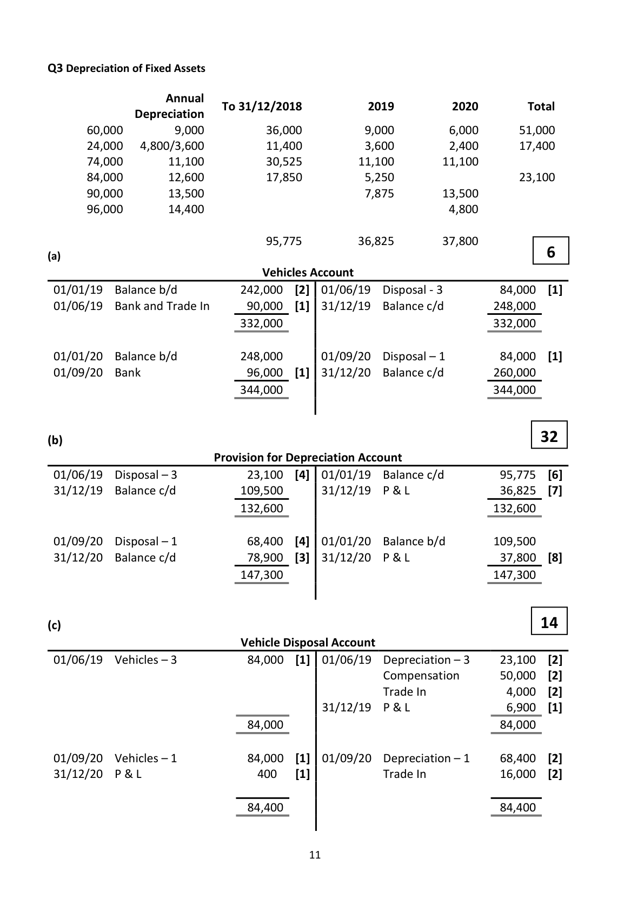

# Question

1.   Answer (A) OR (B)

(A)   Sole Trader – Final Accounts

The following trial balance was extracted from the books of A. Kenny on 31/12/2020:

                                                       €            €
   Land and buildings (cost €900,000)                        795,000
    Delivery vans (cost €380,000)                            310,000
   Equipment at cost                                      178,800
    Discount (net)                                                           4,700
   5% Fixed Mortgage (including €50,000 issued on 31/03/2020)               280,000
   3% Investments acquired on 01/08/2020                   210,000
    Stock 01/01/2020                                        68,700
    Sales                                                                 1,797,300
   Purchases                                             1,105,000
    Salaries and general expenses                            135,800
    Advertising (incorporating suspense)                        36,000
   Investment interest received                                              2,200
   Drawings                                               60,000
    Rates                                                   43,200
   PAYE, PRSI, USC                                                          3,875
   VAT                                                                  29,900
   Bank                                                                 52,100
   Mortgage interest paid for the first three months              2,375
   Debtors and creditors                                     97,300        68,600
   Bad debts provision                                                      3,500
    Capital                                            ________       800,000
                                                          3,042,175     3,042,175

Leaving Certificate 2021                       2
Accounting – Higher Level

<!-- PAGE 3 -->
# Page 3

<!-- HAS_VISUAL: true -->
<!-- VISUAL_REASON: text contains visual keywords: figure; page image extracted because text may not fully capture visual content -->

The following information and instructions are to be taken into account:

(i)   Stock at cost on 31/12/2020 was €72,100. This figure includes damaged stock which cost
     €12,400 but which now has a net realisable value of 25% of cost.
(ii)  Goods were sent to a customer on a ‘Sale or Return’ basis on 31/12/2020. These goods were
     recorded in the books as a credit sale of €28,000 which is a mark‐up on cost of 25%.
(iii)  Provide for depreciation on delivery vans at the annual rate of 20% of cost from the date of
     purchase to the date of sale.
     Note: On 31/03/2020 a delivery van which had cost €42,000 on 30/09/2016 was traded in
      against a new van which cost €67,000. An allowance of €11,000 was given on the old van.
     The cheque for the net amount of this transaction was entered in the bank account but was
      incorrectly treated as a purchase of trading stock. These were the only entries made in the
     books in respect of this transaction.
(iv)  During 2020 a storeroom which cost €75,000 and stock which cost €24,000 were destroyed
     by fire. The insurance company has agreed to contribute €90,000 in compensation for the
       fire damage. No entry had been made in the books in respect of the fire.
    A new storeroom was built by the business’s own employees. The cost of their labour
     €44,000 had been treated as a business expense and the materials costing €38,000 were
     taken from existing stock. No entry had been made in the books in respect of the new
     storeroom.
(v)   Buildings are to be depreciated at the rate of 2% of cost per annum (land at cost was
      €400,000). It was decided to revalue the land and buildings at €1,100,000 on 31/12/2020.
(vi)  The suspense figure arises as a result of the incorrect figure for mortgage interest (although
     the correct entry had been made in the bank account) and a payment of €2,900 to creditors
     entered only in the bank account.
(vii)  The figure for bank in the trial balance has been taken from the business bank account.
     However, a bank statement dated 31/12/2020 has arrived showing an overdraft of €29,200.
    A comparison of the bank account and the bank statement revealed the following
      discrepancies:
      1.   A credit transfer for €1,800 had been received on 31/12/2020 in respect of a debt of
          €2,500 previously written off as bad. The debtor has agreed to pay the remainder
           within two months. No entry was made in the books to record this transaction.
      2.   A cheque for €18,700 issued to a supplier had been entered in the books (cash book
         and ledger) as €17,800.
      3.   A cheque for €4,800 issued to a supplier had been returned. This had not been entered
             in the books.
      4.   A cheque for advertising €17,200 has not been presented for payment.
(viii) Provision should be made for the following:
      1.   Investment income due and mortgage interest due.
           (Note: 20% of mortgage interest for the year refers to the private section of the
             building.)

# Marking Scheme

Q1 (a)Trading and Profit and Loss Account of A Kenny for the year ended 31/12/2020  [1]

                                    €             €              €
 Sales             W 1                                  1,769,300   [3]
 Less Cost of Sales
 Opening stock                                       68,700   [3]
 Purchases             W2                   987,000   [8]
 Less closing stock         W3                    (85,200)   [7]   (970,500)

 Gross Profit                                                        798,800
 Less Expenses
 Distribution Costs
 Depreciation Motor Vehicles   W4    79,750   [4]
 Loss on sale of vehicle      W4      1,600   [4]
 Increase in bad debt provision  W5      700   [4]
 Advertising             W6    32,600   [7]   114,650

 Administration Expenses
 Depreciation Land & Buildings  W7    10,140   [4]
 Salaries & General Expenses   W8    91,800   [4]
 Loss on fire             W9      9,000   [3]
 Rates                               43,200   [2]   154,140         (268,790)

                                                                   530,010
 Add Operating Income
 Bad Debt Recovered        W5                    2,500   [4]
 Discount                                              4,700   [3]       7,200

 Operating Profit                                                    537,210
 Investment Income         W10                                     2,625   [3]

                                                                   539,835
 Less Mortgage Interest       W11                                     (10,700)   [5]

 Net profit                                                          529,135   [6]

                                     3

<!-- PAGE 4 -->
# Page 4

<!-- HAS_VISUAL: true -->
<!-- VISUAL_REASON: page contains vector drawings; page image extracted because text may not fully capture visual content -->

Balance Sheet of A. Kenny as at 31/12/2020                             45

                                          Cost           Acc Dep        NBV
 Tangible Fixed Assets
 Land & Buildings                        1,100,000   [1]                ‐        1,100,000
 Delivery Vans            W4      405,000   [2]    120,350   [3]    284,650
 Equipment                             178,800   [1]                ‐         178,800

                                        1,683,800         120,350        1,563,450
 Financial Assets
 Investments 3%                                                          210,000   [2]
                                                                          1,773,450
 Current Assets
 Closing Stock            W3                        85,200   [2]
 Debtors               W5       70,000   [4]
  Less Bad Debt Provision      W5        4,200   [1]     65,800
 Investment Income due       W10                       425   [3]
 Insurance due                                             90,000   [1]

                                                        241,425

 Less Creditors: amounts falling due within 1 year
 Creditors                W12      69,600   [5]
 Bank                   W13      46,400   [5]
 Vat                                     29,900   [2]
 Mortgage Interest due        W11      10,500   [3]
 PAYE PRSI USC                             3,875   [2]   (160,275)           81,150

                                                                          1,854,600
 Financed By
 Creditors: amounts falling due after 1 year
 5% Fixed Mortgage                                                       280,000   [2]

 Capital                                                 800,000   [1]
 Revaluation Reserve          W14                      308,140   [3]
 Profit & Loss 31/12/2020                                  529,135
                                                         1,637,275
 Less Drawings              W15                        (62,675)   [2]   1,574,600
 Capital Employed                                                         1,854,600

                                     4

<!-- PAGE 5 -->
# Page 5

<!-- HAS_VISUAL: true -->
<!-- VISUAL_REASON: page contains vector drawings; page image extracted because text may not fully capture visual content -->

Workings:
1   Sales                         1,797,300 ‐ 28,000                      1,769,300
2   Purchases                     1,105,000 ‐ 56,000 – 24,000 ‐38,000       987,000
3   Closing Stock                 72,100 – 9,300 +22,400                   85,200
4   Acc Dep: Delivery Vans        70,000 + 79,750 ‐ 29,400                 120,350
    Dep on Vans in P&L            19,000 + 60,750
                                   or 2,100 + 67,600 + 10,050                 79,750
                                                                       405,000     Delivery vans cost             380,000 +67,000 ‐42,000

    Loss on Disposal of Van         42,000 – 11,000‐29,400                     1,600
5   Debtors                      97,300 ‐28,000 +700                      70,000
    Bad Debt Provision            70,000 X .06                               4,200
    Increase in Bad Debt Provision  3,500 – 4,200                            700
    Bad debt recovered                                                      2,500
6   Advertising                    36,000‐2,900‐500                        32,600
                                 900,000 ‐ 75,000 + 44,000 + 38,0007   Depreciation – L&B                                                  907,000

                                   (907,000‐ 400,000) X.02                   10,140
8    Salaries & General Expenses    135,800 ‐ 44,000                         91,800
9   Loss on fire                                                             9,000
10  Investment Income            210,000 x .03 X 5/12                        2,625
                                                                     425    Investment Income due        2,625 ‐2,200

11  Mortgage Interest             2,875 + 10,500 = 13,375 – 2,675            10,700
                                   or 11,500 + 1,875 = 13,375 – 2,675          10,700
                                                                         10,500    Mortgage Interest due         13,375 – 2875

                                                                         69,60012  Creditors                     68,600 ‐ 2,900 – 900 + 4,800

                                                                         46,40013  Bank                         52,100 +900 ‐1,800 – 4,800

                                                                         46,400                                   or 29,200 +17,200

                                                                       308,14014  Revaluation Reserve           193,000 + 105,000 + 10,140

                                                                         62,67515  Drawings                     60,000 + 2,675

                                    5

<!-- PAGE 6 -->
# Page 6

<!-- HAS_VISUAL: true -->
<!-- VISUAL_REASON: page contains vector drawings; page image extracted because text may not fully capture visual content -->

40

Q1 (B) Manufacturing Account of Connolly Ltd for the year ended 31/12/2020     [1]

  Direct Costs
 Opening stock raw materials                 95,000                    [1]
 Purchases raw materials      W1        647,000                    [3]
  Carriage In raw materials                    13,100                    [1]
  Closing Stock raw material                          ( 52,400)                    [1]
 Cost of raw materials consumed                         702,700
 Factory Wages                           275,000                    [1]
 Hire of Special Equipment                   45,000      320,000    [2]
 Prime Cost                                            1,022,700
 Factory Overheads
 Patents written off         W2                                      [4]
 General Factory overhead     W3        111,000                    [7]
 Loss on fire             W4           1,200                    [2]
 Depreciation plant & Machinery W5         79,420      210,620    [5]
                                                       1,233,320
 Opening stock Work in Progress                           26,700     [2]
  Closing stock Work in Progress                              (24,900)    [2]
                                                       1,235,120
 Less Sale of Scrap         W6                         (9,000)    [3]
  Profit on Disposal         W7                          (680)    [5]
 Cost of Manufacture                                   1,225,440

                                    6

<!-- PAGE 7 -->
# Page 7

<!-- HAS_VISUAL: true -->
<!-- VISUAL_REASON: page contains vector drawings; page image extracted because text may not fully capture visual content -->

35

Trading Profit and Loss Account for Connolly Ltd for the year ended 31/12/2020

 Sales                    W8                         1,734,000     [3]
 Less Cost of Sales
 Opening stock finished goods                 60,000                                [2]
 Cost of Manufacture                      1,225,440                                [2]
 Closing stock finished goods       W9    (76,800)              (1,208,640)     [3]
 Gross Profit                                                     525,360
 Selling and Distribution Costs
 Change in Provision for bad debt    W10      1,328                                [3]
 Selling expenses              W11    104,020               (105,348)     [3]

 Administration Expenses
 Administration Expenses                    121,800               (121,800)     [2]
                                                                298,212

 Add Operating Income
 Discount                   W12                             2,300     [3]
 Operating Profit
 Investment Income            W13                             2,250     [3]

 Debenture Interest            W14                             (11,200)     [3]
 Net Profit                                                      291,562
 Dividend Paid                                                         (68,000)     [2]
 Retained Profit                                                  223,562
 Profit and Loss 01/01/2020                                          (358,000)     [2]
 Profit and Loss 31/12/2020                                        (134,438 )     [4]

                                    7

<!-- PAGE 8 -->
# Page 8

<!-- HAS_VISUAL: true -->
<!-- VISUAL_REASON: page contains vector drawings; page image extracted because text may not fully capture visual content -->

45

Balance Sheet of Connolly Ltd as at 31/12/2020

                                    Cost           Acc Dep        NBV        Total
Intangible Assets                   €              €              €          €
Patents                                                                           57,000[1]

Tangible Fixed Assets

Factory Buildings                   1,008,000         148,000   [1]     860,000

Plant and Machinery   W15/16      836,000   [2]    723,740   [3]     112,260
                                  1,844,000         871,740          972,260     972,260

Financial Investments
3% Investments                                                                  180,000[2]
                                                                                1,209,260

Current Assets

Closing Stock:  Raw Materials         52,400   [1]

            Work in Progress      24,900   [1]

      W9  Finished Goods        76,800   [1]    154,100

Debtors             W17      158,200   [9]

Less Provision for Bad Debts W18       (6,328)   [1]    151,872

Bank               W19                     145,800   [5]

Investment Income due   W13                        2,250   [1]

Insurance Compensation due W4                        6,800   [2]

                                                                   460,822

Less Creditors: amounts falling due within 1 year

Creditors            W20       89,600   [4]

VAT                                29,900   [2]

Sales Expenses due      W11       17,020   [3]
Debenture Interest due    W21        8,000   [2]                    (144,520)     316,302

                                                                                1,525,562

Financed By

Creditors: amounts falling due after 1 year

4% Debentures                                                      300,000[2]

Capital and Reserves             Authorised           Issued

Ordinary shares @ €1 each          2,500000       1,000,000   [1]

5% Preference shares @ €1 each      500,000         360,000   [1]

                                                   1,360,000

Profit and Loss balance 31/12/2020                    (134,438)        1,225,562

                                                                                1,525,562

                                    8

<!-- PAGE 9 -->
# Page 9

<!-- HAS_VISUAL: true -->
<!-- VISUAL_REASON: page contains vector drawings; page image extracted because text may not fully capture visual content -->

Question 1 (B): Workings
 1   Purchases                                       655,000 – 8,000     647,000
 2   Patents written off                                     76,000 ൊ 4      19,000
 3   General Factory Overheads                 101,400 – 1,400 + 11,000     111,000
 4   Loss on Fire                                         8,000 – 6,800        1,200
 5   Depreciation Plant and Machinery               836,000 x 95% ൊ 10      79,420
                                                     20,000 – 11,000        9,000 6   Sale of Scrap

 7   Profit on Disposal                         24,000 – 13,680 – 11,000        680
                                                    1,750,000 – 16,000    1,734,000 8   Sales

                                                     64,000 + 12,800      76,800 9   Closing Stock of finished goods

                                                        5,000 – 6,328        1,32810  Increase in bad debt provision

                                       87,000 + 7,020(3% x 234,000) +
11  Selling Expenses                                                     104,020
                                              10,000(2% x 500,000)
12  Discount Net                                        3,700 – 1,400        2,300
13  Investment Income                           180,000 x 3% x 5ൊ12        2,250
14  Debenture Interest                    3,200 + 8,000 or 9,600 + 1,600      11,200
15  Plant & Machinery Cost                           860,000 – 24,000     836,000
16  Plant & Machinery Acc Dep               658,000 + 79,420 – 13,680     723,740
17  Debtors                          174,000 – 16,000 + 2,000 – 1,800     158,200
18  Provision for Bad Debts                       4% x 158,200        6,328
19  Bank                                      146,000 ‐2,000 +1,800     145,800
                                                    148,300 – 2,500     145,800

                                                     78,600 + 11,000      89,60020  Creditors

21  Debenture Interest due                             11,200 – 3,200        8,000

                                    9

<!-- PAGE 10 -->
# Page 10

<!-- HAS_VISUAL: true -->
<!-- VISUAL_REASON: page contains vector drawings; page image extracted because text may not fully capture visual content -->

[1]   [1]                [1]         [2]          [1]           [1]
60
                        31/12/20                           6,000       528,000       (8,030)       177,000       54,600)      56,950       113,000      5,130)(     1,250        814,440        550,000       110,000      48,700      15,650     3,793      1,270         75,000        10,027        814,440
             (

                            [2]         [2]                     [2]                                         [2]           [4]

         Dec                                                                                                                                                                                                                                                              (5,080)    )                                                                                                                                                                                                                                                                                               (19,600         (24,680)                                                                  (8,030)                     (9,200)                                                  (7,450)         (24,680)

                                  [2]   [2]                                               [2]                              [2]

                        )         Nov                                              2,400                                                                                100                                                                                (5,000)                                                                                                                           (2,700)                                                                                     (2,600)                                                                                                                                              (2,600

                                              [2]   [2]                                               [2]                  [2]

         Aug                                 750 )     )
                                                                                        1,000                                                              207)      )43 )250                  (                250         (      ( (
                        (

                                                                 [2]                            [4]          [2]

         May                                                                                                            7,500      7,500                                    1,150                6,350                             7,500

                                                                              10

                                                           [2]                                                             [1]

         Mar                                                             970)   )                ) )                    (             (970                                                                 (970     (970

                [2]   [1]         [1]               [1]                      [1]   [1]   [1]
         Feb     6,000      78,000                  38,000                               10,000                                    132,000        100,000      20,000      12,000                                                                                     132,000

                      [2]   [2]                                                                                     [2]
         Jan                  60,000      15,000                                                                                75,000                                                                                    75,000                    75,000

                                                                                             56,200       104,000       (4,160)     1,200        628,440        450,000      90,000      39,400      14,500     4,000                                    30,540        628,440
             (                              01/01/2020                     390,000        (15,000)       144,000       47,800)

                                                                                                                           BalStatement                         Dep         Dep                                                                                                                                                                    Loss                                                                  Buildings                                                                                                     Provision       Prepaid                                                                                                                           and            Liabilities                                                                                                                                              Assets        Capital       Premium                                                      Received                      and     Accum               Accum                    DebtTabularQ.2                                   Goodwill    Land    Less         Equipment    Less     Stock       Debtors   Bad        Expenses      Total      Share     Share         Creditors    Bank   VAT   Rent  Prepaid   Revaluation  Reserve    Profit      Total

<!-- PAGE 11 -->
# Page 11

<!-- HAS_VISUAL: true -->
<!-- VISUAL_REASON: page contains vector drawings; page image extracted because text may not fully capture visual content -->

1. High interest repayments means less profits are available for investment elsewhere in the business.

1. Sell more ordinary shares to increase shareholders equity as a proportion of capital employed.

1.  Tangible Fixed Assets and stock [5]
Buildings were revalued at the end of this year to €1,250,000 and have been included in the accounts
at their revalued amount.
Depreciation is calculated in order to write off the value or cost of tangible fixed assets over their
estimated useful economic life, as follows:
        o  Buildings         2% of cost per annum straight line basis
        o  Delivery vans      15% of cost per annum straight line basis
Stocks are valued on a first in first out basis at the lower of cost and net realisable value.

1.  Credit Sales increase profit, but do not increase cash. Debtors increased by €70,000.

1. Selling price

1. To show management the cost levels at different levels of production. It is misleading to
  compare the budgeted costs at one level of activity with the actual costs at a different level of
   activity.

# Source References

Exam paper:
- file: intermediate_markdown/exam_papers/higher/accounting_higher_2021_paper_1_exam.md
- pages: [3]

Marking scheme:
- file: intermediate_markdown/marking_schemes/higher/accounting_higher_2021_paper_1_marking_scheme.md
- pages: [4, 5, 6, 7, 8, 9, 10, 11]

# Notes

