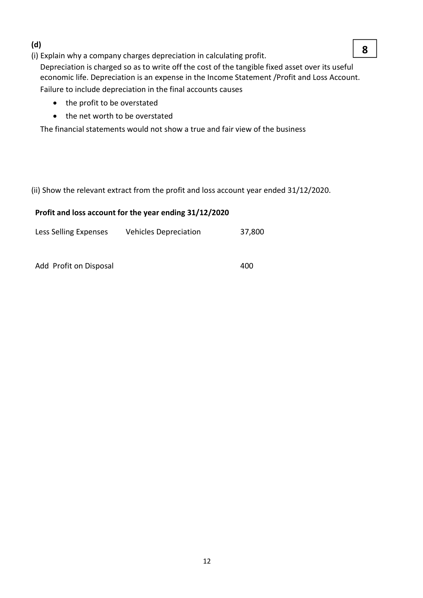
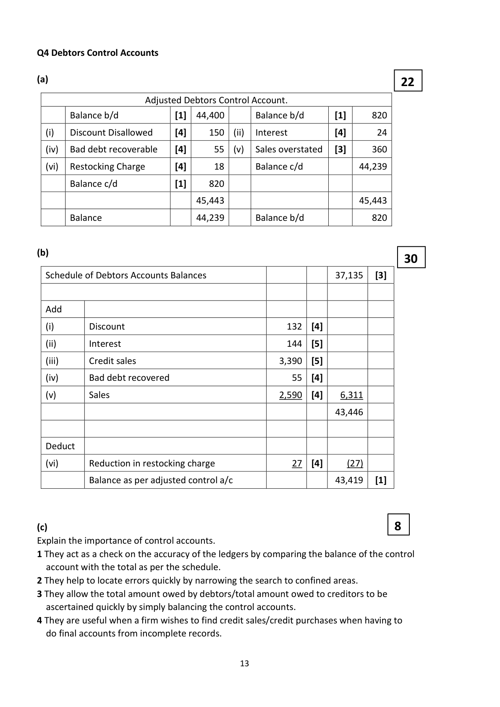

# Question

3.   A cheque of €2,500 issued to a creditor has not been presented for payment.
        (vi)  During the year stock of raw materials which had cost €8,000 were destroyed by fire.
          The insurance company agreed to pay compensation of 85%.
        (vii)  Provision should be made for the following:
             1.   Investment income due and debenture interest due.
             2.    Provision for bad debts to be adjusted to 4% of debtors.
             3.    Patents are being written off over a 6 year period which commenced in 2018.

# Marking Scheme

Q3 Depreciation of Fixed Assets

                   Annual
                          To 31/12/2018          2019         2020         Total
               Depreciation
       60,000         9,000          36,000           9,000         6,000       51,000
       24,000   4,800/3,600          11,400           3,600         2,400       17,400
       74,000       11,100          30,525         11,100        11,100
       84,000       12,600          17,850           5,250                     23,100
       90,000       13,500                           7,875        13,500
       96,000       14,400                                         4,800

                                    95,775         36,825        37,800
(a)                                                       6
                                      Vehicles Account
 01/01/19  Balance b/d          242,000  [2]  01/06/19  Disposal ‐ 3         84,000  [1]
 01/06/19  Bank and Trade In      90,000  [1]  31/12/19  Balance c/d        248,000
                                332,000                                  332,000

 01/01/20  Balance b/d          248,000      01/09/20  Disposal – 1         84,000  [1]
 01/09/20  Bank                  96,000  [1]  31/12/20  Balance c/d        260,000
                                344,000                                  344,000

(b)                                                      32
                              Provision for Depreciation Account
 01/06/19  Disposal – 3            23,100  [4]  01/01/19  Balance c/d         95,775  [6]
 31/12/19  Balance c/d           109,500      31/12/19  P & L               36,825  [7]
                                132,600                                  132,600

 01/09/20  Disposal – 1            68,400  [4]  01/01/20  Balance b/d        109,500
 31/12/20  Balance c/d            78,900  [3]  31/12/20  P & L               37,800  [8]
                                147,300                                  147,300

(c)                                                       14
                                  Vehicle Disposal Account
 01/06/19  Vehicles – 3            84,000  [1]  01/06/19  Depreciation – 3     23,100  [2]
                                                     Compensation       50,000  [2]
                                                       Trade In              4,000  [2]
                                            31/12/19  P & L                6,900  [1]
                                 84,000                                    84,000

 01/09/20  Vehicles – 1            84,000  [1]  01/09/20  Depreciation – 1     68,400  [2]
 31/12/20  P & L                  400    [1]            Trade In            16,000  [2]

                                 84,400                                    84,400

                                           11

<!-- PAGE 12 -->
# Page 12

<!-- HAS_VISUAL: true -->
<!-- VISUAL_REASON: page contains vector drawings; page image extracted because text may not fully capture visual content -->

(d)
                                                         8
(i) Explain why a company charges depreciation in calculating profit.
  Depreciation is charged so as to write off the cost of the tangible fixed asset over its useful
  economic life. Depreciation is an expense in the Income Statement /Profit and Loss Account.
   Failure to include depreciation in the final accounts causes
        the profit to be overstated
        the net worth to be overstated

  The financial statements would not show a true and fair view of the business

(ii) Show the relevant extract from the profit and loss account year ended 31/12/2020.

 Profit and loss account for the year ending 31/12/2020

 Less Selling Expenses     Vehicles Depreciation          37,800

 Add Profit on Disposal                             400

                                           12

<!-- PAGE 13 -->
# Page 13

<!-- HAS_VISUAL: true -->
<!-- VISUAL_REASON: page contains vector drawings; page image extracted because text may not fully capture visual content -->

3. The business would find it more difficult to raise additional loan finance.

3. Increase reserves/retained profits to increase shareholders equity as a proportion of capital
  employed.

3.  Contingent Liability [4]
The company has provided €60,000 for a claim made by an employee for unfair dismissal. The
company’s legal advisers have advised that the company will probably be liable for the full €60,000
of the claim.

3. Depreciation on Fixed Assets of €34,000 reduces profit but does not reduce cash.

3. Variable costs

3. To compare budgeted costs and actual costs in order to identify variances. This allows
   corrective action to be taken.

# Source References

Exam paper:
- file: intermediate_markdown/exam_papers/higher/accounting_higher_2021_paper_1_exam.md
- pages: []

Marking scheme:
- file: intermediate_markdown/marking_schemes/higher/accounting_higher_2021_paper_1_marking_scheme.md
- pages: [12, 13]

# Notes

