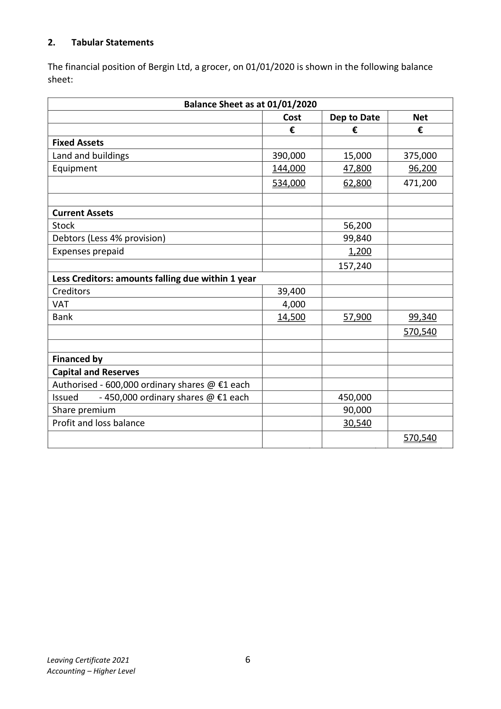
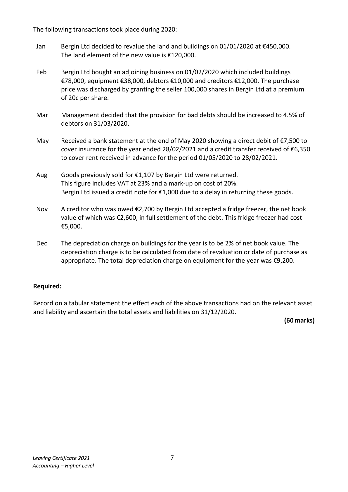
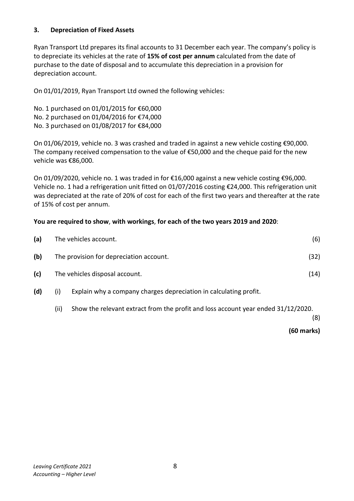
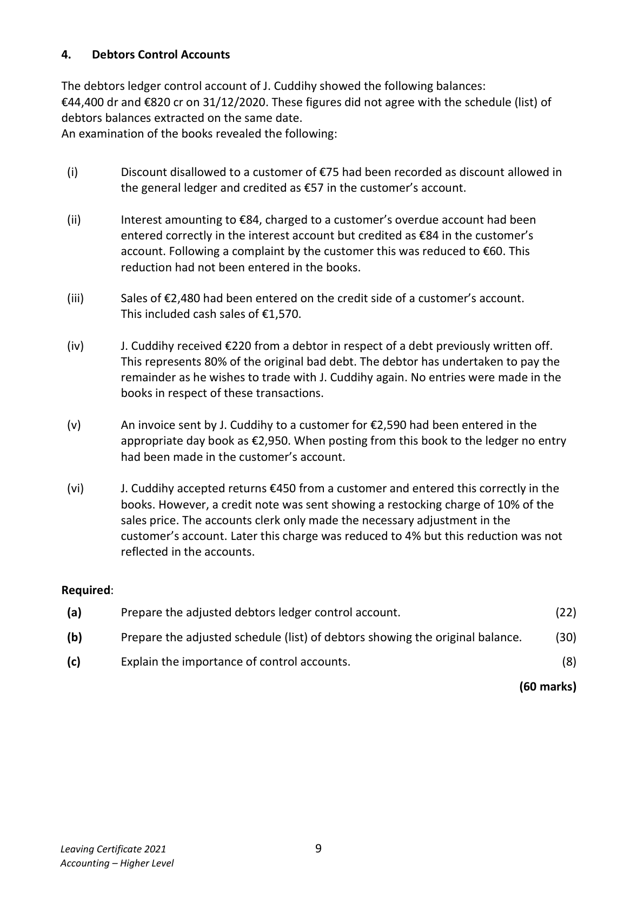
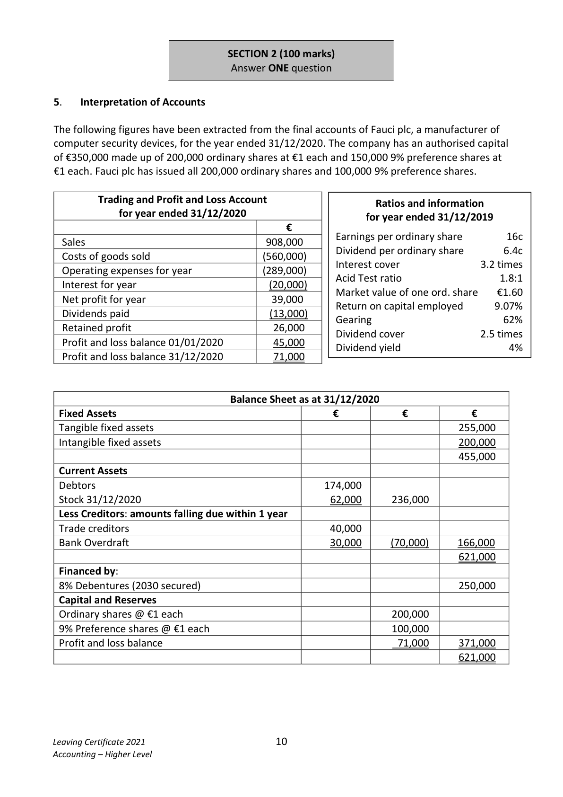
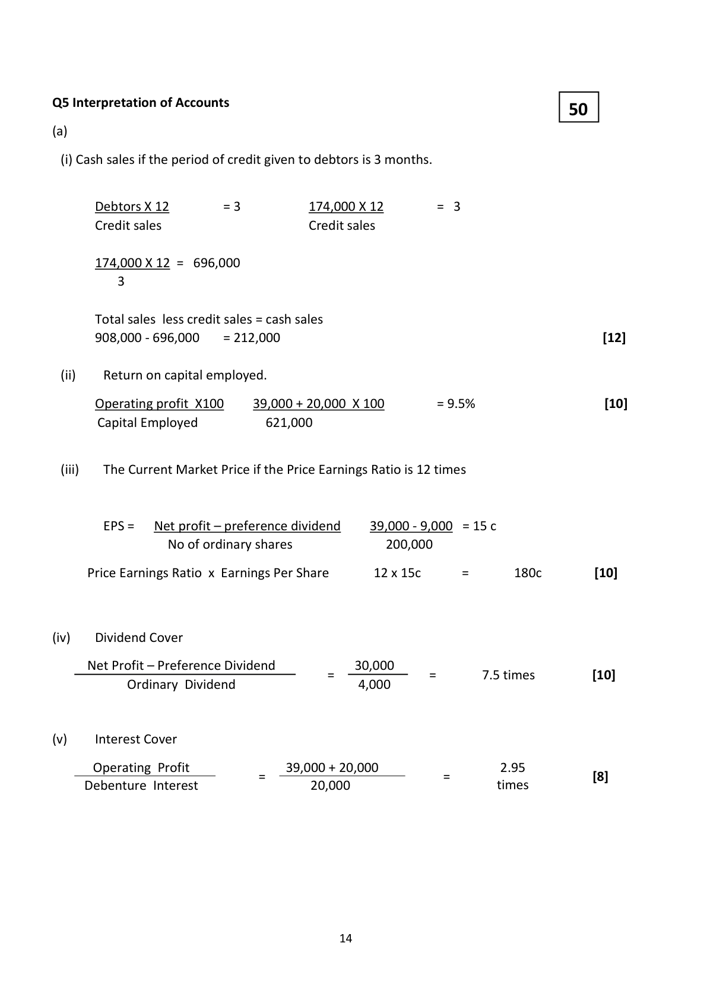
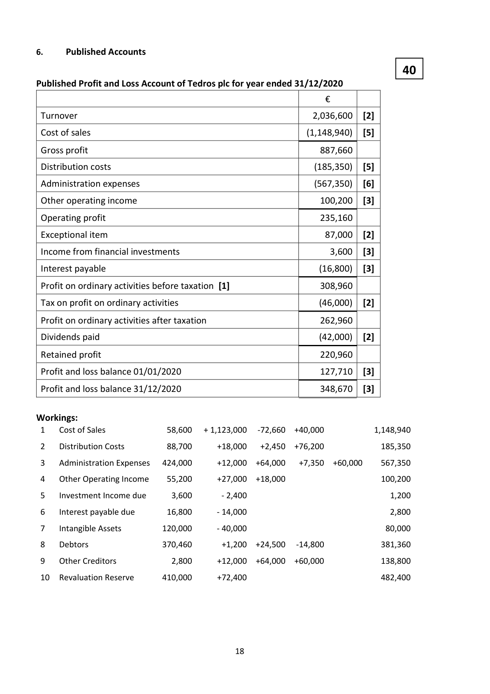

# Question

4.   The Sales Director should be paid a bonus commission of 2% on sales greater
               than €1,000,000, increasing to 3% on any sales above €1,500,000.

     Required:

       (a)   Prepare a manufacturing, trading and profit and loss account for the year ended
          31/12/2020.                                                                       (75)

      (b)   Prepare a balance sheet as at 31/12/2020.                                         (45)
                                                                             (120 marks)

Leaving Certificate 2021                       5
Accounting – Higher Level

<!-- PAGE 6 -->
# Page 6

<!-- HAS_VISUAL: true -->
<!-- VISUAL_REASON: page contains vector drawings; page image extracted because text may not fully capture visual content -->

2.    Tabular Statements

The financial position of Bergin Ltd, a grocer, on 01/01/2020 is shown in the following balance
sheet:

                             Balance Sheet as at 01/01/2020
                                                    Cost     Dep to Date      Net
                                               €           €            €
 Fixed Assets
 Land and buildings                              390,000        15,000       375,000
 Equipment                                     144,000        47,800        96,200
                                               534,000        62,800       471,200

 Current Assets
 Stock                                                         56,200
 Debtors (Less 4% provision)                                      99,840
 Expenses prepaid                                                 1,200
                                                             157,240
 Less Creditors: amounts falling due within 1 year
 Creditors                                        39,400
 VAT                                               4,000
 Bank                                            14,500        57,900        99,340
                                                                           570,540

 Financed by
 Capital and Reserves
 Authorised ‐ 600,000 ordinary shares @ €1 each
 Issued       ‐ 450,000 ordinary shares @ €1 each                   450,000
 Share premium                                                 90,000
 Profit and loss balance                                          30,540
                                                                           570,540

Leaving Certificate 2021                       6
Accounting – Higher Level

<!-- PAGE 7 -->
# Page 7

<!-- HAS_VISUAL: true -->
<!-- VISUAL_REASON: text contains visual keywords: figure; page image extracted because text may not fully capture visual content -->

The following transactions took place during 2020:

 Jan     Bergin Ltd decided to revalue the land and buildings on 01/01/2020 at €450,000.
        The land element of the new value is €120,000.

 Feb     Bergin Ltd bought an adjoining business on 01/02/2020 which included buildings
         €78,000, equipment €38,000, debtors €10,000 and creditors €12,000. The purchase
          price was discharged by granting the seller 100,000 shares in Bergin Ltd at a premium
          of 20c per share.

 Mar   Management decided that the provision for bad debts should be increased to 4.5% of
         debtors on 31/03/2020.

 May    Received a bank statement at the end of May 2020 showing a direct debit of €7,500 to
         cover insurance for the year ended 28/02/2021 and a credit transfer received of €6,350
         to cover rent received in advance for the period 01/05/2020 to 28/02/2021.

 Aug    Goods previously sold for €1,107 by Bergin Ltd were returned.
          This figure includes VAT at 23% and a mark‐up on cost of 20%.
         Bergin Ltd issued a credit note for €1,000 due to a delay in returning these goods.

 Nov   A creditor who was owed €2,700 by Bergin Ltd accepted a fridge freezer, the net book
         value of which was €2,600, in full settlement of the debt. This fridge freezer had cost
         €5,000.

 Dec    The depreciation charge on buildings for the year is to be 2% of net book value. The
         depreciation charge is to be calculated from date of revaluation or date of purchase as
          appropriate. The total depreciation charge on equipment for the year was €9,200.

Required:

Record on a tabular statement the effect each of the above transactions had on the relevant asset
and liability and ascertain the total assets and liabilities on 31/12/2020.
                                                                                 (60 marks)

Leaving Certificate 2021                       7
Accounting – Higher Level

<!-- PAGE 8 -->
# Page 8

3.    Depreciation of Fixed Assets

Ryan Transport Ltd prepares its final accounts to 31 December each year. The company’s policy is
to depreciate its vehicles at the rate of 15% of cost per annum calculated from the date of
purchase to the date of disposal and to accumulate this depreciation in a provision for
depreciation account.

On 01/01/2019, Ryan Transport Ltd owned the following vehicles:

No. 1 purchased on 01/01/2015 for €60,000
No. 2 purchased on 01/04/2016 for €74,000
No. 3 purchased on 01/08/2017 for €84,000

On 01/06/2019, vehicle no. 3 was crashed and traded in against a new vehicle costing €90,000.
The company received compensation to the value of €50,000 and the cheque paid for the new
vehicle was €86,000.

On 01/09/2020, vehicle no. 1 was traded in for €16,000 against a new vehicle costing €96,000.
Vehicle no. 1 had a refrigeration unit fitted on 01/07/2016 costing €24,000. This refrigeration unit
was depreciated at the rate of 20% of cost for each of the first two years and thereafter at the rate
of 15% of cost per annum.

You are required to show, with workings, for each of the two years 2019 and 2020:

(a)    The vehicles account.                                                                          (6)

(b)    The provision for depreciation account.                                                (32)

(c)    The vehicles disposal account.                                                          (14)

(d)      (i)    Explain why a company charges depreciation in calculating profit.

           (ii)  Show the relevant extract from the profit and loss account year ended 31/12/2020.
                                                                                                         (8)

                                                                                 (60 marks)

Leaving Certificate 2021                       8
Accounting – Higher Level

<!-- PAGE 9 -->
# Page 9

<!-- HAS_VISUAL: true -->
<!-- VISUAL_REASON: text contains visual keywords: figure; page image extracted because text may not fully capture visual content -->

4.   Debtors Control Accounts

The debtors ledger control account of J. Cuddihy showed the following balances:
€44,400 dr and €820 cr on 31/12/2020. These figures did not agree with the schedule (list) of
debtors balances extracted on the same date.
An examination of the books revealed the following:

  (i)       Discount disallowed to a customer of €75 had been recorded as discount allowed in
          the general ledger and credited as €57 in the customer’s account.

  (ii)        Interest amounting to €84, charged to a customer’s overdue account had been
          entered correctly in the interest account but credited as €84 in the customer’s
           account. Following a complaint by the customer this was reduced to €60. This
           reduction had not been entered in the books.

  (iii)       Sales of €2,480 had been entered on the credit side of a customer’s account.
           This included cash sales of €1,570.

  (iv)          J. Cuddihy received €220 from a debtor in respect of a debt previously written off.
           This represents 80% of the original bad debt. The debtor has undertaken to pay the
          remainder as he wishes to trade with J. Cuddihy again. No entries were made in the
          books in respect of these transactions.

 (v)      An invoice sent by J. Cuddihy to a customer for €2,590 had been entered in the
           appropriate day book as €2,950. When posting from this book to the ledger no entry
         had been made in the customer’s account.

  (vi)          J. Cuddihy accepted returns €450 from a customer and entered this correctly in the
          books. However, a credit note was sent showing a restocking charge of 10% of the
            sales price. The accounts clerk only made the necessary adjustment in the
          customer’s account. Later this charge was reduced to 4% but this reduction was not
           reflected in the accounts.

Required:

 (a)       Prepare the adjusted debtors ledger control account.                             (22)

 (b)      Prepare the adjusted schedule (list) of debtors showing the original balance.      (30)

 (c)       Explain the importance of control accounts.                                            (8)

                                                                                (60 marks)

Leaving Certificate 2021                       9
Accounting – Higher Level

<!-- PAGE 10 -->
# Page 10

<!-- HAS_VISUAL: true -->
<!-- VISUAL_REASON: page contains vector drawings; text contains visual keywords: figure; page image extracted because text may not fully capture visual content -->

SECTION 2 (100 marks)
                               Answer ONE question

# Marking Scheme

Q4 Debtors Control Accounts

(a)                                                    22

                        Adjusted Debtors Control Account.

       Balance b/d              [1]  44,400       Balance b/d        [1]     820

   (i)    Discount Disallowed      [4]    150   (ii)   Interest            [4]      24

   (iv)  Bad debt recoverable    [4]     55   (v)   Sales overstated   [3]     360

   (vi)   Restocking Charge        [4]     18       Balance c/d            44,239

       Balance c/d               [1]    820

                                  45,443                             45,443

       Balance                    44,239       Balance b/d             820

(b)
                                                      30
  Schedule of Debtors Accounts Balances                            37,135   [3]

  Add

   (i)        Discount                                132  [4]

   (ii)        Interest                                144  [5]

   (iii)       Credit sales                               3,390  [5]

   (iv)      Bad debt recovered                        55  [4]

  (v)        Sales                                     2,590  [4]    6,311

                                                                43,446

  Deduct

   (vi)       Reduction in restocking charge               27  [4]      (27)

           Balance as per adjusted control a/c                      43,419   [1]

(c)                                                   8
Explain the importance of control accounts.
1 They act as a check on the accuracy of the ledgers by comparing the balance of the control
  account with the total as per the schedule.
2 They help to locate errors quickly by narrowing the search to confined areas.
3 They allow the total amount owed by debtors/total amount owed to creditors to be
  ascertained quickly by simply balancing the control accounts.
4 They are useful when a firm wishes to find credit sales/credit purchases when having to
  do final accounts from incomplete records.

                                           13

<!-- PAGE 14 -->
# Page 14

<!-- HAS_VISUAL: true -->
<!-- VISUAL_REASON: page contains vector drawings; page image extracted because text may not fully capture visual content -->

4. There is a higher risk of liquidation due to not being able to make interest payments.

(ii) Explain two ways to reduce gearing of a company.

4. Convert long‐term debt to ordinary shares reducing fixed interest debt and increasing shareholders
   equity.

                                           17

<!-- PAGE 18 -->
# Page 18

<!-- HAS_VISUAL: true -->
<!-- VISUAL_REASON: page contains vector drawings; page image extracted because text may not fully capture visual content -->

4.  Tangible Fixed Assets [7]
                                           Land &      Delivery
                                                                               Total
                                                  Buildings      Vans
                                             €           €          €
     Cost 01/01/2020                            1,100,000      508,000   1,608,000
     Disposal                                     (260,000)                 (260,000)
     Revaluation Surplus                         410,000                 410,000

                                                1,250,000      508,000   1,758,000

     Accumulated depreciation 01/01/2020          62,600       86,200    148,800
     Charge for year 31/12/2020                     9,800       76,200     86,000

                                                 72,400      162,400    234,800
     Transfer to revaluation                         (72,400)                   (72,400)

                                                 0      162,400    162,400

     Net book value 01/01/2020                  1,037,400      421,800   1,459,200
     Net book value 31/12/2020                  1,250,000      345,600   1,595,600

4. Patents written off €9,000 reduces profit, but does not reduce cash.

4. Fixed costs

The examples in part (b) of the question are examples of sensitivity analysis.

(ii) Outline why Henry Ltd would prepare a flexible budget.

4. To help in controlling costs or planning production levels.

                                         31

<!-- PAGE 32 -->
# Page 32

<!-- HAS_VISUAL: true -->
<!-- VISUAL_REASON: page contains vector drawings; text extraction is sparse relative to visible page content; page image extracted because text may not fully capture visual content -->

<!-- EXTRACTION_ISSUE: no extractable text found -->

[No extractable text found]

# Source References

Exam paper:
- file: intermediate_markdown/exam_papers/higher/accounting_higher_2021_paper_1_exam.md
- pages: [6, 7, 8, 9, 10]

Marking scheme:
- file: intermediate_markdown/marking_schemes/higher/accounting_higher_2021_paper_1_marking_scheme.md
- pages: [14, 18, 32]

# Notes

