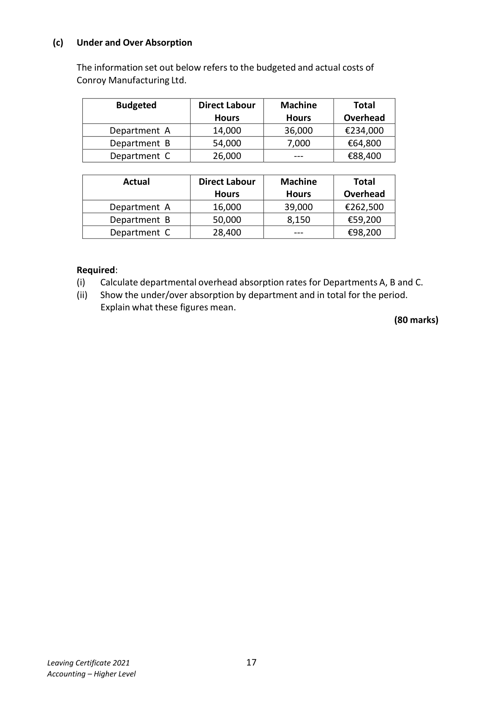
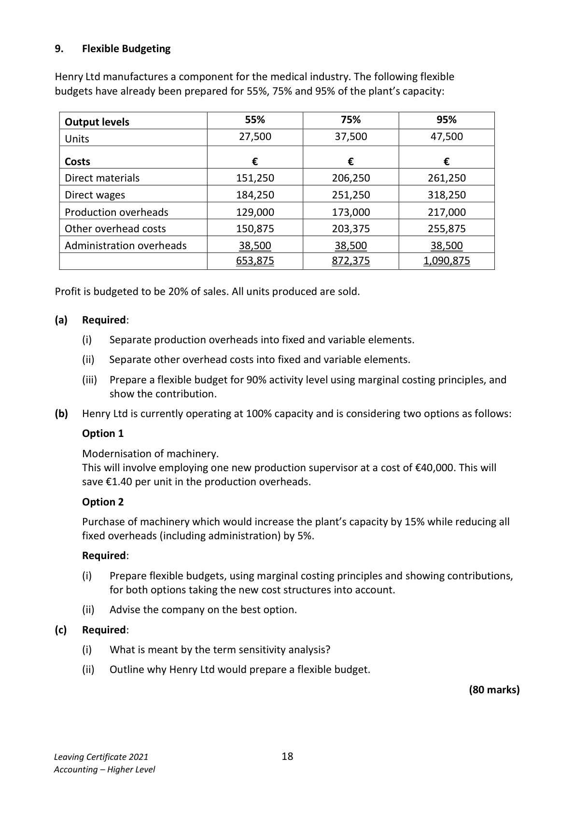
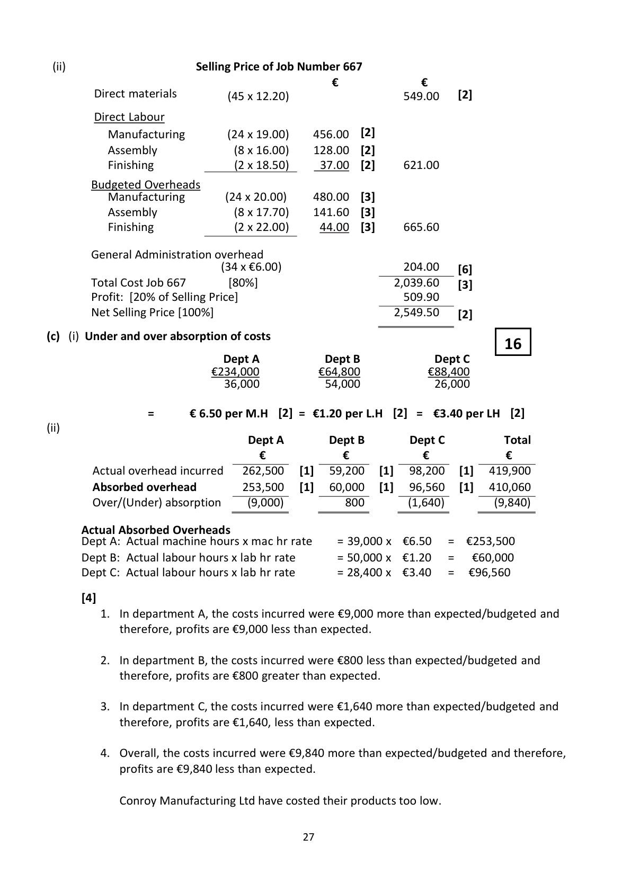
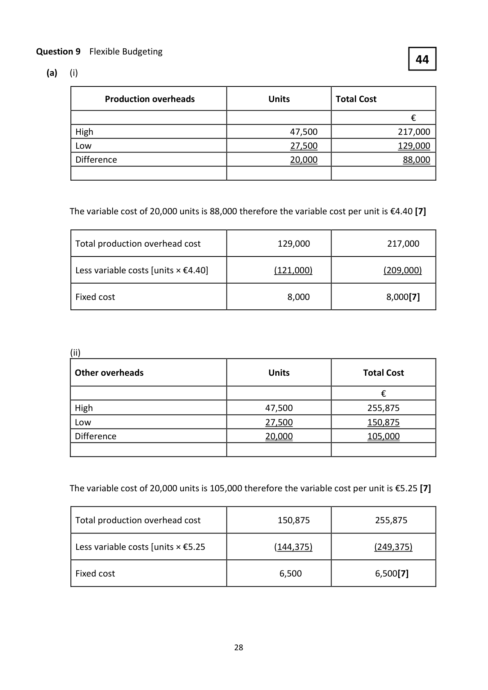

# Question

8.   Stock Valuation, Product Costing, Under and Over Absorption

 (a)   Stock Valuation

       Bolger Ltd is a retail store that buys and sells one product. The following
       information relates to the purchases and sales of the firm for the year 2020.

               Period           Purchases on Credit     Credit Sales        Cash Sales
        01/01/2020‐30/04/2020   4,500 @ €5 each    1,100 @ €10 each   1,700 @ €10 each
        01/05/2020‐31/08/2020   3,600 @ €8 each    1,400 @ €11 each    1,200 @ €11 each
        01/09/2020‐31/12/2020   2,600 @ €7 each    1,600 @ €12 each    1,350 @ €11 each

     On 01/01/2020 there was opening stock of 4,700 units @ €5 each.

      Required:
           (i)   Calculate the value of closing stock at 31/12/2020 using First in/First out, (FIFO) method.
           (ii)  Prepare a trading account for the year ending 31/12/2020.

 (b)   Product Costing
      The following is the budgeted yearly overhead details of Kinsella Ltd, a
      manufacturer of computer equipment that has three production departments.

             Production          Budgeted         Budgeted         Wage Rate
           Departments        Overheads       Labour Hours          Per Hour
          Manufacturing          €840,000       42,000 hours            €19.00
          Assembly               €389,400       22,000 hours            €16.00
            Finishing                €187,000        8,500 hours            €18.50

      Budgeted general administration costs for the year €435,000.

       Details of Job Number 667

       Direct material 45 kg at €12.20 per kg

       Direct labour hours     Manufacturing          24 hours
                           Assembly               8 hours
                                 Finishing                2 hours

        All orders are priced using a profit margin of 20%.

      Required:
           (i)   Calculate the overhead absorption rates for each department.
           (ii)   Calculate the selling price of Job Number 667.

Leaving Certificate 2021                       16
Accounting – Higher Level

<!-- PAGE 17 -->
# Page 17

<!-- HAS_VISUAL: true -->
<!-- VISUAL_REASON: page contains vector drawings; text contains visual keywords: figure; page image extracted because text may not fully capture visual content -->

(c)   Under and Over Absorption

      The information set out below refers to the budgeted and actual costs of
      Conroy Manufacturing Ltd.

              Budgeted          Direct Labour     Machine         Total
                                  Hours         Hours      Overhead
            Department A         14,000         36,000       €234,000
            Department B         54,000          7,000        €64,800
            Department C         26,000                 ‐‐‐         €88,400

                 Actual            Direct Labour     Machine         Total
                                  Hours         Hours      Overhead
            Department A         16,000         39,000       €262,500
            Department B         50,000          8,150        €59,200
            Department C         28,400                 ‐‐‐         €98,200

      Required:
          (i)    Calculate departmental overhead absorption rates for Departments A, B and C.
           (ii)  Show the under/over absorption by department and in total for the period.
             Explain what these figures mean.
                                                                             (80 marks)

Leaving Certificate 2021                       17
Accounting – Higher Level

<!-- PAGE 18 -->
# Page 18

<!-- HAS_VISUAL: true -->
<!-- VISUAL_REASON: page contains vector drawings; text contains visual keywords: line; page image extracted because text may not fully capture visual content -->

# Marking Scheme

8. Receipts from Issue of Shares and Premium, €180,000 increase cash but has no
      immediate effect on profit.

Question 8                                                  30

 (a)  Stock Valuation

        Purchases in Units      Unit Cost         Purchases at cost in €
             4,500              €5                  22,500
             3,600              €8                  28,800
             2,600              €7                 18,200
            10,700                                   69,500

      Credit Sales               Cash Sales                     Total Sales
      Units            €        Units            €          Units      €
      1,100 @ €10  11,000      1,700 @  10 17,000        2,800   28,000
      1,400 @ €11  15,400      1,200 @  11 13,200        2,600   28,600
      1,600 @ €12  19,200      1,350 @  11 14,850        2,950   34,050
      4,100          45,600      4,250          45,050        8,350   90,650

      Closing Stock in Units
     = Opening Stock 4,700 + Purchases 10,700 – Sales 8,350 = 7,050 units [6]

      Closing Stock Valuation:       Units                      €
      (FIFO)                       2,600  @    €7   =    18,200 [2]
                                   3,600  @    €8   =    28,800 [2]
                                850  @    €5   =     4,250 [3]
                                   7,050                     51,250 [3]

     Trading account for the year ending 31/12/2020                 €
      Sales                                                          90,650[3]
      Less Cost of sales
        Opening Stock                              23,500 [3]
        Add Purchases                              69,500 [3]

                                                    93,000
          Less Closing Stock                           51,250 [3]  (41,750)
         Gross Profit                                                [2]   48,900

                                                     34

(b)       (i) Overhead absorption rates for each department.

                         Manufacturing        Assembly              Finishing
     Budgeted Overheads    €840,000           €389,400            €187,000
      Direct Labour Hours       42,000             22,000                8,500

                          €20.00 per DLH [2]  €17.70 per DLH [2]  €22.00 per DLH [2]

                                           26

<!-- PAGE 27 -->
# Page 27

<!-- HAS_VISUAL: true -->
<!-- VISUAL_REASON: page contains vector drawings; page image extracted because text may not fully capture visual content -->

(ii)                          Selling Price of Job Number 667
                                            €             €
         Direct materials         (45 x 12.20)                   549.00    [2]

         Direct Labour
          Manufacturing        (24 x 19.00)    456.00  [2]
          Assembly               (8 x 16.00)    128.00  [2]
            Finishing                (2 x 18.50)     37.00  [2]     621.00

       Budgeted Overheads
          Manufacturing       (24 x 20.00)    480.00  [3]
          Assembly               (8 x 17.70)    141.60  [3]
            Finishing                (2 x 22.00)     44.00  [3]     665.60

        General Administration overhead
                               (34 x €6.00)                    204.00    [6]
        Total Cost Job 667       [80%]                        2,039.60    [3]
          Profit: [20% of Selling Price]                            509.90
       Net Selling Price [100%]                                2,549.50    [2]

(c)  (i) Under and over absorption of costs
                                                     16
                            Dept A          Dept B            Dept C
                           €234,000          €64,800           €88,400
                              36,000           54,000             26,000

                =      € 6.50 per M.H  [2] = €1.20 per L.H  [2] =  €3.40 per LH  [2]
(ii)
                               Dept A       Dept B       Dept C           Total
                                 €            €           €            €
        Actual overhead incurred   262,500   [1]   59,200   [1]   98,200   [1]   419,900
       Absorbed overhead        253,500   [1]   60,000   [1]   96,560   [1]   410,060
        Over/(Under) absorption     (9,000)          800        (1,640)         (9,840)

      Actual Absorbed Overheads
      Dept A: Actual machine hours x mac hr rate    = 39,000 x  €6.50   =  €253,500
      Dept B: Actual labour hours x lab hr rate       = 50,000 x  €1.20   =   €60,000
      Dept C: Actual labour hours x lab hr rate       = 28,400 x  €3.40   =  €96,560

       [4]
           1.  In department A, the costs incurred were €9,000 more than expected/budgeted and
              therefore, profits are €9,000 less than expected.

           2.  In department B, the costs incurred were €800 less than expected/budgeted and
              therefore, profits are €800 greater than expected.

           3.  In department C, the costs incurred were €1,640 more than expected/budgeted and
              therefore, profits are €1,640, less than expected.

           4.  Overall, the costs incurred were €9,840 more than expected/budgeted and therefore,
               profits are €9,840 less than expected.

            Conroy Manufacturing Ltd have costed their products too low.

                                           27

<!-- PAGE 28 -->
# Page 28

<!-- HAS_VISUAL: true -->
<!-- VISUAL_REASON: page contains vector drawings; page image extracted because text may not fully capture visual content -->

# Source References

Exam paper:
- file: intermediate_markdown/exam_papers/higher/accounting_higher_2021_paper_1_exam.md
- pages: [17, 18]

Marking scheme:
- file: intermediate_markdown/marking_schemes/higher/accounting_higher_2021_paper_1_marking_scheme.md
- pages: [27, 28]

# Notes

