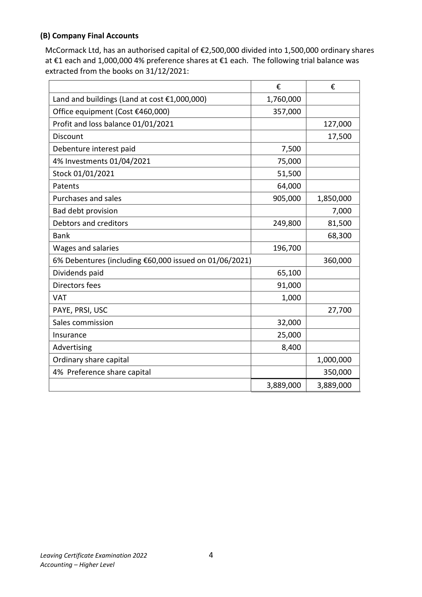
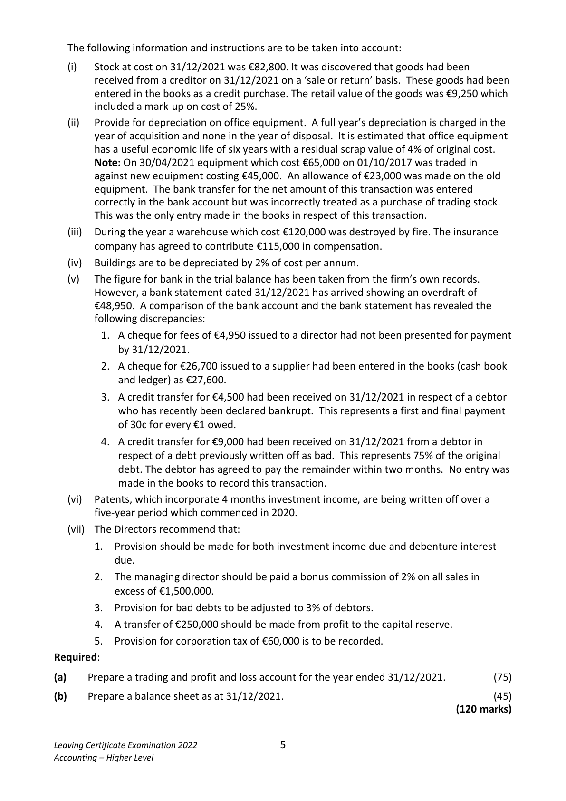

# Question

3.   A cheque for fees of €4,700 issued to a creditor had not been presented for
                payment by 31/12/2021.
  (ix)  Provision should be made for the following:
                1.   Investment income due and debenture interest due.
                2.   Provision for bad debts to be adjusted to 4% of debtors.
                3.   Depreciation on buildings at a rate of 2% of cost per annum.

Required:

(a)    Prepare a manufacturing, trading and profit and loss account for the year ended
      31/12/2021.                                                                           (75)

(b)    Prepare a balance sheet as at 31/12/2021.                                             (45)
                                                                             (120 marks)

Leaving Certificate Examination 2022              3
Accounting – Higher Level

<!-- PAGE 4 -->
# Page 4

<!-- HAS_VISUAL: true -->
<!-- VISUAL_REASON: page contains vector drawings; page image extracted because text may not fully capture visual content -->

(B) Company Final Accounts

 McCormack Ltd, has an authorised capital of €2,500,000 divided into 1,500,000 ordinary shares
 at €1 each and 1,000,000 4% preference shares at €1 each. The following trial balance was
 extracted from the books on 31/12/2021:

                                                       €            €
   Land and buildings (Land at cost €1,000,000)                1,760,000
    Office equipment (Cost €460,000)                          357,000
    Profit and loss balance 01/01/2021                                     127,000
   Discount                                                              17,500
   Debenture interest paid                                      7,500
  4% Investments 01/04/2021                                75,000
   Stock 01/01/2021                                         51,500
   Patents                                                  64,000
   Purchases and sales                                      905,000    1,850,000
   Bad debt provision                                                       7,000
   Debtors and creditors                                    249,800       81,500
   Bank                                                                 68,300
   Wages and salaries                                       196,700
  6% Debentures (including €60,000 issued on 01/06/2021)                  360,000
   Dividends paid                                            65,100
    Directors fees                                             91,000
   VAT                                                       1,000
   PAYE, PRSI, USC                                                        27,700
    Sales commission                                          32,000
   Insurance                                                25,000
    Advertising                                                 8,400
   Ordinary share capital                                                 1,000,000
  4% Preference share capital                                           350,000

                                                           3,889,000    3,889,000

Leaving Certificate Examination 2022              4
Accounting – Higher Level

<!-- PAGE 5 -->
# Page 5

<!-- HAS_VISUAL: true -->
<!-- VISUAL_REASON: text contains visual keywords: figure; page image extracted because text may not fully capture visual content -->

The following information and instructions are to be taken into account:

    (i)   Stock at cost on 31/12/2021 was €82,800. It was discovered that goods had been
        received from a creditor on 31/12/2021 on a ‘sale or return’ basis. These goods had been
        entered in the books as a credit purchase. The retail value of the goods was €9,250 which
        included a mark-up on cost of 25%.
    (ii)   Provide for depreciation on office equipment. A full year’s depreciation is charged in the
        year of acquisition and none in the year of disposal.  It is estimated that office equipment
        has a useful economic life of six years with a residual scrap value of 4% of original cost.
        Note: On 30/04/2021 equipment which cost €65,000 on 01/10/2017 was traded in
         against new equipment costing €45,000. An allowance of €23,000 was made on the old
        equipment. The bank transfer for the net amount of this transaction was entered
         correctly in the bank account but was incorrectly treated as a purchase of trading stock.
         This was the only entry made in the books in respect of this transaction.
     (iii)  During the year a warehouse which cost €120,000 was destroyed by fire. The insurance
       company has agreed to contribute €115,000 in compensation.
    (iv)   Buildings are to be depreciated by 2% of cost per annum.
   (v)   The figure for bank in the trial balance has been taken from the firm’s own records.
       However, a bank statement dated 31/12/2021 has arrived showing an overdraft of
        €48,950. A comparison of the bank account and the bank statement has revealed the
        following discrepancies:
           1. A cheque for fees of €4,950 issued to a director had not been presented for payment
            by 31/12/2021.
           2. A cheque for €26,700 issued to a supplier had been entered in the books (cash book
           and ledger) as €27,600.
           3. A credit transfer for €4,500 had been received on 31/12/2021 in respect of a debtor
          who has recently been declared bankrupt. This represents a first and final payment
              of 30c for every €1 owed.

# Marking Scheme

[No matching marking scheme section detected.]

# Source References

Exam paper:
- file: intermediate_markdown/exam_papers/higher/accounting_higher_2022_paper_1_exam.md
- pages: [4, 5]

Marking scheme:
- file: 
- pages: []

# Notes

