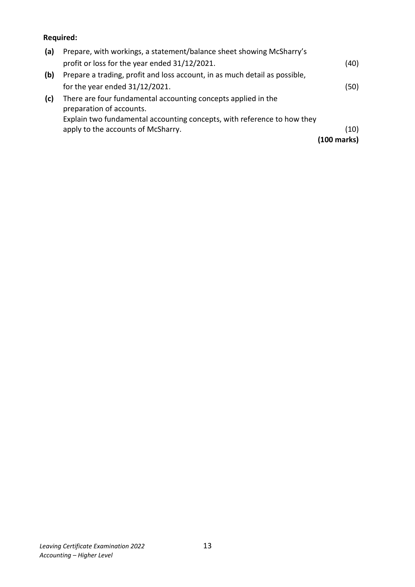
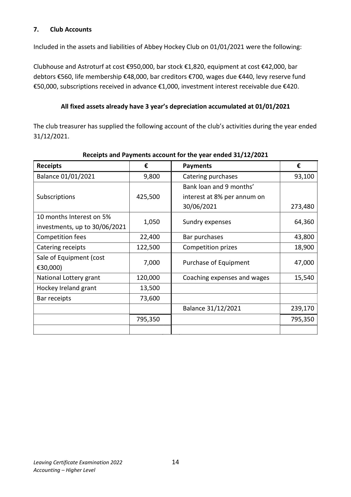

# Question

6        Incomplete Records

 On 01/01/2021, M McSharry lodged €1,350,000 into a business bank account and on the
 same day purchased a business for €1,325,000 which included the following tangible assets
 and liabilities: Premises €800,000; Equipment €225,000; Stock €46,140; 3 months Rates
 Prepaid €8,100; Debtors €88,320; Trade Creditors €54,000; Wages Due €3,200 and
 1.5% Investments €192,000.

 During 2021 McSharry did not keep a full set of accounts but estimates that gross profit
 was 25% of sales. McSharry was able to supply the following information on 31/12/2021.

  (i)    Each week McSharry took goods from stock to the value of €120 and cash €250 for
       household expenses.
  (ii)    The following were lodged to the business bank account during the year:
       Investment interest of €2,400 (from the existing business investments) and private
        inheritance of €290,000.
  (iii)   On 01/07/2021 the business purchased an adjoining premises costing €180,000.
       To fund this purchase, on 01/07/2021 the business borrowed 80% of the cost of the
        premises.
           It was agreed that, interest would be charged at a rate of 3% per annum to be paid
       monthly at the end of each month. The capital sum borrowed would be repaid in 20
       equal instalments over 10 years. The first repayment was due on 01/01/2022.
 (iv)   The following payments from the business bank account were made during the
        year: Light and heat €5,460, wages and general expenses €165,750 (including
       €2,800 for insurance), delivery van €56,000, equipment (purchased on 01/07/2021)
        €60,000. Rates for 12 months €27,600, loan interest €2,000, cleaning expenses
        €4,000.
 (v)    McSharry estimated that 30% of insurance, 25% of cleaning expenses and 10% of
         light and heat should be attributed to private use.
 (vi)    Depreciation is provided for as follows;
           - equipment at the annual rate of 12.5% of cost from the date of purchase to the
       date of sale.
           - delivery van at 20% of cost for a full year.
 (vii)   The business has decided to set up a provision for bad debts amounting to 3% of
       debtors on 31/12/2021.
  (viii)   Included in the assets and liabilities of the firm on 31/12/2021 were bank €108,600,
        stock €85,122 (which includes a stock of heating oil €1,100), debtors €121,500,
       wages due €4,750, trade creditors €57,800 and electricity due €240.

Leaving Certificate Examination 2022              12
Accounting – Higher Level

<!-- PAGE 13 -->
# Page 13

Required:

  (a)  Prepare, with workings, a statement/balance sheet showing McSharry’s
       profit or loss for the year ended 31/12/2021.                                      (40)
  (b)  Prepare a trading, profit and loss account, in as much detail as possible,
       for the year ended 31/12/2021.                                                    (50)
  (c)  There are four fundamental accounting concepts applied in the
      preparation of accounts.
       Explain two fundamental accounting concepts, with reference to how they
      apply to the accounts of McSharry.                                                (10)
                                                                         (100 marks)

Leaving Certificate Examination 2022              13
Accounting – Higher Level

<!-- PAGE 14 -->
# Page 14

<!-- HAS_VISUAL: true -->
<!-- VISUAL_REASON: page contains vector drawings; page image extracted because text may not fully capture visual content -->

# Marking Scheme

[No matching marking scheme section detected.]

# Source References

Exam paper:
- file: intermediate_markdown/exam_papers/higher/accounting_higher_2022_paper_1_exam.md
- pages: [13, 14]

Marking scheme:
- file: 
- pages: []

# Notes

