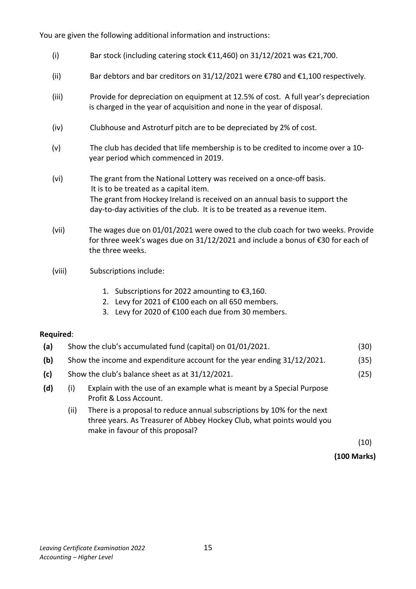
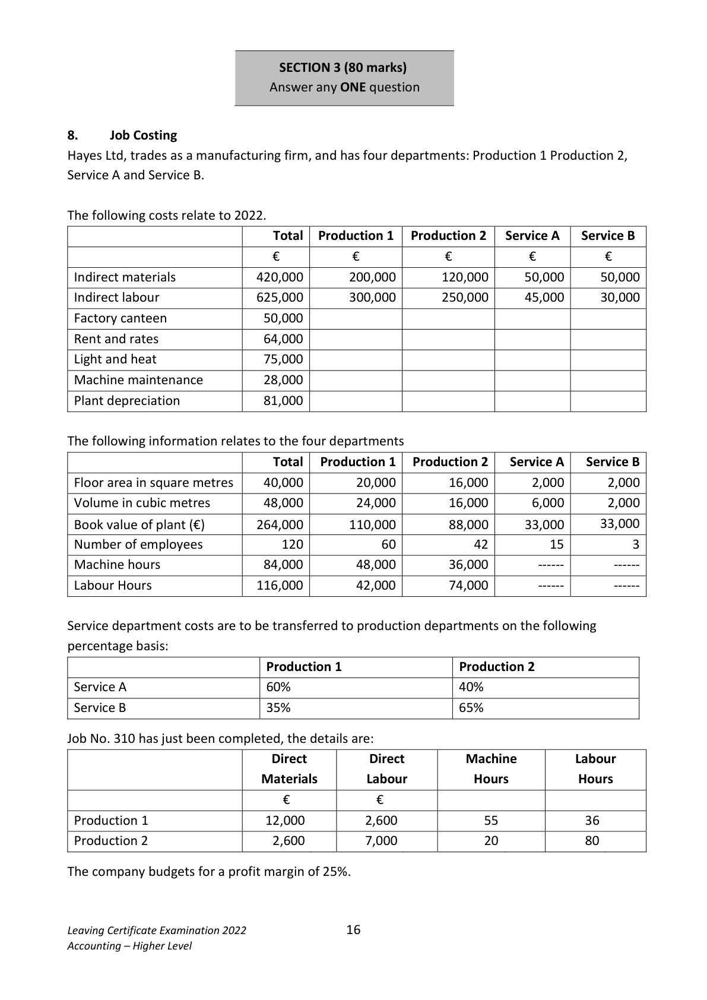

# Question

7.   Club Accounts

Included in the assets and liabilities of Abbey Hockey Club on 01/01/2021 were the following:

Clubhouse and Astroturf at cost €950,000, bar stock €1,820, equipment at cost €42,000, bar
debtors €560, life membership €48,000, bar creditors €700, wages due €440, levy reserve fund
€50,000, subscriptions received in advance €1,000, investment interest receivable due €420.

           All fixed assets already have 3 year’s depreciation accumulated at 01/01/2021

The club treasurer has supplied the following account of the club’s activities during the year ended
31/12/2021.

                Receipts and Payments account for the year ended 31/12/2021

 Receipts                       €          Payments                        €

 Balance 01/01/2021               9,800        Catering purchases                 93,100
                                          Bank loan and 9 months’
 Subscriptions                  425,500        interest at 8% per annum on
                                            30/06/2021                      273,480
 10 months Interest on 5%
                                  1,050       Sundry expenses                   64,360
 investments, up to 30/06/2021
 Competition fees                22,400       Bar purchases                      43,800
 Catering receipts               122,500       Competition prizes                 18,900
 Sale of Equipment (cost
                                  7,000       Purchase of Equipment              47,000
 €30,000)
 National Lottery grant           120,000       Coaching expenses and wages        15,540
 Hockey Ireland grant             13,500
 Bar receipts                     73,600
                                               Balance 31/12/2021               239,170

                               795,350                                       795,350

Leaving Certificate Examination 2022              14
Accounting – Higher Level

<!-- PAGE 15 -->
# Page 15

You are given the following additional information and instructions:

     (i)        Bar stock (including catering stock €11,460) on 31/12/2021 was €21,700.

      (ii)        Bar debtors and bar creditors on 31/12/2021 were €780 and €1,100 respectively.

      (iii)       Provide for depreciation on equipment at 12.5% of cost. A full year’s depreciation
                   is charged in the year of acquisition and none in the year of disposal.

     (iv)       Clubhouse and Astroturf pitch are to be depreciated by 2% of cost.

    (v)       The club has decided that life membership is to be credited to income over a 10-
             year period which commenced in 2019.

     (vi)      The grant from the National Lottery was received on a once-off basis.
                     It is to be treated as a capital item.
            The grant from Hockey Ireland is received on an annual basis to support the
              day-to-day activities of the club.  It is to be treated as a revenue item.

     (vii)      The wages due on 01/01/2021 were owed to the club coach for two weeks. Provide
               for three week’s wages due on 31/12/2021 and include a bonus of €30 for each of
             the three weeks.

     (viii)       Subscriptions include:

                    1.  Subscriptions for 2022 amounting to €3,160.
                    2.  Levy for 2021 of €100 each on all 650 members.
                    3.  Levy for 2020 of €100 each due from 30 members.

Required:
 (a)   Show the club’s accumulated fund (capital) on 01/01/2021.                          (30)

 (b)   Show the income and expenditure account for the year ending 31/12/2021.          (35)

 (c)   Show the club’s balance sheet as at 31/12/2021.                                     (25)

 (d)      (i)    Explain with the use of an example what is meant by a Special Purpose
               Profit & Loss Account.
             (ii)   There is a proposal to reduce annual subscriptions by 10% for the next
             three years. As Treasurer of Abbey Hockey Club, what points would you
          make in favour of this proposal?
                                                                                              (10)

                                                                             (100 Marks)

Leaving Certificate Examination 2022              15
Accounting – Higher Level

<!-- PAGE 16 -->
# Page 16

<!-- HAS_VISUAL: true -->
<!-- VISUAL_REASON: page contains vector drawings; page image extracted because text may not fully capture visual content -->

SECTION 3 (80 marks)
                            Answer any ONE question

# Marking Scheme

[No matching marking scheme section detected.]

# Source References

Exam paper:
- file: intermediate_markdown/exam_papers/higher/accounting_higher_2022_paper_1_exam.md
- pages: [15, 16]

Marking scheme:
- file: 
- pages: []

# Notes

