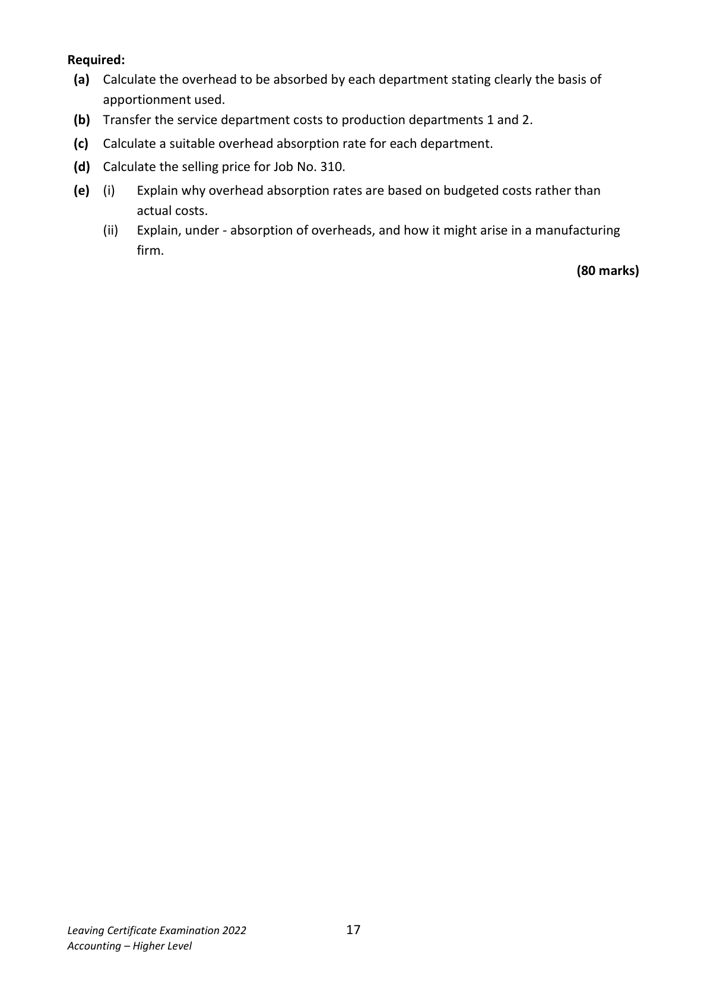
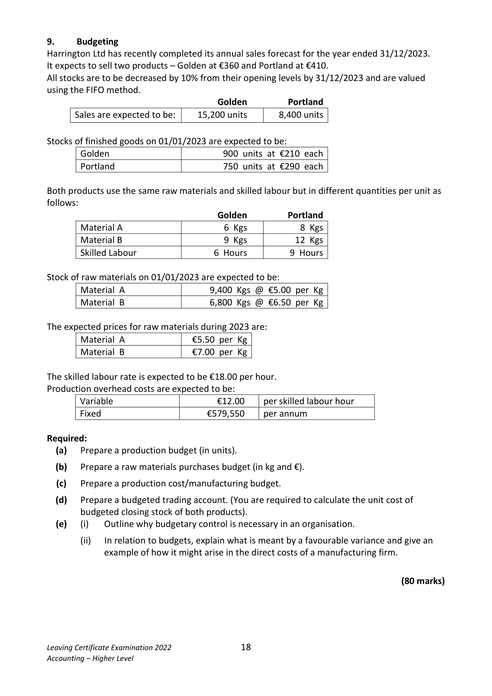

# Question

8.     Job Costing
Hayes Ltd, trades as a manufacturing firm, and has four departments: Production 1 Production 2,
Service A and Service B.

The following costs relate to 2022.
                                  Total  Production 1   Production 2   Service A    Service B
                            €          €            €           €         €
 Indirect materials            420,000       200,000       120,000     50,000     50,000
 Indirect labour              625,000       300,000       250,000     45,000     30,000
 Factory canteen               50,000
 Rent and rates                64,000
 Light and heat                75,000
 Machine maintenance         28,000
 Plant depreciation             81,000

The following information relates to the four departments
                                  Total   Production 1   Production 2    Service A    Service B
 Floor area in square metres     40,000        20,000        16,000       2,000       2,000
 Volume in cubic metres        48,000        24,000        16,000       6,000       2,000
 Book value of plant (€)        264,000       110,000        88,000     33,000     33,000
 Number of employees           120           60           42        15         3
 Machine hours                84,000        48,000        36,000           ------           ------
 Labour Hours                116,000        42,000        74,000           ------           ------

Service department costs are to be transferred to production departments on the following
percentage basis:
                              Production 1                  Production 2
 Service A                 60%                     40%
 Service B                 35%                     65%

Job No. 310 has just been completed, the details are:
                                  Direct          Direct        Machine        Labour
                               Materials       Labour         Hours          Hours
                              €            €
 Production 1                  12,000         2,600            55            36
 Production 2                   2,600         7,000            20            80

The company budgets for a profit margin of 25%.

Leaving Certificate Examination 2022              16
Accounting – Higher Level

<!-- PAGE 17 -->
# Page 17

<!-- HAS_VISUAL: true -->
<!-- VISUAL_REASON: text contains visual keywords: table; page image extracted because text may not fully capture visual content -->

Required:
 (a)  Calculate the overhead to be absorbed by each department stating clearly the basis of
     apportionment used.
 (b)  Transfer the service department costs to production departments 1 and 2.

 (c)  Calculate a suitable overhead absorption rate for each department.

 (d)  Calculate the selling price for Job No. 310.

 (e)   (i)    Explain why overhead absorption rates are based on budgeted costs rather than
            actual costs.
         (ii)   Explain, under - absorption of overheads, and how it might arise in a manufacturing
             firm.
                                                                                 (80 marks)

Leaving Certificate Examination 2022              17
Accounting – Higher Level

<!-- PAGE 18 -->
# Page 18

<!-- HAS_VISUAL: true -->
<!-- VISUAL_REASON: page contains vector drawings; text contains visual keywords: line; page image extracted because text may not fully capture visual content -->

# Marking Scheme

[No matching marking scheme section detected.]

# Source References

Exam paper:
- file: intermediate_markdown/exam_papers/higher/accounting_higher_2022_paper_1_exam.md
- pages: [17, 18]

Marking scheme:
- file: 
- pages: []

# Notes

