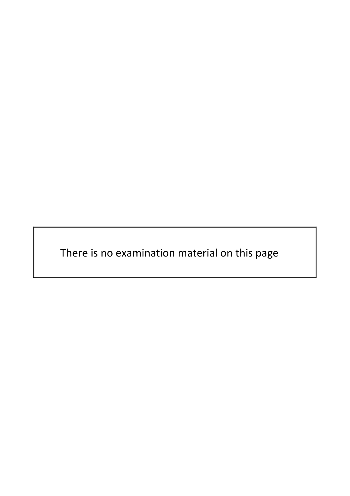
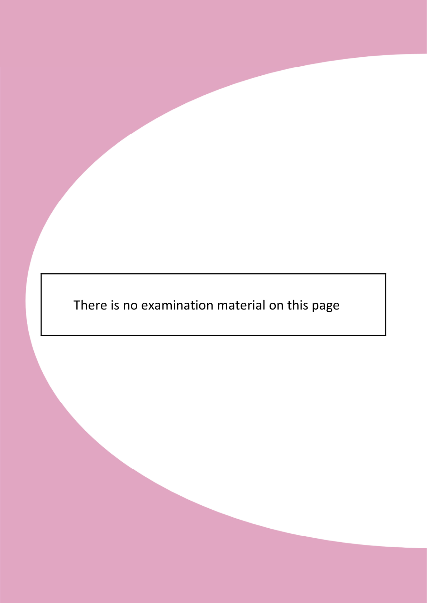

# Question

9.     Budgeting
Harrington Ltd has recently completed its annual sales forecast for the year ended 31/12/2023.
It expects to sell two products – Golden at €360 and Portland at €410.
All stocks are to be decreased by 10% from their opening levels by 31/12/2023 and are valued
using the FIFO method.
                                  Golden         Portland
       Sales are expected to be:     15,200 units       8,400 units

Stocks of finished goods on 01/01/2023 are expected to be:
       Golden                       900 units at €210 each
        Portland                      750 units at €290 each

Both products use the same raw materials and skilled labour but in different quantities per unit as
follows:
                                  Golden         Portland
        Material A                    6 Kgs           8 Kgs
        Material B                    9 Kgs          12 Kgs
         Skilled Labour               6 Hours        9 Hours

Stock of raw materials on 01/01/2023 are expected to be:
        Material A                   9,400 Kgs @ €5.00 per Kg
        Material B                   6,800 Kgs @ €6.50 per Kg

The expected prices for raw materials during 2023 are:
        Material A               €5.50 per Kg
        Material B               €7.00 per Kg

The skilled labour rate is expected to be €18.00 per hour.
Production overhead costs are expected to be:
        Variable                       €12.00    per skilled labour hour
        Fixed                      €579,550    per annum

Required:
  (a)   Prepare a production budget (in units).

  (b)   Prepare a raw materials purchases budget (in kg and €).

   (c)   Prepare a production cost/manufacturing budget.

  (d)   Prepare a budgeted trading account. (You are required to calculate the unit cost of
       budgeted closing stock of both products).
  (e)     (i)    Outline why budgetary control is necessary in an organisation.

             (ii)   In relation to budgets, explain what is meant by a favourable variance and give an
            example of how it might arise in the direct costs of a manufacturing firm.

                                                                                 (80 marks)

Leaving Certificate Examination 2022              18
Accounting – Higher Level

<!-- PAGE 19 -->
# Page 19

<!-- HAS_VISUAL: true -->
<!-- VISUAL_REASON: page contains vector drawings; text extraction is sparse relative to visible page content; page image extracted because text may not fully capture visual content -->

<!-- EXTRACTION_ISSUE: very sparse extracted text -->

There is no examination material on this page

<!-- PAGE 20 -->
# Page 20

<!-- HAS_VISUAL: true -->
<!-- VISUAL_REASON: page contains embedded images; page contains vector drawings; page image extracted because text may not fully capture visual content -->

There is no examination material on this page

Leaving Certificate Examination 2022              20
Accounting – Higher Level

# Marking Scheme

[No matching marking scheme section detected.]

# Source References

Exam paper:
- file: intermediate_markdown/exam_papers/higher/accounting_higher_2022_paper_1_exam.md
- pages: [19, 20]

Marking scheme:
- file: 
- pages: []

# Notes

