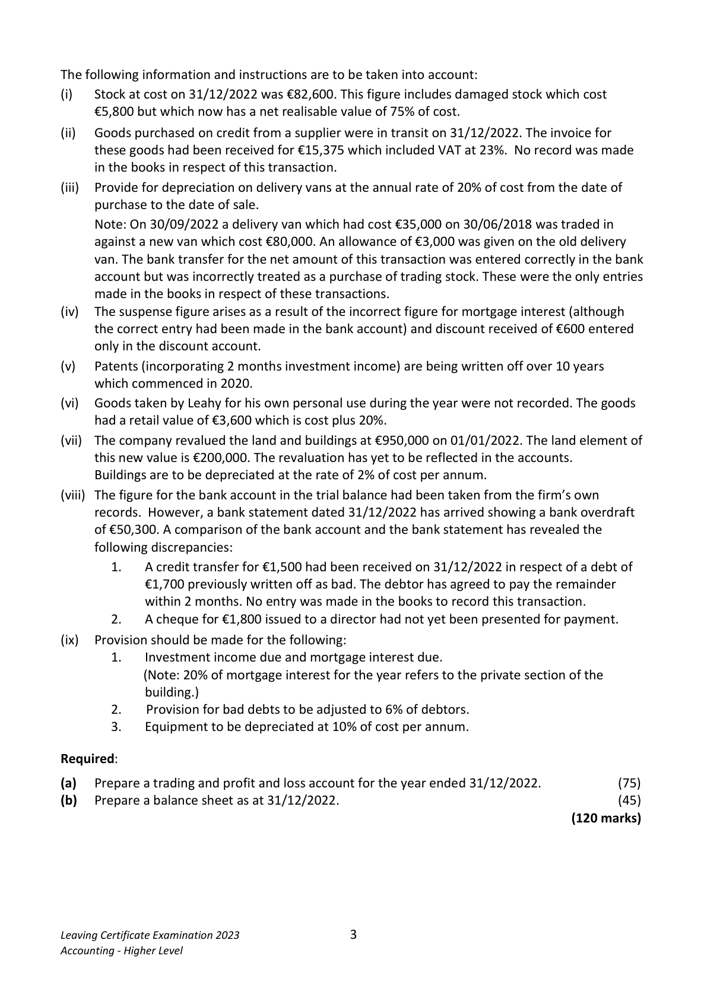
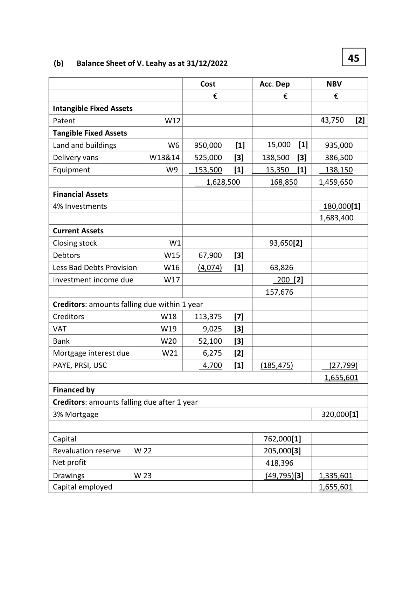
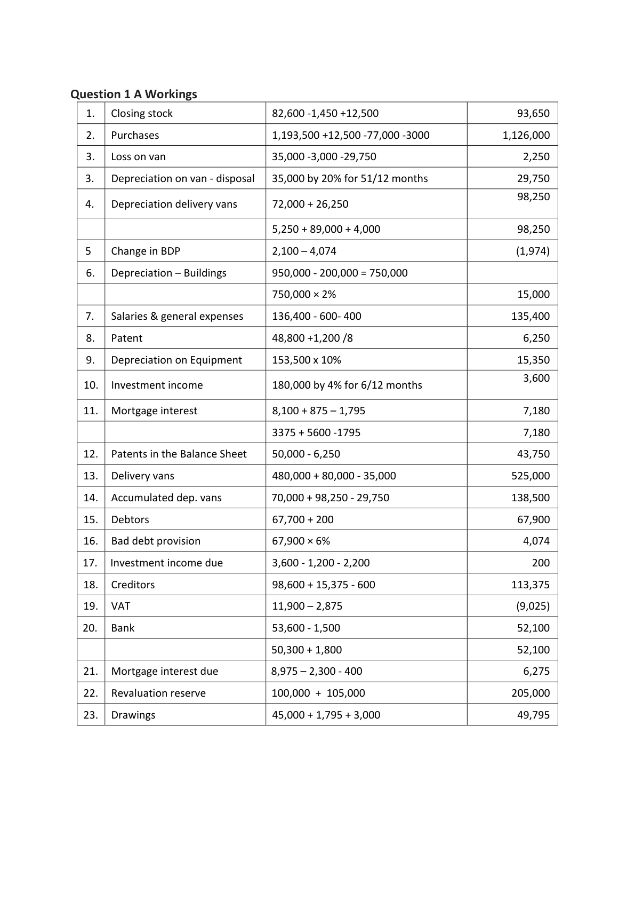
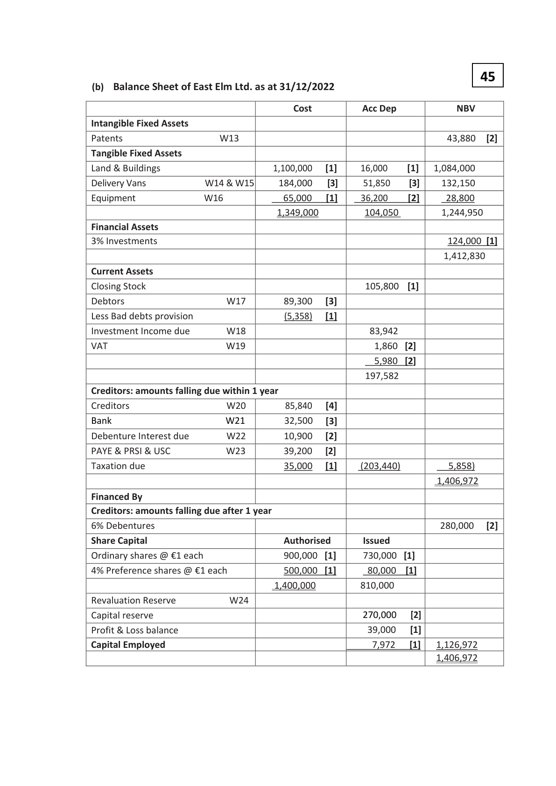
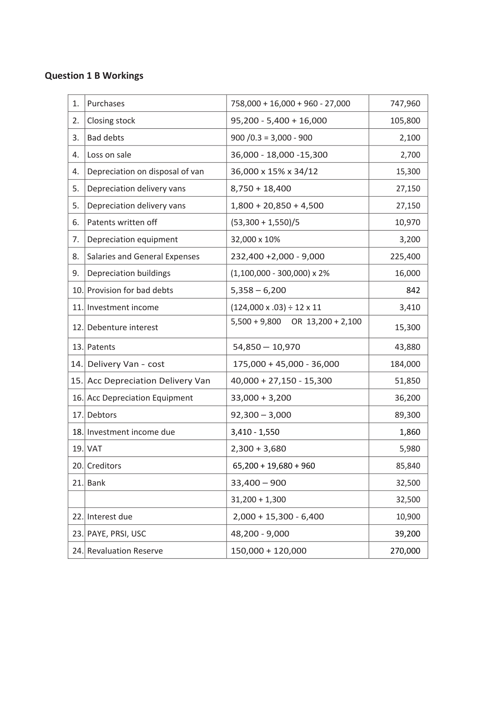
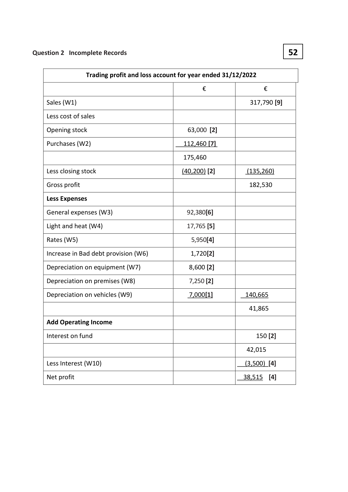

# Question

1.  Answer (A) or (B)

     (A) Sole Trader – Final Accounts

    The following trial balance was extracted from the books of V. Leahy on 31/12/2022:

                                                         €           €
      Patents (incorporating 2 months investment income)         48,800
     Land and buildings                                      850,000
     Accumulated depreciation – land and buildings                          105,000
      Delivery vans                                          480,000
     Accumulated depreciation – delivery vans                                70,000
     Equipment at cost                                      153,500
      Discount (net)                                                           7,700
    4% Investments acquired on 01/07/2022                   180,000
      Stock 01/01/2022                                        70,700
      Sales                                                                1,848,900
      Purchases                                             1,193,500
       Salaries and general expenses (incorporating suspense)      136,400
      Advertising                                              16,000
      Investment income received                                              2,200
      Drawings                                               45,000
      Rates                                                   42,800
      PAYE, PRSI & USC                                                        4,700
     VAT                                                                 11,900
     Bank                                                                 53,600
    3% Fixed mortgage (including €50,000 issued on 01/06/2022)              320,000
     Mortgage interest paid for the first 4 months                  2,300
      Debtors and creditors                                     67,700       98,600
     Bad debts provision                                                      2,100
       Capital                                            ________      762,000
                                                            3,286,700     3,286,700

Leaving Certificate Examination 2023               2
Accounting - Higher Level

<!-- PAGE 3 -->
# Page 3

<!-- HAS_VISUAL: true -->
<!-- VISUAL_REASON: text contains visual keywords: figure; page image extracted because text may not fully capture visual content -->

The following information and instructions are to be taken into account:
(i)   Stock at cost on 31/12/2022 was €82,600. This figure includes damaged stock which cost
     €5,800 but which now has a net realisable value of 75% of cost.
(ii)  Goods purchased on credit from a supplier were in transit on 31/12/2022. The invoice for
     these goods had been received for €15,375 which included VAT at 23%. No record was made
      in the books in respect of this transaction.
(iii)  Provide for depreciation on delivery vans at the annual rate of 20% of cost from the date of
     purchase to the date of sale.
     Note: On 30/09/2022 a delivery van which had cost €35,000 on 30/06/2018 was traded in
      against a new van which cost €80,000. An allowance of €3,000 was given on the old delivery
      van. The bank transfer for the net amount of this transaction was entered correctly in the bank
     account but was incorrectly treated as a purchase of trading stock. These were the only entries
    made in the books in respect of these transactions.
(iv)  The suspense figure arises as a result of the incorrect figure for mortgage interest (although
     the correct entry had been made in the bank account) and discount received of €600 entered
     only in the discount account.
(v)   Patents (incorporating 2 months investment income) are being written off over 10 years
     which commenced in 2020.
(vi)  Goods taken by Leahy for his own personal use during the year were not recorded. The goods
     had a retail value of €3,600 which is cost plus 20%.
(vii)  The company revalued the land and buildings at €950,000 on 01/01/2022. The land element of
      this new value is €200,000. The revaluation has yet to be reflected in the accounts.
      Buildings are to be depreciated at the rate of 2% of cost per annum.
(viii) The figure for the bank account in the trial balance had been taken from the firm’s own
      records. However, a bank statement dated 31/12/2022 has arrived showing a bank overdraft
      of €50,300. A comparison of the bank account and the bank statement has revealed the
      following discrepancies:
         1.   A credit transfer for €1,500 had been received on 31/12/2022 in respect of a debt of
             €1,700 previously written off as bad. The debtor has agreed to pay the remainder
              within 2 months. No entry was made in the books to record this transaction.
         2.   A cheque for €1,800 issued to a director had not yet been presented for payment.
(ix)   Provision should be made for the following:
         1.   Investment income due and mortgage interest due.
              (Note: 20% of mortgage interest for the year refers to the private section of the
               building.)

# Marking Scheme

Question 1 ( A)  Sole Trader                                     75

     (a)  Trading Profit and Loss Account of V. Leahy for the year ended 31/12/22 [1]

                                      €               €            €
      Sales                                                                  1,848,900    [3]

      Less cost of sales

     Opening stock                                           70,700    [3]

      Purchases             W2                     1,126,000    [9]

      Less closing stock         W1                        (93,650)    [7]     (1,103,050)

      Gross profit                                                              745,850

      Less Expenses

      Distribution Costs

      Loss on sale of delivery van   W3        2,250   [4]

      Depreciation delivery vans    W4       98,250   [4]

      Increase in BDP          W5        1,974   [4]

      Advertising                             16,000   [3]        118,474

      Administration Expenses

      Depreciation - buildings     W6       15,000   [3]

      Salaries and general exp.     W7      135,400   [7]

      Patent written off         W8        6,250   [5]
     Dep. on equipment        W9       15,350   [2]

     Rates                                  42,800   [3]       214,800          (333,274)

                                                                               412,576

      Operating income

     Bad debt recovered                                         1,700    [3]
      Discount                                                   7,700    [2]       9,400
      Operating profit                                                          421,976

     Investment income        W10                                          3,600    [4]

     Mortgage interest         W11                                             (7,180)   [5]
     Net profit                                                              418,396   [3]

<!-- PAGE 4 -->
# Page 4

<!-- HAS_VISUAL: true -->
<!-- VISUAL_REASON: page contains vector drawings; page image extracted because text may not fully capture visual content -->

45(b)   Balance Sheet of V. Leahy as at 31/12/2022

                                       Cost            Acc. Dep       NBV
                                      €               €           €
Intangible Fixed Assets
Patent                 W12                                    43,750    [2]
Tangible Fixed Assets
Land and buildings         W6    950,000    [1]      15,000  [1]    935,000
Delivery vans          W13&14    525,000    [3]     138,500  [3]     386,500
Equipment             W9    153,500    [1]      15,350  [1]     138,150
                                         1,628,500        168,850      1,459,650
Financial Assets
4% Investments                                                          180,000[1]
                                                                       1,683,400

Current Assets
Closing stock            W1                        93,650[2]
Debtors                W15     67,900    [3]
Less Bad Debts Provision     W16     (4,074)    [1]       63,826
Investment income due      W17                       200 [2]
                                                      157,676
Creditors: amounts falling due within 1 year
Creditors              W18     113,375    [7]
VAT                  W19       9,025    [3]
Bank                 W20      52,100    [3]
Mortgage interest due      W21      6,275    [2]
PAYE, PRSI, USC                         4,700    [1]     (185,475)          (27,799)
                                                                        1,655,601
Financed by
Creditors: amounts falling due after 1 year
3% Mortgage                                                            320,000[1]

Capital                                                  762,000[1]
Revaluation reserve  W 22                              205,000[3]
Net profit                                             418,396
Drawings       W 23                                 (49,795)[3]    1,335,601
Capital employed                                                       1,655,601

<!-- PAGE 5 -->
# Page 5

<!-- HAS_VISUAL: true -->
<!-- VISUAL_REASON: page contains vector drawings; page image extracted because text may not fully capture visual content -->

Question 1 A Workings

   1.   Closing stock                  82,600 -1,450 +12,500                         93,650

Question 1 (B) Final Accounts of a company                           75

      (a) Trading Profit and Loss Account of East Elm Ltd for the year ended 31/12/2022 [1]
                                            €               €                €
        Sales                                                                        1,150,000[3]
       Less Cost of Sales
       Opening stock                                          55,400   [3]
       Purchases               W1                 747,960   [9]
        Less closing stock           W2                  (105,800) [4]        (697,560)
       Gross Profit                                                            452,440
       Less Expenses
        Distribution Costs
      Bad Debts written off         W3   2,100   [4]
        Loss on sale of delivery van      W4   2,700   [4]
        Advertising                              6,700 [3]
       Depreciation on delivery vans    W5   27,150 [4]      38,650
       Administration Expenses
       Patents written off          W6   10,970  [5]
       Deprecation equipment       W7    3,200  [2]
        Salaries & general           W8 225,400  [7]
       expenses
       Depreciation buildings        W9  16,000   [3]
        Directors fees                         23,300   [2] 278,870                (317,520)
                                                                             134,920
      Add Operating Income
       Discount                                                 5,100   [2]
       Rent received                                          18,000   [2]
       Decrease in bad debt provision   W10                   842    [4]           23,942
       Operating Profit                                                          158,862
       Investment Income          W11                                        3,410 [3]
                                                                             162,272
        Less Debenture Interest       W12                                          (15,300)[4]
      Net Profit before Taxation                                               146,972
       Taxation                                                                         (35,000)[1]
      Net Profit after Taxation                                                 111,972
        Less Dividends paid                                                              (45,000)[1]
       Retained profit                                                          66,972
      P&L balance 01/01/2022                                                         (59,000)[1]
      P&L balance 31/12/2022                                                   7,972  [3]

<!-- PAGE 7 -->
# Page 7

<!-- HAS_VISUAL: true -->
<!-- VISUAL_REASON: page contains vector drawings; page image extracted because text may not fully capture visual content -->

45
(b)  Balance Sheet of East Elm Ltd. as at 31/12/2022

                                            Cost          Acc Dep          NBV
Intangible Fixed Assets
Patents               W13                                            43,880   [2]
Tangible Fixed Assets
Land & Buildings                          1,100,000   [1]     16,000     [1]   1,084,000
Delivery Vans         W14 & W15     184,000    [3]      51,850     [3]    132,150
Equipment           W16             65,000    [1]     36,200     [2]      28,800
                                        1,349,000          104,050         1,244,950
Financial Assets
3% Investments                                                            124,000 [1]
                                                                            1,412,830
Current Assets
Closing Stock                                             105,800  [1]
Debtors                W17        89,300   [3]
Less Bad debts provision                       (5,358)   [1]
Investment Income due      W18                          83,942
VAT                  W19                            1,860  [2]
                                                             5,980  [2]
                                                         197,582
Creditors: amounts falling due within 1 year
Creditors               W20         85,840   [4]
Bank                 W21        32,500   [3]
Debenture Interest due      W22        10,900   [2]
PAYE & PRSI & USC         W23        39,200    [2]
Taxation due                             35,000   [1]     (203,440)           5,858)
                                                                           1,406,972

Financed By
Creditors: amounts falling due after 1 year
6% Debentures                                                           280,000   [2]
Share Capital                             Authorised       Issued
Ordinary shares @ €1 each                 900,000  [1]      730,000  [1]
4% Preference shares @ €1 each            500,000  [1]       80,000  [1]
                                        1,400,000         810,000
Revaluation Reserve        W24
Capital reserve                                           270,000    [2]
Profit & Loss balance                                        39,000    [1]
Capital Employed                                            7,972    [1]   1,126,972
                                                                           1,406,972

<!-- PAGE 8 -->
# Page 8

<!-- HAS_VISUAL: true -->
<!-- VISUAL_REASON: page contains vector drawings; page image extracted because text may not fully capture visual content -->

Question 1 B Workings

        1.  Purchases                         758,000 + 16,000 + 960 - 27,000         747,960

        2.  Closing stock                    95,200 - 5,400 + 16,000               105,800

        3.  Bad debts                       900 /0.3 = 3,000 - 900                     2,100

        4.  Loss on sale                     36,000 - 18,000 -15,300                  2,700

        4.  Depreciation on disposal of van      36,000 x 15% x 34/12                   15,300

        5.  Depreciation delivery vans          8,750 + 18,400                          27,150

        5.  Depreciation delivery vans          1,800 + 20,850 + 4,500                  27,150

        6.  Patents written off                  (53,300 + 1,550)/5                      10,970

        7.  Depreciation equipment            32,000 x 10%                             3,200

        8.  Salaries and General Expenses       232,400 +2,000 - 9,000               225,400

        9.  Depreciation buildings               (1,100,000 - 300,000) x 2%               16,000

       10. Provision for bad debts             5,358 – 6,200                          842

       11. Investment income                 (124,000 x .03) ÷ 12 x 11                   3,410

                                             5,500 + 9,800  OR 13,200 + 2,100
       12. Debenture interest                                                        15,300

       13. Patents                         54,850 – 10,970                      43,880

      14. Delivery Van - cost              175,000 + 45,000 - 36,000            184,000

      15. Acc Depreciation Delivery Van    40,000 + 27,150 - 15,300               51,850

       16. Acc Depreciation Equipment        33,000 + 3,200                        36,200

       17. Debtors                        92,300 – 3,000                        89,300

       18. Investment income due             3,410 - 1,550                             1,860

       19. VAT                            2,300 + 3,680                           5,980

       20. Creditors                          65,200 + 19,680 + 960                    85,840

       21. Bank                          33,400 – 900                           32,500

                                            31,200 + 1,300                           32,500

       22. Interest due                      2,000 + 15,300 - 6,400                  10,900

       23. PAYE, PRSI, USC                  48,200 - 9,000                         39,200

       24. Revaluation Reserve              150,000 + 120,000                   270,000

<!-- PAGE 9 -->
# Page 9

<!-- HAS_VISUAL: true -->
<!-- VISUAL_REASON: page contains vector drawings; page image extracted because text may not fully capture visual content -->

1. Tangible Fixed Assets and stock. [5]
        Buildings were revalued at the end of this year and have been included in the accounts at
        their revalued amount.
       Depreciation is calculated in order to write off the value or cost of tangible fixed assets over
        their estimated useful economic life, as follows.
        Buildings - 2% per annum straight line basis
        Delivery vans - 20% per annum on a reducing balance basis
       Stocks are valued on a first in first out basis at the lower of cost and net realisable value.

1. All costs, variable and fixed, are recovered in the selling price charged to
     customers

# Source References

Exam paper:
- file: intermediate_markdown/exam_papers/higher/accounting_higher_2023_paper_1_exam.md
- pages: [3]

Marking scheme:
- file: intermediate_markdown/marking_schemes/higher/accounting_higher_2023_paper_1_marking_scheme.md
- pages: [4, 5, 7, 8, 9]

# Notes

