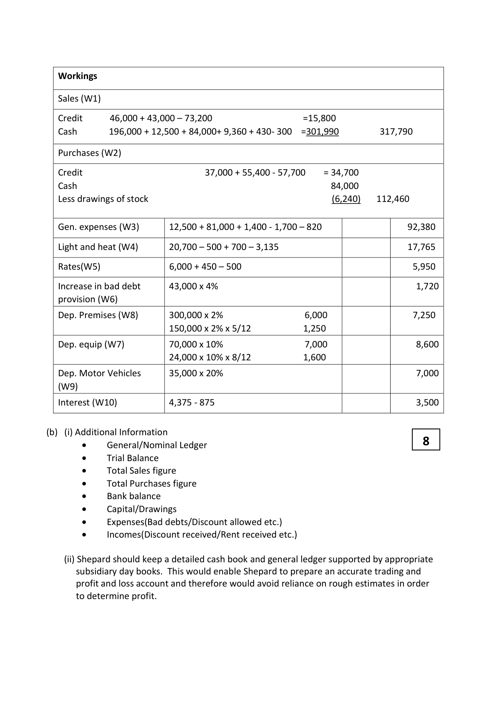
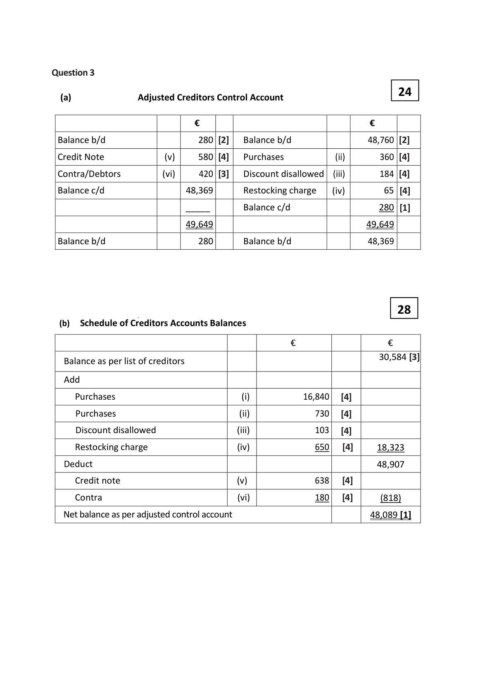

# Question

2.    Provision for bad debts to be adjusted to 6% of debtors.

# Marking Scheme

2.   Purchases                     1,193,500 +12,500 -77,000 -3000              1,126,000

Question 2 Incomplete Records                                  52

                 Trading profit and loss account for year ended 31/12/2022

                                                €                €

     Sales (W1)                                                     317,790 [9]

     Less cost of sales

    Opening stock                               63,000 [2]

    Purchases (W2)                            112,460 [7]

                                              175,460

     Less closing stock                             (40,200) [2]          (135,260)

    Gross profit                                                   182,530

     Less Expenses

    General expenses (W3)                         92,380[6]

     Light and heat (W4)                           17,765 [5]

    Rates (W5)                                       5,950[4]

     Increase in Bad debt provision (W6)              1,720[2]

     Depreciation on equipment (W7)               8,600 [2]

     Depreciation on premises (W8)                 7,250 [2]

     Depreciation on vehicles (W9)                   7,000[1]          140,665

                                                                   41,865

    Add Operating Income

     Interest on fund                                              150 [2]

                                                                  42,015

     Less Interest (W10)                                                  (3,500) [4]

    Net profit                                                    38,515  [4]

<!-- PAGE 10 -->
# Page 10

<!-- HAS_VISUAL: true -->
<!-- VISUAL_REASON: page contains vector drawings; text contains visual keywords: figure; page image extracted because text may not fully capture visual content -->

Workings

   Sales (W1)

   Credit      46,000 + 43,000 – 73,200                   =15,800
  Cash       196,000 + 12,500 + 84,000+ 9,360 + 430- 300  =301,990         317,790

   Purchases (W2)

   Credit                          37,000 + 55,400 - 57,700    = 34,700
  Cash                                                       84,000
   Less drawings of stock                                            (6,240)   112,460

  Gen. expenses (W3)      12,500 + 81,000 + 1,400 - 1,700 – 820                  92,380

   Light and heat (W4)       20,700 – 500 + 700 – 3,135                            17,765

  Rates(W5)               6,000 + 450 – 500                                      5,950

   Increase in bad debt      43,000 x 4%                                           1,720
   provision (W6)

  Dep. Premises (W8)       300,000 x 2%                  6,000                   7,250
                          150,000 x 2% x 5/12           1,250

  Dep. equip (W7)          70,000 x 10%                  7,000                   8,600
                          24,000 x 10% x 8/12           1,600

  Dep. Motor Vehicles      35,000 x 20%                                          7,000
  (W9)

   Interest (W10)           4,375 - 875                                            3,500

(b)  (i) Additional Information
        •    General/Nominal Ledger                                8
        •      Trial Balance
        •     Total Sales figure
        •     Total Purchases figure
        •    Bank balance
        •     Capital/Drawings
        •    Expenses(Bad debts/Discount allowed etc.)
        •    Incomes(Discount received/Rent received etc.)

       (ii) Shepard should keep a detailed cash book and general ledger supported by appropriate
       subsidiary day books. This would enable Shepard to prepare an accurate trading and
        profit and loss account and therefore would avoid reliance on rough estimates in order
       to determine profit.

<!-- PAGE 11 -->
# Page 11

<!-- HAS_VISUAL: true -->
<!-- VISUAL_REASON: page contains vector drawings; page image extracted because text may not fully capture visual content -->

2. Operating Profit [6]
      The operating profit is arrived at after charging:        €
       Depreciation on tangible fixed assets                 76,200
       Patent amortised                                  19,000
       Directors fees                                      45,000
       Auditors fees                                      16,000
       Legal fees                                           9,000

2. It gives a more accurate valuation of closing stock at the end of the financial
     period and this will enable accurate final accounts to be prepared.

# Source References

Exam paper:
- file: intermediate_markdown/exam_papers/higher/accounting_higher_2023_paper_1_exam.md
- pages: []

Marking scheme:
- file: intermediate_markdown/marking_schemes/higher/accounting_higher_2023_paper_1_marking_scheme.md
- pages: [10, 11]

# Notes

