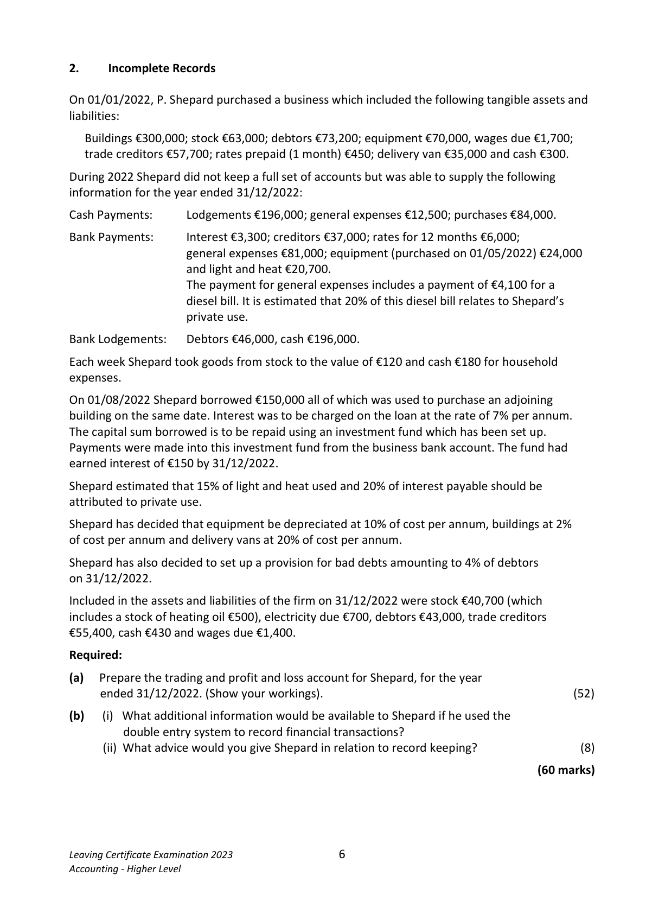
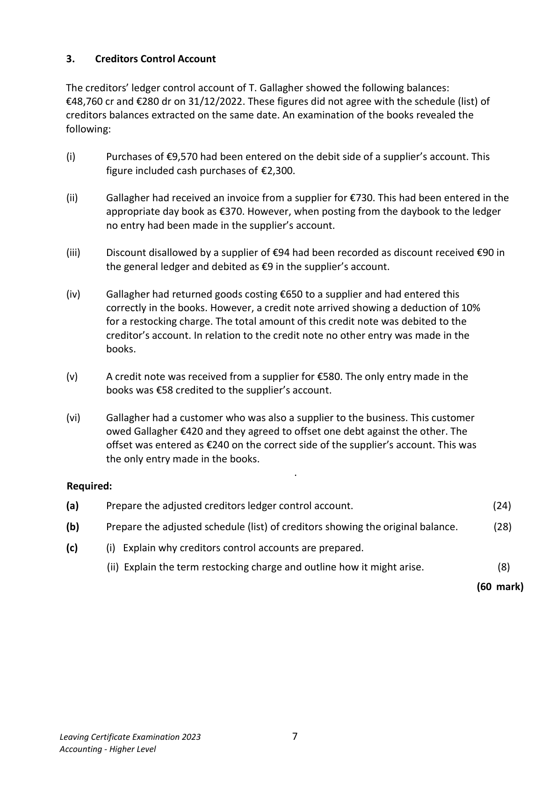
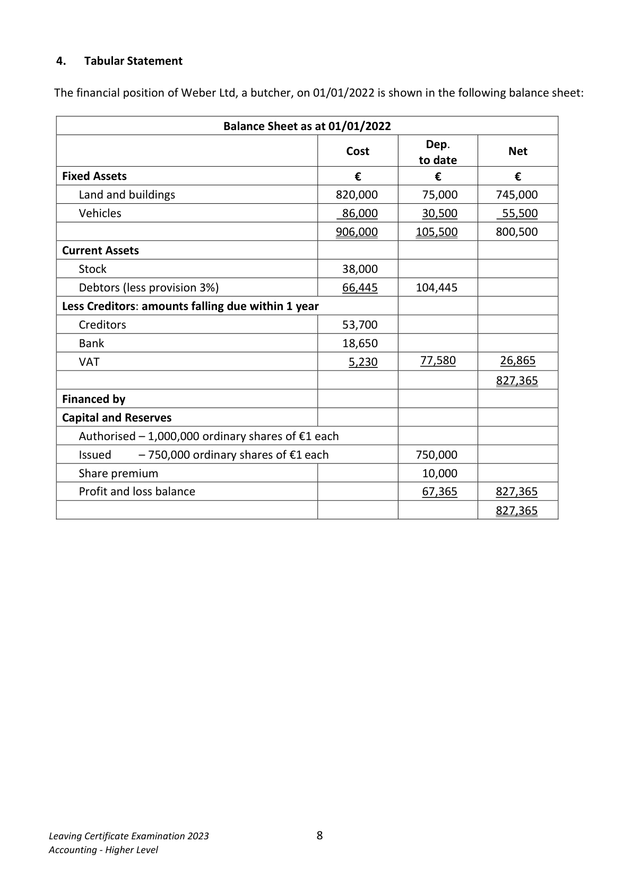
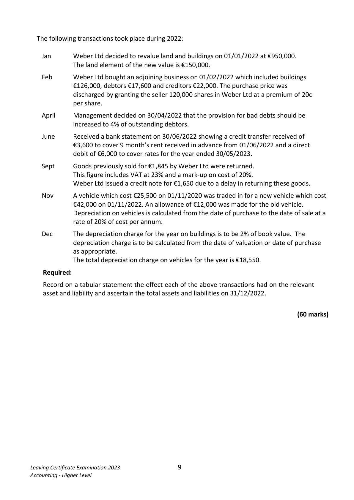
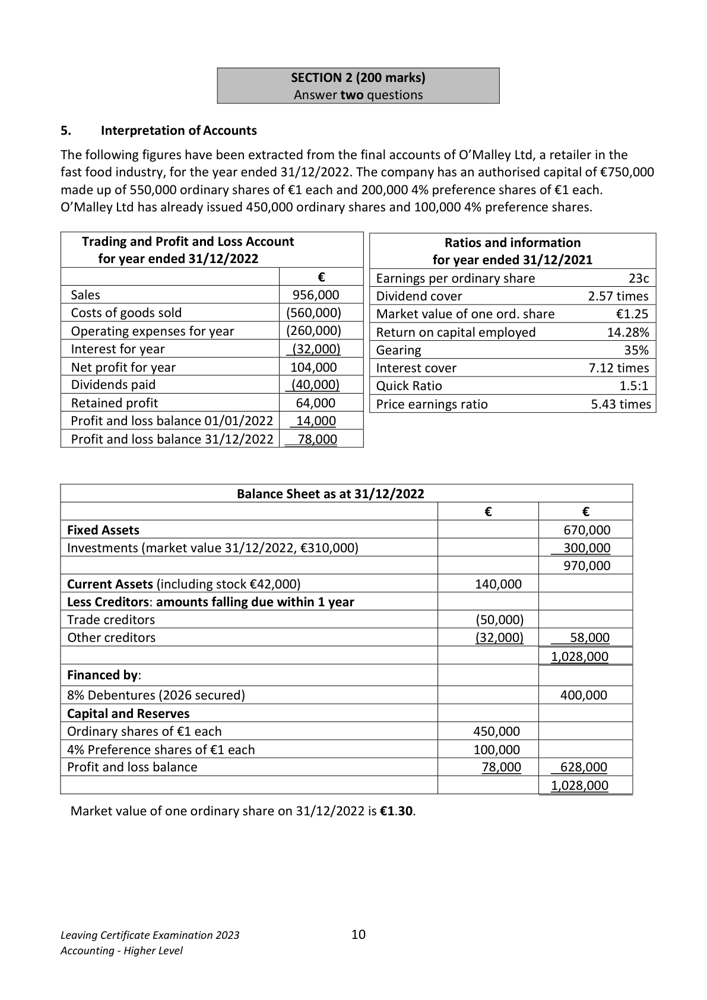

# Question

4.  Provision should be made for corporation tax of €35,000.

    Required:
     (a)  Prepare a trading and profit and loss account for the year ended 31/12/2022.          (75)
     (b)  Prepare a balance sheet as at 31/12/2022.                                             (45)
                                                                               (120 marks)

Leaving Certificate Examination 2023               5
Accounting - Higher Level

<!-- PAGE 6 -->
# Page 6

2.     Incomplete Records

On 01/01/2022, P. Shepard purchased a business which included the following tangible assets and
liabilities:

   Buildings €300,000; stock €63,000; debtors €73,200; equipment €70,000, wages due €1,700;
   trade creditors €57,700; rates prepaid (1 month) €450; delivery van €35,000 and cash €300.

During 2022 Shepard did not keep a full set of accounts but was able to supply the following
information for the year ended 31/12/2022:

Cash Payments:     Lodgements €196,000; general expenses €12,500; purchases €84,000.

Bank Payments:      Interest €3,300; creditors €37,000; rates for 12 months €6,000;
                     general expenses €81,000; equipment (purchased on 01/05/2022) €24,000
                  and light and heat €20,700.
                  The payment for general expenses includes a payment of €4,100 for a
                       diesel bill. It is estimated that 20% of this diesel bill relates to Shepard’s
                      private use.

Bank Lodgements:   Debtors €46,000, cash €196,000.

Each week Shepard took goods from stock to the value of €120 and cash €180 for household
expenses.

On 01/08/2022 Shepard borrowed €150,000 all of which was used to purchase an adjoining
building on the same date. Interest was to be charged on the loan at the rate of 7% per annum.
The capital sum borrowed is to be repaid using an investment fund which has been set up.
Payments were made into this investment fund from the business bank account. The fund had
earned interest of €150 by 31/12/2022.

Shepard estimated that 15% of light and heat used and 20% of interest payable should be
attributed to private use.

Shepard has decided that equipment be depreciated at 10% of cost per annum, buildings at 2%
of cost per annum and delivery vans at 20% of cost per annum.

Shepard has also decided to set up a provision for bad debts amounting to 4% of debtors
on 31/12/2022.

Included in the assets and liabilities of the firm on 31/12/2022 were stock €40,700 (which
includes a stock of heating oil €500), electricity due €700, debtors €43,000, trade creditors
€55,400, cash €430 and wages due €1,400.

Required:

(a)   Prepare the trading and profit and loss account for Shepard, for the year
     ended 31/12/2022. (Show your workings).                                               (52)

(b)     (i) What additional information would be available to Shepard if he used the
         double entry system to record financial transactions?
          (ii) What advice would you give Shepard in relation to record keeping?                     (8)

                                                                                 (60 marks)

Leaving Certificate Examination 2023                6
Accounting - Higher Level

<!-- PAGE 7 -->
# Page 7

<!-- HAS_VISUAL: true -->
<!-- VISUAL_REASON: text contains visual keywords: figure, line; page image extracted because text may not fully capture visual content -->

3.    Creditors Control Account

 The creditors’ ledger control account of T. Gallagher showed the following balances:
 €48,760 cr and €280 dr on 31/12/2022. These figures did not agree with the schedule (list) of
 creditors balances extracted on the same date. An examination of the books revealed the
 following:

  (i)      Purchases of €9,570 had been entered on the debit side of a supplier’s account. This
          figure included cash purchases of €2,300.

  (ii)      Gallagher had received an invoice from a supplier for €730. This had been entered in the
         appropriate day book as €370. However, when posting from the daybook to the ledger
        no entry had been made in the supplier’s account.

  (iii)     Discount disallowed by a supplier of €94 had been recorded as discount received €90 in
         the general ledger and debited as €9 in the supplier’s account.

  (iv)     Gallagher had returned goods costing €650 to a supplier and had entered this
          correctly in the books. However, a credit note arrived showing a deduction of 10%
           for a restocking charge. The total amount of this credit note was debited to the
           creditor’s account. In relation to the credit note no other entry was made in the
         books.

  (v)    A credit note was received from a supplier for €580. The only entry made in the
         books was €58 credited to the supplier’s account.

  (vi)     Gallagher had a customer who was also a supplier to the business. This customer
       owed Gallagher €420 and they agreed to offset one debt against the other. The
           offset was entered as €240 on the correct side of the supplier’s account. This was
         the only entry made in the books.
                                                                                   .
 Required:

  (a)     Prepare the adjusted creditors ledger control account.                               (24)

  (b)     Prepare the adjusted schedule (list) of creditors showing the original balance.        (28)

  (c)         (i)  Explain why creditors control accounts are prepared.

                (ii) Explain the term restocking charge and outline how it might arise.                  (8)

                                                                                    (60 mark)

Leaving Certificate Examination 2023                7
Accounting - Higher Level

<!-- PAGE 8 -->
# Page 8

<!-- HAS_VISUAL: true -->
<!-- VISUAL_REASON: page contains vector drawings; page image extracted because text may not fully capture visual content -->

4.   Tabular Statement

 The financial position of Weber Ltd, a butcher, on 01/01/2022 is shown in the following balance sheet:

                              Balance Sheet as at 01/01/2022
                                                              Dep.
                                                   Cost                      Net
                                                                  to date
  Fixed Assets                                   €           €           €
     Land and buildings                           820,000        75,000      745,000
      Vehicles                                     86,000       30,500        55,500
                                                906,000      105,500      800,500
  Current Assets
     Stock                                        38,000
     Debtors (less provision 3%)                     66,445      104,445
  Less Creditors: amounts falling due within 1 year
      Creditors                                     53,700
     Bank                                        18,650
    VAT                                           5,230       77,580        26,865
                                                                           827,365
  Financed by
   Capital and Reserves
     Authorised – 1,000,000 ordinary shares of €1 each
     Issued    – 750,000 ordinary shares of €1 each              750,000
     Share premium                                             10,000
      Profit and loss balance                                      67,365      827,365
                                                                           827,365

Leaving Certificate Examination 2023                 8
Accounting - Higher Level

<!-- PAGE 9 -->
# Page 9

<!-- HAS_VISUAL: true -->
<!-- VISUAL_REASON: text contains visual keywords: figure; page image extracted because text may not fully capture visual content -->

The following transactions took place during 2022:

    Jan      Weber Ltd decided to revalue land and buildings on 01/01/2022 at €950,000.
            The land element of the new value is €150,000.

   Feb     Weber Ltd bought an adjoining business on 01/02/2022 which included buildings
             €126,000, debtors €17,600 and creditors €22,000. The purchase price was
              discharged by granting the seller 120,000 shares in Weber Ltd at a premium of 20c
             per share.

    April     Management decided on 30/04/2022 that the provision for bad debts should be
              increased to 4% of outstanding debtors.

   June      Received a bank statement on 30/06/2022 showing a credit transfer received of
             €3,600 to cover 9 month’s rent received in advance from 01/06/2022 and a direct
              debit of €6,000 to cover rates for the year ended 30/05/2023.

    Sept     Goods previously sold for €1,845 by Weber Ltd were returned.
               This figure includes VAT at 23% and a mark-up on cost of 20%.
           Weber Ltd issued a credit note for €1,650 due to a delay in returning these goods.

   Nov     A vehicle which cost €25,500 on 01/11/2020 was traded in for a new vehicle which cost
             €42,000 on 01/11/2022. An allowance of €12,000 was made for the old vehicle.
              Depreciation on vehicles is calculated from the date of purchase to the date of sale at a
              rate of 20% of cost per annum.

   Dec      The depreciation charge for the year on buildings is to be 2% of book value. The
              depreciation charge is to be calculated from the date of valuation or date of purchase
              as appropriate.
            The total depreciation charge on vehicles for the year is €18,550.

    Required:

    Record on a tabular statement the effect each of the above transactions had on the relevant
    asset and liability and ascertain the total assets and liabilities on 31/12/2022.

                                                                                     (60 marks)

Leaving Certificate Examination 2023                9
Accounting - Higher Level

<!-- PAGE 10 -->
# Page 10

<!-- HAS_VISUAL: true -->
<!-- VISUAL_REASON: page contains vector drawings; text contains visual keywords: figure; page image extracted because text may not fully capture visual content -->

SECTION 2 (200 marks)
                                Answer two questions

# Marking Scheme

4.   Depreciation delivery vans      72,000 + 26,250

                                      5,250 + 89,000 + 4,000                         98,250

   5   Change in BDP                 2,100 – 4,074                                     (1,974)

4. Dividends [4]

                                                 17,000         Ordinary dividend Paid 5.67c per share

         Preference dividend Paid 4c per share       10,000

# Source References

Exam paper:
- file: intermediate_markdown/exam_papers/higher/accounting_higher_2023_paper_1_exam.md
- pages: [6, 7, 8, 9, 10]

Marking scheme:
- file: intermediate_markdown/marking_schemes/higher/accounting_higher_2023_paper_1_marking_scheme.md
- pages: []

# Notes

