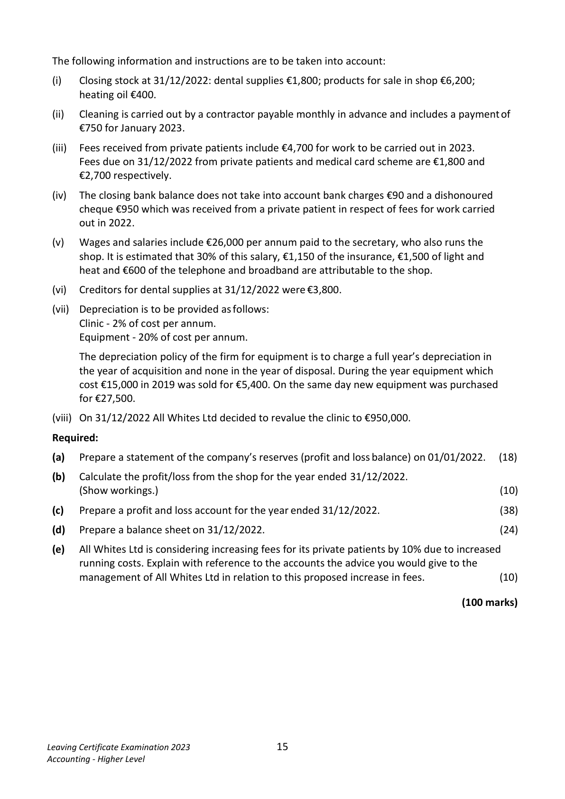
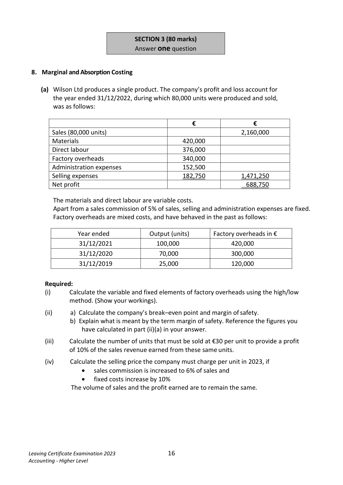
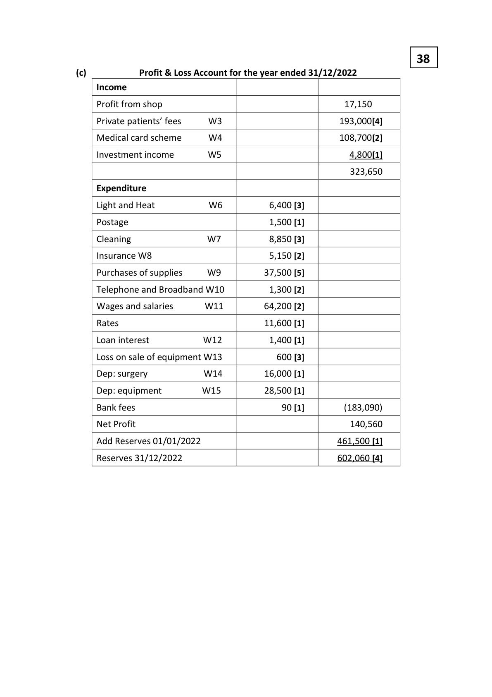
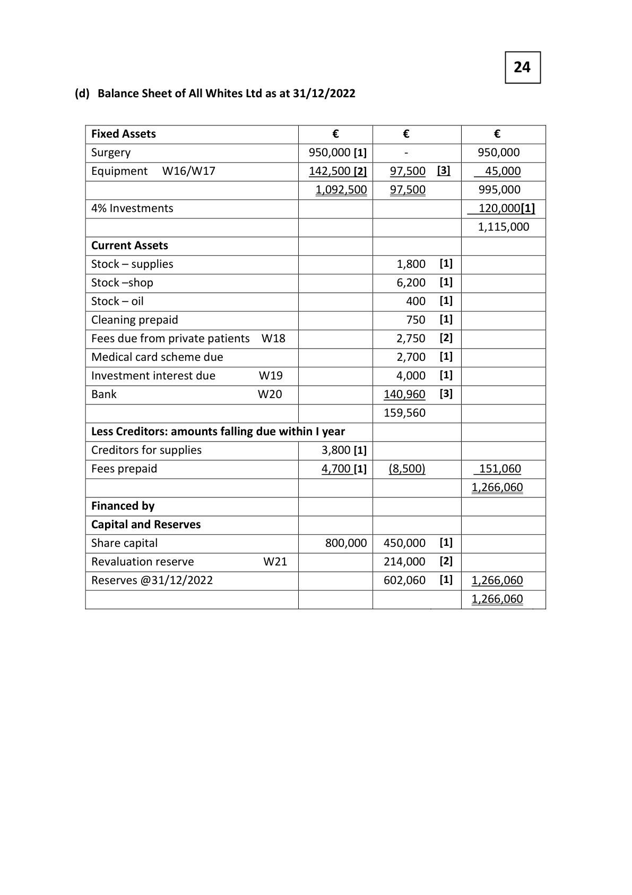
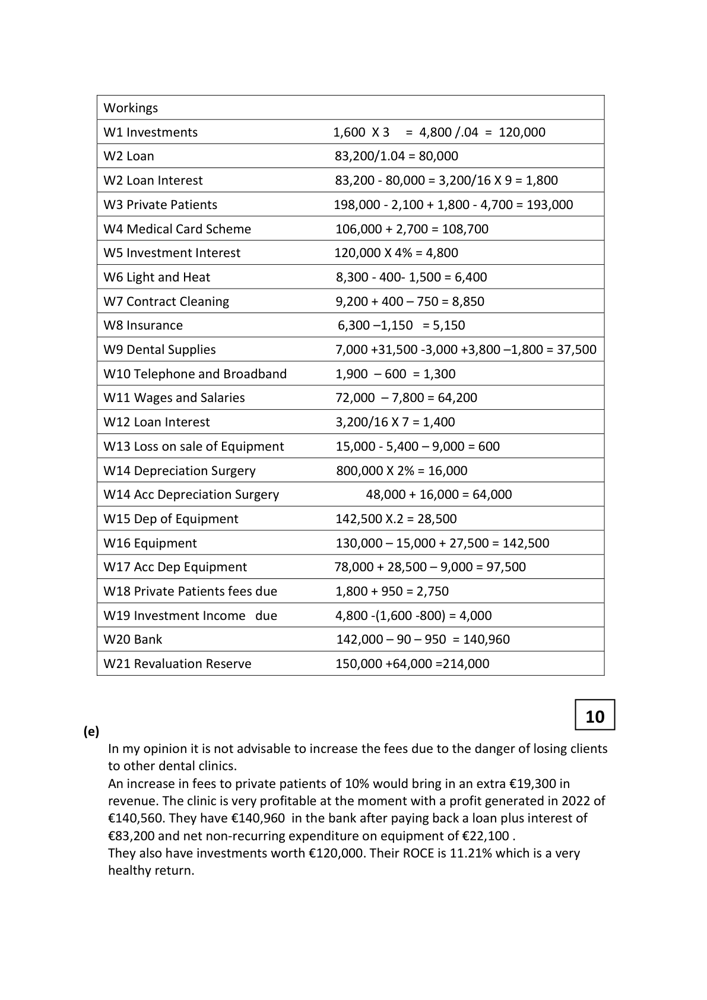
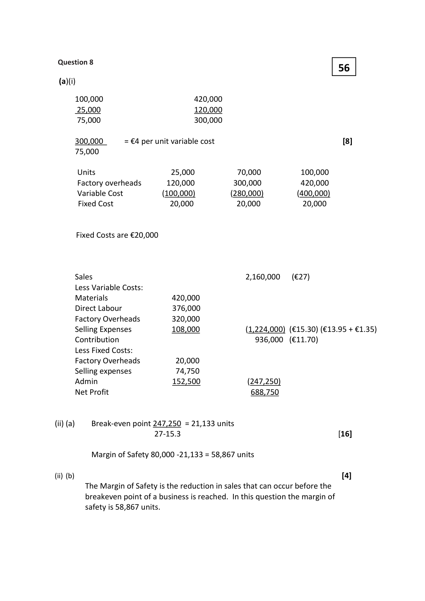

# Question

7.   Service Firm

 The following were included in the assets and liabilities of All Whites Ltd, a dental clinic on
 01/01/2022:

     Clinic at cost €800,000; equipment at cost €130,000; contract cleaning prepaid €400;
    stock of dental supplies for use in clinic €7,000; stock of dental products for shop €8,000;
     creditors for dental supplies to the clinic €3,000; fees due from private patients €2,100;
    investment interest due €800.
    The authorised capital of the company was €800,000 and the issued capital was €450,000.

  All fixed assets have 3 years accumulated depreciation on 01/01/2022.

 The following is a receipts and payments account for the year ended 31/12/2022:

          Receipts and Payments Account of All Whites Ltd for year ended 31/12/2022

                                    €                                          €
Balance at bank 01/01/2022            54,000    Light and heat                           8,300
Receipts from private patients         198,000    Contract cleaning of clinic                 9,200
Receipts from medical card scheme    106,000    Postage                                1,500
Interest on 4% investments (4 months)   1,600    Insurance                               6,300
Sale of dental products in shop         53,000    Purchases – dental products for shop     23,000
Sale of equipment (cost €15,000)         5,400    Purchases – dental supplies for clinic      31,500
                                            Telephone and broadband                1,900
                                       Wages and salaries                     72,000
                                           Equipment                            27,500
                                               Rates                                 11,600
                                         Repayment of a bank loan plus 16
                                         months interest at 3% per annum on     83,200
                                            01/08/2022
                                  _______  Balance at bank 31/12/2022            142,000

                                    418,000                                       418,000

   .

  Leaving Certificate Examination 2023               14
  Accounting - Higher Level

<!-- PAGE 15 -->
# Page 15

<!-- HAS_VISUAL: true -->
<!-- VISUAL_REASON: text contains visual keywords: table; page image extracted because text may not fully capture visual content -->

The following information and instructions are to be taken into account:

  (i)    Closing stock at 31/12/2022: dental supplies €1,800; products for sale in shop €6,200;
      heating oil €400.

  (ii)   Cleaning is carried out by a contractor payable monthly in advance and includes a payment of
      €750 for January 2023.

  (iii)  Fees received from private patients include €4,700 for work to be carried out in 2023.
      Fees due on 31/12/2022 from private patients and medical card scheme are €1,800 and
      €2,700 respectively.

 (iv)  The closing bank balance does not take into account bank charges €90 and a dishonoured
      cheque €950 which was received from a private patient in respect of fees for work carried
      out in 2022.

 (v)  Wages and salaries include €26,000 per annum paid to the secretary, who also runs the
      shop. It is estimated that 30% of this salary, €1,150 of the insurance, €1,500 of light and
      heat and €600 of the telephone and broadband are attributable to the shop.

 (vi)   Creditors for dental supplies at 31/12/2022 were €3,800.

 (vii)  Depreciation is to be provided as follows:
        Clinic - 2% of cost per annum.
      Equipment - 20% of cost per annum.

      The depreciation policy of the firm for equipment is to charge a full year’s depreciation in
      the year of acquisition and none in the year of disposal. During the year equipment which
       cost €15,000 in 2019 was sold for €5,400. On the same day new equipment was purchased
       for €27,500.

  (viii) On 31/12/2022 All Whites Ltd decided to revalue the clinic to €950,000.

 Required:

 (a)   Prepare a statement of the company’s reserves (profit and loss balance) on 01/01/2022.   (18)

 (b)   Calculate the profit/loss from the shop for the year ended 31/12/2022.
      (Show workings.)                                                                          (10)

 (c)   Prepare a profit and loss account for the year ended 31/12/2022.                          (38)

 (d)   Prepare a balance sheet on 31/12/2022.                                                   (24)

 (e)    All Whites Ltd is considering increasing fees for its private patients by 10% due to increased
      running costs. Explain with reference to the accounts the advice you would give to the
     management of All Whites Ltd in relation to this proposed increase in fees.                (10)

                                                                                (100 marks)

Leaving Certificate Examination 2023               15
Accounting - Higher Level

<!-- PAGE 16 -->
# Page 16

<!-- HAS_VISUAL: true -->
<!-- VISUAL_REASON: page contains vector drawings; text contains visual keywords: figure; page image extracted because text may not fully capture visual content -->

SECTION 3 (80 marks)
                              Answer one question

# Marking Scheme

7.    Salaries & general expenses     136,400 - 600- 400                           135,400

Question 7.                                                 18
     (a) Statement of Company’s Reserves (profit and loss balance) 01/01/2022

          Assets                                 €                 €

          Surgery    (800,000 - 48,000)             752,000   [2]

         Equipment (130,000 - 78,000)              52,000    [2]

          Stock – supplies for clinic                    7,000    [1]

          Stock – supplies for shop                    8,000    [1]

          Cleaning prepaid                          400    [1]

         Investment income due                     800    [1]

          Investments             W1      120,000    [2]

         Fees due from private patients               2,100    [1]

         Bank                                    54,000    [1]        996,300

            Liabilities

           Creditors for supplies                       3,000    [1]

          Issued Capital                           450,000    [1]

         Loan                  W2       80,000    [1]

         Loan interest due          W2        1,800    [2]       (534800)

         Reserves at 01/01/2022                                     461,500[1]

                                                        10
      (b) Shop Profit/Loss for the year ended 31/12/2022

           Sales                                                    53,000   [1]

            less Cost of Sales

         Opening stock                            8,000     [1]

          Purchases                              23,000     [1]

                                                 31,000

           Closing stock                               (6,200)     [1]      (24,800)

         Gross Profit                                                28,200

            less: expenses

           Light and heat                            1,500     [1]

        Wages                                   7,800     [1]

          Insurance                                1,150     [1]

         Telephone                              600     [1]      (11,050)

           Profit from shop                                            17,150   [2]

<!-- PAGE 24 -->
# Page 24

<!-- HAS_VISUAL: true -->
<!-- VISUAL_REASON: page contains vector drawings; page image extracted because text may not fully capture visual content -->

38
(c)              Profit & Loss Account for the year ended 31/12/2022
    Income

     Profit from shop                                        17,150

     Private patients’ fees    W3                           193,000[4]

    Medical card scheme    W4                           108,700[2]

    Investment income     W5                               4,800[1]

                                                           323,650

     Expenditure

     Light and Heat        W6          6,400 [3]

     Postage                               1,500 [1]

     Cleaning           W7           8,850 [3]

     Insurance W8                          5,150 [2]

     Purchases of supplies    W9         37,500 [5]

    Telephone and Broadband W10          1,300 [2]

    Wages and salaries     W11         64,200 [2]

     Rates                                11,600 [1]

    Loan interest         W12          1,400 [1]

     Loss on sale of equipment W13           600 [3]

    Dep: surgery         W14         16,000 [1]

    Dep: equipment      W15         28,500 [1]

    Bank fees                             90 [1]         (183,090)

    Net Profit                                              140,560

    Add Reserves 01/01/2022                             461,500 [1]

     Reserves 31/12/2022                                 602,060 [4]

<!-- PAGE 25 -->
# Page 25

<!-- HAS_VISUAL: true -->
<!-- VISUAL_REASON: page contains vector drawings; page image extracted because text may not fully capture visual content -->

24

(d) Balance Sheet of All Whites Ltd as at 31/12/2022

   Fixed Assets                           €          €             €
   Surgery                              950,000 [1]          -            950,000
   Equipment  W16/W17                142,500 [2]    97,500   [3]      45,000
                                          1,092,500    97,500         995,000
  4% Investments                                                      120,000[1]
                                                                      1,115,000
   Current Assets
   Stock – supplies                                      1,800   [1]
   Stock –shop                                          6,200   [1]
   Stock – oil                                         400   [1]
   Cleaning prepaid                                   750   [1]
   Fees due from private patients W18                   2,750   [2]
   Medical card scheme due                              2,700   [1]
   Investment interest due     W19                    4,000   [1]
   Bank                 W20                 140,960   [3]
                                                    159,560
   Less Creditors: amounts falling due within I year
   Creditors for supplies                     3,800 [1]
   Fees prepaid                            4,700 [1]    (8,500)         151,060
                                                                     1,266,060
   Financed by
   Capital and Reserves
   Share capital                            800,000   450,000   [1]
   Revaluation reserve         W21                214,000   [2]
   Reserves @31/12/2022                            602,060   [1]   1,266,060
                                                                     1,266,060

<!-- PAGE 26 -->
# Page 26

<!-- HAS_VISUAL: true -->
<!-- VISUAL_REASON: page contains vector drawings; text contains visual keywords: table; page image extracted because text may not fully capture visual content -->

Workings

  W1 Investments                     1,600 X 3  = 4,800 /.04 = 120,000

  W2 Loan                            83,200/1.04 = 80,000

  W2 Loan Interest                    83,200 - 80,000 = 3,200/16 X 9 = 1,800

  W3 Private Patients                 198,000 - 2,100 + 1,800 - 4,700 = 193,000

  W4 Medical Card Scheme            106,000 + 2,700 = 108,700

  W5 Investment Interest              120,000 X 4% = 4,800

  W6 Light and Heat                   8,300 - 400- 1,500 = 6,400

  W7 Contract Cleaning                9,200 + 400 – 750 = 8,850

  W8 Insurance                        6,300 –1,150 = 5,150

  W9 Dental Supplies                  7,000 +31,500 -3,000 +3,800 –1,800 = 37,500

  W10 Telephone and Broadband       1,900 – 600 = 1,300

  W11 Wages and Salaries              72,000 – 7,800 = 64,200

  W12 Loan Interest                   3,200/16 X 7 = 1,400

  W13 Loss on sale of Equipment        15,000 - 5,400 – 9,000 = 600

  W14 Depreciation Surgery            800,000 X 2% = 16,000

  W14 Acc Depreciation Surgery             48,000 + 16,000 = 64,000

  W15 Dep of Equipment              142,500 X.2 = 28,500

  W16 Equipment                     130,000 – 15,000 + 27,500 = 142,500

  W17 Acc Dep Equipment             78,000 + 28,500 – 9,000 = 97,500

  W18 Private Patients fees due         1,800 + 950 = 2,750

  W19 Investment Income due         4,800 -(1,600 -800) = 4,000

  W20 Bank                          142,000 – 90 – 950 = 140,960

  W21 Revaluation Reserve            150,000 +64,000 =214,000

                                                    10
(e)
    In my opinion it is not advisable to increase the fees due to the danger of losing clients
    to other dental clinics.
   An increase in fees to private patients of 10% would bring in an extra €19,300 in
    revenue. The clinic is very profitable at the moment with a profit generated in 2022 of
    €140,560. They have €140,960 in the bank after paying back a loan plus interest of
    €83,200 and net non-recurring expenditure on equipment of €22,100 .
    They also have investments worth €120,000. Their ROCE is 11.21% which is a very
    healthy return.

<!-- PAGE 27 -->
# Page 27

<!-- HAS_VISUAL: true -->
<!-- VISUAL_REASON: page contains vector drawings; page image extracted because text may not fully capture visual content -->

# Source References

Exam paper:
- file: intermediate_markdown/exam_papers/higher/accounting_higher_2023_paper_1_exam.md
- pages: [15, 16]

Marking scheme:
- file: intermediate_markdown/marking_schemes/higher/accounting_higher_2023_paper_1_marking_scheme.md
- pages: [24, 25, 26, 27]

# Notes

