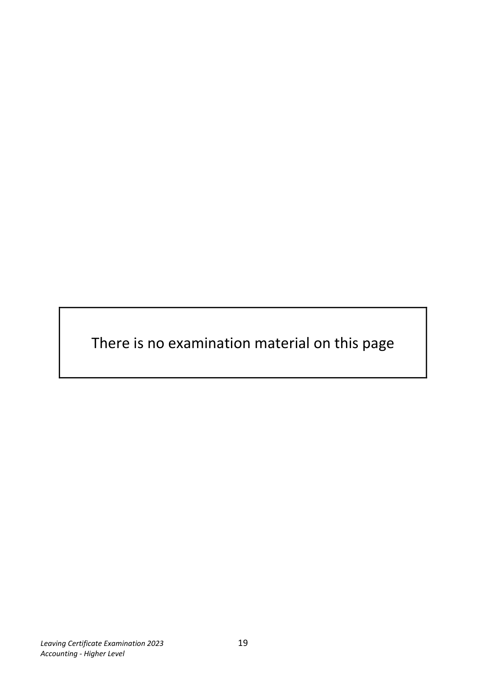
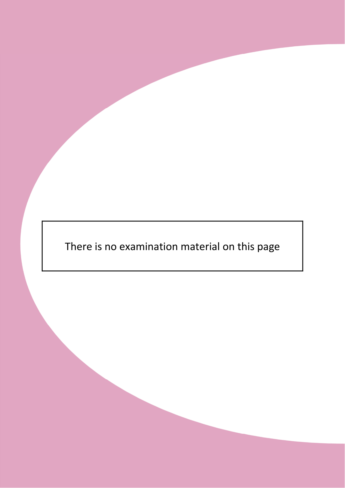
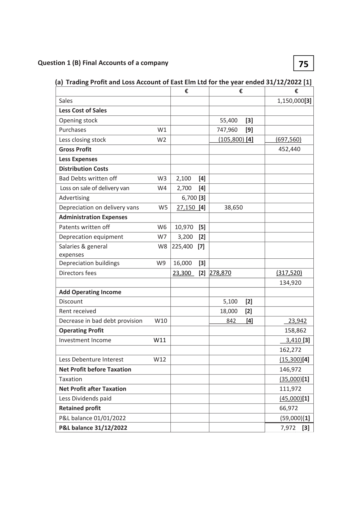
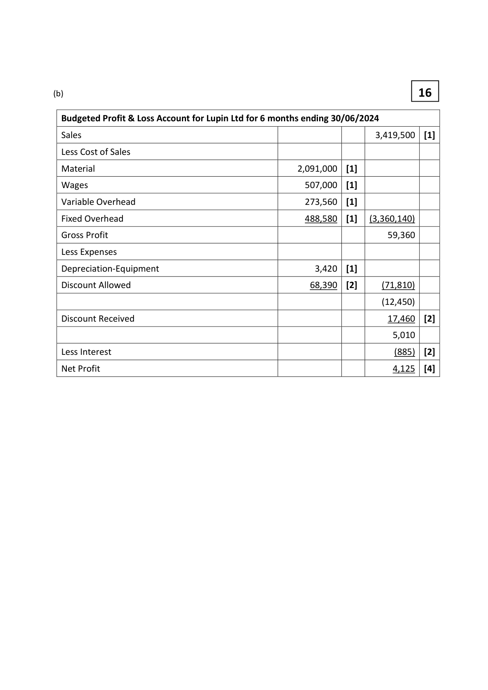
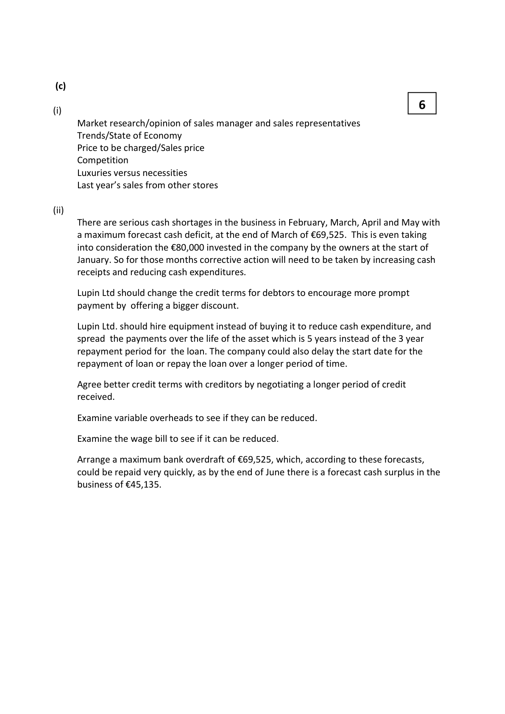
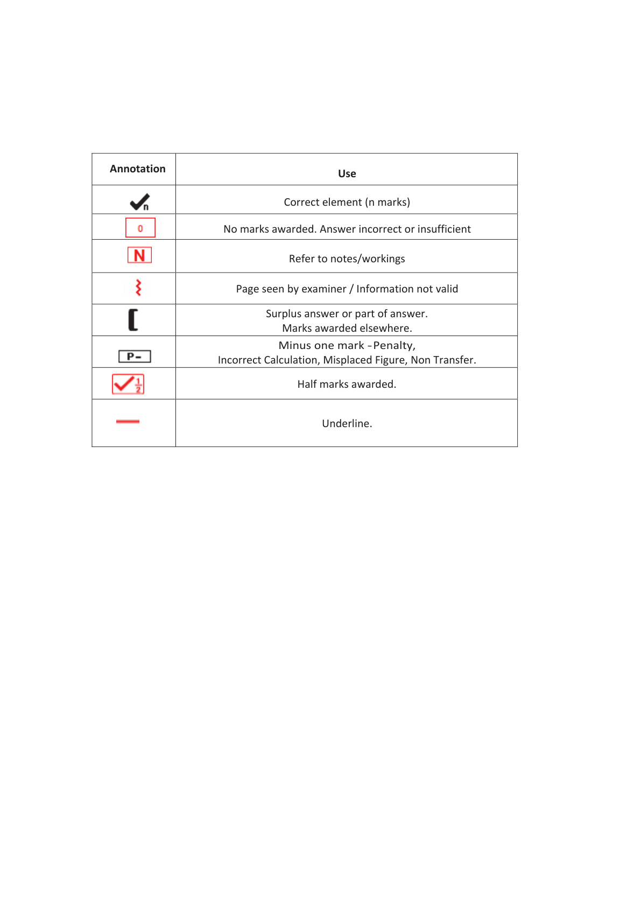

# Question

9.   Budgeting

Lupin Ltd is preparing to set up a business on 01/01/2024. Lupin plans to lodge €80,000 into the
business bank account. Lupin Ltd has made the following forecast for the first six months of trading:

               Jan       Feb      March      April     May      June       Total
    Sales      €468,000  €544,500  €567,000  €585,000  €594,000  €661,000  €3,419,500
    Purchases  €436,000  €320,000  €325,000  €330,000  €335,000  €345,000  €2,091,000

(i)    The expected selling price is €50 per unit.
(ii)    The cash collection pattern from sales is expected to be as follows:
      Cash customers:    40% of sales revenue will be for immediate cash and a cash discount of
                    5% will be allowed.
       Credit customers:   60% of sales revenue will be from credit customers.
                          These debtors will pay their bills 60% in the month after sale and the
                          remainder in the second month after sale.
(iii)   The cash payment pattern for purchases is expected to be:
       Credit suppliers      The purchases will be paid for 50% in the month after purchase when a
                    2% cash discount will be received. The remaining purchases will be
                            paid for in the second month after purchase.
(iv)    Expenses of the business will be settled as follows:
      Expected costs      Wages €84,500 per month, payable as incurred.
                             Variable overheads €4 per unit, payable as incurred.
                             Fixed overheads (including depreciation) €82,000 per month,
                           payable as incurred.
       Capital costs        Equipment will be purchased on 01/01/2024 costing €36,000 which will
                         have a useful economic life of 5 years and have a scrap value of 5% of
                           the original cost.
                        To finance this purchase, a loan of €24,000 will be secured on
                           01/01/2024. Interest will be charged at 8% per annum.
                        The interest for each month is to be paid on the last day of the month
                         based on the amount of the loan outstanding at that date.
                        The capital sum is to be repaid in 32 monthly instalments commencing
                       on 01/02/2024.
 Required:
  (a)   Prepare a cash budget for Lupin Ltd for each of the six months January to June 2024.
  (b)   Prepare a budgeted trading and profit and loss account for Lupin Ltd for the six months
      ending 30/06/2024.
  (c)     (i)  What factors should be taken into consideration by Lupin Ltd in arriving at the
          expected sales figures for the first six months of 2024?
           (ii) On the basis of the cash budget you have prepared in (a) above, what advice would you
           give to the management of Lupin Ltd?
                                                                                   (80 marks)

Leaving Certificate Examination 2023               18
Accounting - Higher Level

<!-- PAGE 19 -->
# Page 19

<!-- HAS_VISUAL: true -->
<!-- VISUAL_REASON: page contains vector drawings; page image extracted because text may not fully capture visual content -->

There is no examination material on this page

Leaving Certificate Examination 2023               19
Accounting - Higher Level

<!-- PAGE 20 -->
# Page 20

<!-- HAS_VISUAL: true -->
<!-- VISUAL_REASON: page contains embedded images; page contains vector drawings; page image extracted because text may not fully capture visual content -->

There is no examination material on this page

Leaving Certificate Examination 2023               20
Accounting - Higher Level

# Marking Scheme

9.   Depreciation on Equipment     153,500 x 10%                                15,350

                                                                                     3,600
   10.  Investment income             180,000 by 4% for 6/12 months

   11.  Mortgage interest              8,100 + 875 – 1,795                             7,180

                                  3375 + 5600 -1795                              7,180

   12.   Patents in the Balance Sheet     50,000 - 6,250                                43,750

   13.   Delivery vans                  480,000 + 80,000 - 35,000                     525,000

   14.  Accumulated dep. vans         70,000 + 98,250 - 29,750                      138,500

   15.  Debtors                       67,700 + 200                                  67,900

   16.  Bad debt provision             67,900 × 6%                                    4,074

  17.  Investment income due         3,600 - 1,200 - 2,200                           200

   18.   Creditors                      98,600 + 15,375 - 600                         113,375

   19.  VAT                          11,900 – 2,875                                    (9,025)

  20.  Bank                         53,600 - 1,500                                 52,100

                                     50,300 + 1,800                                52,100

   21.  Mortgage interest due          8,975 – 2,300 - 400                              6,275

   22.   Revaluation reserve            100,000 + 105,000                           205,000

   23.  Drawings                     45,000 + 1,795 + 3,000                         49,795

<!-- PAGE 6 -->
# Page 6

<!-- HAS_VISUAL: true -->
<!-- VISUAL_REASON: page contains vector drawings; page image extracted because text may not fully capture visual content -->

9.                                               Receipts  Cash   Credit   Credit                 Payments     Purchases     Purchases   Wages    Variable   Fixed     Equipment    Capital    Interest   Total  Net  Loan    Opening    Closing

        (a)         Question

<!-- PAGE 31 -->
# Page 31

<!-- HAS_VISUAL: true -->
<!-- VISUAL_REASON: page contains vector drawings; page image extracted because text may not fully capture visual content -->

(b)                                                     16

  Budgeted Profit & Loss Account for Lupin Ltd for 6 months ending 30/06/2024

  Sales                                                                  3,419,500  [1]

  Less Cost of Sales

  Material                                              2,091,000  [1]

 Wages                                               507,000  [1]

  Variable Overhead                                     273,560  [1]

  Fixed Overhead                                       488,580  [1]   (3,360,140)

  Gross Profit                                                             59,360

  Less Expenses

  Depreciation-Equipment                                   3,420  [1]

  Discount Allowed                                       68,390  [2]      (71,810)

                                                                               (12,450)

  Discount Received                                                       17,460  [2]

                                                                            5,010

  Less Interest                                                                    (885)  [2]

  Net Profit                                                                 4,125  [4]

<!-- PAGE 32 -->
# Page 32

<!-- HAS_VISUAL: true -->
<!-- VISUAL_REASON: page contains vector drawings; page image extracted because text may not fully capture visual content -->

(c)

                                                     6(i)
     Market research/opinion of sales manager and sales representatives
     Trends/State of Economy
      Price to be charged/Sales price
     Competition
      Luxuries versus necessities
      Last year’s sales from other stores

(ii)
     There are serious cash shortages in the business in February, March, April and May with
     a maximum forecast cash deficit, at the end of March of €69,525. This is even taking
      into consideration the €80,000 invested in the company by the owners at the start of
      January. So for those months corrective action will need to be taken by increasing cash
      receipts and reducing cash expenditures.

     Lupin Ltd should change the credit terms for debtors to encourage more prompt
     payment by offering a bigger discount.

     Lupin Ltd. should hire equipment instead of buying it to reduce cash expenditure, and
     spread the payments over the life of the asset which is 5 years instead of the 3 year
     repayment period for the loan. The company could also delay the start date for the
     repayment of loan or repay the loan over a longer period of time.

     Agree better credit terms with creditors by negotiating a longer period of credit
      received.

     Examine variable overheads to see if they can be reduced.

     Examine the wage bill to see if it can be reduced.

     Arrange a maximum bank overdraft of €69,525, which, according to these forecasts,
     could be repaid very quickly, as by the end of June there is a forecast cash surplus in the
     business of €45,135.

<!-- PAGE 33 -->
# Page 33

<!-- HAS_VISUAL: true -->
<!-- VISUAL_REASON: page contains embedded images; page contains vector drawings; text contains visual keywords: figure, line; page image extracted because text may not fully capture visual content -->

Annotation                                     Use

                                  Correct element (n marks)

                No marks awarded. Answer incorrect or insufficient

                                   Refer to notes/workings

                      Page seen by examiner / Information not valid

                               Surplus answer or part of answer.
                             Marks awarded elsewhere.
                          Minus one mark - Penalty,
                      Incorrect Calculation, Misplaced Figure, Non Transfer.

                                       Half marks awarded.

                                          Underline.

<!-- PAGE 34 -->
# Page 34

<!-- EXTRACTION_ISSUE: no extractable text found -->

[No extractable text found]

<!-- PAGE 35 -->
# Page 35

<!-- EXTRACTION_ISSUE: no extractable text found -->

[No extractable text found]

<!-- PAGE 36 -->
# Page 36

<!-- HAS_VISUAL: true -->
<!-- VISUAL_REASON: page contains vector drawings; text extraction is sparse relative to visible page content; page image extracted because text may not fully capture visual content -->

<!-- EXTRACTION_ISSUE: no extractable text found -->

[No extractable text found]

# Source References

Exam paper:
- file: intermediate_markdown/exam_papers/higher/accounting_higher_2023_paper_1_exam.md
- pages: [19, 20]

Marking scheme:
- file: intermediate_markdown/marking_schemes/higher/accounting_higher_2023_paper_1_marking_scheme.md
- pages: [6, 31, 32, 33, 34, 35, 36]

# Notes

