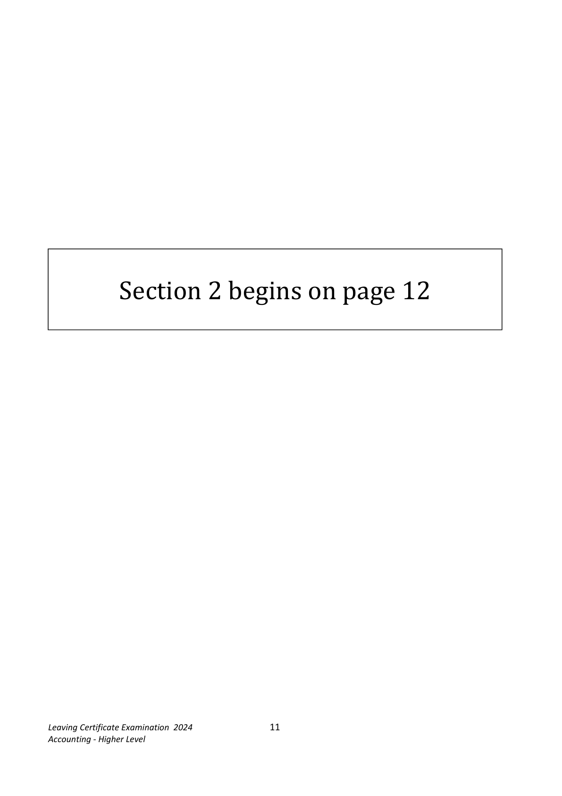
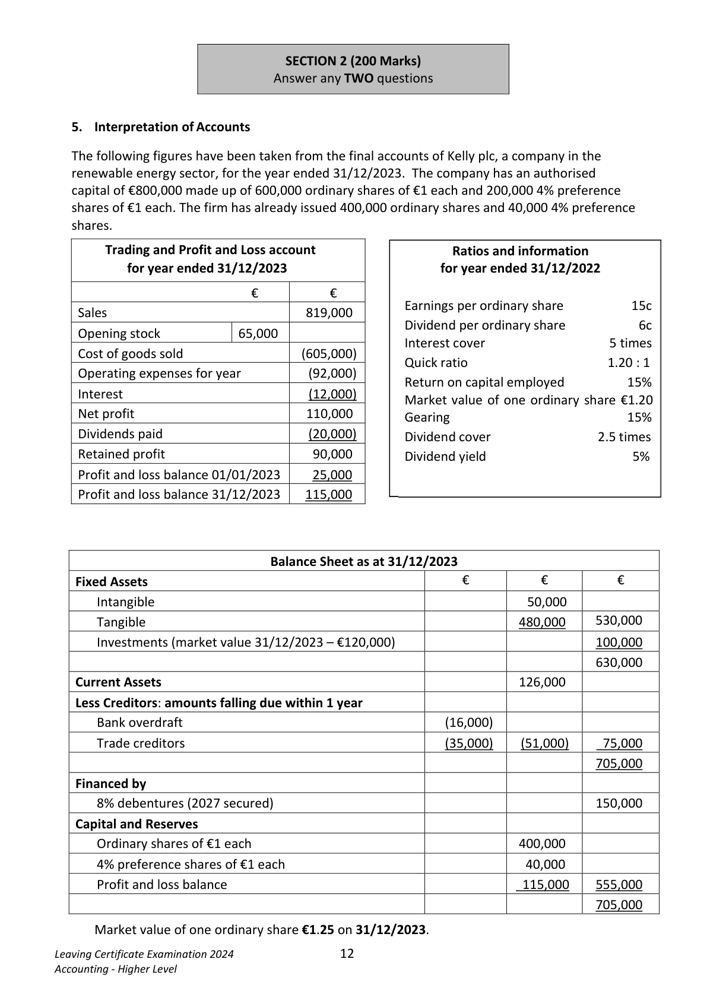
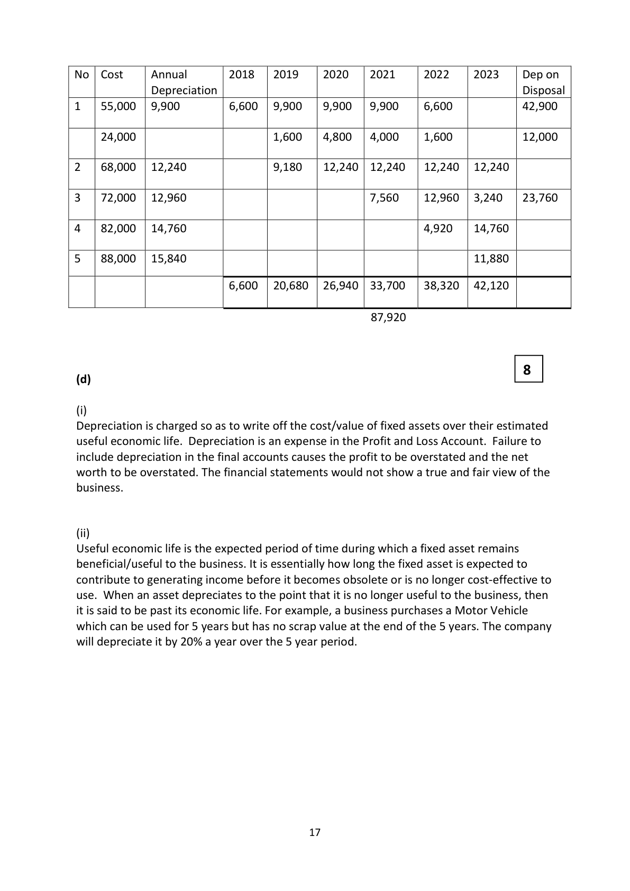
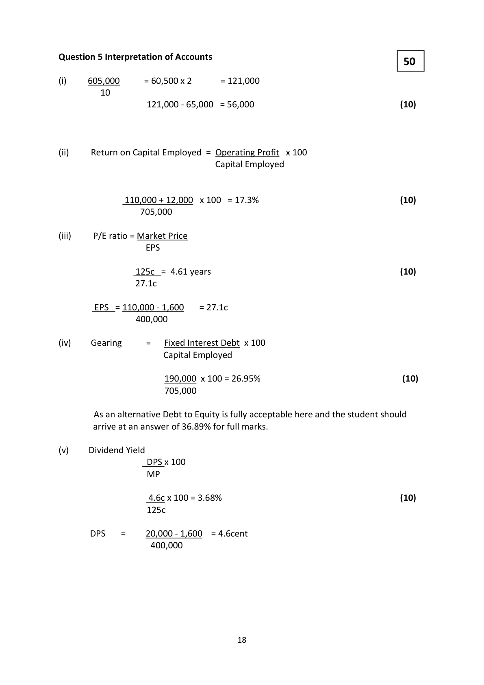

# Question

4. Depreciation of Fixed Assets

      Cobra Trucking Ltd prepares its final accounts to 31 December each year. The
      company’s policy is to depreciate its trucks on a straight line basis over 5 years.

       Scrap value is estimated at 10% of the original cost of a truck.
       Depreciation is charged from the date of purchase to the date of disposal.

     On 01/01/2022 Cobra Trucking Ltd owned the following trucks:

       Truck No. 1 purchased on 01/05/2018 for €55,000.
       Truck No. 2 purchased on 01/04/2019 for €68,000.
       Truck No. 3 purchased on 01/06/2021 for €72,000.

     On 01/09/2022, truck no.1 was traded in for €20,000 against another truck costing
       €82,000. Truck no.1 had a refrigeration unit fitted on 01/09/2019. The cost of the
       refrigeration unit was €22,000 and the cost of installing it was a further €2,000.
      Note: Refrigeration units are depreciated at 20% of cost for the first two years and
       thereafter at a rate of 10% of cost each year until fully written off.

     On 01/04/2023, truck no. 3 was crashed and traded in against a new truck costing
       €88,000. The company received compensation from the insurance company to the
       value of €26,000 and the cheque paid for the new vehicle was €65,000.

      You are required to show, with workings, for each of the two years 2022 and 2023:

        (a)    The Truck Account.                                                               (6)

        (b)    The Provision for Depreciation Account.                                    (32)

         (c)    The Truck Disposal Account.                                                (14)

        (d)        (i) Why does a company charge depreciation in calculating profit?

                        (ii) Explain the term ‘useful economic life’ in relation to fixed assets.         (8)

                                                                             (60 marks)

Leaving Certificate Examination 2024               10
Accounting - Higher Level

<!-- PAGE 11 -->
# Page 11

<!-- HAS_VISUAL: true -->
<!-- VISUAL_REASON: page contains vector drawings; text extraction is sparse relative to visible page content; page image extracted because text may not fully capture visual content -->

Section 2 begins on page 12

Leaving Certificate Examination 2024               11
Accounting - Higher Level

<!-- PAGE 12 -->
# Page 12

<!-- HAS_VISUAL: true -->
<!-- VISUAL_REASON: page contains embedded images; page contains vector drawings; text contains visual keywords: figure; page image extracted because text may not fully capture visual content -->

SECTION 2 (200 Marks)
                              Answer any TWO questions

# Marking Scheme

Question 4 Depreciation of Fixed Assets

                                                      6(a)                                 Truck Account

 01/01/2022 Balance b/d       [1] 219,000      01/09/2022 Disposal          [1] 79,000

 01/09/2022 Bank                [1] 82,000      31/12/2022 Balance c/d      [1] 222,000

                               301,000                                  301,000

 01/01/2023 Balance b/d        222,000      01/04/2023 Disposal          [1] 72,000

 01/04/2023 Bank               [1] 88,000      31/12/2023 Balance c/d        238,000

                               310,000                                  310,000

 01/01/2024 Balance b/d        238,000

                                                          32
  (b)                         Provision for Depreciation Account
  01/09/2022 Disposal          [4] 54,900      01/01/2022 Balance b/d        [6] 87,920
  31/12/2022 Balance c/d         71,340      31/12/2022 Profit & Loss      [8] 38,320

                               126,240                                  126,240

  01/04/2023 Disposal          [4] 23,760      01/01/2023 Balance b/d        71,340

  31/12/2023 Balance c/d      [3] 89,700      31/12/2023 Profit & Loss     [7] 42,120

                               113,460                                  113,460

                                           01/01/2024 Balance b/d       89,700

                                                           14
  (c)                          Disposal of Truck Account
  01/09/2022 Cost               [1] 79,000      01/09/2022  Trade In        [2] 20,000
                                                  Provision for Depreciation     [2] 54,900

                              _____      31/12/2022 P&L               [1] 4,100

                                79,000                                   79,000

  01/04/2023 Cost               [1] 72,000      01/04/2023 Trade in          [2] 23,000

  31/12/2023       Profit & Loss[1]   760      Compensation                [2] 26,000

                              _____       Provision for Depreciation    [2] 23,760
                                72,760                                   72,760

                                         16

<!-- PAGE 17 -->
# Page 17

<!-- HAS_VISUAL: true -->
<!-- VISUAL_REASON: page contains vector drawings; page image extracted because text may not fully capture visual content -->

No  Cost     Annual      2018   2019    2020   2021    2022    2023   Dep on
              Depreciation                                                         Disposal
1   55,000   9,900        6,600   9,900    9,900   9,900    6,600            42,900

    24,000                        1,600    4,800   4,000    1,600            12,000

2   68,000   12,240               9,180    12,240  12,240   12,240  12,240

3   72,000   12,960                                7,560    12,960   3,240   23,760

4   82,000   14,760                                         4,920    14,760

5   88,000   15,840                                                 11,880

                           6,600   20,680  26,940  33,700   38,320  42,120

                                                  87,920

                                                          8
(d)

 (i)
Depreciation is charged so as to write off the cost/value of fixed assets over their estimated
useful economic life. Depreciation is an expense in the Profit and Loss Account. Failure to
include depreciation in the final accounts causes the profit to be overstated and the net
worth to be overstated. The financial statements would not show a true and fair view of the
business.

 (ii)
Useful economic life is the expected period of time during which a fixed asset remains
beneficial/useful to the business. It is essentially how long the fixed asset is expected to
contribute to generating income before it becomes obsolete or is no longer cost-effective to
use. When an asset depreciates to the point that it is no longer useful to the business, then
it is said to be past its economic life. For example, a business purchases a Motor Vehicle
which can be used for 5 years but has no scrap value at the end of the 5 years. The company
will depreciate it by 20% a year over the 5 year period.

                                        17

<!-- PAGE 18 -->
# Page 18

<!-- HAS_VISUAL: true -->
<!-- VISUAL_REASON: page contains vector drawings; text contains visual keywords: table; page image extracted because text may not fully capture visual content -->

# Source References

Exam paper:
- file: intermediate_markdown/exam_papers/higher/accounting_higher_2024_paper_1_exam.md
- pages: [11, 12]

Marking scheme:
- file: intermediate_markdown/marking_schemes/higher/accounting_higher_2024_paper_1_marking_scheme.md
- pages: [17, 18]

# Notes

