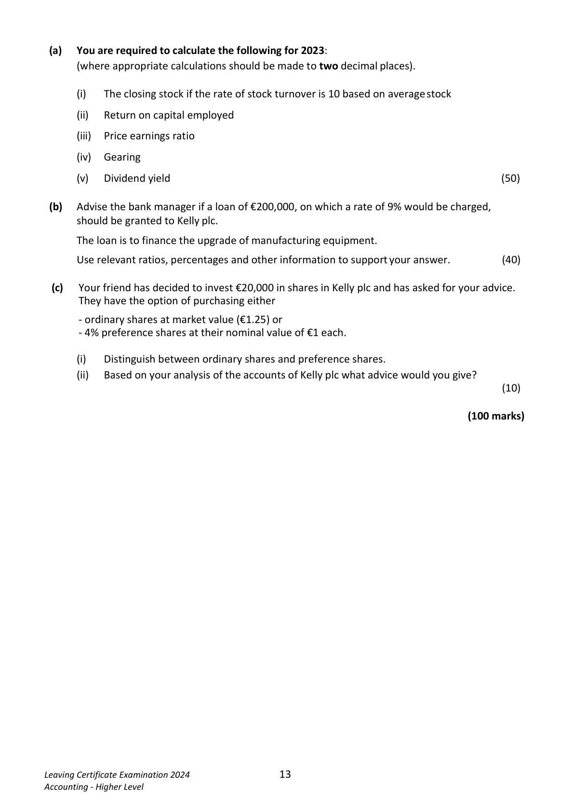
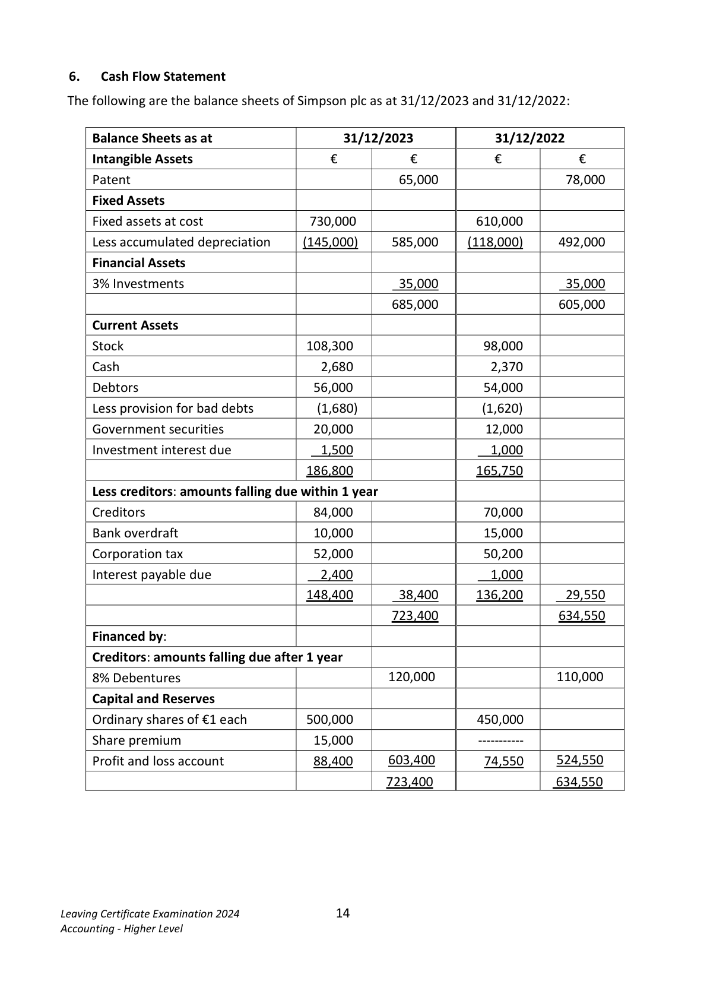
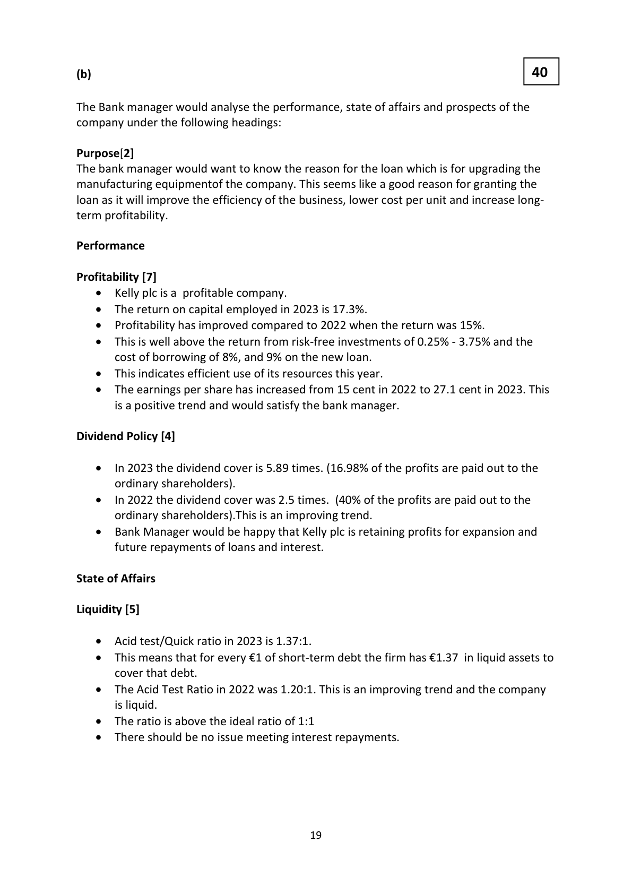
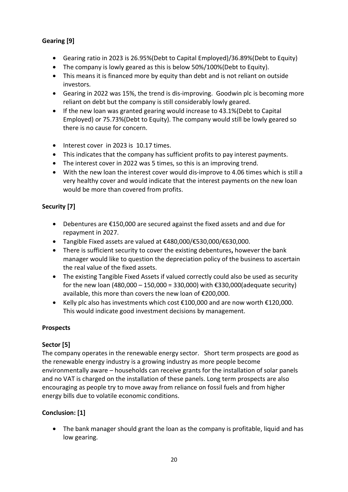
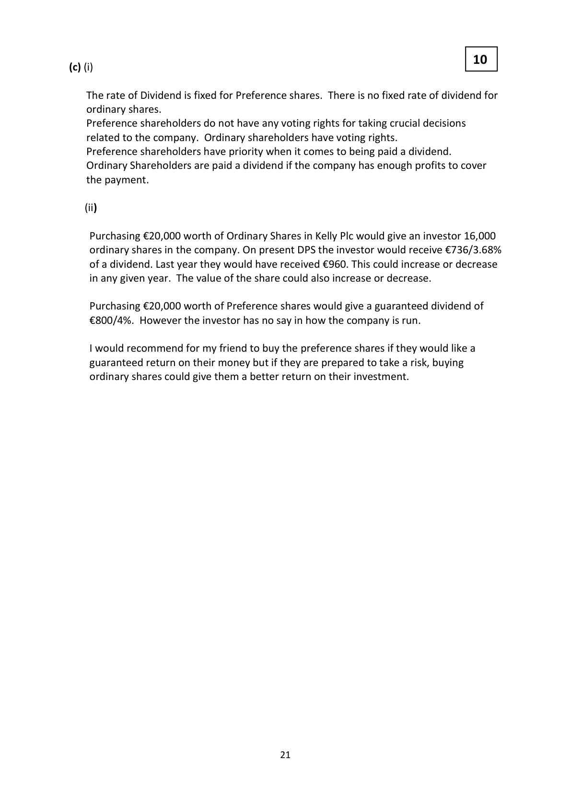
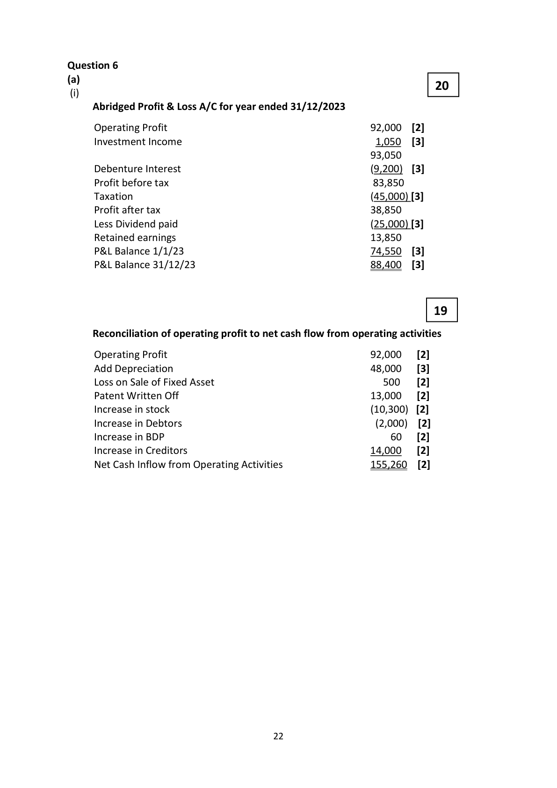

# Question

5.  Interpretation of Accounts

  The following figures have been taken from the final accounts of Kelly plc, a company in the
  renewable energy sector, for the year ended 31/12/2023. The company has an authorised
   capital of €800,000 made up of 600,000 ordinary shares of €1 each and 200,000 4% preference
   shares of €1 each. The firm has already issued 400,000 ordinary shares and 40,000 4% preference
   shares.

        Trading and Profit and Loss account                      Ratios and information
             for year ended 31/12/2023                           for year ended 31/12/2022

                           €          €
                                                         Earnings per ordinary share          15c
    Sales                              819,000
                                                       Dividend per ordinary share           6c
   Opening stock            65,000
                                                              Interest cover                 5 times
    Cost of goods sold                   (605,000)
                                                     Quick ratio                      1.20 : 1
    Operating expenses for year           (92,000)
                                                     Return on capital employed        15%
    Interest                               (12,000)                                                  Market value of one ordinary share €1.20
   Net profit                          110,000        Gearing                      15%
    Dividends paid                        (20,000)       Dividend cover                  2.5 times
    Retained profit                      90,000        Dividend yield                 5%
    Profit and loss balance 01/01/2023     25,000
    Profit and loss balance 31/12/2023    115,000

                                 Balance Sheet as at 31/12/2023
   Fixed Assets                                            €          €          €
       Intangible                                                        50,000
       Tangible                                                        480,000    530,000
       Investments (market value 31/12/2023 – €120,000)                              100,000
                                                                                 630,000
   Current Assets                                                     126,000
   Less Creditors: amounts falling due within 1 year
      Bank overdraft                                           (16,000)
      Trade creditors                                           (35,000)     (51,000)     75,000
                                                                                 705,000
   Financed by
     8% debentures (2027 secured)                                                150,000
    Capital and Reserves
       Ordinary shares of €1 each                                        400,000
     4% preference shares of €1 each                                    40,000
        Profit and loss balance                                            115,000    555,000
                                                                                 705,000

      Market value of one ordinary share €1.25 on 31/12/2023.

Leaving Certificate Examination 2024               12
Accounting - Higher Level

<!-- PAGE 13 -->
# Page 13

(a)  You are required to calculate the following for 2023:
      (where appropriate calculations should be made to two decimal places).

          (i)   The closing stock if the rate of stock turnover is 10 based on average stock

           (ii)   Return on capital employed

           (iii)   Price earnings ratio

         (iv)  Gearing

        (v)   Dividend yield                                                                       (50)

 (b)   Advise the bank manager if a loan of €200,000, on which a rate of 9% would be charged,
      should be granted to Kelly plc.

      The loan is to finance the upgrade of manufacturing equipment.

     Use relevant ratios, percentages and other information to support your answer.           (40)

  (c)   Your friend has decided to invest €20,000 in shares in Kelly plc and has asked for your advice.
      They have the option of purchasing either

          - ordinary shares at market value (€1.25) or
          - 4% preference shares at their nominal value of €1 each.

          (i)    Distinguish between ordinary shares and preference shares.
           (ii)   Based on your analysis of the accounts of Kelly plc what advice would you give?
                                                                                                  (10)

                                                                                (100 marks)

Leaving Certificate Examination 2024               13
Accounting - Higher Level

<!-- PAGE 14 -->
# Page 14

<!-- HAS_VISUAL: true -->
<!-- VISUAL_REASON: page contains vector drawings; page image extracted because text may not fully capture visual content -->

# Marking Scheme

Question 5 Interpretation of Accounts                                                          50

(i)     605,000     = 60,500 x 2      = 121,000
        10
                   121,000 - 65,000 = 56,000                                     (10)

(ii)     Return on Capital Employed = Operating Profit  x 100
                                        Capital Employed

              110,000 + 12,000  x 100 = 17.3%                                   (10)
                  705,000

(iii)     P/E ratio = Market Price
                  EPS

                125c = 4.61 years                                               (10)
                  27.1c

        EPS = 110,000 - 1,600   = 27.1c
                 400,000

(iv)    Gearing     =   Fixed Interest Debt x 100
                           Capital Employed

                       190,000 x 100 = 26.95%                                    (10)
                       705,000

       As an alternative Debt to Equity is fully acceptable here and the student should
         arrive at an answer of 36.89% for full marks.

(v)     Dividend Yield
                 DPS x 100
             MP

                      4.6c x 100 = 3.68%                                             (10)
                   125c

      DPS   =    20,000 - 1,600  = 4.6cent
                    400,000

                                       18

<!-- PAGE 19 -->
# Page 19

<!-- HAS_VISUAL: true -->
<!-- VISUAL_REASON: page contains vector drawings; text contains visual keywords: table; page image extracted because text may not fully capture visual content -->

(b)                                                        40

The Bank manager would analyse the performance, state of affairs and prospects of the
company under the following headings:

Purpose[2]
The bank manager would want to know the reason for the loan which is for upgrading the
manufacturing equipmentof the company. This seems like a good reason for granting the
loan as it will improve the efficiency of the business, lower cost per unit and increase long-
term profitability.

Performance

Profitability [7]
   •   Kelly plc is a profitable company.
   •  The return on capital employed in 2023 is 17.3%.
   •   Profitability has improved compared to 2022 when the return was 15%.
   •   This is well above the return from risk-free investments of 0.25% - 3.75% and the
       cost of borrowing of 8%, and 9% on the new loan.
   •   This indicates efficient use of its resources this year.
   •  The earnings per share has increased from 15 cent in 2022 to 27.1 cent in 2023. This
          is a positive trend and would satisfy the bank manager.

Dividend Policy [4]

   •   In 2023 the dividend cover is 5.89 times. (16.98% of the profits are paid out to the
       ordinary shareholders).
   •   In 2022 the dividend cover was 2.5 times. (40% of the profits are paid out to the
       ordinary shareholders).This is an improving trend.
   •  Bank Manager would be happy that Kelly plc is retaining profits for expansion and
       future repayments of loans and interest.

State of Affairs

Liquidity [5]

   •  Acid test/Quick ratio in 2023 is 1.37:1.
   •   This means that for every €1 of short-term debt the firm has €1.37 in liquid assets to
       cover that debt.
   •  The Acid Test Ratio in 2022 was 1.20:1. This is an improving trend and the company
          is liquid.
   •  The ratio is above the ideal ratio of 1:1
   •  There should be no issue meeting interest repayments.

                                       19

<!-- PAGE 20 -->
# Page 20

<!-- HAS_VISUAL: true -->
<!-- VISUAL_REASON: text contains visual keywords: table; page image extracted because text may not fully capture visual content -->

Gearing [9]

   •  Gearing ratio in 2023 is 26.95%(Debt to Capital Employed)/36.89%(Debt to Equity)
   •  The company is lowly geared as this is below 50%/100%(Debt to Equity).
   •   This means it is financed more by equity than debt and is not reliant on outside
        investors.
   •  Gearing in 2022 was 15%, the trend is dis-improving. Goodwin plc is becoming more
        reliant on debt but the company is still considerably lowly geared.
   •    If the new loan was granted gearing would increase to 43.1%(Debt to Capital
      Employed) or 75.73%(Debt to Equity). The company would still be lowly geared so
       there is no cause for concern.

   •   Interest cover in 2023 is 10.17 times.
   •   This indicates that the company has sufficient profits to pay interest payments.
   •  The interest cover in 2022 was 5 times, so this is an improving trend.
   •  With the new loan the interest cover would dis-improve to 4.06 times which is still a
       very healthy cover and would indicate that the interest payments on the new loan
      would be more than covered from profits.

Security [7]

   •  Debentures are €150,000 are secured against the fixed assets and and due for
      repayment in 2027.
   •  Tangible Fixed assets are valued at €480,000/€530,000/€630,000.
   •  There is sufficient security to cover the existing debentures, however the bank
      manager would like to question the depreciation policy of the business to ascertain
       the real value of the fixed assets.
   •  The existing Tangible Fixed Assets if valued correctly could also be used as security
        for the new loan (480,000 – 150,000 = 330,000) with €330,000(adequate security)
        available, this more than covers the new loan of €200,000.
   •   Kelly plc also has investments which cost €100,000 and are now worth €120,000.
       This would indicate good investment decisions by management.

Prospects

Sector [5]
The company operates in the renewable energy sector.  Short term prospects are good as
the renewable energy industry is a growing industry as more people become
environmentally aware – households can receive grants for the installation of solar panels
and no VAT is charged on the installation of these panels. Long term prospects are also
encouraging as people try to move away from reliance on fossil fuels and from higher
energy bills due to volatile economic conditions.

Conclusion: [1]

   •  The bank manager should grant the loan as the company is profitable, liquid and has
      low gearing.

                                       20

<!-- PAGE 21 -->
# Page 21

<!-- HAS_VISUAL: true -->
<!-- VISUAL_REASON: page contains vector drawings; page image extracted because text may not fully capture visual content -->

10
(c) (i)

   The rate of Dividend is fixed for Preference shares. There is no fixed rate of dividend for
   ordinary shares.
   Preference shareholders do not have any voting rights for taking crucial decisions
    related to the company. Ordinary shareholders have voting rights.
   Preference shareholders have priority when it comes to being paid a dividend.
   Ordinary Shareholders are paid a dividend if the company has enough profits to cover
   the payment.

     (ii)

    Purchasing €20,000 worth of Ordinary Shares in Kelly Plc would give an investor 16,000
    ordinary shares in the company. On present DPS the investor would receive €736/3.68%
    of a dividend. Last year they would have received €960. This could increase or decrease
     in any given year. The value of the share could also increase or decrease.

    Purchasing €20,000 worth of Preference shares would give a guaranteed dividend of
    €800/4%. However the investor has no say in how the company is run.

       I would recommend for my friend to buy the preference shares if they would like a
    guaranteed return on their money but if they are prepared to take a risk, buying
    ordinary shares could give them a better return on their investment.

                                       21

<!-- PAGE 22 -->
# Page 22

<!-- HAS_VISUAL: true -->
<!-- VISUAL_REASON: page contains vector drawings; page image extracted because text may not fully capture visual content -->

# Source References

Exam paper:
- file: intermediate_markdown/exam_papers/higher/accounting_higher_2024_paper_1_exam.md
- pages: [13, 14]

Marking scheme:
- file: intermediate_markdown/marking_schemes/higher/accounting_higher_2024_paper_1_marking_scheme.md
- pages: [19, 20, 21, 22]

# Notes

