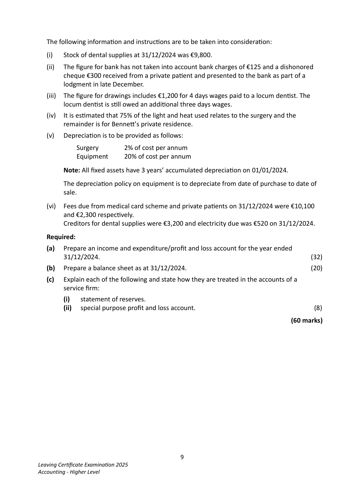
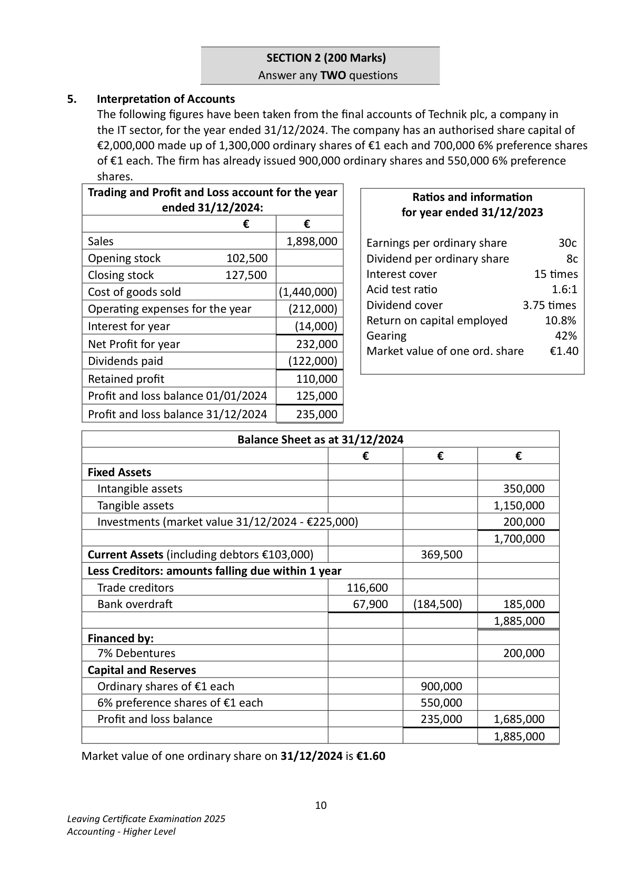
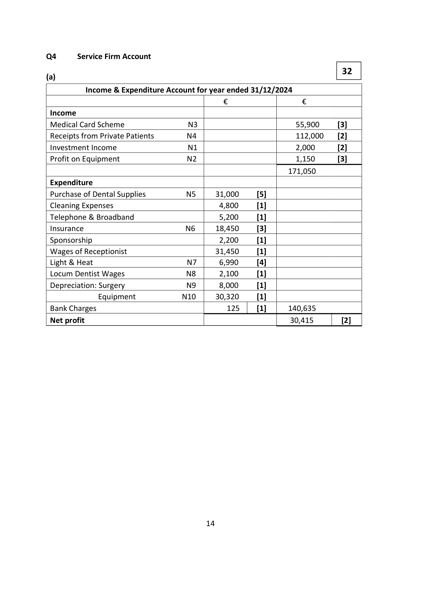
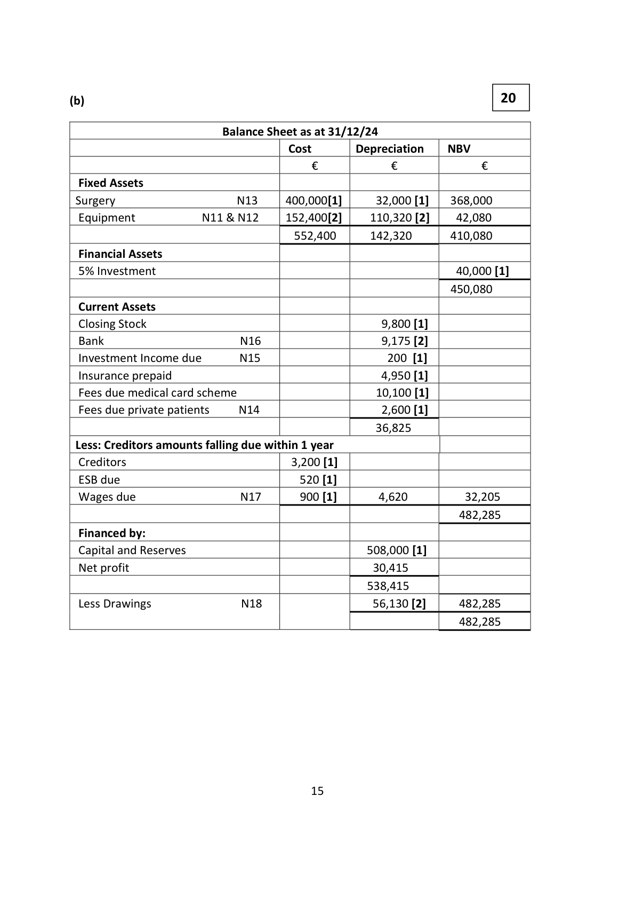
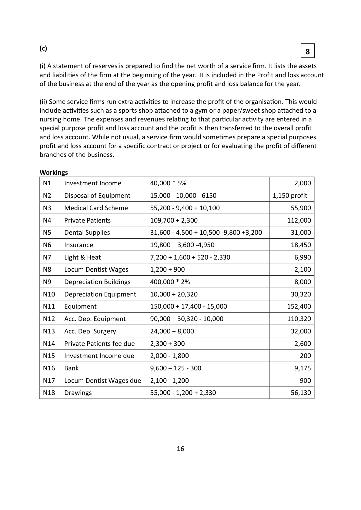
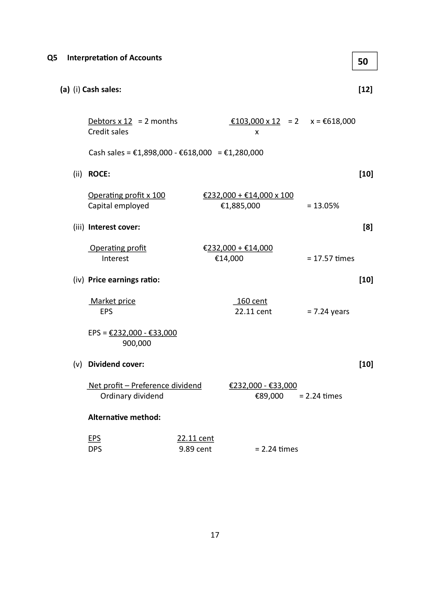

# Question

4.    Service Firm

     The following were included in the assets and liabiliƟes of B. BenneƩ, a denƟst, on
     01/01/2024:

     Surgery at cost €400,000; equipment at cost €150,000; 5% investments €40,000;
      stock of dental supplies €10,500; stock of heaƟng oil €1,600;
      creditors for dental supplies €4,500; fees due from medical card scheme €9,400;
     3 months insurance prepaid €3,600; capital and reserves €508,000.

    The following receipts and payments account had been prepared on the 31/12/2024:

         Receipts and Payments Account of B. BenneƩ for the year ended 31/12/2024

      Receipts                       €     Payments                      €

      Balance at bank 01/01/2024      11,400   Purchase of dental supplies      31,600

      Medical card scheme            55,200   Cleaning expenses               4,800

       Receipts from private paƟents   109,700   Telephone and broadband        5,200

      Investment income               1,800   Insurance (12 months)           19,800
      Equipment 01/05/2024
                                       6,150   Sponsorship                     2,200
       (cost €15,000)
                                       Wages of recepƟonist           31,450

                                                      Light and heat                   7,200
                                           Equipment (purchased
                                                                            17,400
                                             01/05/2024)
                                             Drawings                      55,000

                                               Balance at bank 31/12/2024       9,600

                                   184,250                                184,250

                                           8
Leaving CerƟficate ExaminaƟon 2025
Accounting - Higher Level

<!-- PAGE 9 -->
# Page 9

The following informaƟon and instrucƟons are to be taken into consideraƟon:

    (i)   Stock of dental supplies at 31/12/2024 was €9,800.

    (ii)   The figure for bank has not taken into account bank charges of €125 and a dishonored
       cheque €300 received from a private paƟent and presented to the bank as part of a
       lodgment in late December.

     (iii)  The figure for drawings includes €1,200 for 4 days wages paid to a locum denƟst. The
       locum denƟst is sƟll owed an addiƟonal three days wages.

    (iv)    It is esƟmated that 75% of the light and heat used relates to the surgery and the
        remainder is for BenneƩ’s private residence.

   (v)   DepreciaƟon is to be provided as follows:

            Surgery      2% of cost per annum
           Equipment    20% of cost per annum

        Note: All fixed assets have 3 years’ accumulated depreciaƟon on 01/01/2024.

       The depreciaƟon policy on equipment is to depreciate from date of purchase to date of
          sale.

    (vi)  Fees due from medical card scheme and private paƟents on 31/12/2024 were €10,100
       and €2,300 respecƟvely.
         Creditors for dental supplies were €3,200 and electricity due was €520 on 31/12/2024.

   Required:

   (a)   Prepare an income and expenditure/profit and loss account for the year ended
        31/12/2024.                                                                         (32)

   (b)   Prepare a balance sheet as at 31/12/2024.                                           (20)

   (c)   Explain each of the following and state how they are treated in the accounts of a
         service firm:

            (i)   statement of reserves.
             (ii)   special purpose profit and loss account.                                            (8)

                                                                                (60 marks)

                                           9
Leaving CerƟficate ExaminaƟon 2025
Accounting - Higher Level

<!-- PAGE 10 -->
# Page 10

<!-- HAS_VISUAL: true -->
<!-- VISUAL_REASON: page contains vector drawings; page image extracted because text may not fully capture visual content -->

SECTION 2 (200 Marks)
                              Answer any TWO questions

# Marking Scheme

4. DepreciaƟon will not be understated and therefore profits will not be overstated.

       (ii)
    The Consistency concept states that accounƟng items must be treated exactly the same
   way from one accounƟng period to the next and if you change a policy, you must give the
    reason for this change, and the effect of the change on profit.
     In this quesƟon the buildings are being depreciated on a straight-line basis each year at 2%
    per annum.

                                     13

<!-- PAGE 15 -->
# Page 15

<!-- HAS_VISUAL: true -->
<!-- VISUAL_REASON: page contains vector drawings; page image extracted because text may not fully capture visual content -->

Q4      Service Firm Account

                                                           32
(a)

         Income & Expenditure Account for year ended 31/12/2024
                                         €                 €
 Income
 Medical Card Scheme             N3                         55,900      [3]
 Receipts from Private Patients       N4                         112,000    [2]
 Investment Income              N1                         2,000       [2]
 Profit on Equipment              N2                          1,150       [3]
                                                             171,050
 Expenditure
 Purchase of Dental Supplies        N5     31,000     [5]
 Cleaning Expenses                           4,800      [1]
 Telephone & Broadband                      5,200      [1]
 Insurance                     N6     18,450     [3]
 Sponsorship                                 2,200      [1]
 Wages of Receptionist                      31,450     [1]
 Light & Heat                   N7      6,990      [4]
 Locum Dentist Wages            N8      2,100      [1]
 Depreciation: Surgery            N9      8,000      [1]
            Equipment          N10     30,320     [1]
 Bank Charges                              125     [1]     140,635
 Net profit                                                    30,415        [2]

                                     14

<!-- PAGE 16 -->
# Page 16

<!-- HAS_VISUAL: true -->
<!-- VISUAL_REASON: page contains vector drawings; page image extracted because text may not fully capture visual content -->

(b)                                                       20

                          Balance Sheet as at 31/12/24
                                      Cost        Depreciation   NBV
                                     €           €             €
  Fixed Assets
 Surgery                 N13     400,000[1]      32,000 [1]    368,000
 Equipment         N11 & N12     152,400[2]     110,320 [2]    42,080
                                     552,400      142,320      410,080
  Financial Assets
 5% Investment                                                   40,000 [1]
                                                               450,080
  Current Assets
  Closing Stock                                        9,800 [1]
 Bank                   N16                     9,175 [2]
  Investment Income due     N15                    200 [1]
  Insurance prepaid                                    4,950 [1]
  Fees due medical card scheme                       10,100 [1]
  Fees due private patients    N14                     2,600 [1]
                                                    36,825
 Less: Creditors amounts falling due within 1 year
  Creditors                            3,200 [1]
 ESB due                            520 [1]
 Wages due               N17      900 [1]       4,620          32,205
                                                                 482,285
 Financed by:
  Capital and Reserves                              508,000 [1]
 Net profit                                         30,415
                                                  538,415
  Less Drawings             N18                   56,130 [2]     482,285
                                                                 482,285

                                     15

<!-- PAGE 17 -->
# Page 17

<!-- HAS_VISUAL: true -->
<!-- VISUAL_REASON: page contains vector drawings; page image extracted because text may not fully capture visual content -->

(c)                                                              8

(i) A statement of reserves is prepared to find the net worth of a service firm. It lists the assets
and liabiliƟes of the firm at the beginning of the year.  It is included in the Profit and loss account
of the business at the end of the year as the opening profit and loss balance for the year.

(ii) Some service firms run extra acƟviƟes to increase the profit of the organisaƟon. This would
include acƟviƟes such as a sports shop aƩached to a gym or a paper/sweet shop aƩached to a
nursing home. The expenses and revenues relaƟng to that parƟcular acƟvity are entered in a
special purpose profit and loss account and the profit is then transferred to the overall profit
and loss account. While not usual, a service firm would someƟmes prepare a special purposes
profit and loss account for a specific contract or project or for evaluaƟng the profit of different
branches of the business.

Workings
 N1    Investment Income         40,000 * 5%                                 2,000

 N2    Disposal of Equipment      15,000 - 10,000 - 6150                 1,150 profit

 N3    Medical Card Scheme       55,200 - 9,400 + 10,100                     55,900

 N4    Private Patients            109,700 + 2,300                          112,000

 N5    Dental Supplies            31,600 - 4,500 + 10,500 -9,800 +3,200         31,000

 N6    Insurance                 19,800 + 3,600 -4,950                       18,450

 N7    Light & Heat               7,200 + 1,600 + 520 - 2,330                   6,990

 N8   Locum Dentist Wages       1,200 + 900                                 2,100

 N9    Depreciation Buildings      400,000 * 2%                                8,000

 N10   Depreciation Equipment    10,000 + 20,320                            30,320

 N11   Equipment                150,000 + 17,400 - 15,000                  152,400

 N12   Acc. Dep. Equipment       90,000 + 30,320 - 10,000                   110,320

 N13   Acc. Dep. Surgery          24,000 + 8,000                             32,000

 N14   Private Patients fee due     2,300 + 300                                 2,600

 N15   Investment Income due     2,000 - 1,800                              200

 N16   Bank                      9,600 – 125 - 300                            9,175

 N17  Locum Dentist Wages due   2,100 - 1,200                              900

 N18   Drawings                 55,000 - 1,200 + 2,330                      56,130

                                     16

<!-- PAGE 18 -->
# Page 18

<!-- HAS_VISUAL: true -->
<!-- VISUAL_REASON: page contains vector drawings; page image extracted because text may not fully capture visual content -->

# Source References

Exam paper:
- file: intermediate_markdown/exam_papers/higher/accounting_higher_2025_paper_1_exam.md
- pages: [9, 10]

Marking scheme:
- file: intermediate_markdown/marking_schemes/higher/accounting_higher_2025_paper_1_marking_scheme.md
- pages: [15, 16, 17, 18]

# Notes

