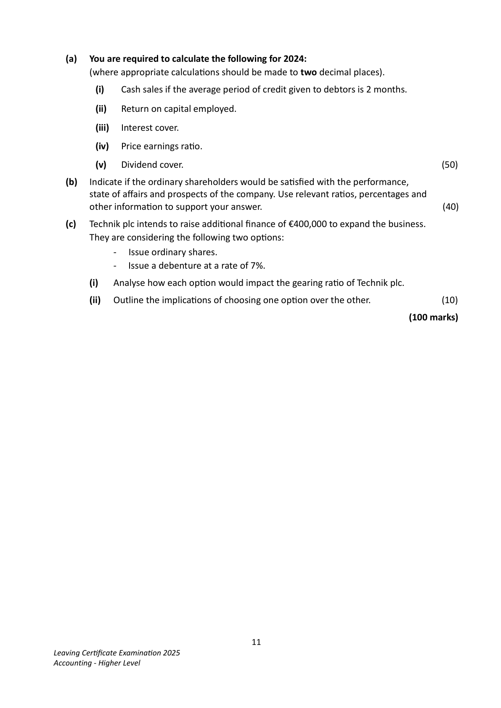
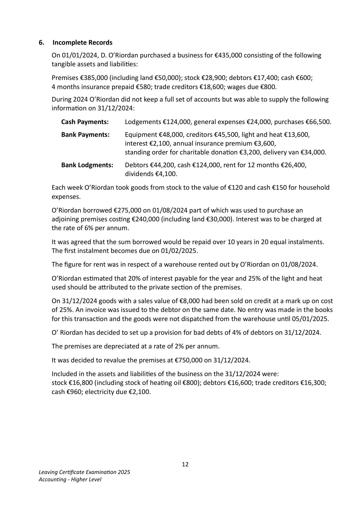
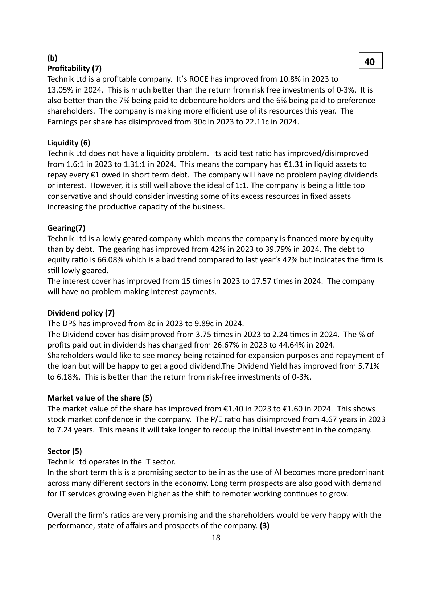
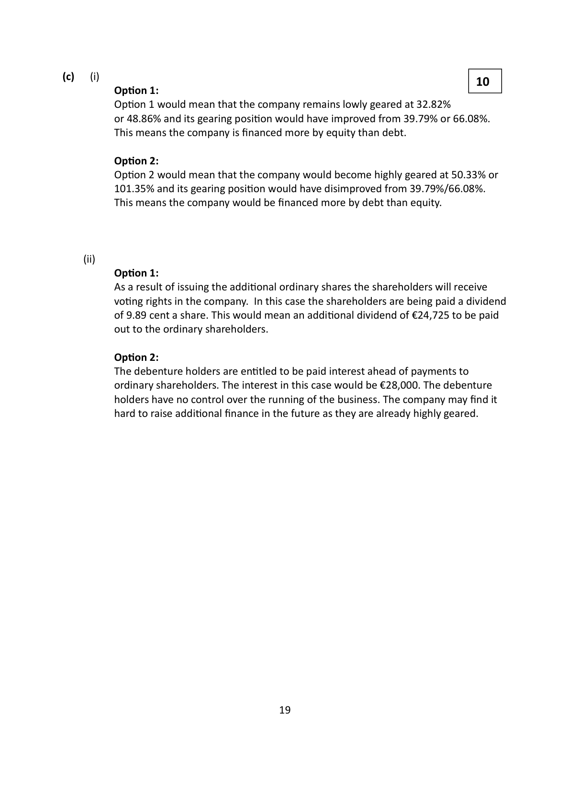
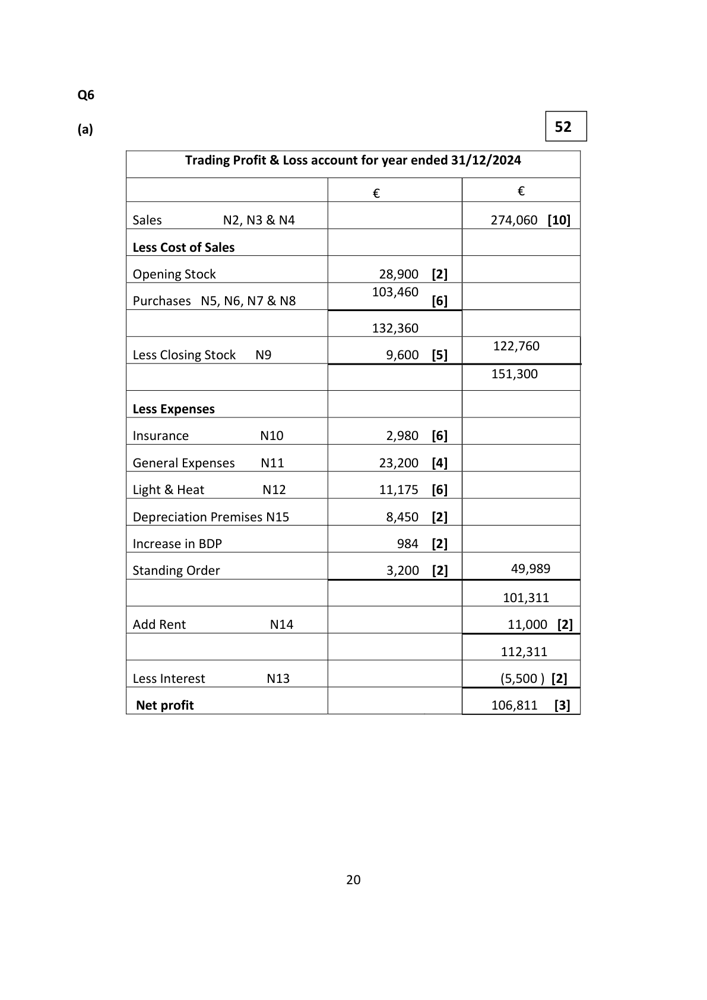

# Question

5.    InterpretaƟon of Accounts
     The following figures have been taken from the final accounts of Technik plc, a company in
     the IT sector, for the year ended 31/12/2024. The company has an authorised share capital of
     €2,000,000 made up of 1,300,000 ordinary shares of €1 each and 700,000 6% preference shares
      of €1 each. The firm has already issued 900,000 ordinary shares and 550,000 6% preference
      shares.
    Trading and Profit and Loss account for the year                                                     RaƟos and informaƟon
              ended 31/12/2024:                                                                  for year ended 31/12/2023
                           €        €
    Sales                              1,898,000     Earnings per ordinary share        30c
   Opening stock           102,500                 Dividend per ordinary share          8c
    Closing stock            127,500                    Interest cover               15 Ɵmes
    Cost of goods sold                  (1,440,000)     Acid test raƟo                      1.6:1
                                                     Dividend cover              3.75 Ɵmes   OperaƟng expenses for the year       (212,000)
                                                    Return on capital employed      10.8%    Interest for year                       (14,000)
                                                    Gearing                    42%
   Net Profit for year                   232,000
                                                Market value of one ord. share    €1.40
    Dividends paid                       (122,000)
    Retained profit                      110,000
    Profit and loss balance 01/01/2024     125,000
    Profit and loss balance 31/12/2024     235,000

                             Balance Sheet as at 31/12/2024
                                              €           €           €
    Fixed Assets
      Intangible assets                                                      350,000
      Tangible assets                                                        1,150,000
     Investments (market value 31/12/2024 - €225,000)                        200,000
                                                                           1,700,000
    Current Assets (including debtors €103,000)                  369,500
    Less Creditors: amounts falling due within 1 year
     Trade creditors                             116,600
     Bank overdraŌ                               67,900     (184,500)       185,000
                                                                           1,885,000
   Financed by:
    7% Debentures                                                       200,000
    Capital and Reserves
     Ordinary shares of €1 each                               900,000
    6% preference shares of €1 each                          550,000
     Profit and loss balance                                   235,000      1,685,000
                                                                           1,885,000

  Market value of one ordinary share on 31/12/2024 is €1.60

                                          10
Leaving CerƟficate ExaminaƟon 2025
Accounting - Higher Level

<!-- PAGE 11 -->
# Page 11

<!-- HAS_VISUAL: true -->
<!-- VISUAL_REASON: text contains visual keywords: line; page image extracted because text may not fully capture visual content -->

(a)  You are required to calculate the following for 2024:
       (where appropriate calculaƟons should be made to two decimal places).

              (i)   Cash sales if the average period of credit given to debtors is 2 months.

               (ii)   Return on capital employed.

               (iii)   Interest cover.

            (iv)   Price earnings raƟo.

           (v)   Dividend cover.                                                               (50)

   (b)   Indicate if the ordinary shareholders would be saƟsfied with the performance,
         state of affairs and prospects of the company. Use relevant raƟos, percentages and
        other informaƟon to support your answer.                                            (40)

   (c)   Technik plc intends to raise addiƟonal finance of €400,000 to expand the business.
       They are considering the following two opƟons:
                   -   Issue ordinary shares.
                   -   Issue a debenture at a rate of 7%.

            (i)   Analyse how each opƟon would impact the gearing raƟo of Technik plc.

             (ii)   Outline the implicaƟons of choosing one opƟon over the other.                 (10)

                                                                             (100 marks)

                                          11
Leaving CerƟficate ExaminaƟon 2025
Accounting - Higher Level

<!-- PAGE 12 -->
# Page 12

<!-- HAS_VISUAL: true -->
<!-- VISUAL_REASON: text contains visual keywords: table; page image extracted because text may not fully capture visual content -->

# Marking Scheme

Q5   InterpretaƟon of Accounts                                                             50

    (a) (i) Cash sales:                                                                  [12]

          Debtors x 12 = 2 months             €103,000 x 12  = 2   x = €618,000
            Credit sales                                  x

          Cash sales = €1,898,000 - €618,000 = €1,280,000

           (ii) ROCE:                                                                     [10]

         OperaƟng profit x 100         €232,000 + €14,000 x 100
            Capital employed                  €1,885,000           = 13.05%

            (iii) Interest cover:                                                                   [8]

          OperaƟng profit              €232,000 + €14,000
                Interest                     €14,000               = 17.57 Ɵmes

         (iv) Price earnings raƟo:                                                       [10]

          Market price                       160 cent
             EPS                               22.11 cent        = 7.24 years

          EPS = €232,000 - €33,000
                   900,000

        (v) Dividend cover:                                                            [10]

          Net profit – Preference dividend       €232,000 - €33,000
              Ordinary dividend                      €89,000    = 2.24 Ɵmes

          AlternaƟve method:

          EPS                   22.11 cent
         DPS                    9.89 cent          = 2.24 Ɵmes

                                     17

<!-- PAGE 19 -->
# Page 19

<!-- HAS_VISUAL: true -->
<!-- VISUAL_REASON: page contains vector drawings; text contains visual keywords: table; page image extracted because text may not fully capture visual content -->

(b)                                                              40
Profitability (7)
Technik Ltd is a profitable company. It’s ROCE has improved from 10.8% in 2023 to
13.05% in 2024. This is much beƩer than the return from risk free investments of 0-3%.  It is
also beƩer than the 7% being paid to debenture holders and the 6% being paid to preference
shareholders. The company is making more efficient use of its resources this year. The
Earnings per share has disimproved from 30c in 2023 to 22.11c in 2024.

Liquidity (6)
Technik Ltd does not have a liquidity problem. Its acid test raƟo has improved/disimproved
from 1.6:1 in 2023 to 1.31:1 in 2024. This means the company has €1.31 in liquid assets to
repay every €1 owed in short term debt. The company will have no problem paying dividends
or interest. However, it is sƟll well above the ideal of 1:1. The company is being a liƩle too
conservaƟve and should consider invesƟng some of its excess resources in fixed assets
increasing the producƟve capacity of the business.

Gearing(7)
Technik Ltd is a lowly geared company which means the company is financed more by equity
than by debt. The gearing has improved from 42% in 2023 to 39.79% in 2024. The debt to
equity raƟo is 66.08% which is a bad trend compared to last year’s 42% but indicates the firm is
sƟll lowly geared.
The interest cover has improved from 15 Ɵmes in 2023 to 17.57 Ɵmes in 2024. The company
will have no problem making interest payments.

Dividend policy (7)
The DPS has improved from 8c in 2023 to 9.89c in 2024.
The Dividend cover has disimproved from 3.75 Ɵmes in 2023 to 2.24 Ɵmes in 2024. The % of
profits paid out in dividends has changed from 26.67% in 2023 to 44.64% in 2024.
Shareholders would like to see money being retained for expansion purposes and repayment of
the loan but will be happy to get a good dividend.The Dividend Yield has improved from 5.71%
to 6.18%. This is beƩer than the return from risk-free investments of 0-3%.

Market value of the share (5)
The market value of the share has improved from €1.40 in 2023 to €1.60 in 2024. This shows
stock market confidence in the company. The P/E raƟo has disimproved from 4.67 years in 2023
to 7.24 years. This means it will take longer to recoup the iniƟal investment in the company.

Sector (5)
Technik Ltd operates in the IT sector.
In the short term this is a promising sector to be in as the use of AI becomes more predominant
across many different sectors in the economy. Long term prospects are also good with demand
for IT services growing even higher as the shiŌ to remoter working conƟnues to grow.

Overall the firm’s raƟos are very promising and the shareholders would be very happy with the
performance, state of affairs and prospects of the company. (3)
                                     18

<!-- PAGE 20 -->
# Page 20

<!-- HAS_VISUAL: true -->
<!-- VISUAL_REASON: page contains vector drawings; page image extracted because text may not fully capture visual content -->

(c)     (i)                                                             10
        OpƟon 1:
        OpƟon 1 would mean that the company remains lowly geared at 32.82%
          or 48.86% and its gearing posiƟon would have improved from 39.79% or 66.08%.
           This means the company is financed more by equity than debt.

        OpƟon 2:
        OpƟon 2 would mean that the company would become highly geared at 50.33% or
         101.35% and its gearing posiƟon would have disimproved from 39.79%/66.08%.
           This means the company would be financed more by debt than equity.

       (ii)
        OpƟon 1:
         As a result of issuing the addiƟonal ordinary shares the shareholders will receive
         voƟng rights in the company. In this case the shareholders are being paid a dividend
           of 9.89 cent a share. This would mean an addiƟonal dividend of €24,725 to be paid
          out to the ordinary shareholders.

        OpƟon 2:
         The debenture holders are enƟtled to be paid interest ahead of payments to
           ordinary shareholders. The interest in this case would be €28,000. The debenture
          holders have no control over the running of the business. The company may find it
          hard to raise addiƟonal finance in the future as they are already highly geared.

                                     19

<!-- PAGE 21 -->
# Page 21

<!-- HAS_VISUAL: true -->
<!-- VISUAL_REASON: page contains vector drawings; page image extracted because text may not fully capture visual content -->

# Source References

Exam paper:
- file: intermediate_markdown/exam_papers/higher/accounting_higher_2025_paper_1_exam.md
- pages: [11, 12]

Marking scheme:
- file: intermediate_markdown/marking_schemes/higher/accounting_higher_2025_paper_1_marking_scheme.md
- pages: [19, 20, 21]

# Notes

