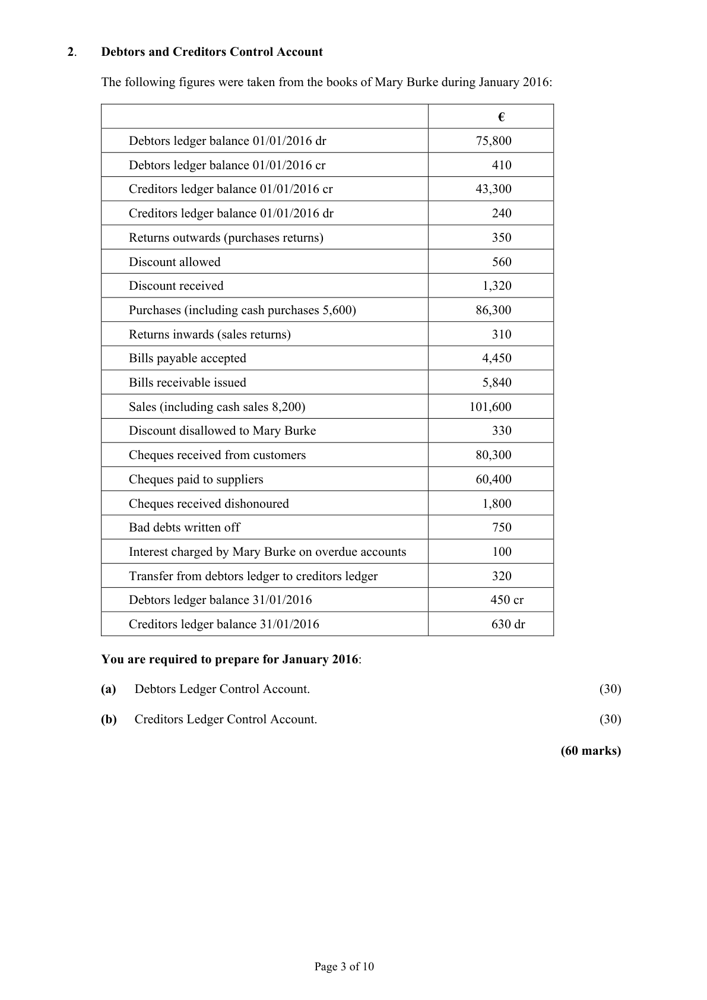
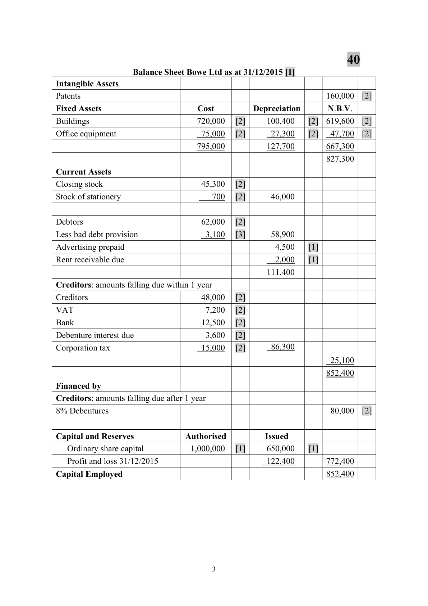
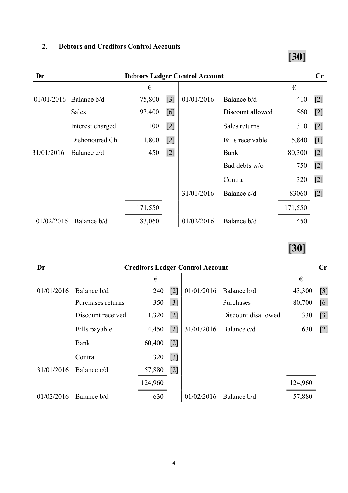

# Question

1.    Final Accounts of a Company

     The following balances were extracted from the books of Bowe Ltd as on 31/12/2015.

                                                                   €              €
          Share capital
             Authorised –  1,000,000 Ordinary Shares at €1 each
              Issued     –   650,000 Ordinary Shares at €1 each                            650,000
           Buildings                                                   720,000
           Office equipment                                              75,000
          Accumulated depreciation – office equipment                                      22,000
          Accumulated depreciation – buildings                                             86,000
           Patents                                                     160,000
           Returns inwards (sales returns)                                    4,800
           Purchases                                                   225,000
           Sales                                                                        560,900
       8% Debentures (issued on 01/04/2015)                                            80,000
          Debtors                                                       62,000
           Creditors                                                                      48,000
          Stock of goods for resale (01/01/2015)                            45,600
          Stock of stationery (01/01/2015)                                   1,200
           Wages/salaries                                               127,100
           Advertising                                                   18,000
           Stationery                                                       6,300
       VAT                                                                            7,200
           Provision for bad debts                                                            4,800
            Light, heat and insurance                                       24,000
         Bank                                                                          12,500
            Directors’ fees                                                 35,300
          Debenture interest                                               1,200
             Profit/loss balance 01/01/2015                                                    22,100
          Rent                                                                          12,000
                                                                       1,505,500        1,505,500

    You are given the following additional information:

        (i)    Stock of goods for resale on 31/12/2015 €45,300.
        (ii)   Stock of stationery on 31/12/2015 €700.
         (iii)   Depreciation to be provided as follows:
             Buildings                  -  2% of cost
             Office equipment         -  10% of book value.
       (iv)  Rent receivable due on 31/12/2015 €2,000.
       (v)   Advertising was for the year ended 31/03/2016.
       (vi)   Provision for bad debts to be adjusted to 5% of debtors.
       (vii)  Provide for debenture interest due on 31/12/2015.
        (viii) Provide for corporation tax €15,000.

     Required:

       (a)   Prepare a trading and profit and loss account for the year ended 31/12/2015.            (80)
      (b)   Prepare a balance sheet as at 31/12/2015.                                              (40)
                                                                                 (120 marks)

                                           Page 2 of 10

<!-- PAGE 3 -->
# Page 3

<!-- HAS_VISUAL: true -->
<!-- VISUAL_REASON: page contains vector drawings; text contains visual keywords: figure; page image extracted because text may not fully capture visual content -->

# Marking Scheme

1.    Final Accounts of a Limited Company                   80

    Trading Profit and Loss Account of Bowe Ltd for the year ended 31/12/2015 [1]
 Sales                                                                560,900 [4]
 Less sales returns                                                          4,800 [4]
                                                                      556,100
 Less cost of sales
    Opening stock                                      45,600 [4]
    Purchases                                         225,000 [4]
                                                     270,600
    Closing stock                                       45,300 [4]
 Cost of sales                                                          225,300
 Gross profit                                                          330,800 [4]
 Less Expenses
 Administration [1]
    Stationery                               6,800 [6]
   Wages and salaries                    127,100 [4]
    Light, heat and insurance                24,000 [4]
    Directors’ fees                         35,300 [4]
    Depreciation
     Buildings               14,400 [4]
      Office equipment         5,300 [4]     19,700      212,900

 Selling and Distribution [1]
    Advertising                           13,500 [6]     13,500         226,400
                                                                      104,400
 Add operating income
    Rent received                                                        14,000 [3]
    Decrease in bad debt provision                                           1,700 [4]
 Operating profit                                                       120,100
    Less debenture interest                                                  4,800 [6]
 Net profit for the year                                                 115,300
    Less taxation                                                        15,000 [3]
                                                                      100,300
 Add profit and loss balance 01/01/2015                                    22,100 [3]
 Profit and loss balance at 31/12/2015                                   122,400 [2]

                                             2

<!-- PAGE 5 -->
# Page 5

<!-- HAS_VISUAL: true -->
<!-- VISUAL_REASON: page contains vector drawings; page image extracted because text may not fully capture visual content -->

40
                  Balance Sheet Bowe Ltd as at 31/12/2015 [1]
Intangible Assets
Patents                                                             160,000  [2]
Fixed Assets                       Cost          Depreciation       N.B.V.
Buildings                           720,000   [2]     100,400    [2]  619,600  [2]
Office equipment                     75,000   [2]      27,300    [2]   47,700  [2]
                                   795,000          127,700        667,300
                                                                    827,300
Current Assets
Closing stock                         45,300   [2]
Stock of stationery                     700   [2]      46,000

Debtors                              62,000   [2]
Less bad debt provision                 3,100   [3]      58,900
Advertising prepaid                                       4,500    [1]
Rent receivable due                                       2,000    [1]
                                                     111,400
Creditors: amounts falling due within 1 year
Creditors                             48,000   [2]
VAT                                  7,200   [2]
Bank                                12,500   [2]
Debenture interest due                  3,600   [2]
Corporation tax                       15,000   [2]      86,300
                                                                     25,100
                                                                    852,400
Financed by
Creditors: amounts falling due after 1 year
8% Debentures                                                        80,000  [2]

Capital and Reserves            Authorised          Issued
   Ordinary share capital            1,000,000   [1]     650,000    [1]
   Profit and loss 31/12/2015                           122,400        772,400
Capital Employed                                                   852,400

                                           3

<!-- PAGE 6 -->
# Page 6

<!-- HAS_VISUAL: true -->
<!-- VISUAL_REASON: page contains vector drawings; page image extracted because text may not fully capture visual content -->

# Source References

Exam paper:
- file: intermediate_markdown/exam_papers/ordinary/accounting_ordinary_2016_paper_1_exam.md
- pages: [3]

Marking scheme:
- file: intermediate_markdown/marking_schemes/ordinary/accounting_ordinary_2016_paper_1_marking_scheme.md
- pages: [5, 6]

# Notes

