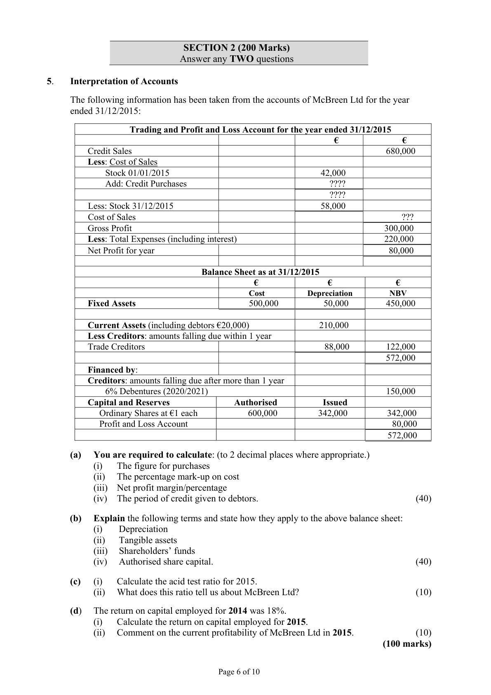

# Question

4.    Tabular Statement

     The following balance sheet shows the financial position of a sole trader, Brendan Boyle,
      as at 01/01/2016.

                                   Balance Sheet as at 01/01/2016

        Fixed Assets                            €                 €             €
             Buildings                                            450,000
            Machinery                                             82,000
                                                                                 532,000
        Current Assets
             Stock                                                  32,000
             Debtors                                                28,000
           Bank                                                  30,500
                                                                   90,500
        Less Creditors: amounts falling due within 1 year
              Creditors                               24,000
            Rent due                                 3,500          27,500
                                                                                   63,000
                                                                                 595,000
        Financed by:
              Capital                                               590,000
                Profit/loss account                                        5,000
                                                                                 595,000

      The following transactions took place during January 2016:

       Jan 3    Received from a debtor a cheque for €3,700 in full settlement of a debt of €3,900.

       Jan 7    Purchased goods on credit for €14,200.

       Jan 12   Paid by cheque rent that was due at the beginning of the month.

       Jan 16   Paid, by cheque, a creditor’s account balance of €4,100 and received a discount of €300.

       Jan 19   Sold goods on credit for €8,200, which originally cost €9,200.

       Jan 21  A debtor who owed €600 was declared bankrupt and paid 30c in the €.

       Jan 23   Paid by cheque from business bank account €3,300 for roof repairs to private house.

       Jan 26   Purchased a new warehouse for €170,000. A deposit of €15,000 was paid by cheque
               and the remainder borrowed from Warehouse Finance Ltd.

     Required:

     Record on a tabular statement the effect each of the above transactions had on the relevant assets
     and liabilities.

     Show the total assets and liabilities on 31/01/2016.
                                                                                     (60 marks)

                                           Page 5 of 10

<!-- PAGE 6 -->
# Page 6

<!-- HAS_VISUAL: true -->
<!-- VISUAL_REASON: page contains vector drawings; text contains visual keywords: figure; page image extracted because text may not fully capture visual content -->

SECTION 2 (200 Marks)
                          Answer any TWO questions

# Marking Scheme

[No matching marking scheme section detected.]

# Source References

Exam paper:
- file: intermediate_markdown/exam_papers/ordinary/accounting_ordinary_2016_paper_1_exam.md
- pages: [6]

Marking scheme:
- file: 
- pages: []

# Notes

