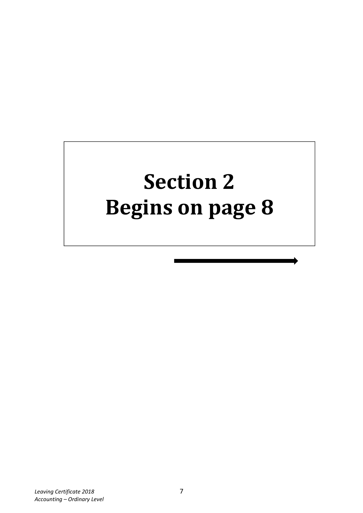
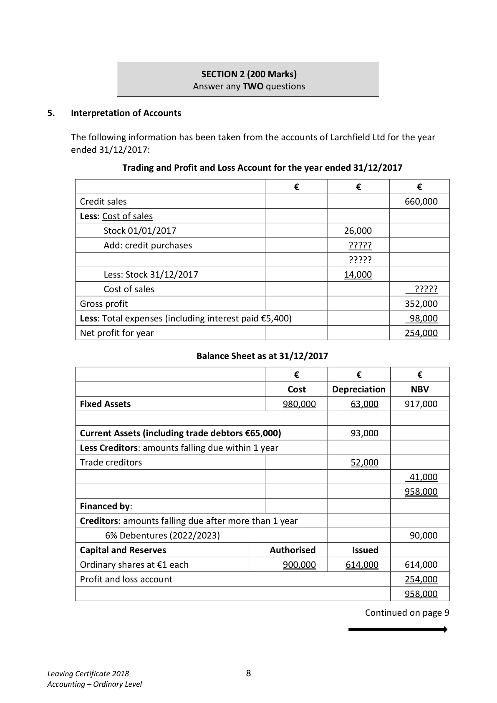

# Question

4.    Tabular Statement

     The following balance sheet shows the financial position of a sole trader, Trevor Kelly, as at
     01/02/2018:

                              Balance Sheet as at 01/02/2018

       Fixed Assets                          €              €            €
            Buildings                                       500,000
            Delivery vans                                     82,000
                                                                        582,000
       Current Assets
           Stock                              52,000
          Debtors                           14,000
          Bank                              41,500       107,500

       Less Creditors: amounts falling due within 1 year
            Creditors                           21,000
          Expenses due                       800        21,800
                                                                          85,700
                                                                        667,700
       Financed by:
            Capital                                         590,000
             Profit/loss account                                   77,700
                                                                        667,700

     The following transactions took place during February 2018:

     Feb 4      Paid by cheque expenses that were due at the beginning of the month.
     Feb 8     Purchased goods on credit for €14,800.
     Feb 13    Purchased a new delivery van for €21,000. A deposit of €4,000 was paid by
              cheque and the remainder borrowed from Surety Finance Ltd.
     Feb 16    Received from a debtor a cheque for €3,200 in full settlement of a debt of
                €4,500.
     Feb 20     Paid by cheque from business bank account €1,600 for roof repairs to private
                 residence.
     Feb 22     Paid by cheque, a creditor’s account balance of €500 and received a discount of
                €120.
     Feb 25   A debtor who owed €400 was declared bankrupt and paid 30c in the €.
     Feb 27     Sold goods on credit for €7,300, which originally cost €8,300.

     Required:

     Record on a tabular statement the effect each of the above transactions had on the relevant
      assets and liabilities.

    Show the total assets and liabilities on 28/02/2018.
                                                                                 (60 marks)

Leaving Certificate 2018                       6
Accounting – Ordinary Level

<!-- PAGE 7 -->
# Page 7

<!-- HAS_VISUAL: true -->
<!-- VISUAL_REASON: page contains vector drawings; text extraction is sparse relative to visible page content; page image extracted because text may not fully capture visual content -->

Section 2
      Begins on page 8

Leaving Certificate 2018                       7
Accounting – Ordinary Level

<!-- PAGE 8 -->
# Page 8

<!-- HAS_VISUAL: true -->
<!-- VISUAL_REASON: page contains vector drawings; page image extracted because text may not fully capture visual content -->

SECTION 2 (200 Marks)
                             Answer any TWO questions

# Marking Scheme

[No matching marking scheme section detected.]

# Source References

Exam paper:
- file: intermediate_markdown/exam_papers/ordinary/accounting_ordinary_2018_paper_1_exam.md
- pages: [7, 8]

Marking scheme:
- file: 
- pages: []

# Notes

