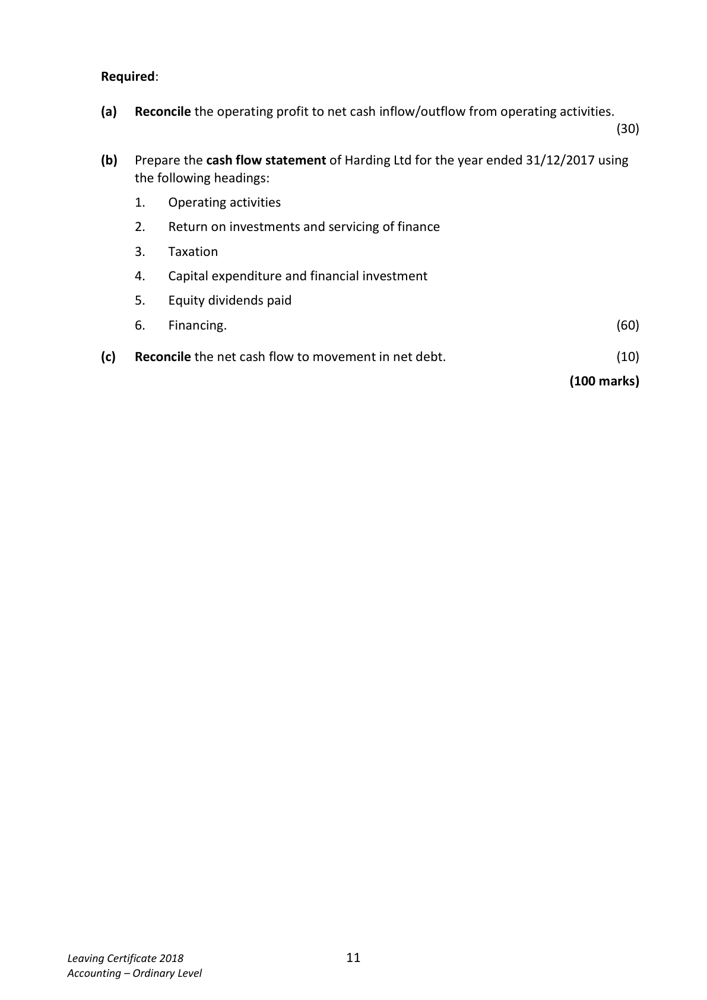
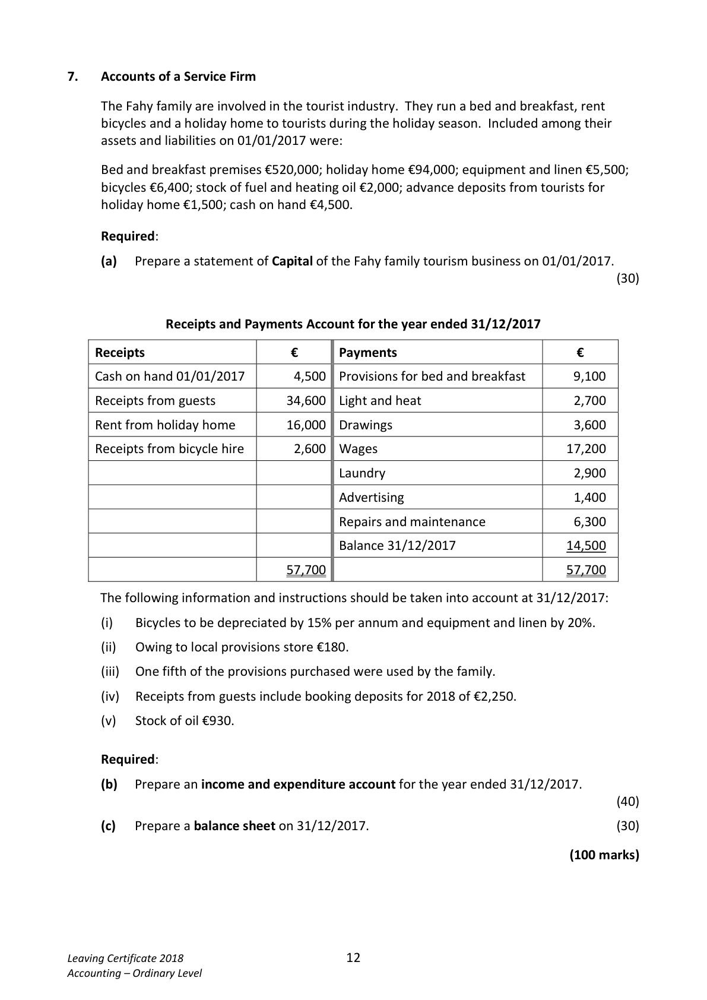

# Question

6.   Cash Flow Statement

     The following information has been extracted from the books of Harding Ltd:

                Profit and loss (extract) for year ended 31/12/2017            €
      Operating profit                                                 85,000
       Interest paid                                                            (5,000)
                                                                      80,000
      Taxation                                                               (7,000)
                                                                      73,000
      Dividends paid                                                         (6,000)
      Retained profit                                                  67,000
        Profit and loss balance 01/01/2017                                 61,000
        Profit and loss balance 31/12/2017                               128,000

      Balance Sheets as at                        31/12/2017         31/12/2016
                                             €        €        €        €
      Fixed Assets
           Land and buildings                  350,000              250,000
            Less depreciation provision            (40,000)   310,000    (28,000)   222,000
      Current Assets
            Stock                               52,000               47,000
           Debtors                             30,000               26,000
           Bank                               22,000               17,000
                                              104,000              90,000
       Less Creditors: amounts falling due within 1 year
             Creditors                            11,000              22,000
            Taxation                              7,000                9,000
                                                   (18,000)              (31,000)
      Net Current Assets                                   86,000               59,000
       Total Net Assets                                   396,000             281,000

      Financed by
       Creditors: amounts falling due after 1 year
         7% Debentures                               105,000               95,000
       Capital and Reserves
            Ordinary share capital issued                   148,000             119,000
           Share premium                                 15,000                6,000
              Profit and loss account                         128,000               61,000
                                                        396,000             281,000

                                                                   Continued on page 11

Leaving Certificate 2018                       10
Accounting – Ordinary Level

<!-- PAGE 11 -->
# Page 11

Required:

      (a)   Reconcile the operating profit to net cash inflow/outflow from operating activities.
                                                                                               (30)

      (b)   Prepare the cash flow statement of Harding Ltd for the year ended 31/12/2017 using
          the following headings:

            1.    Operating activities

            2.   Return on investments and servicing of finance

            3.    Taxation

            4.    Capital expenditure and financial investment

            5.    Equity dividends paid

            6.    Financing.                                                                    (60)

       (c)   Reconcile the net cash flow to movement in net debt.                              (10)

                                                                             (100 marks)

Leaving Certificate 2018                       11
Accounting – Ordinary Level

<!-- PAGE 12 -->
# Page 12

<!-- HAS_VISUAL: true -->
<!-- VISUAL_REASON: page contains vector drawings; text contains visual keywords: line; page image extracted because text may not fully capture visual content -->

# Marking Scheme

[No matching marking scheme section detected.]

# Source References

Exam paper:
- file: intermediate_markdown/exam_papers/ordinary/accounting_ordinary_2018_paper_1_exam.md
- pages: [11, 12]

Marking scheme:
- file: 
- pages: []

# Notes

