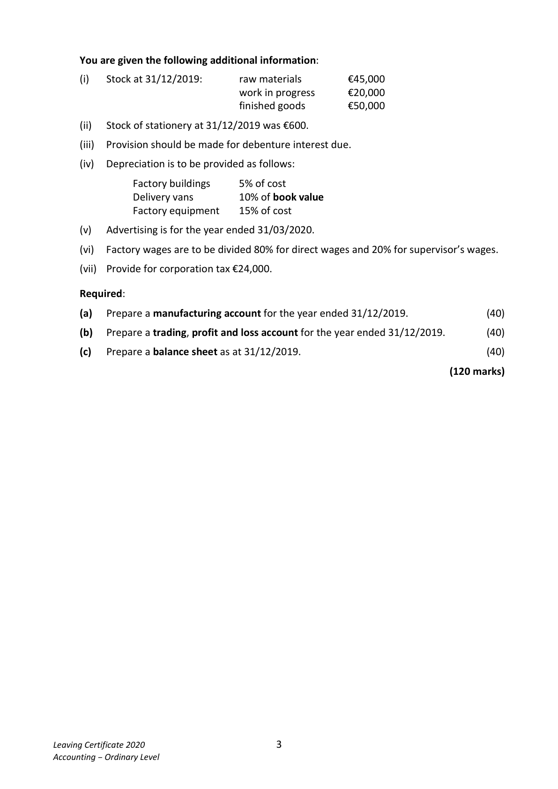
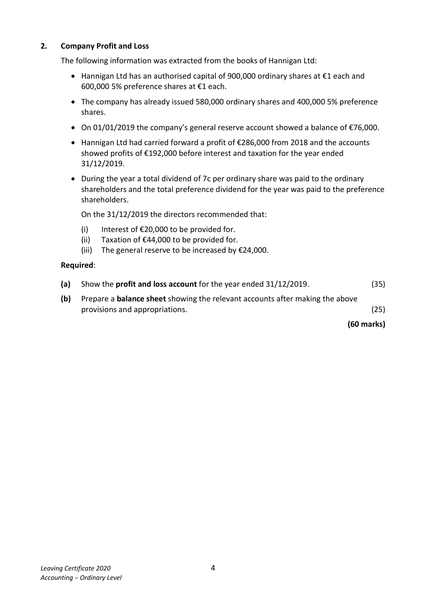
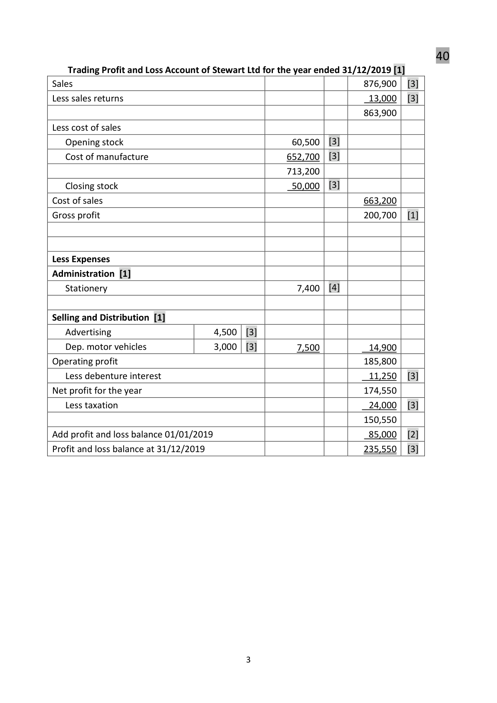
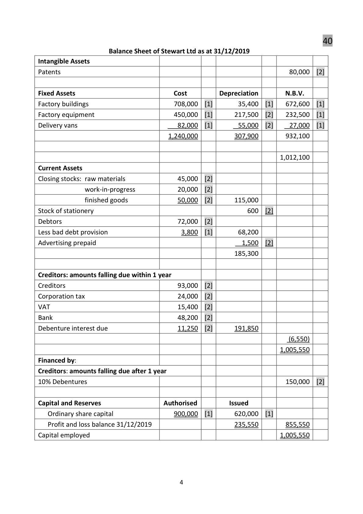
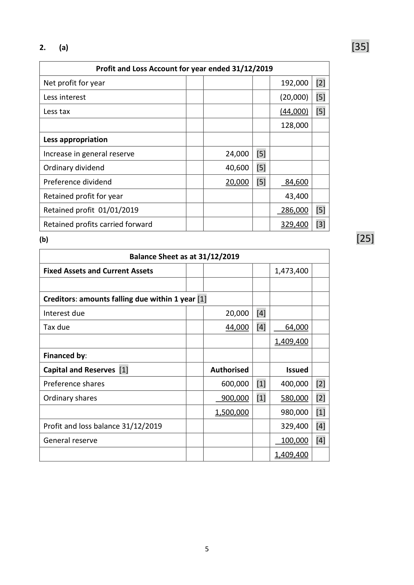
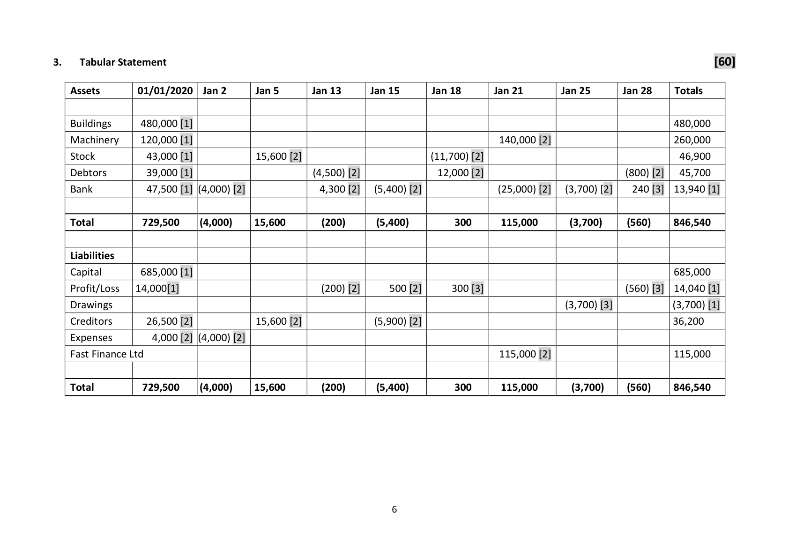

# Question

1.    Final Accounts of a Manufacturing Company

     The following balances were extracted from the books of Stewart Ltd as at 31/12/2019:

                                                       €           €

      Share capital
        Authorised – 900,000 ordinary shares at €1 each
        Issued    – 620,000 ordinary shares at €1 each                    620,000
       Delivery vans (cost €82,000)                            30,000

       Factory equipment (cost €450,000)                     300,000

       Factory buildings                                    708,000

      Patent                                               80,000

      Stock 01/01/2019

       Raw materials                                      50,000

       Work in progress                                   16,400

          Finished goods                                     60,500

      Purchase of raw materials                             380,500

       Sales                                                            876,900

      Returns inwards (sales returns)                          13,000

       Factory light and heat                                  12,400

       Sale of scrap materials                                                6,500

       Stationery                                              8,000

       Factory wages                                       130,000

       Direct expenses                                       17,000

       Advertising                                             6,000

     10% Debentures (issued 01/04/2019)                                150,000

       Creditors                                                          93,000

      Debtors                                              72,000

       Provision for bad debts                                                3,800

     VAT                                                              15,400

       Factory insurance                                     15,000

      Bank                                                             48,200

        Profit and loss balance 01/01/2019                  _________     __85,000

                                                          1,898,800     1,898,800

Leaving Certificate 2020                       2
Accounting – Ordinary Level

<!-- PAGE 3 -->
# Page 3

You are given the following additional information:

         (i)   Stock at 31/12/2019:      raw materials         €45,000
                                work in progress      €20,000
                                         finished goods        €50,000

         (ii)   Stock of stationery at 31/12/2019 was €600.

         (iii)   Provision should be made for debenture interest due.

       (iv)  Depreciation is to be provided as follows:

                Factory buildings    5% of cost
                 Delivery vans       10% of book value
                Factory equipment   15% of cost

       (v)   Advertising is for the year ended 31/03/2020.

       (vi)  Factory wages are to be divided 80% for direct wages and 20% for supervisor’s wages.

        (vii)  Provide for corporation tax €24,000.

     Required:

      (a)   Prepare a manufacturing account for the year ended 31/12/2019.                 (40)

      (b)   Prepare a trading, profit and loss account for the year ended 31/12/2019.         (40)

       (c)   Prepare a balance sheet as at 31/12/2019.                                         (40)

                                                                             (120 marks)

Leaving Certificate 2020                       3
Accounting – Ordinary Level

<!-- PAGE 4 -->
# Page 4

# Marking Scheme

1.    Final Accounts of a Company                                    40

            Manufacturing Account of Stewart Ltd for year ended 31/12/2019 [1]
 Stock raw materials 01/01/2019                                         50,000   [3]
 Purchase of raw materials                                             380,500   [2]
                                                                    430,500
 Less stock of raw materials 31/12/2019                                   45,000   [3]
 Cost of raw materials consumed                                        385,500
 Add factory wages                                                   104,000   [4]
 Add direct expenses                                                    17,000   [2]
 PRIME COST [1]                                                     506,500
 Add Factory Overhead Expenses
       Factory supervisors wages                      26,000   [2]
       Factory insurance                             15,000   [3]
       Factory light and heat                          12,400   [2]
      Dep. factory equipment                        67,500   [3]
      Dep. factory building                           35,400   [3]
 Total expenses                                                      156,300
 Factory Cost                                                        662,800
 Add work-in-progress 01/01/2019                                        16,400   [3]
                                                                    679,200
 Less work-in-progress 31/12/2019                                       20,000   [3]
                                                                    659,200
 Less sale of scrap materials                                                6,500   [3]
 Cost of manufacture                                                  652,700   [2]

                                           2

<!-- PAGE 4 -->
# Page 4

<!-- HAS_VISUAL: true -->
<!-- VISUAL_REASON: page contains vector drawings; page image extracted because text may not fully capture visual content -->

40
    Trading Profit and Loss Account of Stewart Ltd for the year ended 31/12/2019 [1]
Sales                                                              876,900   [3]
Less sales returns                                                     13,000   [3]
                                                                  863,900
Less cost of sales
   Opening stock                                    60,500  [3]
   Cost of manufacture                             652,700  [3]
                                                  713,200
   Closing stock                                     50,000  [3]
Cost of sales                                                       663,200
Gross profit                                                        200,700   [1]

Less Expenses
Administration [1]
   Stationery                                         7,400  [4]

Selling and Distribution [1]
   Advertising                      4,500  [3]
   Dep. motor vehicles               3,000  [3]         7,500           14,900
Operating profit                                                    185,800
   Less debenture interest                                             11,250   [3]
Net profit for the year                                               174,550
   Less taxation                                                      24,000   [3]
                                                                  150,550
Add profit and loss balance 01/01/2019                                 85,000   [2]
Profit and loss balance at 31/12/2019                                  235,550   [3]

                                          3

<!-- PAGE 5 -->
# Page 5

<!-- HAS_VISUAL: true -->
<!-- VISUAL_REASON: page contains vector drawings; page image extracted because text may not fully capture visual content -->

40
                     Balance Sheet of Stewart Ltd as at 31/12/2019
Intangible Assets
Patents                                                                   80,000  [2]

Fixed Assets                              Cost          Depreciation        N.B.V.
Factory buildings                         708,000  [1]       35,400  [1]    672,600  [1]
Factory equipment                       450,000  [1]      217,500  [2]    232,500  [1]
Delivery vans                             82,000  [1]        55,000  [2]     27,000  [1]
                                        1,240,000           307,900        932,100

                                                                         1,012,100
Current Assets
Closing stocks: raw materials               45,000  [2]
               work-in-progress            20,000  [2]
                finished goods               50,000  [2]      115,000
Stock of stationery                                         600  [2]
Debtors                                  72,000  [2]
Less bad debt provision                      3,800  [1]       68,200
Advertising prepaid                                            1,500  [2]
                                                         185,300

Creditors: amounts falling due within 1 year
Creditors                                 93,000  [2]
Corporation tax                           24,000  [2]
VAT                                      15,400  [2]
Bank                                     48,200  [2]
Debenture interest due                     11,250  [2]      191,850
                                                                                   (6,550)
                                                                         1,005,550
Financed by:
Creditors: amounts falling due after 1 year
10% Debentures                                                          150,000  [2]

Capital and Reserves                   Authorised          Issued
   Ordinary share capital                  900,000  [1]      620,000  [1]
   Profit and loss balance 31/12/2019                        235,550        855,550
Capital employed                                                          1,005,550

                                          4

<!-- PAGE 6 -->
# Page 6

<!-- HAS_VISUAL: true -->
<!-- VISUAL_REASON: page contains vector drawings; page image extracted because text may not fully capture visual content -->

2.    (a)                                                               [35]

                 Profit and Loss Account for year ended 31/12/2019
 Net profit for year                                             192,000  [2]
 Less interest                                                       (20,000)  [5]
 Less tax                                                           (44,000)  [5]
                                                             128,000
 Less appropriation
 Increase in general reserve                        24,000  [5]
 Ordinary dividend                               40,600  [5]
 Preference dividend                             20,000  [5]     84,600
 Retained profit for year                                          43,400
 Retained profit 01/01/2019                                    286,000  [5]
 Retained profits carried forward                                 329,400  [3]
(b)                                                                    [25]
                       Balance Sheet as at 31/12/2019
 Fixed Assets and Current Assets                                1,473,400

 Creditors: amounts falling due within 1 year [1]
 Interest due                                    20,000  [4]
 Tax due                                        44,000  [4]     64,000
                                                               1,409,400
 Financed by:
 Capital and Reserves [1]                     Authorised          Issued
 Preference shares                              600,000  [1]    400,000  [2]
 Ordinary shares                                900,000  [1]    580,000  [2]
                                               1,500,000        980,000  [1]
 Profit and loss balance 31/12/2019                              329,400  [4]
 General reserve                                               100,000  [4]
                                                               1,409,400

                                           5

<!-- PAGE 7 -->
# Page 7

<!-- HAS_VISUAL: true -->
<!-- VISUAL_REASON: page contains vector drawings; page image extracted because text may not fully capture visual content -->

# Source References

Exam paper:
- file: intermediate_markdown/exam_papers/ordinary/accounting_ordinary_2020_paper_1_exam.md
- pages: [3, 4]

Marking scheme:
- file: intermediate_markdown/marking_schemes/ordinary/accounting_ordinary_2020_paper_1_marking_scheme.md
- pages: [4, 5, 6, 7]

# Notes

