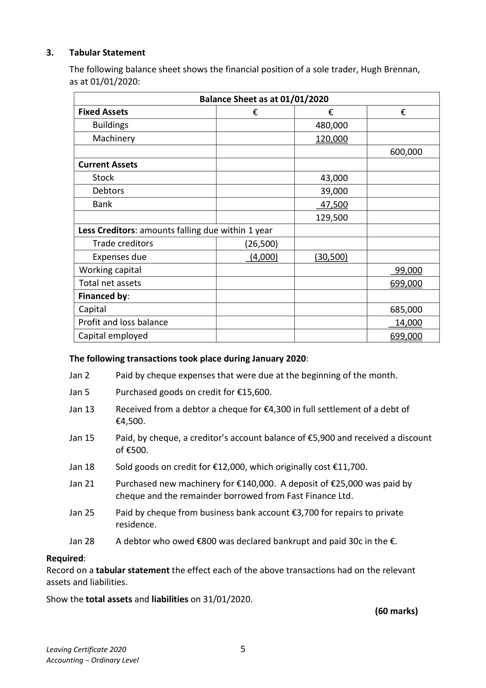

# Question

2.   Company Profit and Loss

     The following information was extracted from the books of Hannigan Ltd:
         Hannigan Ltd has an authorised capital of 900,000 ordinary shares at €1 each and
          600,000 5% preference shares at €1 each.
         The company has already issued 580,000 ordinary shares and 400,000 5% preference
           shares.
         On 01/01/2019 the company’s general reserve account showed a balance of €76,000.
         Hannigan Ltd had carried forward a profit of €286,000 from 2018 and the accounts
         showed profits of €192,000 before interest and taxation for the year ended
          31/12/2019.
          During the year a total dividend of 7c per ordinary share was paid to the ordinary
           shareholders and the total preference dividend for the year was paid to the preference
           shareholders.

        On the 31/12/2019 the directors recommended that:

                 (i)    Interest of €20,000 to be provided for.
                  (ii)   Taxation of €44,000 to be provided for.
                  (iii)  The general reserve to be increased by €24,000.

     Required:

      (a)  Show the profit and loss account for the year ended 31/12/2019.                  (35)

      (b)   Prepare a balance sheet showing the relevant accounts after making the above
           provisions and appropriations.                                                     (25)

                                                                                 (60 marks)

Leaving Certificate 2020                       4
Accounting – Ordinary Level

<!-- PAGE 5 -->
# Page 5

<!-- HAS_VISUAL: true -->
<!-- VISUAL_REASON: page contains vector drawings; page image extracted because text may not fully capture visual content -->

# Marking Scheme

[No matching marking scheme section detected.]

# Source References

Exam paper:
- file: intermediate_markdown/exam_papers/ordinary/accounting_ordinary_2020_paper_1_exam.md
- pages: [5]

Marking scheme:
- file: 
- pages: []

# Notes

