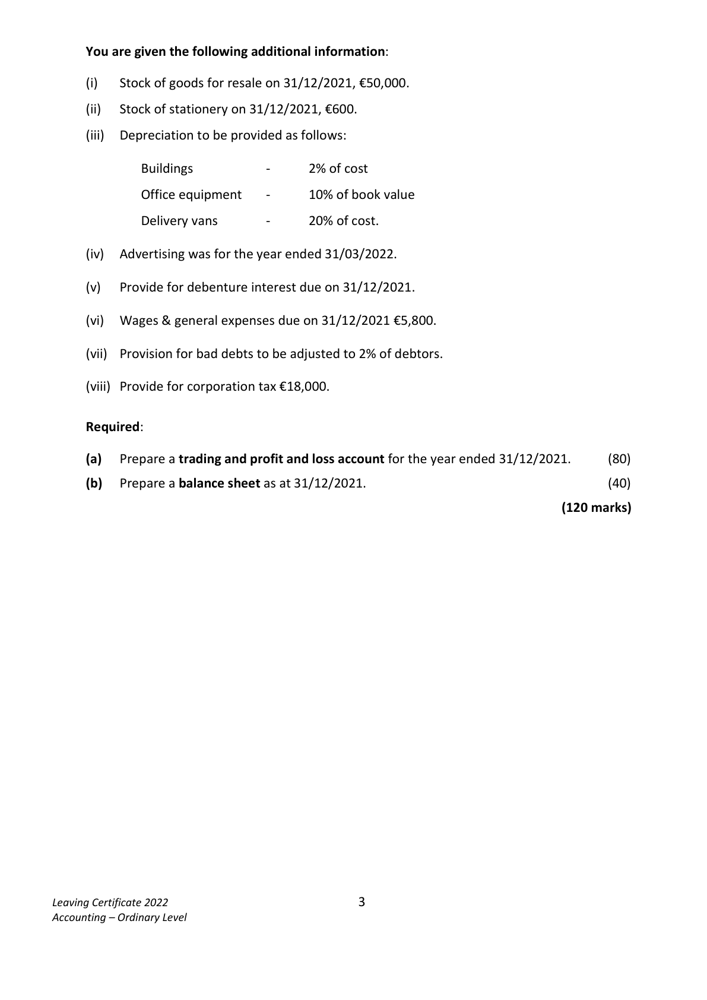
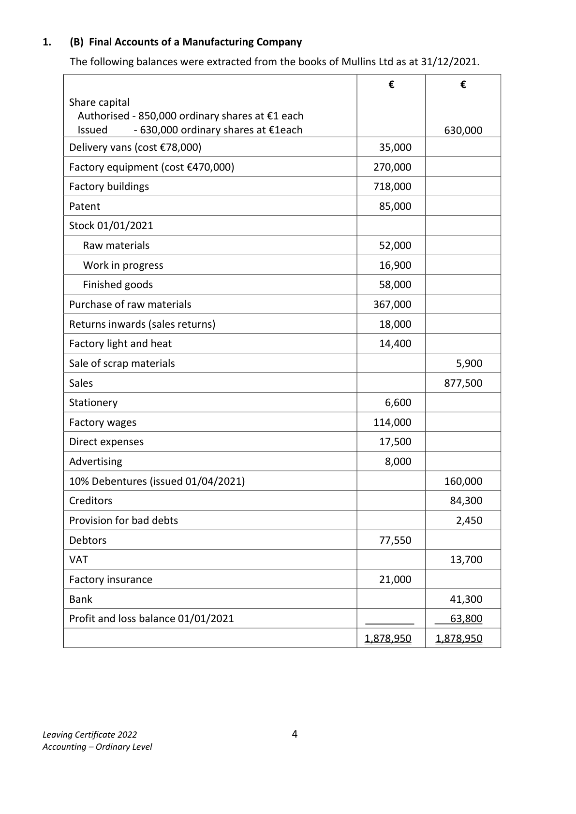
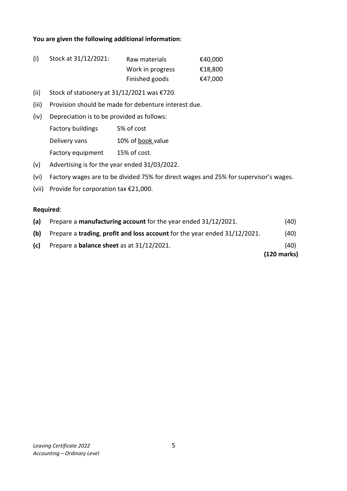
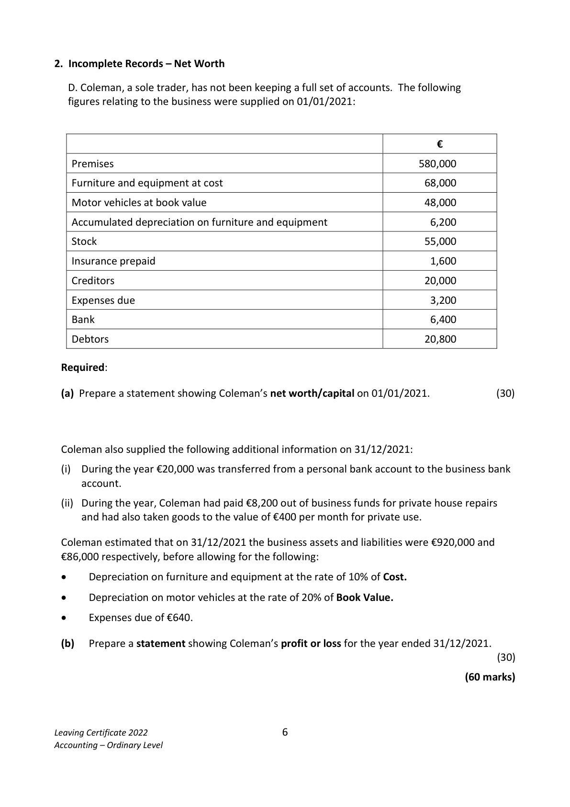

# Question

1.    (A) Final Accounts of a Company

      The following balances were extracted from the books of Dawn Ltd as at 31/12/2021:

                                                        €              €

        Share capital
          Authorised  ‐ 950,000 ordinary shares at €1 each
           Issued        ‐ 500,000 ordinary shares at €1 each                      500,000
         Delivery vans at cost                                   60,000

          Buildings (Cost €620,000)                             595,200

          Office equipment                                     50,000

        Accumulated depreciation of office equipment                            12,000

         Patents                                            120,000

         Stock of goods for resale (01/01/2021)                   80,500

         Stock of stationery (01/01/2021)                          1,500

       Wages & general expenses                            126,400

         Stationery                                              6,200

         Advertising                                           20,600

          Light & heat                                          22,000

         Purchases                                          262,800

         Sales                                                              654,000

         Returns outwards (purchases returns)                                     7,200

         Creditors                                                            65,000

        Debtors                                            145,000

       VAT                                                                   4,000

         Directors fees                                         32,000

         Provision for bad debts                                                  1,300

       10% Debentures (issued 01/04/2021)                                  200,000

        Debenture interest                                    10,200

        Bank                                                                  4,900

          Profit/loss balance 01/01/2021                                         80,000

         Discount                                        ________           4,000

                                                            1,532,400       1,532,400

Leaving Certificate 2022                          2
Accounting – Ordinary Level

<!-- PAGE 3 -->
# Page 3

You are given the following additional information:

        (i)   Stock of goods for resale on 31/12/2021, €50,000.

         (ii)   Stock of stationery on 31/12/2021, €600.

         (iii)  Depreciation to be provided as follows:

               Buildings                 ‐    2% of cost

               Office equipment     ‐     10% of book value

               Delivery vans           ‐     20% of cost.

       (iv)   Advertising was for the year ended 31/03/2022.

       (v)   Provide for debenture interest due on 31/12/2021.

       (vi)  Wages & general expenses due on 31/12/2021 €5,800.

        (vii)  Provision for bad debts to be adjusted to 2% of debtors.

        (viii) Provide for corporation tax €18,000.

     Required:

      (a)   Prepare a trading and profit and loss account for the year ended 31/12/2021.      (80)

      (b)   Prepare a balance sheet as at 31/12/2021.                                          (40)

                                                                              (120 marks)

Leaving Certificate 2022                          3
Accounting – Ordinary Level

<!-- PAGE 4 -->
# Page 4

<!-- HAS_VISUAL: true -->
<!-- VISUAL_REASON: page contains vector drawings; page image extracted because text may not fully capture visual content -->

1.    (B) Final Accounts of a Manufacturing Company

     The following balances were extracted from the books of Mullins Ltd as at 31/12/2021.

                                                           €           €

     Share capital
       Authorised ‐ 850,000 ordinary shares at €1 each
       Issued       ‐ 630,000 ordinary shares at €1each                          630,000
     Delivery vans (cost €78,000)                                 35,000

     Factory equipment (cost €470,000)                         270,000

     Factory buildings                                         718,000

     Patent                                                    85,000

     Stock 01/01/2021

      Raw materials                                           52,000

      Work in progress                                        16,900

        Finished goods                                          58,000

     Purchase of raw materials                                 367,000

     Returns inwards (sales returns)                              18,000

     Factory light and heat                                      14,400

     Sale of scrap materials                                                     5,900

      Sales                                                                877,500

     Stationery                                                   6,600

     Factory wages                                           114,000

      Direct expenses                                            17,500

     Advertising                                                  8,000

    10% Debentures (issued 01/04/2021)                                    160,000

     Creditors                                                               84,300

     Provision for bad debts                                                     2,450

     Debtors                                                   77,550

    VAT                                                                   13,700

     Factory insurance                                          21,000

     Bank                                                                  41,300

      Profit and loss balance 01/01/2021                                        63,800

                                                              1,878,950     1,878,950

Leaving Certificate 2022                          4
Accounting – Ordinary Level

<!-- PAGE 5 -->
# Page 5

<!-- HAS_VISUAL: true -->
<!-- VISUAL_REASON: page contains vector drawings; page image extracted because text may not fully capture visual content -->

You are given the following additional information:

(i)   Stock at 31/12/2021:    Raw materials          €40,000
                        Work in progress        €18,800
                                Finished goods         €47,000

(ii)   Stock of stationery at 31/12/2021 was €720.

(iii)   Provision should be made for debenture interest due.

(iv)  Depreciation is to be provided as follows:

     Factory buildings    5% of cost

      Delivery vans       10% of book value

     Factory equipment   15% of cost.

(v)   Advertising is for the year ended 31/03/2022.

(vi)  Factory wages are to be divided 75% for direct wages and 25% for supervisor’s wages.

(vii)  Provide for corporation tax €21,000.

Required:

(a)   Prepare a manufacturing account for the year ended 31/12/2021.                 (40)

(b)   Prepare a trading, profit and loss account for the year ended 31/12/2021.         (40)

(c)   Prepare a balance sheet as at 31/12/2021.                                        (40)
                                                                        (120 marks)

Leaving Certificate 2022                       5
Accounting – Ordinary Level

<!-- PAGE 6 -->
# Page 6

<!-- HAS_VISUAL: true -->
<!-- VISUAL_REASON: page contains vector drawings; text contains visual keywords: figure; page image extracted because text may not fully capture visual content -->

# Marking Scheme

[No matching marking scheme section detected.]

# Source References

Exam paper:
- file: intermediate_markdown/exam_papers/ordinary/accounting_ordinary_2022_paper_1_exam.md
- pages: [3, 4, 5, 6]

Marking scheme:
- file: 
- pages: []

# Notes

