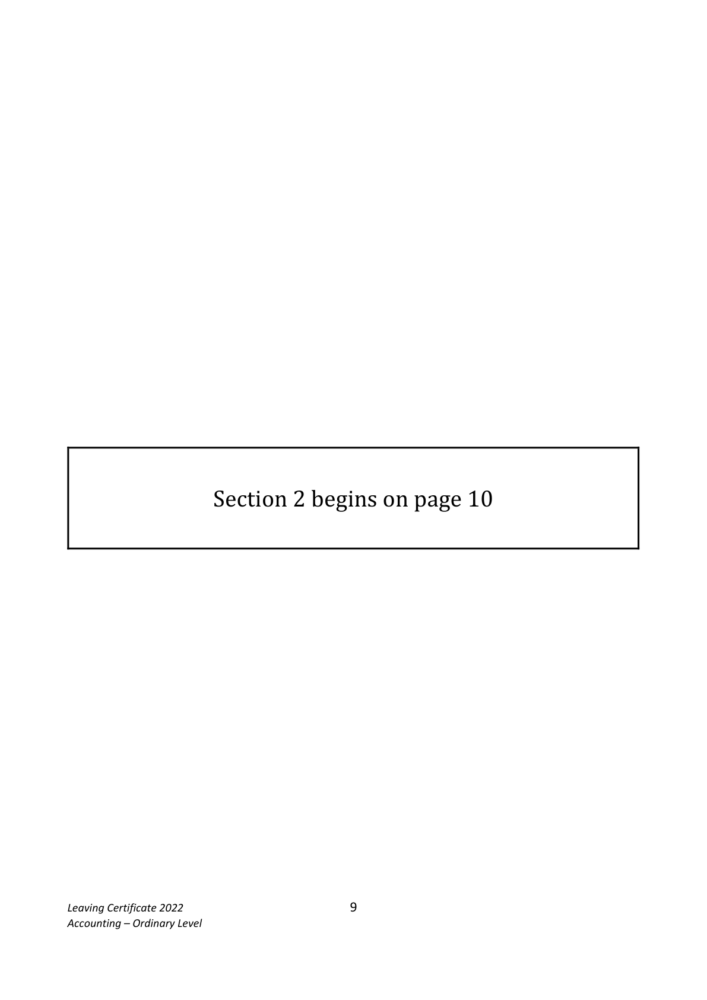
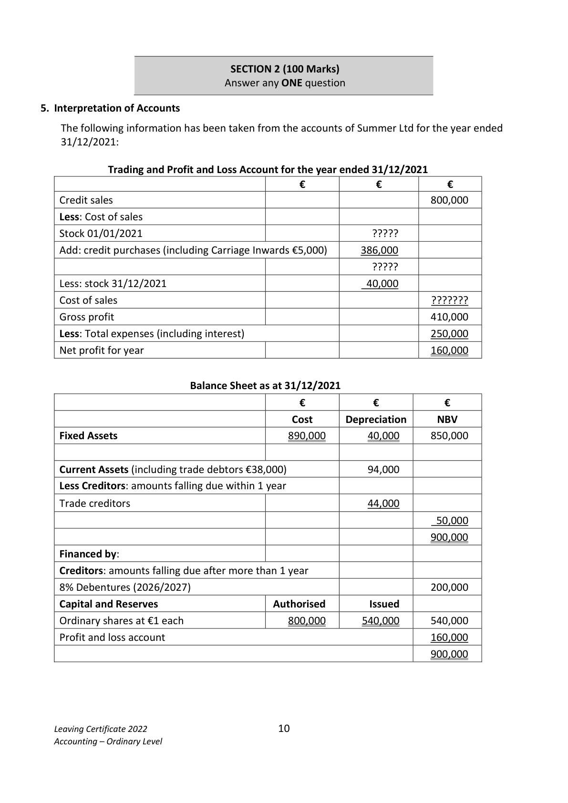

# Question

4. Tabular Statement

The following balance sheet shows the financial position of a sole trader, Gerard
Cunningham, as at 01/03/2022:

  Balance Sheet as at 01/03/2022

 Fixed Assets                                         €              €              €

  Buildings                                                   650,000
 Equipment                                                   78,000
                                                                          728,000
 Current Assets
 Stock                                         52,000
 Debtors                                       31,400
 Bank                                         44,500       127,900

  Less Creditors: amounts falling due within 1 year
 Trade Creditors                                31,000
 Expenses due                                    2,400         33,400         94,500
  Total Net Assets                                                           822,500

 Financed by:
  Capital                                                     750,000
  Profit and loss                                                      72,500
  Capital Employed                                                          822,500

The following transactions took place during March 2022:

Mar 4     Paid by cheque expenses that were due at the beginning of the month.
Mar 6     Purchased goods on credit for €16,200.
Mar 7     Paid by cheque from business bank account €1,400 for house repairs to family member.
Mar 16    Received from a debtor a cheque for €3,400 in full settlement of a debt of €3,900.
Mar 21    Purchased new equipment for €64,000. A deposit of €8,000 was paid by cheque
         and the remainder borrowed from Low Cost Loans Ltd.
Mar 24    Paid by cheque, a creditor’s account balance of €600 and received a discount of €140.
Mar 25   A debtor who owed €4,000 was declared bankrupt and paid 20c in the €.
Mar 27    Sold goods on credit for €8,300, which originally cost €8,000.

Required:

Record on a tabular statement the effect each of the above transactions had on the relevant assets
and liabilities.

Show the total assets and liabilities on 31/03/2022.                               (60 marks)

Leaving Certificate 2022                       8
Accounting – Ordinary Level

<!-- PAGE 9 -->
# Page 9

<!-- HAS_VISUAL: true -->
<!-- VISUAL_REASON: page contains vector drawings; text extraction is sparse relative to visible page content; page image extracted because text may not fully capture visual content -->

Section 2 begins on page 10

Leaving Certificate 2022                       9
Accounting – Ordinary Level

<!-- PAGE 10 -->
# Page 10

<!-- HAS_VISUAL: true -->
<!-- VISUAL_REASON: page contains vector drawings; page image extracted because text may not fully capture visual content -->

SECTION 2 (100 Marks)
                                Answer any ONE question

# Marking Scheme

[No matching marking scheme section detected.]

# Source References

Exam paper:
- file: intermediate_markdown/exam_papers/ordinary/accounting_ordinary_2022_paper_1_exam.md
- pages: [9, 10]

Marking scheme:
- file: 
- pages: []

# Notes

