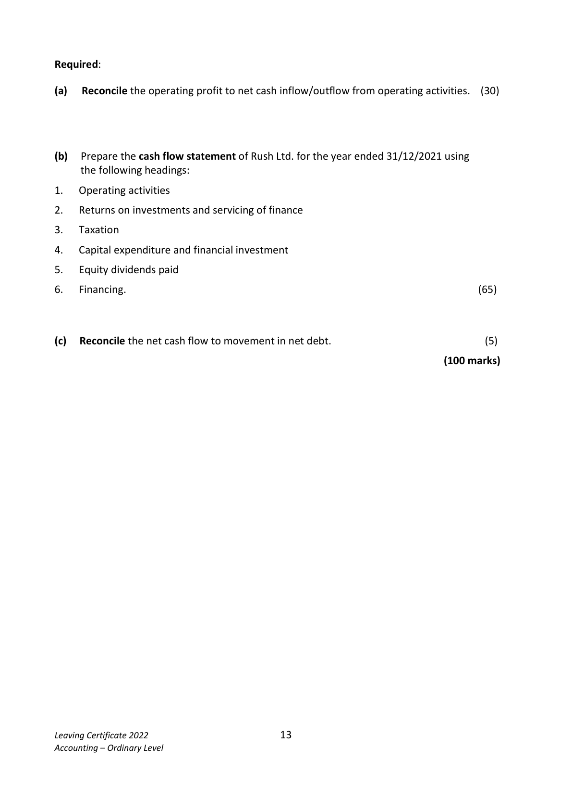
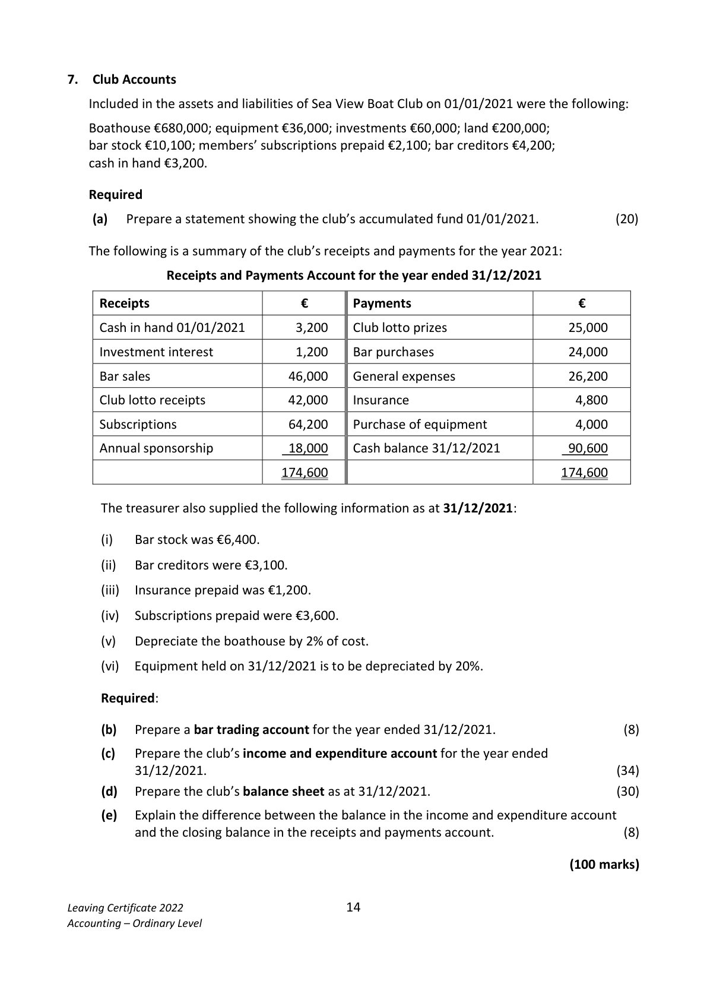

# Question

6.   Cash Flow Statement

     The following information has been extracted from the books of Rush Ltd:

       Profit and loss (extract) for year ended 31/12/2021                  €

      Operating profit                                               156,000
       Interest paid                                                        (20,000)
                                                                   136,000
      Taxation                                                            (24,000)
                                                                   112,000
      Dividends paid                                                      (27,000)
      Retained profit                                                  85,000
        Profit and loss balance 01/01/2021                               120,000
        Profit and loss balance 31/12/2021                               205,000

    Balance Sheets as at                        31/12/2021         31/12/2020
                                           €        €        €        €
    Fixed Assets
        Land and buildings                  840,000              620,000
          Less depreciation provision            (80,000)   760,000    (50,000)   570,000
    Current Assets
         Stock                               80,000               70,000
         Debtors                             25,000               45,000
        Bank                               20,000               15,000
                                           125,000             130,000
    Less Creditors: amounts falling due within 1 year
          Creditors                            42,000              32,000
         Taxation                            24,000              28,000
                                                (66,000)              (60,000)
   Net Current Assets                                   59,000               70,000
    Total Net Assets                                   819,000             640,000

    Financed by
    Creditors: amounts falling due after 1 year
       8% Debentures                               250,000             220,000
    Capital and Reserves
         Ordinary share capital issued                   340,000             300,000
         Share premium                                 24,000                     ‐‐‐‐‐‐‐‐‐‐
           Profit and loss account                         205,000             120,000
                                                     819,000             640,000

Leaving Certificate 2022                       12
Accounting – Ordinary Level

<!-- PAGE 13 -->
# Page 13

Required:

(a)   Reconcile the operating profit to net cash inflow/outflow from operating activities.  (30)

(b)  Prepare the cash flow statement of Rush Ltd. for the year ended 31/12/2021 using
     the following headings:

1.   Operating activities

2.   Returns on investments and servicing of finance

3.   Taxation

4.   Capital expenditure and financial investment

5.   Equity dividends paid

6.   Financing.                                                                           (65)

(c)   Reconcile the net cash flow to movement in net debt.                                    (5)

                                                                          (100 marks)

Leaving Certificate 2022                       13
Accounting – Ordinary Level

<!-- PAGE 14 -->
# Page 14

<!-- HAS_VISUAL: true -->
<!-- VISUAL_REASON: page contains vector drawings; page image extracted because text may not fully capture visual content -->

# Marking Scheme

[No matching marking scheme section detected.]

# Source References

Exam paper:
- file: intermediate_markdown/exam_papers/ordinary/accounting_ordinary_2022_paper_1_exam.md
- pages: [13, 14]

Marking scheme:
- file: 
- pages: []

# Notes

