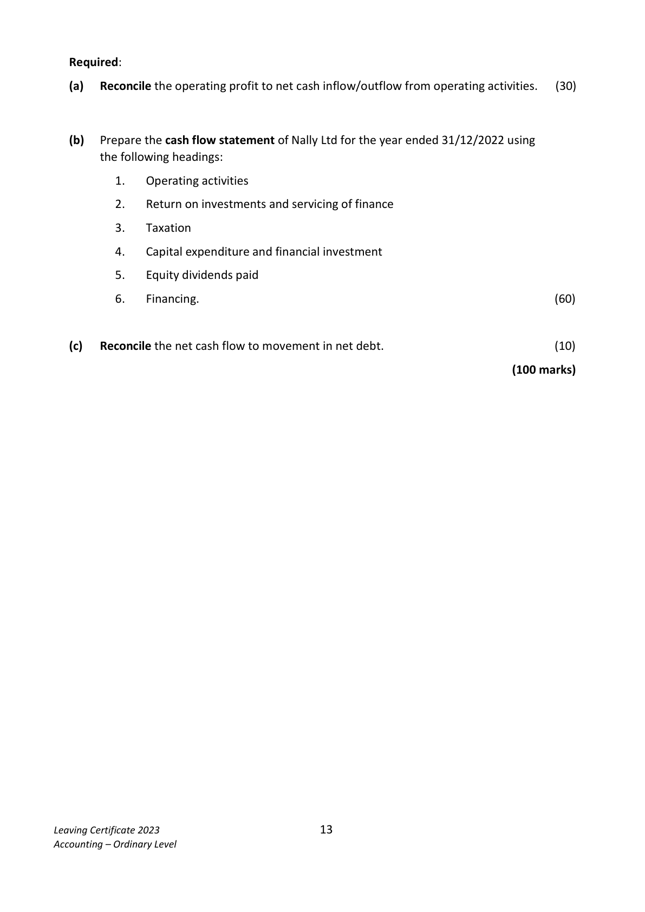
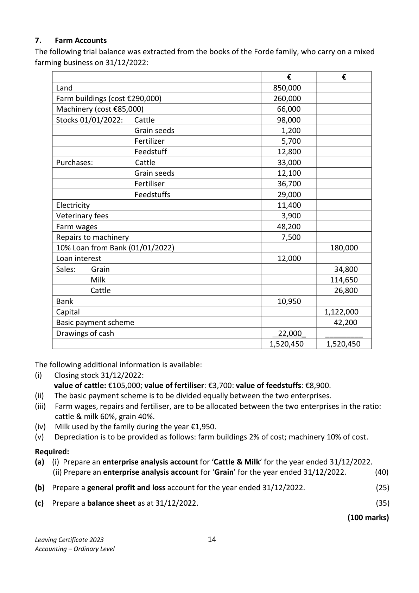

# Question

6.   Cash Flow Statement
     The following information has been extracted from the books of Nally Ltd:

       Profit and Loss (extract) for year ended 31/12/2022              €

      Operating profit                                              155,400
       Interest paid                                                      (16,800)
                                                                  138,600
      Taxation                                                          (38,000)
                                                                  100,600
      Dividends paid                                                     (55,000)
      Retained profit                                                 45,600
       Profit and loss balance 01/01/2022                               44,400
       Profit and loss balance 31/12/2022                               90,000

      Balance Sheets as at                        31/12/2022          31/12/2021
                                             €         €        €        €

       Fixed Assets
      Land and buildings                        750,000             610,000
       Less depreciation provision                 (110,000)   640,000   (88,000)   522,000
      Current Assets
         Stock                                 114,000               93,000
         Debtors                                 84,000               54,000
        Bank                                   76,000               42,000
                                               274,000             189,000
       Less Creditors: amounts falling due within 1 year
          Creditors                                61,000               52,600
         Taxation                                38,000               24,000
                                                    (99,000)               (76,600)
      Net Current Assets                                  175,000             112,400
       Total Net Assets                                    815,000             634,400

      Financed by
       Creditors: amounts falling due after 1 year
       8% Debentures                                   210,000             150,000
       Capital and Reserves
         Ordinary share capital issued                       480,000             440,000
         Share premium                                    35,000
           Profit and loss account                              90,000               44,400
                                                         815,000             634,400

Leaving Certificate 2023                        12
Accounting – Ordinary Level

<!-- PAGE 13 -->
# Page 13

Required:

   (a)   Reconcile the operating profit to net cash inflow/outflow from operating activities.   (30)

   (b)   Prepare the cash flow statement of Nally Ltd for the year ended 31/12/2022 using
        the following headings:

            1.    Operating activities

            2.   Return on investments and servicing of finance

            3.    Taxation

            4.    Capital expenditure and financial investment

            5.    Equity dividends paid

            6.    Financing.                                                                   (60)

   (c)   Reconcile the net cash flow to movement in net debt.                                (10)

                                                                             (100 marks)

Leaving Certificate 2023                        13
Accounting – Ordinary Level

<!-- PAGE 14 -->
# Page 14

<!-- HAS_VISUAL: true -->
<!-- VISUAL_REASON: page contains vector drawings; page image extracted because text may not fully capture visual content -->

# Marking Scheme

6.   Insurance                           13,200 – 800 – 3,100      9,300

6.      Dep – delivery vans          95,000 @ 10%                  9,500

6.     Dep medical equipment       36,000 @ 10%                  3,600

# Source References

Exam paper:
- file: intermediate_markdown/exam_papers/ordinary/accounting_ordinary_2023_paper_1_exam.md
- pages: [13, 14]

Marking scheme:
- file: intermediate_markdown/marking_schemes/ordinary/accounting_ordinary_2023_paper_1_marking_scheme.md
- pages: []

# Notes

