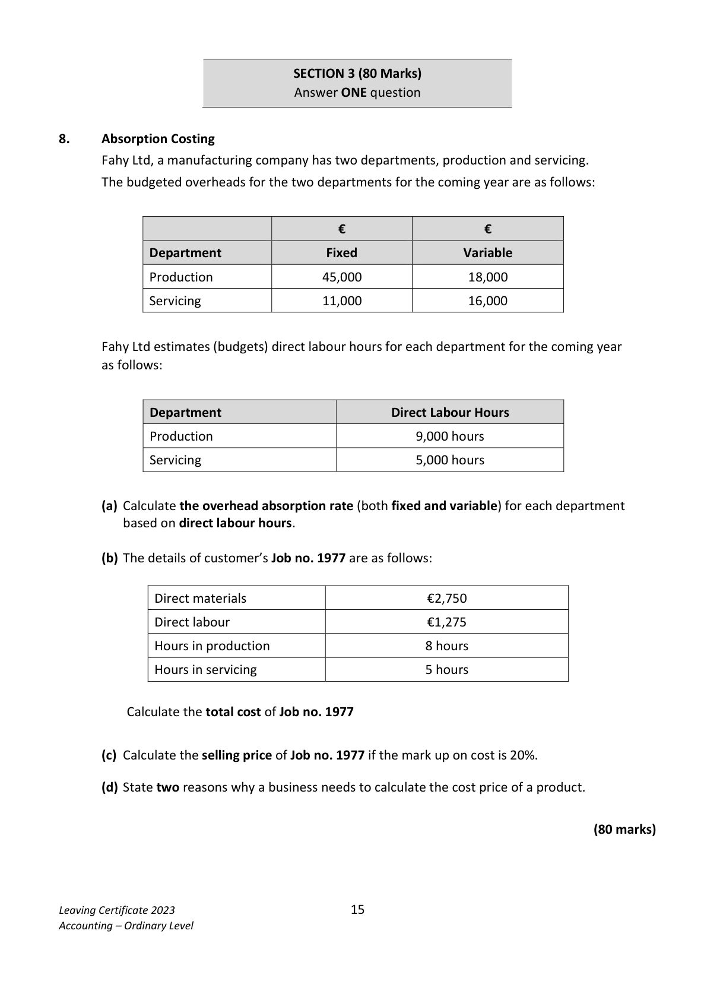
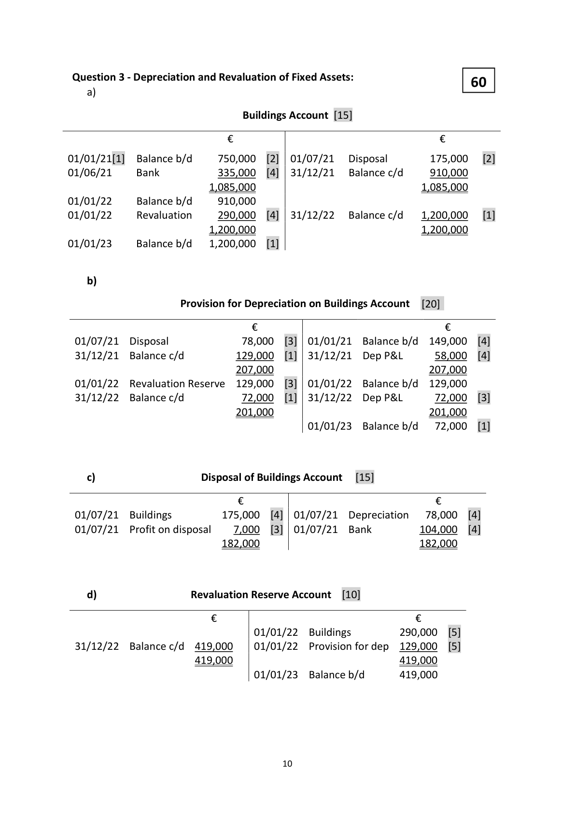
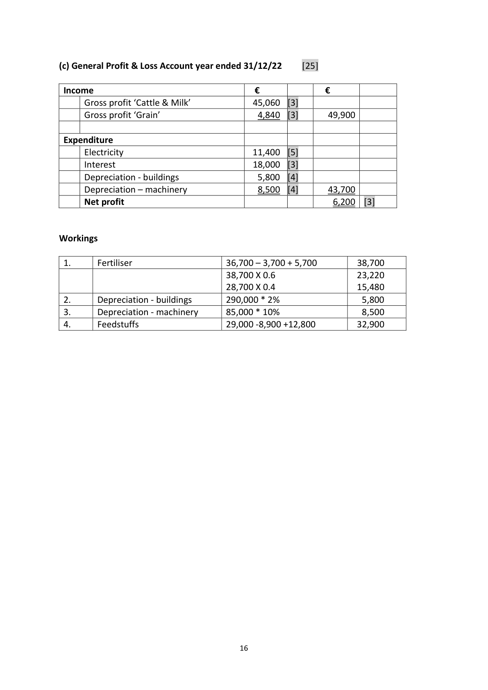

# Question

7.   Farm Accounts
The following trial balance was extracted from the books of the Forde family, who carry on a mixed
farming business on 31/12/2022:

                                                           €            €
     Land                                                   850,000
     Farm buildings (cost €290,000)                            260,000
     Machinery (cost €85,000)                                  66,000
      Stocks 01/01/2022:   Cattle                               98,000
                           Grain seeds                            1,200
                                 Fertilizer                              5,700
                            Feedstuff                            12,800
      Purchases:            Cattle                               33,000
                           Grain seeds                          12,100
                                 Fertiliser                             36,700
                            Feedstuffs                           29,000
       Electricity                                                11,400
      Veterinary fees                                             3,900
     Farm wages                                              48,200
      Repairs to machinery                                        7,500
    10% Loan from Bank (01/01/2022)                                       180,000
     Loan interest                                             12,000
       Sales:    Grain                                                         34,800
               Milk                                                         114,650
                Cattle                                                         26,800
     Bank                                                    10,950
      Capital                                                                1,122,000
      Basic payment scheme                                                   42,200
     Drawings of cash                                         22,000_     _________
                                                              1,520,450      1,520,450

The following additional information is available:
(i)    Closing stock 31/12/2022:
     value of cattle: €105,000; value of fertiliser: €3,700: value of feedstuffs: €8,900.
(ii)  The basic payment scheme is to be divided equally between the two enterprises.
(iii)  Farm wages, repairs and fertiliser, are to be allocated between the two enterprises in the ratio:
      cattle & milk 60%, grain 40%.
(iv)  Milk used by the family during the year €1,950.
(v)   Depreciation is to be provided as follows: farm buildings 2% of cost; machinery 10% of cost.

Required:
(a)   (i) Prepare an enterprise analysis account for ‘Cattle & Milk’ for the year ended 31/12/2022.
        (ii) Prepare an enterprise analysis account for ‘Grain’ for the year ended 31/12/2022.        (40)

(b)  Prepare a general profit and loss account for the year ended 31/12/2022.                     (25)

(c)  Prepare a balance sheet as at 31/12/2022.                                                    (35)

                                                                                 (100 marks)

Leaving Certificate 2023                        14
Accounting – Ordinary Level

<!-- PAGE 15 -->
# Page 15

<!-- HAS_VISUAL: true -->
<!-- VISUAL_REASON: page contains vector drawings; page image extracted because text may not fully capture visual content -->

SECTION 3 (80 Marks)
                                Answer ONE question

# Marking Scheme

7.   Dep - Buildings                      550,000 @2%            11,000

7.        Interest payable            90,000 @10% x9/12             6,750

7.     Dep motor vehicles           48,400 @ 15%                  7,260

                                          9

<!-- PAGE 11 -->
# Page 11

<!-- HAS_VISUAL: true -->
<!-- VISUAL_REASON: page contains vector drawings; page image extracted because text may not fully capture visual content -->

Question 7 – Farm Accounts
                                                    100

(a)   Enterprise Analysis Account “Cows/milk” for the year ended 31/12/2022  [20]

  Income                                  €             €
        Sale of milk                           114,650  [2]
        Sale of cattle                            26,800  [2]
        Basic Payment                          21,100  [2]
       Drawings                                1,950  [2]
        Increase in stock                          7,000  [1]      171,500

   Expenditure
          Fertilizer                               23,220  [2]
        Feedstuff                               32,900  [2]
       Vet fees                                 3,900  [1]
         Cattle                                  33,000  [1]
        Repairs                                  4,500  [1]
      Wages                                 28,920  [2]      126,440
       Gross profit ‘Cattle & Milk’                                45,060 [2]

     (b)(ii)Enterprise Analysis Account “Grain” for the year ended 31/12/2022  [20]
  Income                                 €             €
       Sale of grain                            34,800  [3]
       Single farm payment                     21,100  [3]    55,900

   Expenditure
        Fertilizer                               15,480  [3]
      Decrease in stock                         1,200  [3]
      Seed                                   12,100  [2]
       Repairs                                  3,000  [2]
     Wages                                 19,280  [2]       51,060
      Gross profit Grain’                                         4,840 [2]

                                             15

<!-- PAGE 17 -->
# Page 17

<!-- HAS_VISUAL: true -->
<!-- VISUAL_REASON: page contains vector drawings; page image extracted because text may not fully capture visual content -->

(c) General Profit & Loss Account year ended 31/12/22     [25]

 Income                                €             €
      Gross profit ‘Cattle & Milk’              45,060  [3]
      Gross profit ‘Grain’                      4,840  [3]      49,900

 Expenditure
       Electricity                            11,400  [5]
      Interest                              18,000  [3]
      Depreciation - buildings                  5,800  [4]
      Depreciation – machinery                8,500  [4]      43,700
     Net profit                                               6,200  [3]

Workings

# Source References

Exam paper:
- file: intermediate_markdown/exam_papers/ordinary/accounting_ordinary_2023_paper_1_exam.md
- pages: [15]

Marking scheme:
- file: intermediate_markdown/marking_schemes/ordinary/accounting_ordinary_2023_paper_1_marking_scheme.md
- pages: [11, 17]

# Notes

