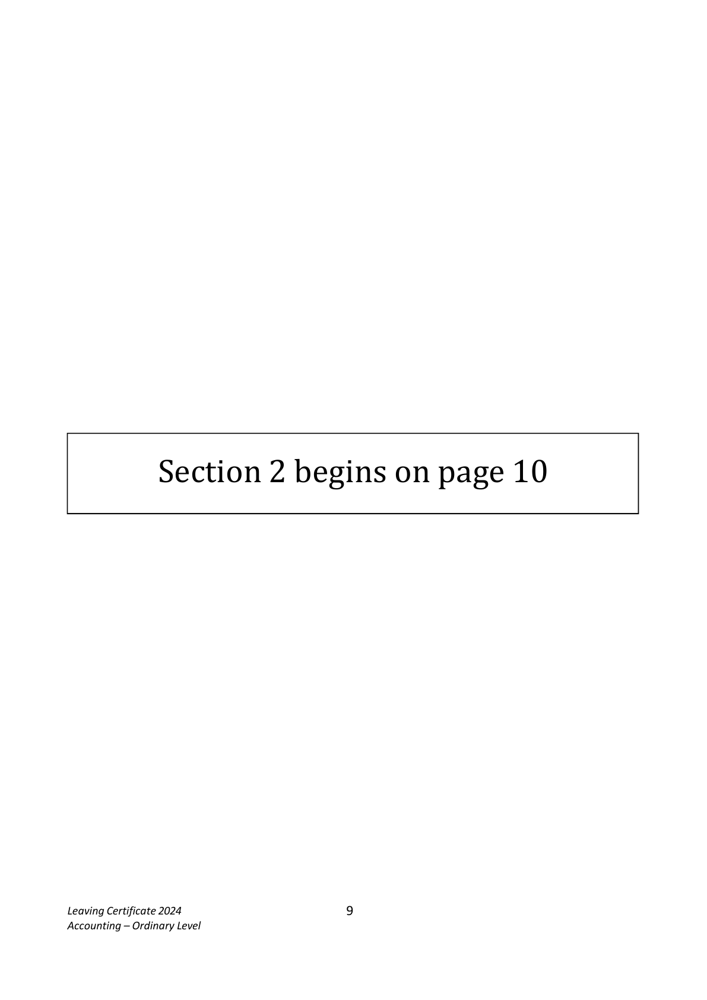
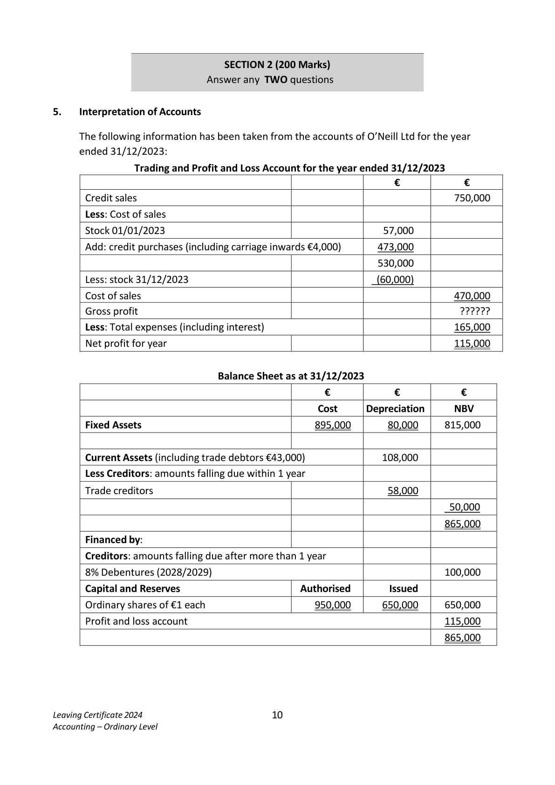
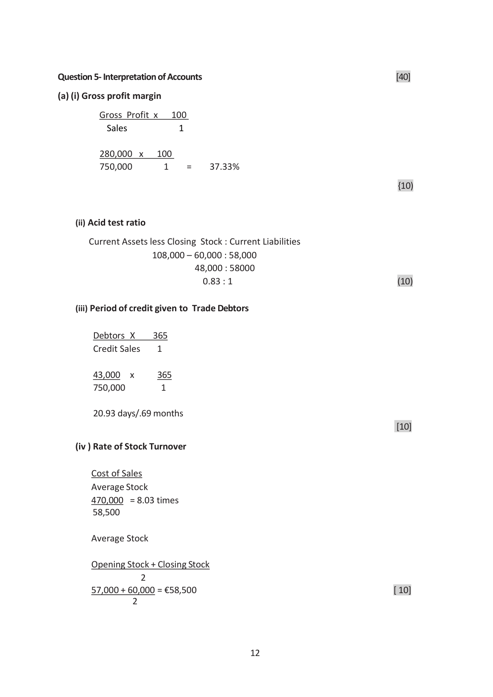

# Question

4.  Company Profit and Loss

    The following information was extracted from the books of Hanlon Ltd:

    •  Hanlon Ltd has an authorised capital of 1,200,000 ordinary shares of €1 each and
       750,000 6% preference shares of €1 each.

    •  The company has already issued 800,000 ordinary shares and 500,000 6% preference shares.

    •  On 01/01/2023 the company’s general reserve account showed a balance of €82,000.

    •  Hanlon Ltd had carried forward a profit of €214,000 from 2022 and the accounts showed
         profits of €202,000 before interest and taxation for the year ended 31/12/2023.

    •  During the year a total dividend of 4c per ordinary share was paid to the ordinary shareholders
       and the total preference dividend for the year was paid to the preference shareholders.

      On the 31/12/2023 the directors recommended that:

            (i)     Interest of €28,000 to be provided for.
             (ii)    Taxation of €59,000 to be provided for.
             (iii)   The general reserve to be increased by €35,000.

    Required

     (a)   Show the profit and loss account for the year ended 31/12/2023.                  (35)

     (b)   Prepare a balance sheet showing the relevant accounts after making the          (25)
         above provisions and appropriations.

                                                                                (60 marks)

Leaving Certificate 2024                       8
Accounting – Ordinary Level

<!-- PAGE 9 -->
# Page 9

<!-- HAS_VISUAL: true -->
<!-- VISUAL_REASON: page contains embedded images; page contains vector drawings; text extraction is sparse relative to visible page content; page image extracted because text may not fully capture visual content -->

Section 2 begins on page 10

Leaving Certificate 2024                       9
Accounting – Ordinary Level

<!-- PAGE 10 -->
# Page 10

<!-- HAS_VISUAL: true -->
<!-- VISUAL_REASON: page contains embedded images; page contains vector drawings; page image extracted because text may not fully capture visual content -->

SECTION 2 (200 Marks)
                           Answer any TWO questions

# Marking Scheme

Question 4 - Company Profit and Loss

 (a ) Profit and Loss Account for year ended 31/12/2023                          [35

 Net profit for year                                              202,000     [2]
 Less interest                                                        (28,000)    [5]
 Less tax                                                             (59,000)    [5]
                                                              115,000
 Less appropriation
 Increase in general reserve                         (35,000)  [5]
 Ordinary dividend                                 (32,000)  [5]
 Preference dividend                               (30,000)  [5]     (97,000)

 Retained profit for year                                          18,000
 Retained profit for 01/01/2023                                  214,000     [5]

 Retained profit carried forward                                  232,000     [3]

 (b) Balance Sheet as at 31/12/2023                                                  [25)

 Fixed assets and currents assets                                    1,736,000

 Creditors: amounts falling due within 1 year [1]
 Interest due                                        28,000  [4]

 Tax due                                           59,000  [4]      87,000

                                                                  1,649,000
 Financed by:
 Capital and Reserves [1]                         Authorised           Issued
 Preference shares                                 750,000  [1]     500,000  [2]
 Ordinary shares                                   1,200,000  [1]     800,000  [2]
                                                  1,950,000        1,300,000  [1]
 Profit and loss balance 31/12/2023                                  232,000  [4]
 General reserve                                                   117,000  [4]
                                                                   1,649,000

                                     11

<!-- PAGE 12 -->
# Page 12

<!-- HAS_VISUAL: true -->
<!-- VISUAL_REASON: page contains vector drawings; page image extracted because text may not fully capture visual content -->

# Source References

Exam paper:
- file: intermediate_markdown/exam_papers/ordinary/accounting_ordinary_2024_paper_1_exam.md
- pages: [9, 10]

Marking scheme:
- file: intermediate_markdown/marking_schemes/ordinary/accounting_ordinary_2024_paper_1_marking_scheme.md
- pages: [12]

# Notes

