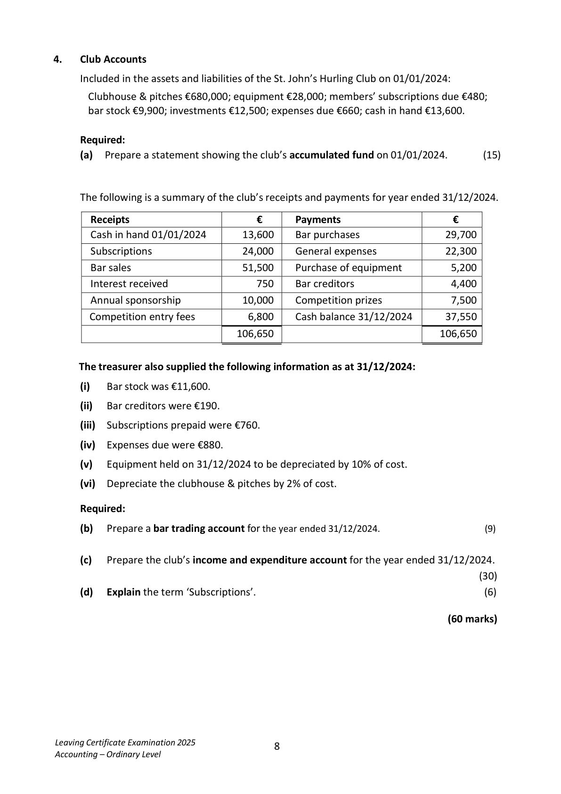

# Question

3.    Tabular Statement

     The following balance sheet shows the financial position of a sole trader Stephen Harris,
      as at 01/04/2025:
                                Balance Sheet as at 01/04/2025
                                               €           €           €
       Fixed Assets
         Buildings                                              600,000
       Equipment                                              96,000     696,000

      Current Assets
        Stock                                                   84,000
        Debtors                                                12,500
       Bank                                                   21,300
                                                             117,800

       Less Creditors: amounts falling due within 1 year
        Trade creditors                            19,700

        Insurance due                             600        20,300
      Working capital                                                        97,500
       Total net assets                                                       793,500

      Financed by:
         Capital                                                           687,000
          Profit and loss account                                              106,500

        Capital employed                                                    793,500

     The following transactions took place during April 2025:
     Apr 3   Paid by cheque insurance that was due at the beginning of the month.
     Apr 4  Purchased goods on credit for €16,200.
     Apr 10  Received from a debtor a cheque for €4,800 in full settlement of a debt of €5,200.
     Apr 14  Paid, by cheque, a creditor’s account balance of €1,750 and received a discount
               of €160.
     Apr 17  Sold goods on credit for €10,600, which originally cost €8,000.
     Apr 19  Purchased new delivery van for €31,000. A deposit of €6,000 was paid by cheque
            and the remainder borrowed from Future Finance Ltd.
     Apr 21  Paid by cheque from business bank account €2,300 for roof repairs to private
              residence.
     Apr 30 A debtor who owed €800 was declared bankrupt and paid 20c in the €.

     Required:
     Record on a tabular statement the effect each of the above transactions had on the
      relevant assets and liabilities.

    Show the total assets and liabilities on 30/04/2025.                         (60 marks)

Leaving Certificate Examination 2025              7
Accounting – Ordinary Level

<!-- PAGE 8 -->
# Page 8

<!-- HAS_VISUAL: true -->
<!-- VISUAL_REASON: page contains vector drawings; page image extracted because text may not fully capture visual content -->

# Marking Scheme

[No matching marking scheme section detected.]

# Source References

Exam paper:
- file: intermediate_markdown/exam_papers/ordinary/accounting_ordinary_2025_paper_1_exam.md
- pages: [8]

Marking scheme:
- file: 
- pages: []

# Notes

