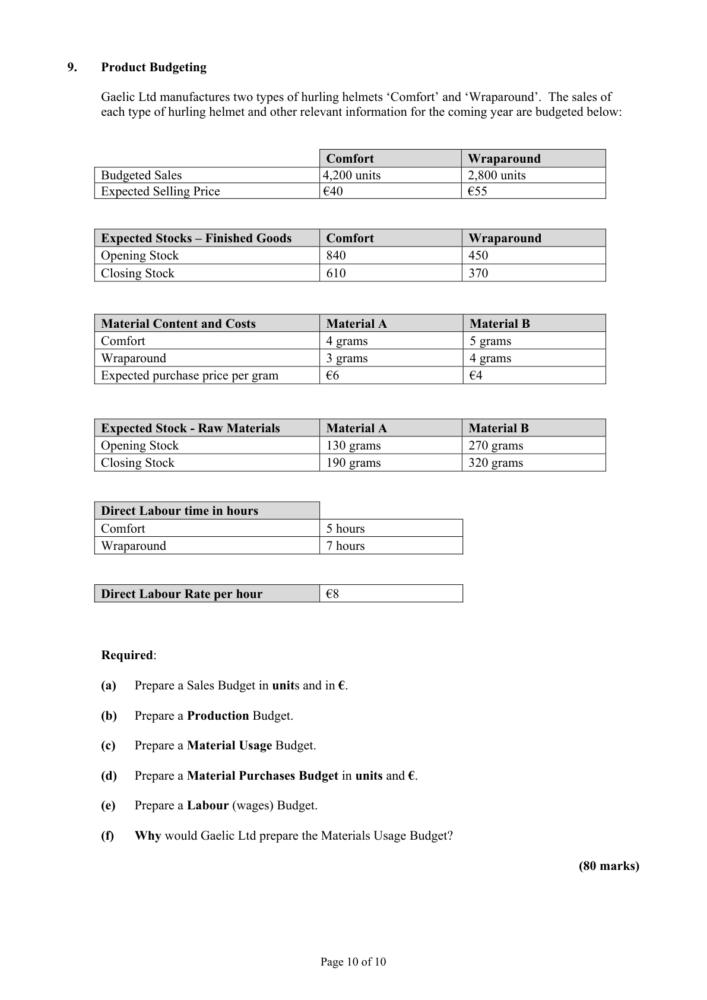
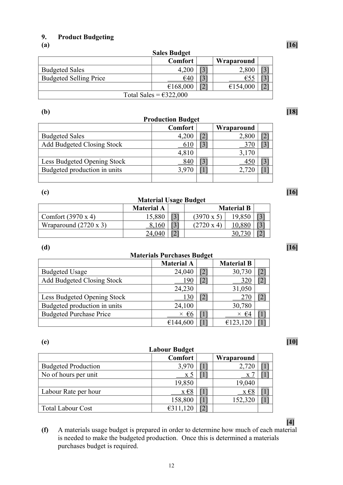

# Question

8.    Absorption Costing

      Fastpac Ltd, a manufacturing company has two departments Production and Packing.
     The budgeted overheads for the two departments for the coming year are as follows:

                                                    €              €
              Department                           Fixed          Variable
                Production                             30,000         18,000
               Packing                                  7,000          9,000

      Fastpac Ltd estimates (budgets) Direct Labour Hours for each Department for the coming
      year as follows:

                                                          Direct
                                             Labour Hours
                Production                               5,000 hrs

               Packing                                  2,000 hrs

       (a)   Calculate the overhead absorption rate (both Fixed and Variable) for each Department
           based on Direct Labour Hours.

      (b)   The details of customer’s Job No. 671 are as follows:

                 Direct Materials                               €1,250

                 Direct Labour                               €460

              Hours in Production                             3

              Hours in Packing                                2

            Calculate the total cost of Job No. 671.

       (c)    Calculate the selling price of Job No. 671 if the mark up on cost is 20%.

      (d)   State two reasons why a business needs to calculate the cost price of a product.

                                                                                 (80 marks)

                                            Page 9 of 10

<!-- PAGE 10 -->
# Page 10

<!-- HAS_VISUAL: true -->
<!-- VISUAL_REASON: page contains vector drawings; page image extracted because text may not fully capture visual content -->

# Marking Scheme

8.   Marginal Costing                                                             [40]

(a)   Production Dept:

            Fixed         30,000   = €6 per hour                                                                [10]                            5,000

             Variable       18,000   = €3.60 per hour                                                                [10]                            5,000

     Packing Dept:

             Fixed          7,000   = €3.50 per hour        [10]
                            2,000

             Variable       9,000   = €4.50 per hour        [10]
                            2,000

(b)  Job No 671                                                                    [24]

             Direct Materials                    1,250 .00   [4]
             Direct Labour                        460.00   [4]
            Production overheads
                 Fixed  3 × 6                     18.00   [3]
                  Variable 3 × 3.60                10.80   [3]
           Packing overheads
                 Fixed  2 × 3.50                   7.00   [3]
                  Variable  2 × 4.50                 9.00   [3]
                                                1,754.80   [4]

(c)   Selling Price of Job No. 671                                                   [10]

              Cost:  1754.80
           + 20%  350.96
                     2,105.76

(d)  Two reasons                                                                       [6]

       (i)   To be able to calculate a selling price.

        (ii)  To see if it will be possible to make a profit producing the product.

                                            11

<!-- PAGE 14 -->
# Page 14

<!-- HAS_VISUAL: true -->
<!-- VISUAL_REASON: page contains vector drawings; page image extracted because text may not fully capture visual content -->

# Source References

Exam paper:
- file: intermediate_markdown/exam_papers/ordinary/accounting_ordinary_2015_paper_1_exam.md
- pages: [10]

Marking scheme:
- file: intermediate_markdown/marking_schemes/ordinary/accounting_ordinary_2015_paper_1_marking_scheme.md
- pages: [14]

# Notes

