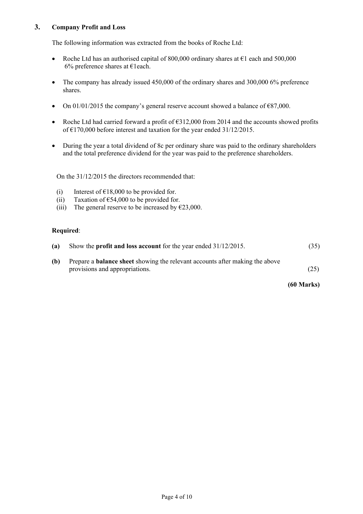
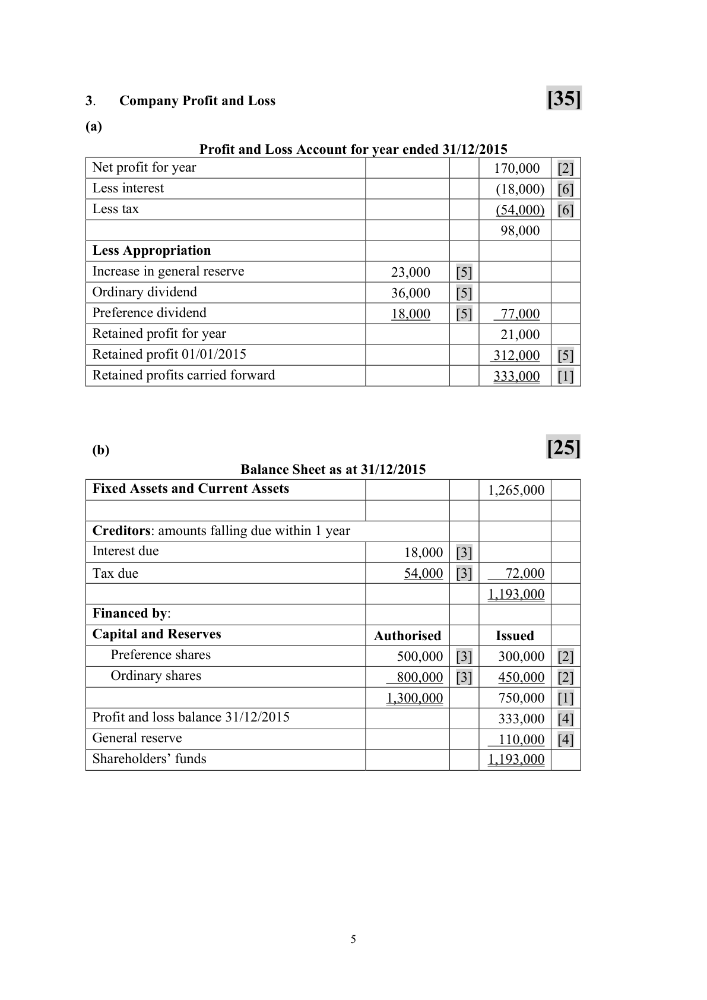

# Question

2.    Debtors and Creditors Control Account

     The following figures were taken from the books of Mary Burke during January 2016:

                                                                  €

          Debtors ledger balance 01/01/2016 dr                         75,800

          Debtors ledger balance 01/01/2016 cr                          410

           Creditors ledger balance 01/01/2016 cr                        43,300

           Creditors ledger balance 01/01/2016 dr                        240

           Returns outwards (purchases returns)                          350

          Discount allowed                                          560

          Discount received                                            1,320

           Purchases (including cash purchases 5,600)                    86,300

           Returns inwards (sales returns)                               310

            Bills payable accepted                                        4,450

            Bills receivable issued                                        5,840

           Sales (including cash sales 8,200)                           101,600

          Discount disallowed to Mary Burke                           330

          Cheques received from customers                            80,300

          Cheques paid to suppliers                                   60,400

          Cheques received dishonoured                                 1,800

         Bad debts written off                                       750

             Interest charged by Mary Burke on overdue accounts             100

           Transfer from debtors ledger to creditors ledger                  320

          Debtors ledger balance 31/01/2016                           450 cr

           Creditors ledger balance 31/01/2016                          630 dr

    You are required to prepare for January 2016:

       (a)   Debtors Ledger Control Account.                                                     (30)

      (b)   Creditors Ledger Control Account.                                                    (30)

                                                                                     (60 marks)

                                           Page 3 of 10

<!-- PAGE 4 -->
# Page 4

# Marking Scheme

2.   Debtors and Creditors Control Accounts
                                                          [30]

 Dr                        Debtors Ledger Control Account                       Cr

                                 €                                        €
 01/01/2016  Balance b/d           75,800   [3]  01/01/2016   Balance b/d           410   [2]

             Sales                 93,400   [6]               Discount allowed       560   [2]

               Interest charged         100   [2]                Sales returns           310   [2]

            Dishonoured Ch.        1,800   [2]                  Bills receivable        5,840   [1]

31/01/2016  Balance c/d             450   [2]             Bank               80,300   [2]

                                                   Bad debts w/o         750   [2]

                                                            Contra               320   [2]

                                               31/01/2016   Balance c/d          83060   [2]

                                171,550                                      171,550

 01/02/2016  Balance b/d          83,060       01/02/2016   Balance b/d           450

                                                          [30]

 Dr                         Creditors Ledger Control Account                      Cr

                                   €                                        €
 01/01/2016  Balance b/d             240  [2]  01/01/2016  Balance b/d            43,300   [3]
              Purchases returns        350  [3]              Purchases             80,700   [6]

              Discount received       1,320  [2]              Discount disallowed      330   [3]

                Bills payable           4,450  [2]  31/01/2016  Balance c/d             630   [2]

            Bank                 60,400  [2]

              Contra                 320  [3]

 31/01/2016  Balance c/d           57,880  [2]

                                 124,960                                       124,960

 01/02/2016  Balance b/d             630       01/02/2016  Balance b/d            57,880

                                                4

<!-- PAGE 7 -->
# Page 7

<!-- HAS_VISUAL: true -->
<!-- VISUAL_REASON: page contains vector drawings; page image extracted because text may not fully capture visual content -->

# Source References

Exam paper:
- file: intermediate_markdown/exam_papers/ordinary/accounting_ordinary_2016_paper_1_exam.md
- pages: [4]

Marking scheme:
- file: intermediate_markdown/marking_schemes/ordinary/accounting_ordinary_2016_paper_1_marking_scheme.md
- pages: [7]

# Notes

