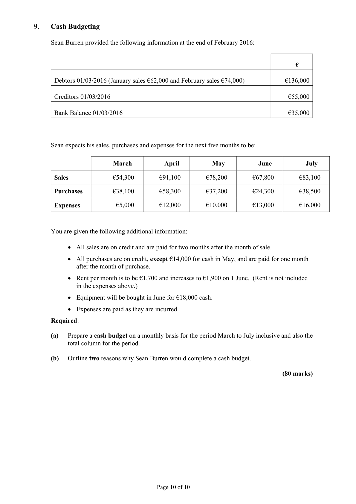
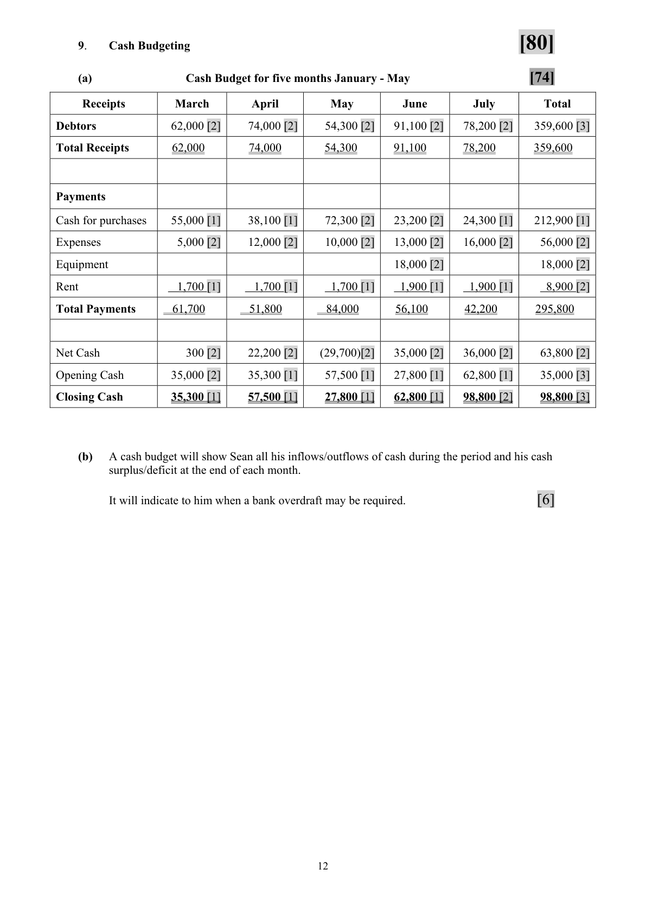

# Question

8.   Marginal Costing

    Mooney Ltd manufactures a single product. The following is the proposed annual budget
      for the coming year:

                                            €              €
                   Sales (55,000 units)                          770,000
                   Variable Costs             467,500
                  Fixed Costs                137,500          605,000
                 Net Profit                                  165,000

     Required:

      (a)   Calculate the selling price per unit.

      (b)   Calculate the variable cost per unit.

      (c)   Calculate the contribution from each unit sold.

      (d)   Calculate the break-even point in volume (units) and sales value (€).

      (e)   Calculate the margin of safety in units and sales value, if the budgeted sales
            for the period are 35,000 units.

       (f)   Calculate the level of production and sales revenue that will yield a profit of
           €400,000.

      (g)   Explain the term ‘variable cost’ in relation to Mooney Ltd.
          Give one example of a ‘variable cost’.

                                                                             (80 marks)

                                           Page 9 of 10

<!-- PAGE 10 -->
# Page 10

<!-- HAS_VISUAL: true -->
<!-- VISUAL_REASON: page contains vector drawings; text contains visual keywords: line; page image extracted because text may not fully capture visual content -->

# Marking Scheme

8.   Marginal Costing                                                   [80]

(a)   Selling Price per unit   =     770,000   =    €14 per unit                [12]
                                  55,000 units

(b)  Variable cost per unit  =      467,500   =    €8.50 per unit              [12]
                                  55,000 units

(c)   Contribution per unit  =   SP - VC = C
                               €14 - €8.50  =    €5.50 per unit              [10]

(d)  Break-even point  =    fixed costs   =    137,500
                               C.P.U.            5.50    =    25,000 units    [10]

          Sales value    =    25,000 × €14              =    €350,000

(e)  Margin of Safety  =    Budgeted sales – B.E.P.
                             35,000 – 25,000       =    10,000 units

          Sales value    =    10,000 units × €14      =    €140,000             [15]

(f)  To achieve a profit of €400,000                                               [17]

          FC + TP =    137,500 + 400,000 =    537,500
                5.50               5.50                5.50    = 97,728 units

                 Sales value = 97,728 units × €14              =   €1,368,192

     Alternative

     Let N               =      number of units
    SP – VC – FC         =        profit
    14N – 8.5N – 137,500   =      400,000
     5.5N               =      537,500
   N                  =      537,500               =   97,728 units
                                       5.50
      Sales value           =       97,728 units × €14        =    €1,368,192

(g)   Variable cost is a cost that changes with the amounts of units made.
       e.g. packaging, raw materials, labour.                                              [4]

                                            11

<!-- PAGE 14 -->
# Page 14

<!-- HAS_VISUAL: true -->
<!-- VISUAL_REASON: page contains vector drawings; page image extracted because text may not fully capture visual content -->

# Source References

Exam paper:
- file: intermediate_markdown/exam_papers/ordinary/accounting_ordinary_2016_paper_1_exam.md
- pages: [10]

Marking scheme:
- file: intermediate_markdown/marking_schemes/ordinary/accounting_ordinary_2016_paper_1_marking_scheme.md
- pages: [14]

# Notes

