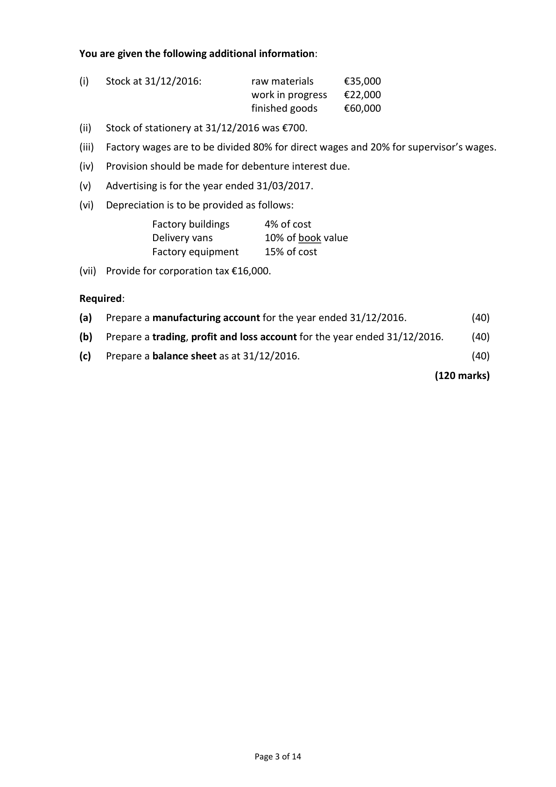
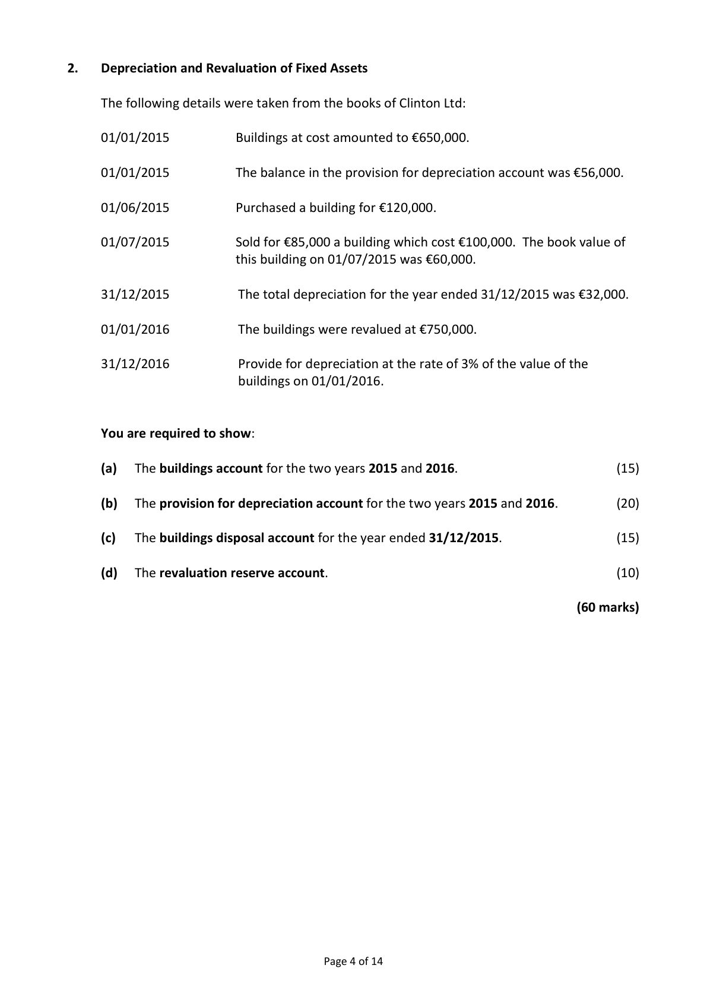
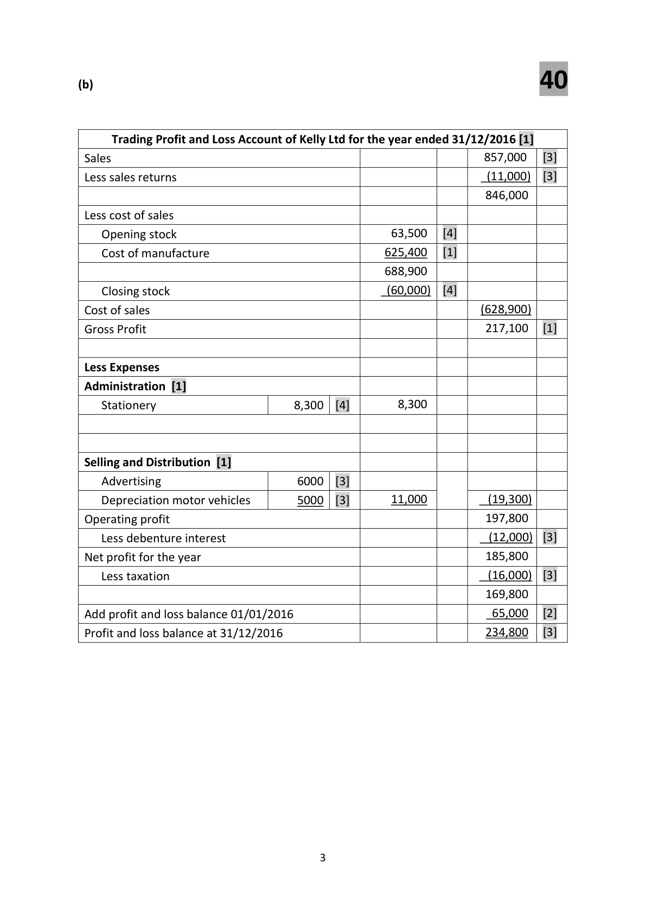
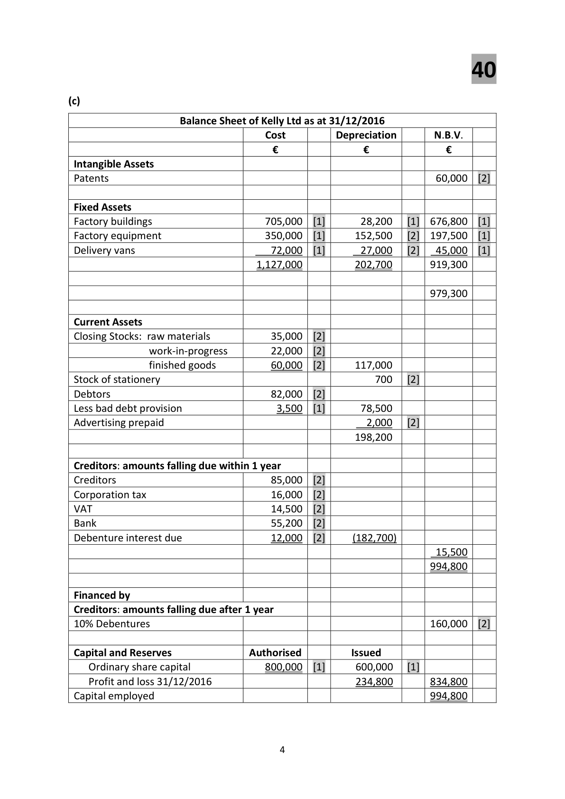
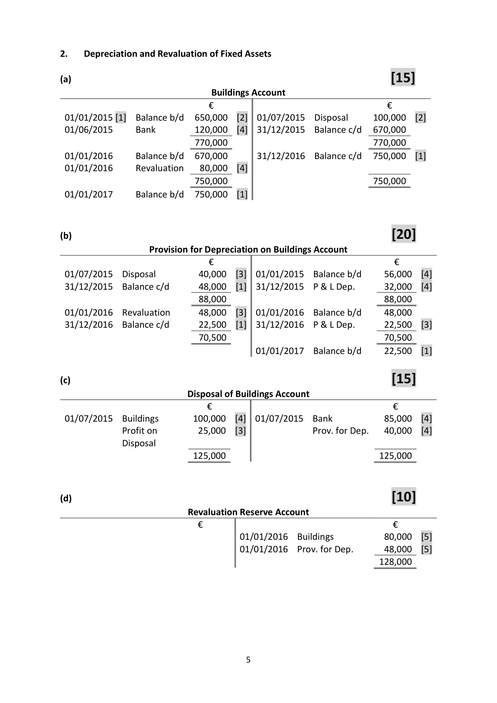

# Question

1.    Final Accounts of a Manufacturing Company
     The following balances were extracted from the books of Kelly Ltd as at 31/12/2016:

                                                    €           €
  Share capital
    Authorised  ‐ 800,000 ordinary shares at €1 each
    Issued        ‐ 600,000 ordinary shares at €1 each                    600,000
   Delivery vans (cost €72,000)                            50,000

  Factory buildings                                    705,000

  Factory equipment (cost €350,000)                     250,000

  Patent                                               60,000

  Stock 01/01/2016

    Raw materials                                      45,000

    Work in progress                                   15,400

     Finished goods                                     63,500

  Purchase of raw materials                             360,500

   Sales                                                            857,000

  Returns inwards (sales returns)                          11,000

   Creditors                                                          85,000

  Debtors                                              82,000

   Sale of scrap materials                                                7,400

  Factory wages                                       140,000

   Direct expenses                                       15,000

  Stationery                                              9,000

  10% Debentures (issued 01/04/2016)                                160,000

  VAT                                                              14,500

   Provision for bad debts                                                3,500

   Advertising                                             8,000

  Factory insurance                                     19,000

  Bank                                                              55,200

  Factory light and heat                                  14,200

   Profit and loss balance 01/01/2016                  ________       65,000

                                                      1,847,600     1,847,600

                                                               Continued on page 3

                                      Page 2 of 14

<!-- PAGE 3 -->
# Page 3

<!-- HAS_VISUAL: true -->
<!-- VISUAL_REASON: page contains vector drawings; page image extracted because text may not fully capture visual content -->

You are given the following additional information:

(i)   Stock at 31/12/2016:         raw materials      €35,000
                              work in progress   €22,000
                                      finished goods     €60,000

(ii)   Stock of stationery at 31/12/2016 was €700.

(iii)  Factory wages are to be divided 80% for direct wages and 20% for supervisor’s wages.

(iv)   Provision should be made for debenture interest due.

(v)   Advertising is for the year ended 31/03/2017.

(vi)  Depreciation is to be provided as follows:

               Factory buildings     4% of cost
                Delivery vans        10% of book value
               Factory equipment    15% of cost

(vii)  Provide for corporation tax €16,000.

Required:

(a)   Prepare a manufacturing account for the year ended 31/12/2016.              (40)

(b)   Prepare a trading, profit and loss account for the year ended 31/12/2016.      (40)

(c)   Prepare a balance sheet as at 31/12/2016.                                      (40)

                                                                     (120 marks)

                                      Page 3 of 14

<!-- PAGE 4 -->
# Page 4

# Marking Scheme

1.    Final Accounts of a Manufacturing Company                                40

(a)

           Manufacturing Account of Kelly Ltd for year ended 31/12/2016 [1]
 Stock of raw materials 01/01/2016                                     45,000    [3]
 Purchase of raw materials                                           360,500    [2]
                                                                  405,500
 Less stock of raw materials 31/12/2016                                   (35,000)   [3]
 Cost of raw materials consumed                                      370,500
 Add factory wages                                                 112,000    [4]
 Add direct expenses                                                  15,000    [2]
 PRIME COST [1]                                                   497,500
 Add Factory Overhead Expenses
    Factory supervisor’s wages                       28,000   [2]
    Factory insurance                               19,000   [2]
    Factory light and heat                           14,200   [3]
    Depreciation factory equipment                  52,500   [3]
    Depreciation factory building                     28,200   [3]
 Total expenses                                                    141,900
 Factory Cost                                                      639,400
 Add work‐in‐progress 01/01/2016                                      15,400    [3]
                                                                  654,800
 Less work‐in‐progress 31/12/2016                                        (22,000)   [3]
                                                                  632,800
 Less sale of scrap materials                                                 (7,400)   [3]
 COST OF MANUFACTURE                                            625,400    [2]

                                        2

<!-- PAGE 5 -->
# Page 5

<!-- HAS_VISUAL: true -->
<!-- VISUAL_REASON: page contains vector drawings; page image extracted because text may not fully capture visual content -->

(b)                                40

      Trading Profit and Loss Account of Kelly Ltd for the year ended 31/12/2016 [1]
 Sales                                                             857,000   [3]
 Less sales returns                                                        (11,000)  [3]
                                                                   846,000

 Less cost of sales
    Opening stock                                   63,500   [4]
    Cost of manufacture                             625,400   [1]
                                                  688,900
    Closing stock                                       (60,000)  [4]
 Cost of sales                                                           (628,900)
 Gross Profit                                                       217,100   [1]

 Less Expenses
 Administration [1]
    Stationery                       8,300  [4]        8,300

 Selling and Distribution [1]
    Advertising                     6000  [3]
    Depreciation motor vehicles       5000  [3]       11,000           (19,300)
 Operating profit                                                    197,800
    Less debenture interest                                                (12,000)  [3]
 Net profit for the year                                               185,800
    Less taxation                                                          (16,000)  [3]
                                                                   169,800
 Add profit and loss balance 01/01/2016                                 65,000   [2]
 Profit and loss balance at 31/12/2016                                 234,800   [3]

                                        3

<!-- PAGE 6 -->
# Page 6

<!-- HAS_VISUAL: true -->
<!-- VISUAL_REASON: page contains vector drawings; page image extracted because text may not fully capture visual content -->

40

(c)

                     Balance Sheet of Kelly Ltd as at 31/12/2016
                                      Cost          Depreciation        N.B.V.
                                   €               €             €
 Intangible Assets
 Patents                                                              60,000  [2]

 Fixed Assets
 Factory buildings                     705,000  [1]       28,200   [1]  676,800  [1]
 Factory equipment                   350,000  [1]     152,500   [2]  197,500  [1]
 Delivery vans                          72,000  [1]       27,000   [2]   45,000  [1]
                                     1,127,000          202,700       919,300

                                                                    979,300

 Current Assets
 Closing Stocks: raw materials           35,000  [2]
                work‐in‐progress        22,000  [2]
                  finished goods          60,000  [2]     117,000
 Stock of stationery                                     700   [2]
 Debtors                              82,000  [2]
 Less bad debt provision                  3,500  [1]       78,500
 Advertising prepaid                                       2,000   [2]
                                                      198,200

 Creditors: amounts falling due within 1 year
 Creditors                             85,000  [2]
 Corporation tax                        16,000  [2]
 VAT                                  14,500  [2]
 Bank                                 55,200  [2]
 Debenture interest due                 12,000  [2]     (182,700)
                                                                      15,500
                                                                    994,800

 Financed by
 Creditors: amounts falling due after 1 year
 10% Debentures                                                    160,000  [2]

 Capital and Reserves               Authorised          Issued
    Ordinary share capital              800,000  [1]      600,000   [1]
     Profit and loss 31/12/2016                           234,800       834,800
 Capital employed                                                    994,800

                                        4

<!-- PAGE 7 -->
# Page 7

<!-- HAS_VISUAL: true -->
<!-- VISUAL_REASON: page contains vector drawings; page image extracted because text may not fully capture visual content -->

# Source References

Exam paper:
- file: intermediate_markdown/exam_papers/ordinary/accounting_ordinary_2017_paper_1_exam.md
- pages: [3, 4]

Marking scheme:
- file: intermediate_markdown/marking_schemes/ordinary/accounting_ordinary_2017_paper_1_marking_scheme.md
- pages: [5, 6, 7]

# Notes

