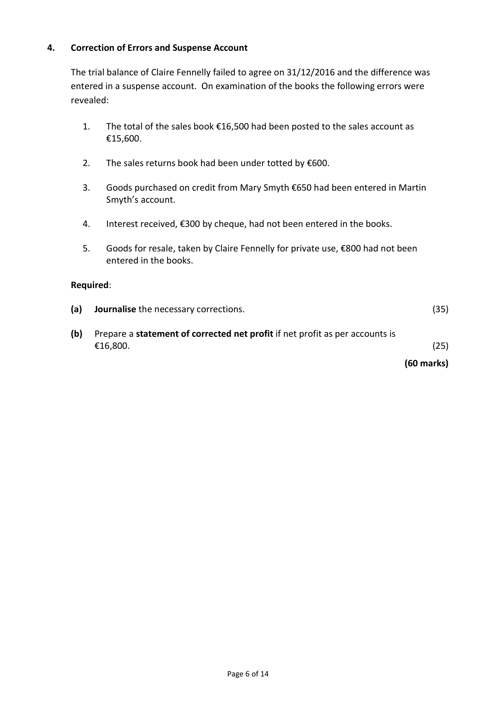
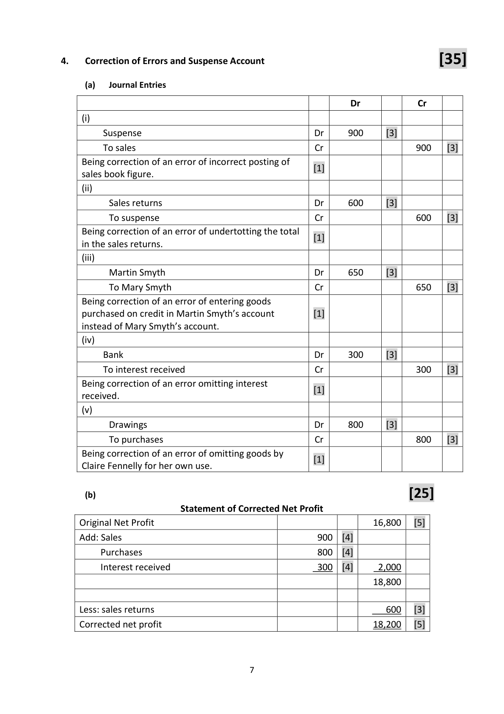

# Question

3.   Incomplete Records – Net Worth

       S. Dowling, a sole trader, has not been keeping a full set of accounts. The following figures
      relating to the business were supplied on 01/01/2016:

                                                           €
       Premises                                             460,000
      Motor vehicles at book value                             58,200
        Furniture and equipment at cost                          64,000
       Accumulated depreciation on furniture and equipment      17,800
       Insurance prepaid                                      900
       Stock                                                  65,400
        Creditors                                              16,100
       Expenses due                                            3,600
       Debtors                                               29,000
       Bank overdraft                                           7,300

     Required:

      (a)   Prepare a statement showing Dowling’s net worth/capital on 01/01/2016.         (30)

          Dowling also supplied the following additional information on 31/12/2016:

                 (i)   During the year €18,000 was transferred from a personal bank account to the
                business bank account.

                  (ii)   During the year, Dowling had paid €8,600 out of business funds for private house
                  repairs and had also taken goods to the value of €500 per month for private use.

          Dowling estimated that on 31/12/2016 the business assets and liabilities were
          €990,000 and €92,000 respectively, before allowing for the following:

              Depreciation on furniture and equipment at the rate of 20% of cost.

              Depreciation on motor vehicles at the rate of 10% of book value.

              Expenses due of €870.

      (b)   Prepare a statement showing Dowling’s profit or loss for the year ended
          31/12/2016.                                                                       (30)

                                                                                 (60 marks)

                                            Page 5 of 14

<!-- PAGE 6 -->
# Page 6

# Marking Scheme

3.   Incomplete Records – Net Worth

      (a)   Statement of Net Worth/Capital 01/01/2016                  [30]

        Assets                                 €            €
        Premises                               460,000   [3]
        Furniture and equipment (64000 ‐ 17800)    46,200   [6]
       Motor vehicles                           58,200   [3]
        Stock                                    65,400   [2]
       Debtors                                 29,000   [3]
        Insurance prepaid                         900   [3]   659,700

          Liabilities
        Creditors                                16,100   [3]
       Expenses due                              3,600   [2]
       Bank overdraft                             7,300   [3]    (27,000)
        Capital/Net Worth 01/01/2016                           632,700   [2]

      (b)  Statement of Profit/Loss for year ended 31/12/2016            [30]

        Assets                                                        990,000    [3]
        Less    Depreciation furniture and equipment       12,800   [3]
                Depreciation motor vehicles                 5,820   [3]     (18,620)
                                                                     971,380
        Less liabilities
                    Liabilities                                 92,000   [3]
               Expenses due                             870   [3]     (92,870)
       Net worth 31/12/2016                                          878,510
        Less net worth 01/01/2016                                         (632,700)   [1]
       Apparent profit for the year                                      245,810
        Less capital Introduced                                             (18000)   [5]
                                                                     227,810
      Add    Drawings                                  8,600   [3]
                Stock                                      6,000   [3]     14,600
       Net profit for the year 2016                                     242,410    [3]

                                        6

<!-- PAGE 9 -->
# Page 9

<!-- HAS_VISUAL: true -->
<!-- VISUAL_REASON: page contains vector drawings; text contains visual keywords: figure; page image extracted because text may not fully capture visual content -->

# Source References

Exam paper:
- file: intermediate_markdown/exam_papers/ordinary/accounting_ordinary_2017_paper_1_exam.md
- pages: [6]

Marking scheme:
- file: intermediate_markdown/marking_schemes/ordinary/accounting_ordinary_2017_paper_1_marking_scheme.md
- pages: [9]

# Notes

