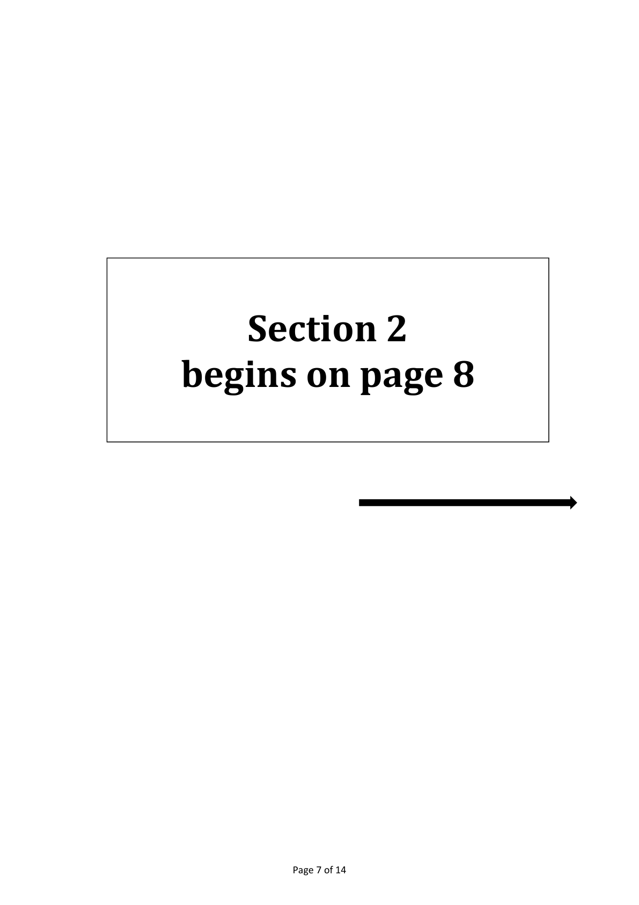
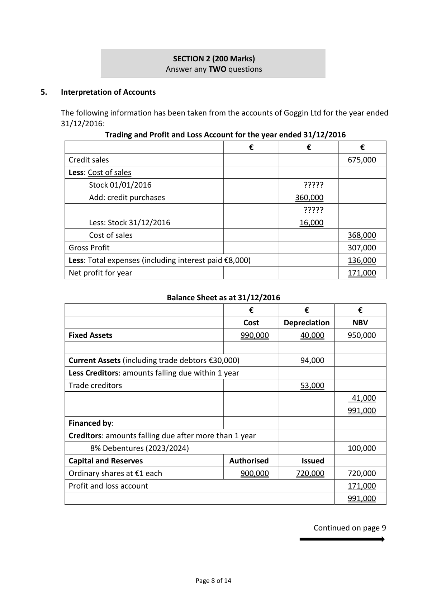
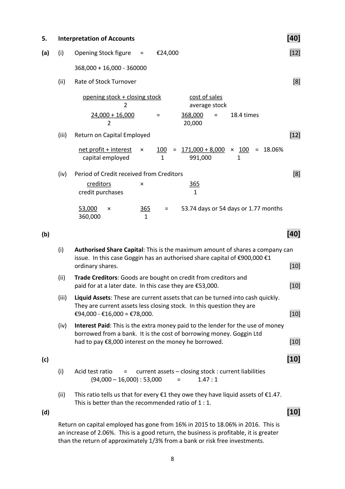

# Question

4.    Correction of Errors and Suspense Account

     The trial balance of Claire Fennelly failed to agree on 31/12/2016 and the difference was
     entered in a suspense account. On examination of the books the following errors were
      revealed:

         1.   The total of the sales book €16,500 had been posted to the sales account as
             €15,600.

         2.   The sales returns book had been under totted by €600.

         3.   Goods purchased on credit from Mary Smyth €650 had been entered in Martin
             Smyth’s account.

         4.    Interest received, €300 by cheque, had not been entered in the books.

         5.   Goods for resale, taken by Claire Fennelly for private use, €800 had not been
             entered in the books.

     Required:

      (a)   Journalise the necessary corrections.                                              (35)

      (b)   Prepare a statement of corrected net profit if net profit as per accounts is
           €16,800.                                                                           (25)

                                                                                 (60 marks)

                                            Page 6 of 14

<!-- PAGE 7 -->
# Page 7

<!-- HAS_VISUAL: true -->
<!-- VISUAL_REASON: page contains vector drawings; text extraction is sparse relative to visible page content; page image extracted because text may not fully capture visual content -->

<!-- EXTRACTION_ISSUE: very sparse extracted text -->

Section 2
begins on page 8

                     Page 7 of 14

<!-- PAGE 8 -->
# Page 8

<!-- HAS_VISUAL: true -->
<!-- VISUAL_REASON: page contains vector drawings; page image extracted because text may not fully capture visual content -->

SECTION 2 (200 Marks)
                             Answer any TWO questions

# Marking Scheme

4.    Correction of Errors and Suspense Account                         [35]

       (a)   Journal Entries

                                                          Dr             Cr
       (i)
         Suspense                                   Dr     900      [3]
        To sales                                        Cr                  900    [3]
    Being correction of an error of incorrect posting of
                                                                   [1]
     sales book figure.
        (ii)
           Sales returns                               Dr     600      [3]
         To suspense                                   Cr                  600    [3]
    Being correction of an error of undertotting the total
                                                                   [1]
     in the sales returns.
        (iii)
          Martin Smyth                              Dr     650      [3]
         To Mary Smyth                                Cr                  650    [3]
    Being correction of an error of entering goods
    purchased on credit in Martin Smyth’s account          [1]
     instead of Mary Smyth’s account.
      (iv)
        Bank                                       Dr     300      [3]
        To interest received                             Cr                  300    [3]
    Being correction of an error omitting interest
                                                                   [1]
     received.
      (v)
          Drawings                                  Dr     800      [3]
         To purchases                                  Cr                  800    [3]
    Being correction of an error of omitting goods by
                                                                   [1]
     Claire Fennelly for her own use.

       (b)                                                 [25]
                        Statement of Corrected Net Profit
     Original Net Profit                                              16,800   [5]
    Add: Sales                                      900  [4]
         Purchases                                  800  [4]
          Interest received                            300  [4]     2,000
                                                                  18,800

     Less: sales returns                                             600   [3]
    Corrected net profit                                             18,200   [5]

                                        7

<!-- PAGE 10 -->
# Page 10

<!-- HAS_VISUAL: true -->
<!-- VISUAL_REASON: page contains embedded images; page contains vector drawings; text contains visual keywords: figure, table; page image extracted because text may not fully capture visual content -->

# Source References

Exam paper:
- file: intermediate_markdown/exam_papers/ordinary/accounting_ordinary_2017_paper_1_exam.md
- pages: [7, 8]

Marking scheme:
- file: intermediate_markdown/marking_schemes/ordinary/accounting_ordinary_2017_paper_1_marking_scheme.md
- pages: [10]

# Notes

