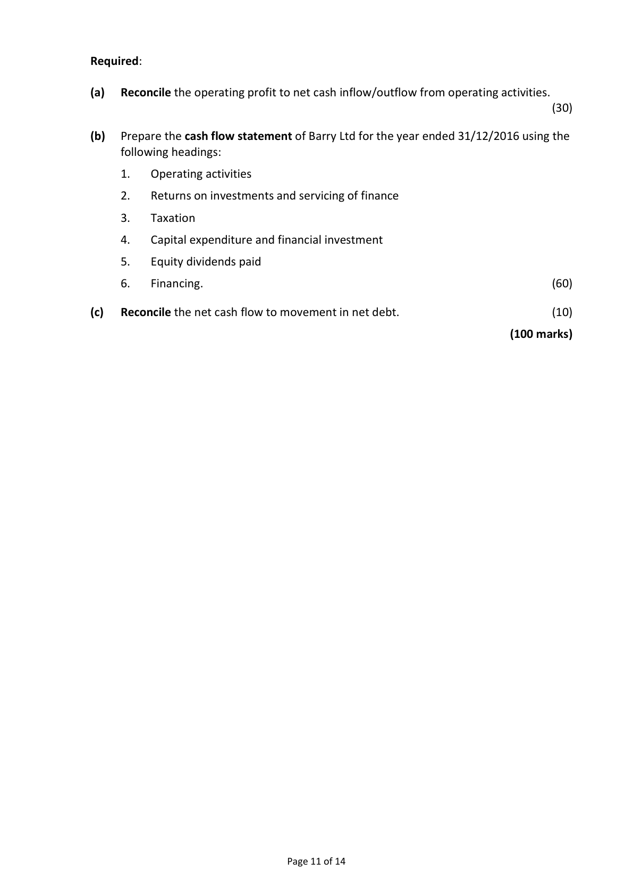
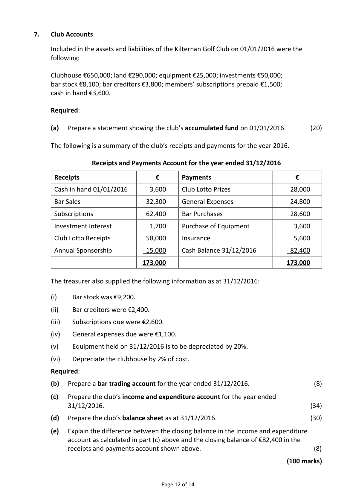
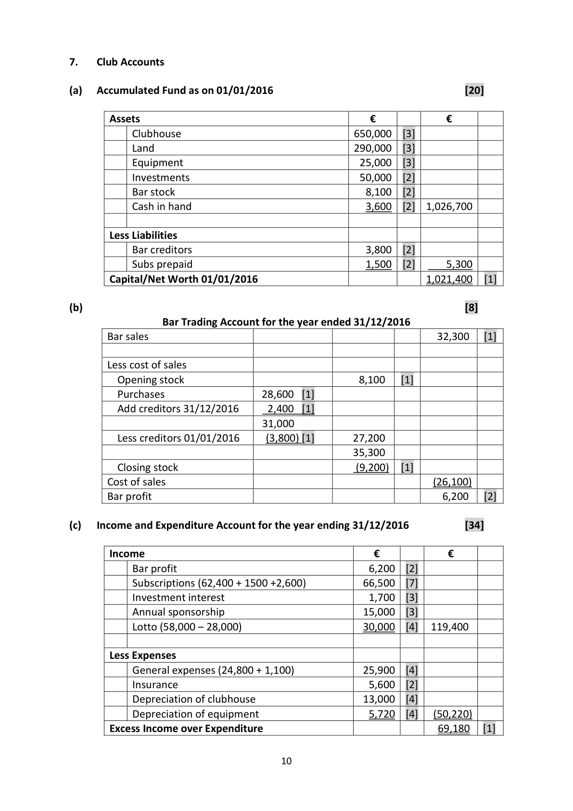

# Question

6.   Cash Flow Statement

     The following information has been extracted from the books of Barry Ltd:

       Profit and loss (extract) for year ended 31/12/2016                  €
      Operating profit                                                 70,000
       Interest paid                                                        (13,000)
                                                                     57,000
      Taxation                                                            (24,000)
                                                                     33,000
      Dividends paid                                                         (8,000)
      Retained profit                                                  25,000
        Profit and loss balance 01/01/2016                               136,000
        Profit and loss balance 31/12/2016                               161,000

      Balance Sheets as at                        31/12/2016         31/12/2015
                                             €        €        €        €
      Fixed Assets
           Land and buildings                  880,000              740,000
            Less depreciation provision           (110,000)   770,000    (85,000)   655,000
      Current Assets
            Stock                               43,000               37,000
           Debtors                             29,000               26,000
           Bank                                 8,000               15,000
                                               80,000              78,000
       Less Creditors: amounts falling due within 1 year
             Creditors                            45,000              36,000
            Taxation                            24,000              20,000
                                                   (69,000)              (56,000)
      Net Current Assets                                   11,000               22,000
       Total Net Assets                                   781,000             677,000

      Financed by
       Creditors: amounts falling due after 1 year
         7% Debentures                               145,000             115,000
       Capital and Reserves
            Ordinary share capital issued                   450,000             420,000
           Share premium                                 25,000                6,000
              Profit and loss account                         161,000             136,000
                                                        781,000             677,000

                                                                   Continued on page 11

                                           Page 10 of 14

<!-- PAGE 11 -->
# Page 11

Required:

(a)   Reconcile the operating profit to net cash inflow/outflow from operating activities.
                                                                                         (30)

(b)   Prepare the cash flow statement of Barry Ltd for the year ended 31/12/2016 using the
      following headings:

      1.    Operating activities

      2.    Returns on investments and servicing of finance

      3.    Taxation

      4.    Capital expenditure and financial investment

      5.    Equity dividends paid

      6.    Financing.                                                                    (60)

(c)   Reconcile the net cash flow to movement in net debt.                              (10)

                                                                        (100 marks)

                                      Page 11 of 14

<!-- PAGE 12 -->
# Page 12

<!-- HAS_VISUAL: true -->
<!-- VISUAL_REASON: page contains vector drawings; page image extracted because text may not fully capture visual content -->

# Marking Scheme

6.   Cash Flow Statement

(a)   Reconciliation of Operating Profit to Net Cash Inflow from Operating Activities
                                                                       [30]
                                                     €
        Operating profit                                  70,000   [3]
      Add depreciation                                 25,000   [6]
        Increase in stock                                      (6,000)   [6]
        Increase in debtors                                    (3,000)   [6]
        Increase in creditors                                9,000   [6]
       Net cash inflow from operating activities             95,000   [3]

(b)  Cash Flow Statement of Rodgers Ltd For the year ended 31/12/2016        [60]

                                                       €
 Operating Activities [4]
 Net cash inflow from operating activities                      95,000    [3]

 Return on Investment and Servicing of Finance [4]
 Interest paid                                                  (13,000)   [4]

 Taxation [4]
 Tax paid                                                       (20,000)  [4]

 Capital Expenditure and Financial Investment [4]
 Purchase of land/buildings                                   (140,000)  [6]

 Equity Dividends Paid [4]
 Dividends paid                                                   (8,000)  [6]
 Net cash inflow before liquid resources and financing            (86,000)

 Financing
 Issue of ordinary share capital                 30,000   [4]
 Share premium                              19,000   [4]
 Debentures                                 30,000   [4]    79,000
 Decrease in cash                                                (7,000)  [5]

(c)   Reconciliation of Net Cash Flow to movement in Net Debt                   [10]

      Decrease in cash in the period                         (7,000)    [2]
      Debentures                                         (30,000)    [2]
      Change in net debt                                  (37,000)    [2]
      Net debt 01/01/2016                              (100,000)    [2]
      Net debt 31/12/2016                              (137,000)    [2]

                                        9

<!-- PAGE 12 -->
# Page 12

<!-- HAS_VISUAL: true -->
<!-- VISUAL_REASON: page contains vector drawings; page image extracted because text may not fully capture visual content -->

# Source References

Exam paper:
- file: intermediate_markdown/exam_papers/ordinary/accounting_ordinary_2017_paper_1_exam.md
- pages: [11, 12]

Marking scheme:
- file: intermediate_markdown/marking_schemes/ordinary/accounting_ordinary_2017_paper_1_marking_scheme.md
- pages: [12]

# Notes

