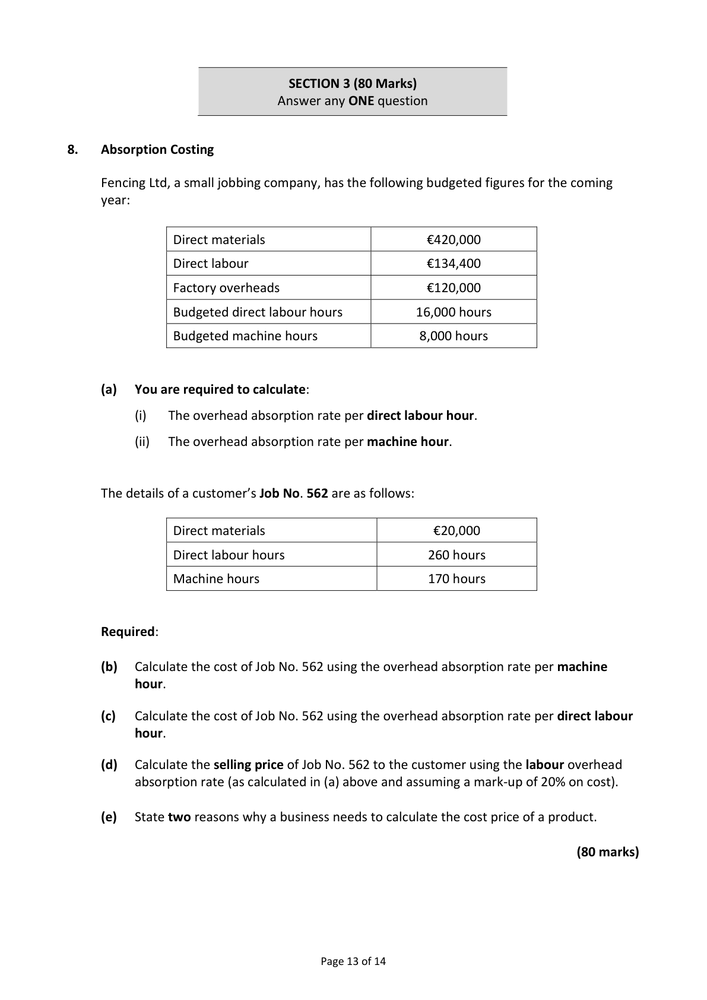
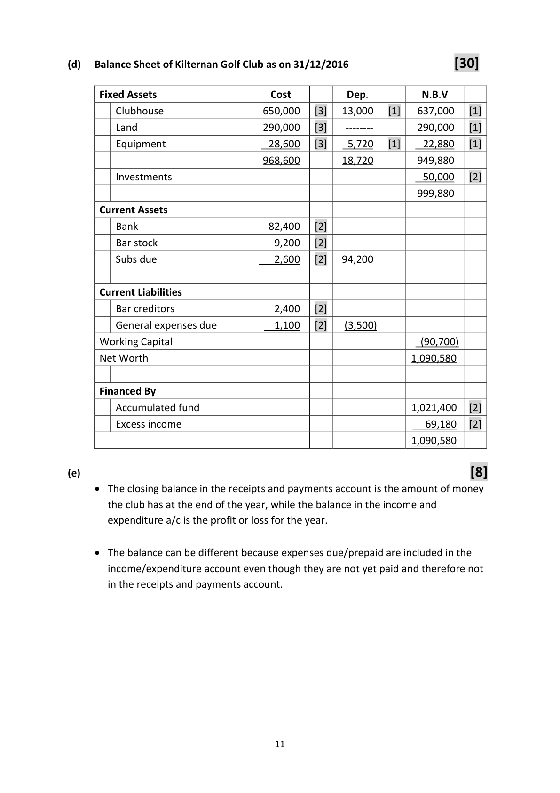
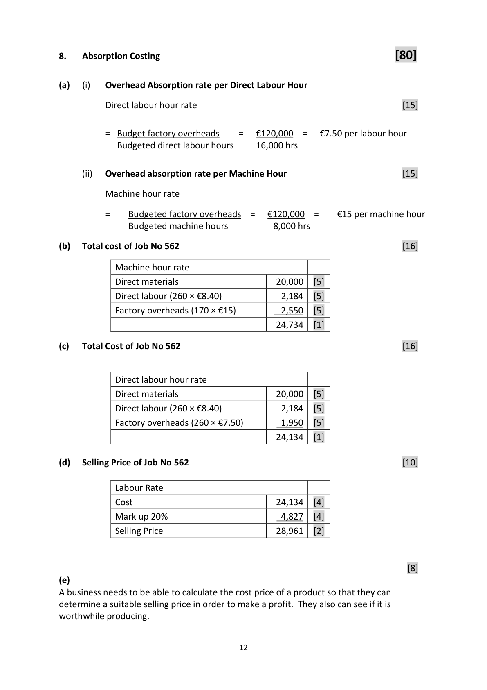

# Question

7.   Club Accounts

     Included in the assets and liabilities of the Kilternan Golf Club on 01/01/2016 were the
      following:

     Clubhouse €650,000; land €290,000; equipment €25,000; investments €50,000;
     bar stock €8,100; bar creditors €3,800; members’ subscriptions prepaid €1,500;
     cash in hand €3,600.

     Required:

      (a)   Prepare a statement showing the club’s accumulated fund on 01/01/2016.        (20)

     The following is a summary of the club’s receipts and payments for the year 2016.

                  Receipts and Payments Account for the year ended 31/12/2016

      Receipts                     €      Payments                       €

      Cash in hand 01/01/2016       3,600     Club Lotto Prizes                  28,000

      Bar Sales                    32,300     General Expenses                 24,800

       Subscriptions                62,400     Bar Purchases                    28,600

      Investment Interest            1,700     Purchase of Equipment              3,600

      Club Lotto Receipts           58,000     Insurance                          5,600

      Annual Sponsorship          15,000     Cash Balance 31/12/2016          82,400

                                173,000                                    173,000

     The treasurer also supplied the following information as at 31/12/2016:

        (i)     Bar stock was €9,200.

         (ii)    Bar creditors were €2,400.

         (iii)    Subscriptions due were €2,600.

       (iv)    General expenses due were €1,100.

       (v)    Equipment held on 31/12/2016 is to be depreciated by 20%.

       (vi)    Depreciate the clubhouse by 2% of cost.

     Required:

      (b)   Prepare a bar trading account for the year ended 31/12/2016.                        (8)

       (c)   Prepare the club’s income and expenditure account for the year ended
          31/12/2016.                                                                       (34)

      (d)   Prepare the club’s balance sheet as at 31/12/2016.                                (30)

      (e)   Explain the difference between the closing balance in the income and expenditure
          account as calculated in part (c) above and the closing balance of €82,400 in the
            receipts and payments account shown above.                                          (8)

                                                                             (100 marks)

                                           Page 12 of 14

<!-- PAGE 13 -->
# Page 13

<!-- HAS_VISUAL: true -->
<!-- VISUAL_REASON: page contains vector drawings; text contains visual keywords: figure; page image extracted because text may not fully capture visual content -->

SECTION 3 (80 Marks)
                             Answer any ONE question

# Marking Scheme

7.   Club Accounts

(a)   Accumulated Fund as on 01/01/2016                                        [20]

        Assets                                       €            €
           Clubhouse                                650,000  [3]
           Land                                     290,000  [3]
           Equipment                                 25,000  [3]
            Investments                                50,000  [2]
            Bar stock                                    8,100  [2]
           Cash in hand                                 3,600  [2]  1,026,700

        Less Liabilities
            Bar creditors                                 3,800  [2]
           Subs prepaid                                 1,500  [2]      5,300
        Capital/Net Worth 01/01/2016                                1,021,400   [1]

(b)                                                                                      [8]
                 Bar Trading Account for the year ended 31/12/2016
       Bar sales                                                      32,300   [1]

        Less cost of sales
        Opening stock                                 8,100    [1]
         Purchases                  28,600  [1]
        Add creditors 31/12/2016     2,400  [1]
                                    31,000
          Less creditors 01/01/2016     (3,800) [1]       27,200
                                                     35,300
          Closing stock                                     (9,200)   [1]
       Cost of sales                                                       (26,100)
       Bar profit                                                       6,200    [2]

(c)   Income and Expenditure Account for the year ending 31/12/2016            [34]

       Income                                       €            €
            Bar profit                                     6,200  [2]
             Subscriptions (62,400 + 1500 +2,600)           66,500  [7]
            Investment interest                           1,700  [3]
           Annual sponsorship                          15,000  [3]
             Lotto (58,000 – 28,000)                       30,000  [4]  119,400

        Less Expenses
            General expenses (24,800 + 1,100)             25,900  [4]
            Insurance                                    5,600  [2]
             Depreciation of clubhouse                    13,000  [4]
             Depreciation of equipment                     5,720  [4]   (50,220)
        Excess Income over Expenditure                                 69,180   [1]

                                       10

<!-- PAGE 13 -->
# Page 13

<!-- HAS_VISUAL: true -->
<!-- VISUAL_REASON: page contains vector drawings; page image extracted because text may not fully capture visual content -->

(d)   Balance Sheet of Kilternan Golf Club as on 31/12/2016                 [30]

      Fixed Assets                      Cost          Dep.          N.B.V
         Clubhouse                   650,000   [3]   13,000   [1]   637,000   [1]
         Land                        290,000   [3]     ‐‐‐‐‐‐‐‐        290,000   [1]
         Equipment                    28,600   [3]    5,720   [1]    22,880   [1]
                                     968,600        18,720        949,880
         Investments                                                50,000   [2]
                                                                  999,880
      Current Assets
        Bank                         82,400   [2]
         Bar stock                       9,200   [2]
         Subs due                       2,600   [2]   94,200

      Current Liabilities
         Bar creditors                   2,400   [2]
         General expenses due           1,100   [2]    (3,500)
      Working Capital                                                    (90,700)
      Net Worth                                                    1,090,580

      Financed By
         Accumulated fund                                          1,021,400   [2]
          Excess income                                              69,180   [2]
                                                                    1,090,580

(e)                                                                   [8]
      The closing balance in the receipts and payments account is the amount of money
        the club has at the end of the year, while the balance in the income and
        expenditure a/c is the profit or loss for the year.

      The balance can be different because expenses due/prepaid are included in the
        income/expenditure account even though they are not yet paid and therefore not
         in the receipts and payments account.

                                       11

<!-- PAGE 14 -->
# Page 14

<!-- HAS_VISUAL: true -->
<!-- VISUAL_REASON: page contains vector drawings; text contains visual keywords: table; page image extracted because text may not fully capture visual content -->

# Source References

Exam paper:
- file: intermediate_markdown/exam_papers/ordinary/accounting_ordinary_2017_paper_1_exam.md
- pages: [13]

Marking scheme:
- file: intermediate_markdown/marking_schemes/ordinary/accounting_ordinary_2017_paper_1_marking_scheme.md
- pages: [13, 14]

# Notes

