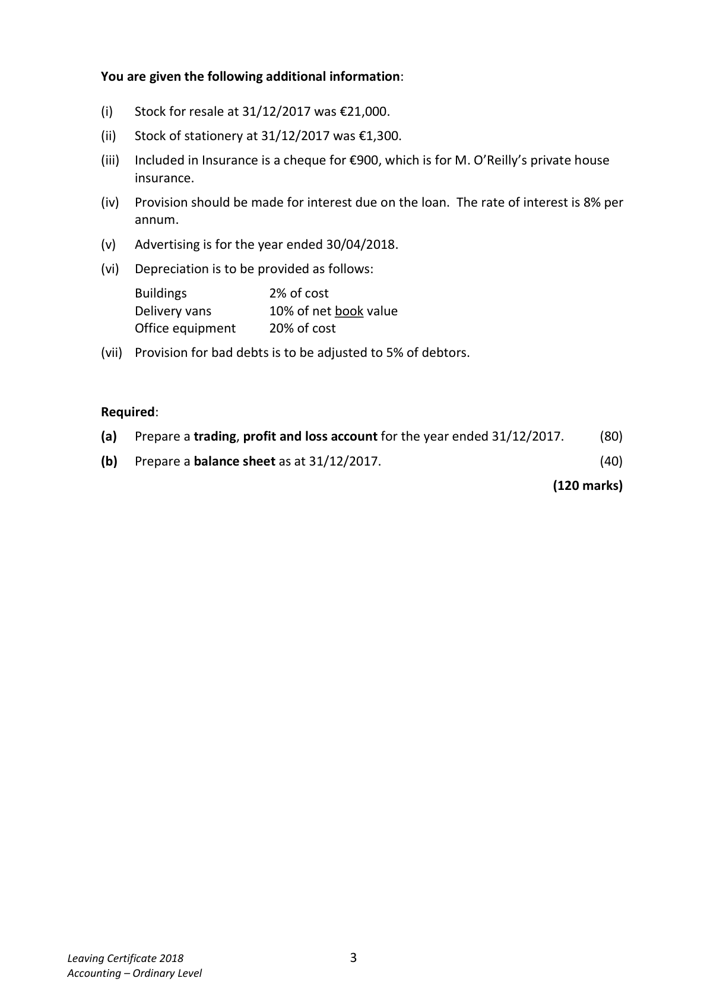
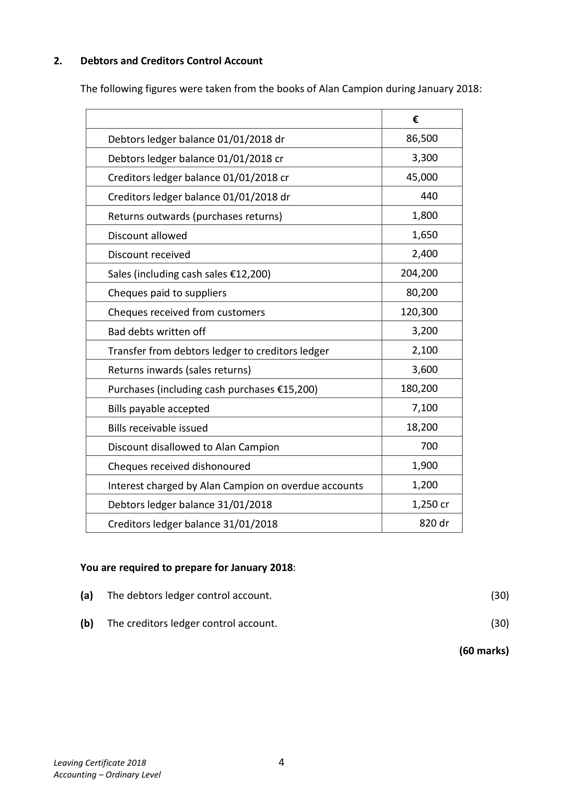

# Question

1.    Final Accounts of a Sole Trader

     The following balances were extracted from the books of Michael O’Reilly, a sole trader as at
     31/12/2017:

                                                     €             €

         Buildings                                      400,000
         Delivery vans at cost                              64,000
        Accumulated depreciation – delivery vans                             12,000
         Office equipment (cost €20,000)                   10,000
         Patents                                            24,000
          Capital 01/01/2017                                             202,000
        Drawings                                        12,200
         Stock 01/01/2017                                27,000
         Sales                                                         583,000
        Purchases                                     192,000
        Returns outwards (purchases returns)                                  5,100
        Returns inwards (sales returns)                      13,000
         Creditors                                                       22,400
        Debtors                                           36,200
         Discount received                                                  1,300
       Wages and salaries                              108,000
        General expenses                                12,500
       VAT                                                            15,300
         Stationery                                         4,200
       Term loan (received 01/04/2017)                                  60,000
        Loan interest paid                                  1,500
        PRSI/USC                                                          9,600
         Insurance                                         8,200
         Provision for bad debts                                                2,600
        Bank                                           46,500
         Advertising                                        5,400
          Profit/loss balance 01/01/2017                  _______          51,400
                                                      964,700         964,700

                                                                    Continued on page 3

Leaving Certificate 2018                       2
Accounting – Ordinary Level

<!-- PAGE 3 -->
# Page 3

<!-- HAS_VISUAL: true -->
<!-- VISUAL_REASON: page contains vector drawings; page image extracted because text may not fully capture visual content -->

You are given the following additional information:

        (i)   Stock for resale at 31/12/2017 was €21,000.

         (ii)   Stock of stationery at 31/12/2017 was €1,300.

         (iii)  Included in Insurance is a cheque for €900, which is for M. O’Reilly’s private house
           insurance.

       (iv)   Provision should be made for interest due on the loan. The rate of interest is 8% per
         annum.

       (v)   Advertising is for the year ended 30/04/2018.

       (vi)  Depreciation is to be provided as follows:

            Buildings         2% of cost
           Delivery vans       10% of net book value
            Office equipment    20% of cost

        (vii)  Provision for bad debts is to be adjusted to 5% of debtors.

     Required:

      (a)   Prepare a trading, profit and loss account for the year ended 31/12/2017.      (80)

      (b)   Prepare a balance sheet as at 31/12/2017.                                      (40)

                                                                           (120 marks)

Leaving Certificate 2018                       3
Accounting – Ordinary Level

<!-- PAGE 4 -->
# Page 4

<!-- HAS_VISUAL: true -->
<!-- VISUAL_REASON: page contains vector drawings; text contains visual keywords: figure; page image extracted because text may not fully capture visual content -->

# Marking Scheme

[No matching marking scheme section detected.]

# Source References

Exam paper:
- file: intermediate_markdown/exam_papers/ordinary/accounting_ordinary_2018_paper_1_exam.md
- pages: [3, 4]

Marking scheme:
- file: 
- pages: []

# Notes

