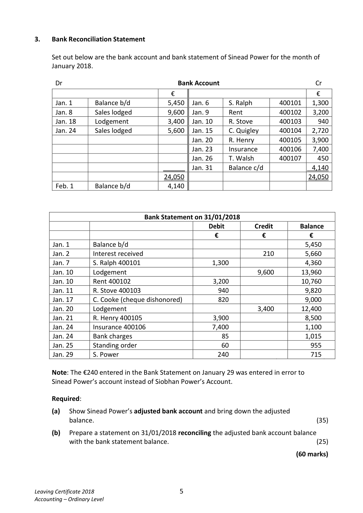

# Question

2.   Debtors and Creditors Control Account

     The following figures were taken from the books of Alan Campion during January 2018:

                                                                €

          Debtors ledger balance 01/01/2018 dr                       86,500

          Debtors ledger balance 01/01/2018 cr                         3,300

            Creditors ledger balance 01/01/2018 cr                      45,000

            Creditors ledger balance 01/01/2018 dr                       440

           Returns outwards (purchases returns)                         1,800

           Discount allowed                                            1,650

           Discount received                                           2,400

            Sales (including cash sales €12,200)                        204,200

          Cheques paid to suppliers                                  80,200

          Cheques received from customers                         120,300

         Bad debts written off                                        3,200

           Transfer from debtors ledger to creditors ledger                2,100

           Returns inwards (sales returns)                               3,600

           Purchases (including cash purchases €15,200)                180,200

               Bills payable accepted                                       7,100

               Bills receivable issued                                      18,200

           Discount disallowed to Alan Campion                         700

          Cheques received dishonoured                               1,900

            Interest charged by Alan Campion on overdue accounts         1,200

          Debtors ledger balance 31/01/2018                           1,250 cr

            Creditors ledger balance 31/01/2018                         820 dr

    You are required to prepare for January 2018:

      (a)  The debtors ledger control account.                                                (30)

      (b)  The creditors ledger control account.                                              (30)

                                                                                 (60 marks)

Leaving Certificate 2018                       4
Accounting – Ordinary Level

<!-- PAGE 5 -->
# Page 5

<!-- HAS_VISUAL: true -->
<!-- VISUAL_REASON: page contains vector drawings; page image extracted because text may not fully capture visual content -->

# Marking Scheme

[No matching marking scheme section detected.]

# Source References

Exam paper:
- file: intermediate_markdown/exam_papers/ordinary/accounting_ordinary_2018_paper_1_exam.md
- pages: [5]

Marking scheme:
- file: 
- pages: []

# Notes

