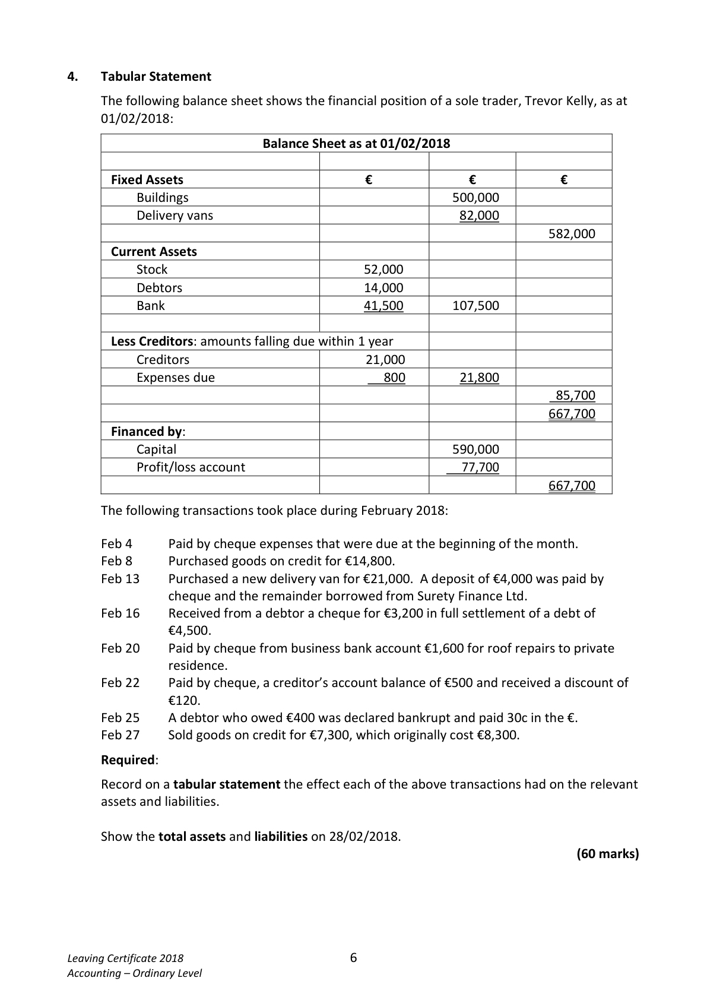

# Question

3.   Bank Reconciliation Statement

     Set out below are the bank account and bank statement of Sinead Power for the month of
     January 2018.

      Dr                               Bank Account                              Cr
                                      €                                       €
       Jan. 1       Balance b/d           5,450   Jan. 6        S. Ralph       400101   1,300
       Jan. 8       Sales lodged           9,600   Jan. 9      Rent          400102    3,200
       Jan. 18     Lodgement            3,400   Jan. 10      R. Stove       400103     940
       Jan. 24      Sales lodged           5,600   Jan. 15      C. Quigley      400104   2,720
                                                       Jan. 20      R. Henry       400105   3,900
                                                       Jan. 23     Insurance      400106    7,400
                                                       Jan. 26      T. Walsh       400107    450
                                   ______  Jan. 31     Balance c/d               4,140
                                      24,050                                     24,050
       Feb. 1      Balance b/d           4,140

                             Bank Statement on 31/01/2018
                                                       Debit          Credit        Balance
                                                  €            €            €
      Jan. 1       Balance b/d                                                     5,450
      Jan. 2        Interest received                                210         5,660
      Jan. 7         S. Ralph 400101                      1,300                       4,360
      Jan. 10     Lodgement                                       9,600        13,960
      Jan. 10      Rent 400102                          3,200                     10,760
      Jan. 11       R. Stove 400103                      940                       9,820
      Jan. 17       C. Cooke (cheque dishonored)          820                       9,000
      Jan. 20     Lodgement                                       3,400        12,400
      Jan. 21       R. Henry 400105                      3,900                       8,500
      Jan. 24      Insurance 400106                    7,400                       1,100
      Jan. 24     Bank charges                          85                       1,015
      Jan. 25      Standing order                       60                      955
      Jan. 29        S. Power                           240                      715

     Note: The €240 entered in the Bank Statement on January 29 was entered in error to
     Sinead Power’s account instead of Siobhan Power’s Account.

     Required:

      (a)  Show Sinead Power’s adjusted bank account and bring down the adjusted
           balance.                                                                           (35)

      (b)   Prepare a statement on 31/01/2018 reconciling the adjusted bank account balance
          with the bank statement balance.                                                  (25)

                                                                                 (60 marks)

Leaving Certificate 2018                       5
Accounting – Ordinary Level

<!-- PAGE 6 -->
# Page 6

<!-- HAS_VISUAL: true -->
<!-- VISUAL_REASON: page contains vector drawings; page image extracted because text may not fully capture visual content -->

# Marking Scheme

[No matching marking scheme section detected.]

# Source References

Exam paper:
- file: intermediate_markdown/exam_papers/ordinary/accounting_ordinary_2018_paper_1_exam.md
- pages: [6]

Marking scheme:
- file: 
- pages: []

# Notes

