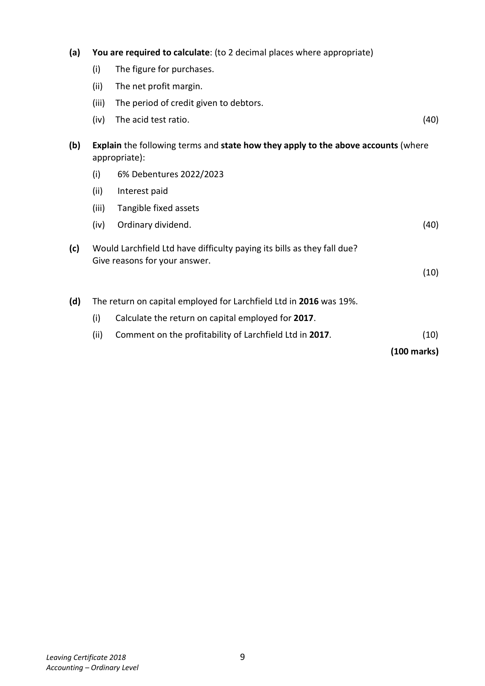
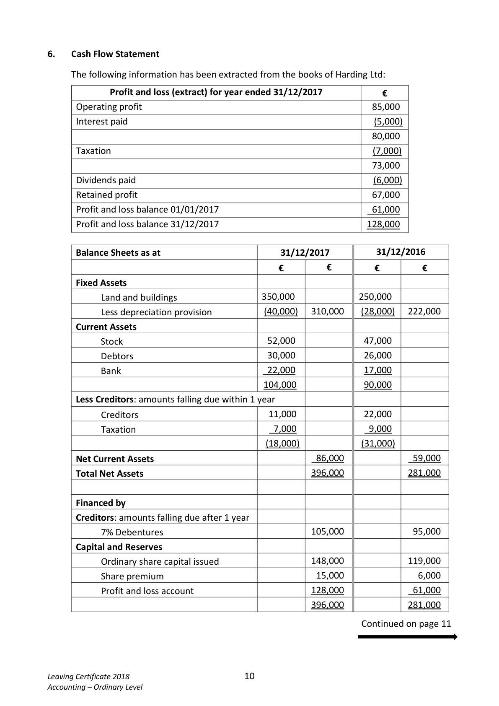

# Question

5.    Interpretation of Accounts

     The following information has been taken from the accounts of Larchfield Ltd for the year
     ended 31/12/2017:

                 Trading and Profit and Loss Account for the year ended 31/12/2017

                                                 €           €           €
        Credit sales                                                           660,000
        Less: Cost of sales
             Stock 01/01/2017                                    26,000
            Add: credit purchases                                  ?????
                                                                 ?????
              Less: Stock 31/12/2017                               14,000
             Cost of sales                                                        ?????
       Gross profit                                                           352,000
        Less: Total expenses (including interest paid €5,400)                         98,000
       Net profit for year                                                     254,000

                                Balance Sheet as at 31/12/2017

                                                 €           €           €
                                                     Cost      Depreciation    NBV
       Fixed Assets                                980,000        63,000      917,000

       Current Assets (including trade debtors €65,000)               93,000
        Less Creditors: amounts falling due within 1 year
       Trade creditors                                             52,000
                                                                              41,000
                                                                            958,000
       Financed by:
        Creditors: amounts falling due after more than 1 year
         6% Debentures (2022/2023)                                         90,000
        Capital and Reserves                      Authorised        Issued
       Ordinary shares at €1 each                    900,000      614,000      614,000
         Profit and loss account                                                 254,000
                                                                            958,000

                                                                    Continued on page 9

Leaving Certificate 2018                       8
Accounting – Ordinary Level

<!-- PAGE 9 -->
# Page 9

<!-- HAS_VISUAL: true -->
<!-- VISUAL_REASON: text contains visual keywords: figure; page image extracted because text may not fully capture visual content -->

(a)  You are required to calculate: (to 2 decimal places where appropriate)

                 (i)   The figure for purchases.

                  (ii)   The net profit margin.

                  (iii)  The period of credit given to debtors.

               (iv)  The acid test ratio.                                                           (40)

      (b)   Explain the following terms and state how they apply to the above accounts (where
           appropriate):

                 (i)   6% Debentures 2022/2023

                  (ii)    Interest paid

                  (iii)   Tangible fixed assets

               (iv)   Ordinary dividend.                                                           (40)

       (c)  Would Larchfield Ltd have difficulty paying its bills as they fall due?
          Give reasons for your answer.
                                                                                               (10)

      (d)  The return on capital employed for Larchfield Ltd in 2016 was 19%.

                 (i)    Calculate the return on capital employed for 2017.

                  (ii)  Comment on the profitability of Larchfield Ltd in 2017.                       (10)

                                                                             (100 marks)

Leaving Certificate 2018                       9
Accounting – Ordinary Level

<!-- PAGE 10 -->
# Page 10

<!-- HAS_VISUAL: true -->
<!-- VISUAL_REASON: page contains vector drawings; page image extracted because text may not fully capture visual content -->

# Marking Scheme

[No matching marking scheme section detected.]

# Source References

Exam paper:
- file: intermediate_markdown/exam_papers/ordinary/accounting_ordinary_2018_paper_1_exam.md
- pages: [9, 10]

Marking scheme:
- file: 
- pages: []

# Notes

