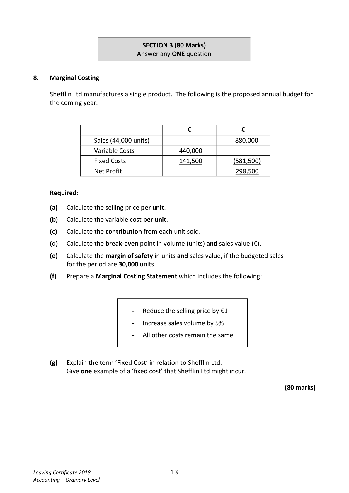

# Question

7.   Accounts of a Service Firm

     The Fahy family are involved in the tourist industry. They run a bed and breakfast, rent
      bicycles and a holiday home to tourists during the holiday season. Included among their
      assets and liabilities on 01/01/2017 were:

     Bed and breakfast premises €520,000; holiday home €94,000; equipment and linen €5,500;
      bicycles €6,400; stock of fuel and heating oil €2,000; advance deposits from tourists for
      holiday home €1,500; cash on hand €4,500.

     Required:

      (a)   Prepare a statement of Capital of the Fahy family tourism business on 01/01/2017.
                                                                                               (30)

                Receipts and Payments Account for the year ended 31/12/2017

    Receipts                    €      Payments                         €

    Cash on hand 01/01/2017        4,500  Provisions for bed and breakfast       9,100

    Receipts from guests           34,600  Light and heat                        2,700

    Rent from holiday home        16,000  Drawings                            3,600

    Receipts from bicycle hire        2,600  Wages                             17,200

                                         Laundry                             2,900

                                              Advertising                          1,400

                                            Repairs and maintenance              6,300

                                          Balance 31/12/2017                 14,500

                                 57,700                                    57,700

     The following information and instructions should be taken into account at 31/12/2017:

        (i)    Bicycles to be depreciated by 15% per annum and equipment and linen by 20%.

         (ii)   Owing to local provisions store €180.

         (iii)  One fifth of the provisions purchased were used by the family.

       (iv)   Receipts from guests include booking deposits for 2018 of €2,250.

       (v)   Stock of oil €930.

     Required:

      (b)   Prepare an income and expenditure account for the year ended 31/12/2017.
                                                                                               (40)

       (c)   Prepare a balance sheet on 31/12/2017.                                           (30)

                                                                             (100 marks)

Leaving Certificate 2018                       12
Accounting – Ordinary Level

<!-- PAGE 13 -->
# Page 13

<!-- HAS_VISUAL: true -->
<!-- VISUAL_REASON: page contains vector drawings; page image extracted because text may not fully capture visual content -->

SECTION 3 (80 Marks)
                             Answer any ONE question

# Marking Scheme

[No matching marking scheme section detected.]

# Source References

Exam paper:
- file: intermediate_markdown/exam_papers/ordinary/accounting_ordinary_2018_paper_1_exam.md
- pages: [13]

Marking scheme:
- file: 
- pages: []

# Notes

