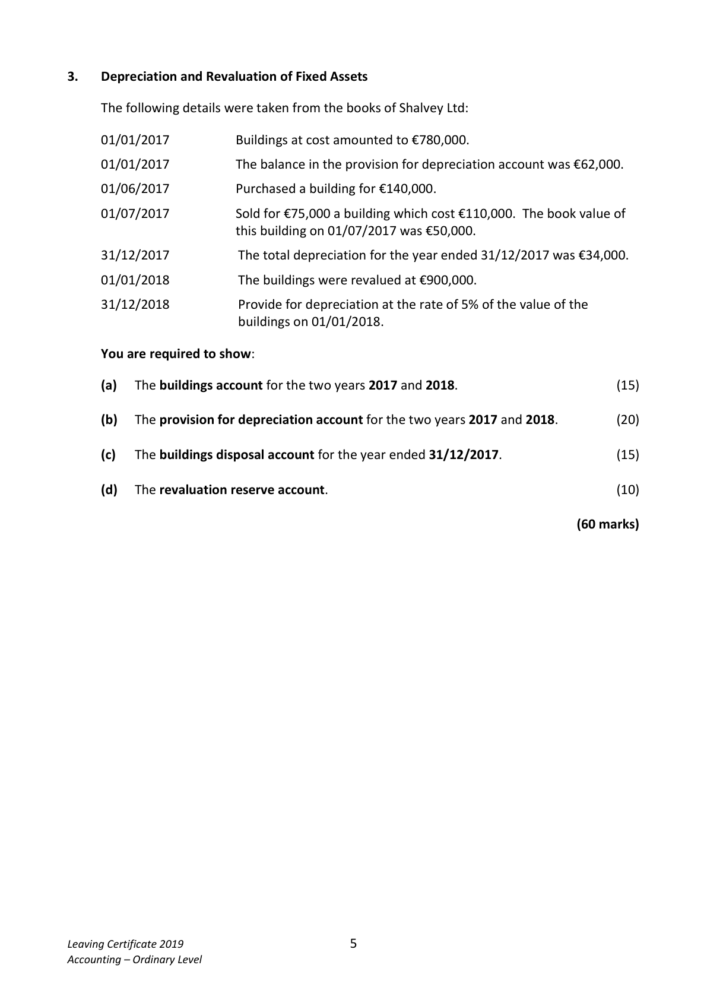
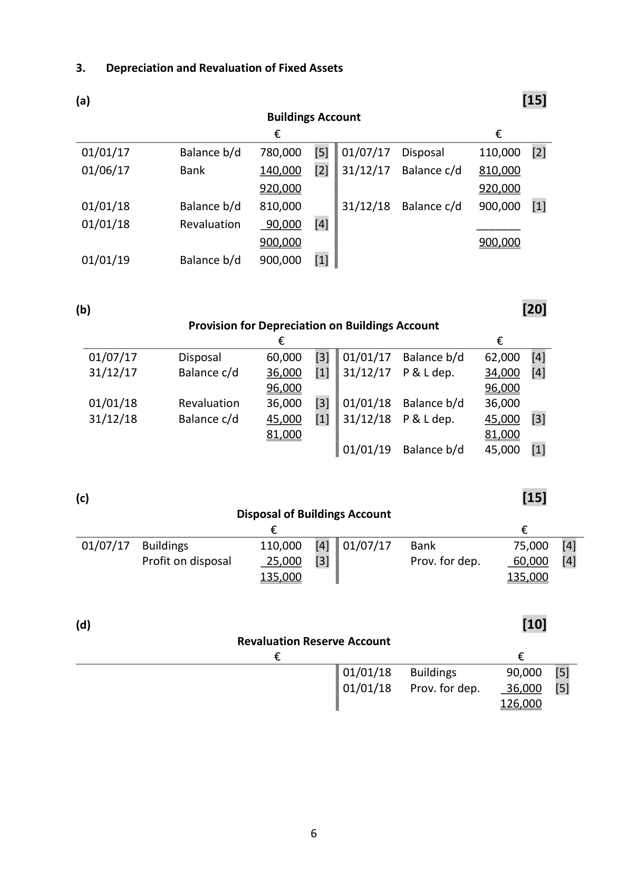

# Question

2.   Incomplete Records – Net Worth

    M. Forristal, a sole trader, has not been keeping a full set of accounts. The following figures
      relating to the business were supplied on 01/01/2018:

                                                                    €

      Premises                                                        520,000

       Furniture and equipment at cost                                     48,200

     Motor vehicles at book value                                        49,000

      Accumulated depreciation on furniture and equipment                   8,700

      Stock                                                             62,300

      Insurance prepaid                                                    1,200

       Creditors                                                          18,200

      Expenses due                                                        2,800

      Bank                                                                5,600

      Debtors                                                           21,200

     Required:

      (a)   Prepare a statement showing Forristal’s net worth/capital on 01/01/2018.
                                                                                               (30)

             Forristal also supplied the following additional information on 31/12/2018:

                 (i)   During the year €12,000 was transferred from a personal bank account to the
                business bank account.

                  (ii)   During the year, Forristal had paid €7,100 out of business funds for private house
                  repairs and had also taken goods to the value of €350 per month for private use.

      Forristal estimated that on 31/12/2018 the business assets and liabilities were €860,000 and
     €78,000 respectively, before allowing for the following:
            Depreciation on furniture and equipment at the rate of 25% of cost
            Depreciation on motor vehicles at the rate of 8% of book value
            Expenses due of €920.

      (b)   Prepare a statement showing Forristal’s profit or loss for the year ended 31/12/2018.
                                                                                               (30)

                                                                                 (60 marks)

Leaving Certificate 2019                       4
Accounting – Ordinary Level

<!-- PAGE 5 -->
# Page 5

# Marking Scheme

2.   Incomplete Records – Net Worth
                                                                          [30]

      (a)   Statement of Net Worth/Capital 01/01/2018

        Assets                                  €              €
        Premises                                520,000   [3]
        Furniture and equipment (48,200 ‐ 8,700)     39,500   [6]
       Motor vehicles                            49,000   [3]
        Stock                                     62,300   [3]
       Debtors                                   21,200   [3]
       Bank                                       5,600   [3]
        Insurance prepaid                           1,200   [3]      698,800

          Liabilities
        Creditors                                 18,200   [2]
       Expenses due                               2,800   [2]       21,000
        Capital/net worth 01/01/2018                               677,800   [2]

                                                                          [30]

      (b)  Statement of Profit/Loss for year ended 31/12/2018

                                                   €              €
        Assets                                                         860,000   [6]
        Less Depreciation furniture and equipment           12,050  [3]
            Depreciation motor vehicles                     3,920  [3]     (15,970)
                                                                      844,030
        Less Liabilities
                Liabilities                                    78,000  [3]
            Expenses due                                920  [3]     (78,920)
       Net worth 31/12/2018                                           765,110
             Less net worth 01/01/2018                                    (677,800)   [2]
           Apparent profit for the year                                    87,310
             Less capital introduced                                          (12,000)   [3]
                                                                        75,310
      Add drawings
             Repairs                                       7,100  [3]
             Stock                                         4,200  [3]      11,300
       Net profit for year 2018                                           86,610   [1]

                                     5

<!-- PAGE 6 -->
# Page 6

<!-- HAS_VISUAL: true -->
<!-- VISUAL_REASON: page contains vector drawings; page image extracted because text may not fully capture visual content -->

# Source References

Exam paper:
- file: intermediate_markdown/exam_papers/ordinary/accounting_ordinary_2019_paper_1_exam.md
- pages: [5]

Marking scheme:
- file: intermediate_markdown/marking_schemes/ordinary/accounting_ordinary_2019_paper_1_marking_scheme.md
- pages: [6]

# Notes

